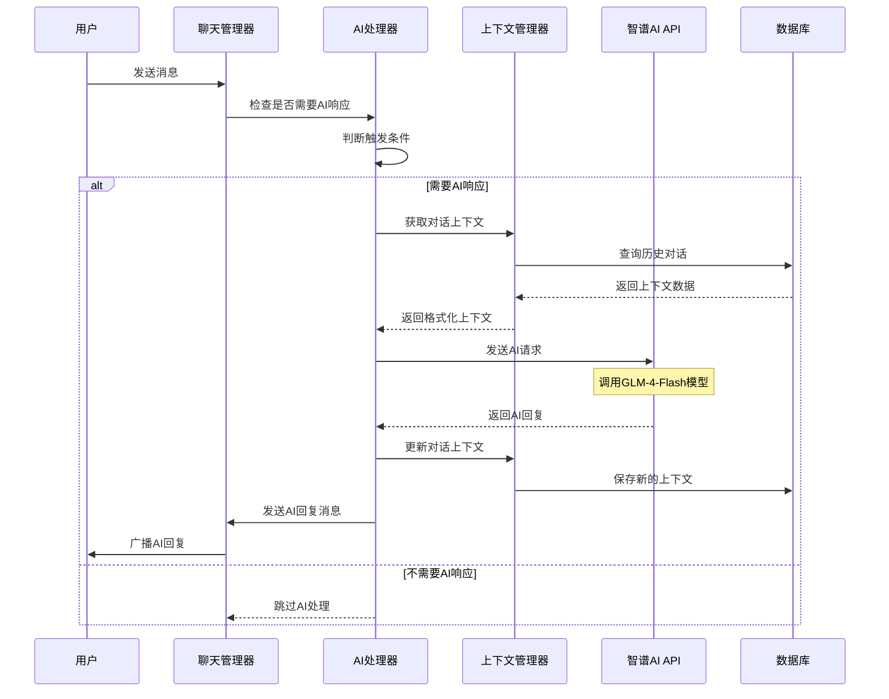
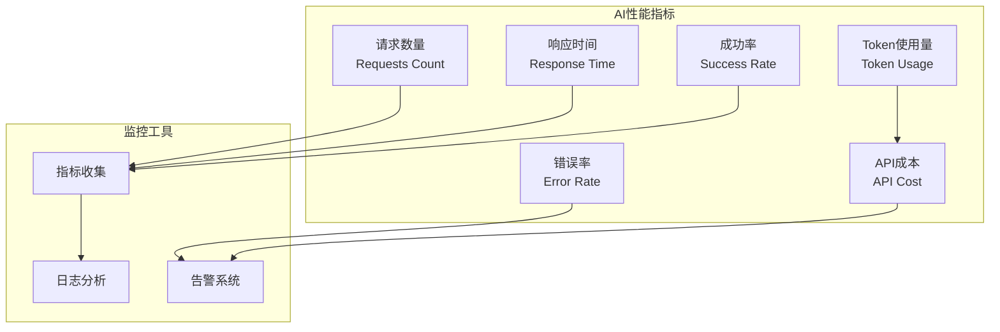

# Chat-Room AI集成文档

## 📋 概述

Chat-Room集成了智谱AI的GLM-4-Flash模型，为用户提供智能对话功能。AI助手可以在群聊中响应@AI消息和关键词，也支持私聊模式，提供上下文感知的智能回复。

## 🤖 AI功能架构

### AI集成架构图

```mermaid
graph TB
    subgraph "用户交互层"
        USER[用户输入]
        GROUP_CHAT[群聊@AI]
        PRIVATE_CHAT[私聊AI]
        KEYWORDS[关键词触发]
    end
    
    subgraph "AI处理层"
        AI_HANDLER[AI处理器<br/>AIHandler]
        TRIGGER[触发判断器<br/>TriggerDetector]
        CONTEXT[上下文管理器<br/>ContextManager]
    end
    
    subgraph "智谱AI服务"
        API[智谱AI API<br/>GLM-4-Flash]
        MODEL[语言模型]
    end
    
    subgraph "数据存储层"
        CONTEXT_DB[上下文存储<br/>SQLite]
        CONFIG[AI配置<br/>YAML]
    end
    
    USER --> GROUP_CHAT
    USER --> PRIVATE_CHAT
    USER --> KEYWORDS
    
    GROUP_CHAT --> TRIGGER
    PRIVATE_CHAT --> AI_HANDLER
    KEYWORDS --> TRIGGER
    
    TRIGGER --> AI_HANDLER
    AI_HANDLER --> CONTEXT
    AI_HANDLER --> API
    
    API --> MODEL
    MODEL --> API
    
    CONTEXT --> CONTEXT_DB
    AI_HANDLER --> CONFIG
```

### AI响应流程



## 🔧 AI处理器实现

### 核心AI处理器 (server/ai/ai_handler.py)

```python
class AIHandler:
    """AI处理器核心类"""
    
    def __init__(self, config: dict):
        self.config = config
        self.client = None
        self.context_manager = ContextManager()
        self.trigger_detector = TriggerDetector()
        self.enabled = config.get('enabled', False)
        
        if self.enabled:
            self._init_ai_client()
    
    def _init_ai_client(self):
        """初始化智谱AI客户端"""
        from zhipuai import ZhipuAI
        api_key = self.config.get('api_key')
        if not api_key:
            raise AIException("AI API密钥未配置")
        self.client = ZhipuAI(api_key=api_key)
    
    def should_respond_to_message(self, message: str, group_id: int, user_id: int) -> bool:
        """判断是否需要AI响应"""
        if not self.enabled:
            return False
            
        # 私聊AI模式：所有消息都响应
        if self._is_private_ai_chat(group_id):
            return True
            
        # 群聊模式：检查@AI或关键词
        return self.trigger_detector.should_trigger(message)
    
    def generate_ai_response(self, message: str, context: dict) -> str:
        """生成AI回复"""
        try:
            # 构建对话上下文
            conversation_context = self.context_manager.build_context(
                user_id=context['user_id'],
                group_id=context['group_id'],
                current_message=message
            )
            
            # 调用智谱AI API
            response = self.client.chat.completions.create(
                model=self.config.get('model', 'glm-4-flash'),
                messages=conversation_context,
                max_tokens=self.config.get('max_tokens', 1000),
                temperature=self.config.get('temperature', 0.7)
            )
            
            ai_reply = response.choices[0].message.content
            
            # 更新对话上下文
            self.context_manager.update_context(
                user_id=context['user_id'],
                group_id=context['group_id'],
                user_message=message,
                ai_response=ai_reply
            )
            
            return ai_reply
            
        except Exception as e:
            logger.error(f"AI回复生成失败: {e}")
            return "抱歉，我现在无法回复，请稍后再试。"
```

### 触发判断器 (server/ai/trigger_detector.py)

```python
class TriggerDetector:
    """AI触发判断器"""
    
    def __init__(self):
        self.at_patterns = ['@AI', '@ai', '@Ai', '@aI']
        self.keyword_patterns = [
            'AI', 'ai', 'Ai', 'aI',
            '人工智能', '智能助手', '机器人',
            'AI能', 'AI可以', 'AI帮我',
            '请AI', '问AI', '让AI'
        ]
    
    def should_trigger(self, message: str) -> bool:
        """判断消息是否应该触发AI响应"""
        # 检查@AI模式
        if self._check_at_patterns(message):
            return True
            
        # 检查关键词模式
        if self._check_keyword_patterns(message):
            return True
            
        return False
    
    def _check_at_patterns(self, message: str) -> bool:
        """检查@AI模式"""
        for pattern in self.at_patterns:
            if pattern in message:
                return True
        return False
    
    def _check_keyword_patterns(self, message: str) -> bool:
        """检查关键词模式"""
        # 简单的关键词匹配
        for keyword in self.keyword_patterns:
            if keyword in message:
                return True
        return False
    
    def extract_ai_message(self, message: str) -> str:
        """提取发给AI的消息内容"""
        # 移除@AI标记
        for pattern in self.at_patterns:
            message = message.replace(pattern, '').strip()
        return message
```

### 上下文管理器 (server/ai/context_manager.py)

```python
class ContextManager:
    """AI对话上下文管理器"""
    
    def __init__(self, max_context_length: int = 10):
        self.max_context_length = max_context_length
        self.system_prompt = self._load_system_prompt()
    
    def build_context(self, user_id: int, group_id: int, current_message: str) -> List[dict]:
        """构建对话上下文"""
        context = [{"role": "system", "content": self.system_prompt}]
        
        # 获取历史对话
        history = self._get_conversation_history(user_id, group_id)
        
        # 添加历史对话到上下文
        for item in history[-self.max_context_length:]:
            context.append({"role": "user", "content": item['user_message']})
            context.append({"role": "assistant", "content": item['ai_response']})
        
        # 添加当前消息
        context.append({"role": "user", "content": current_message})
        
        return context
    
    def update_context(self, user_id: int, group_id: int, 
                      user_message: str, ai_response: str):
        """更新对话上下文"""
        from server.database.models import AIConversation
        
        conversation = AIConversation(
            user_id=user_id,
            group_id=group_id,
            user_message=user_message,
            ai_response=ai_response,
            created_at=datetime.now()
        )
        conversation.save()
    
    def _load_system_prompt(self) -> str:
        """加载系统提示词"""
        return """你是Chat-Room聊天室的AI助手，名字叫"AI助手"。你的特点：
1. 友好、有帮助、专业
2. 回答简洁明了，避免过长的回复
3. 支持中文对话，理解中文语境
4. 可以回答技术问题、提供建议、进行日常对话
5. 如果不确定答案，会诚实地说不知道
6. 保持积极正面的态度

请根据用户的问题提供有帮助的回复。"""
    
    def _get_conversation_history(self, user_id: int, group_id: int) -> List[dict]:
        """获取对话历史"""
        from server.database.models import AIConversation
        
        conversations = AIConversation.get_recent_conversations(
            user_id=user_id,
            group_id=group_id,
            limit=self.max_context_length
        )
        
        return [
            {
                'user_message': conv.user_message,
                'ai_response': conv.ai_response
            }
            for conv in conversations
        ]
```

## 🗄️ AI数据模型

### AI对话记录表

```sql
CREATE TABLE ai_conversations (
    id INTEGER PRIMARY KEY AUTOINCREMENT,
    user_id INTEGER NOT NULL,
    group_id INTEGER NOT NULL,
    user_message TEXT NOT NULL,
    ai_response TEXT NOT NULL,
    created_at TIMESTAMP DEFAULT CURRENT_TIMESTAMP,
    FOREIGN KEY (user_id) REFERENCES users (id),
    FOREIGN KEY (group_id) REFERENCES chat_groups (id)
);

-- 创建索引优化查询性能
CREATE INDEX idx_ai_conversations_user_group 
ON ai_conversations (user_id, group_id, created_at DESC);
```

### AI配置表

```sql
CREATE TABLE ai_settings (
    id INTEGER PRIMARY KEY AUTOINCREMENT,
    user_id INTEGER,
    group_id INTEGER,
    setting_key TEXT NOT NULL,
    setting_value TEXT NOT NULL,
    created_at TIMESTAMP DEFAULT CURRENT_TIMESTAMP,
    updated_at TIMESTAMP DEFAULT CURRENT_TIMESTAMP,
    FOREIGN KEY (user_id) REFERENCES users (id),
    FOREIGN KEY (group_id) REFERENCES chat_groups (id)
);
```

## ⚙️ AI配置管理

### 服务器AI配置 (config/server_config.yaml)

```yaml
# AI功能配置
ai:
  # 基础配置
  enabled: true
  api_key: "your-zhipu-ai-api-key"
  model: "glm-4-flash"
  base_url: "https://open.bigmodel.cn/api/paas/v4/"
  
  # 模型参数
  max_tokens: 1000
  temperature: 0.7
  top_p: 0.9
  
  # 上下文管理
  context_window: 10  # 保留最近10轮对话
  max_context_tokens: 3000
  
  # 响应控制
  response_timeout: 30  # 30秒超时
  max_retries: 3
  retry_delay: 1
  
  # 触发设置
  triggers:
    at_patterns: ["@AI", "@ai", "@Ai", "@aI"]
    keywords: 
      - "AI"
      - "ai" 
      - "人工智能"
      - "智能助手"
      - "机器人"
      - "AI能"
      - "AI可以"
      - "AI帮我"
  
  # 私聊AI设置
  private_chat:
    enabled: true
    group_name_pattern: "private_with_ai"
    auto_create: true
  
  # 安全设置
  content_filter:
    enabled: true
    max_message_length: 2000
    blocked_keywords: []
  
  # 性能设置
  rate_limit:
    requests_per_minute: 60
    requests_per_hour: 1000
  
  # 日志设置
  logging:
    log_requests: true
    log_responses: true
    log_context: false
```

### AI配置管理器

```python
class AIConfig:
    """AI配置管理器"""
    
    def __init__(self, config_path: str):
        self.config = self._load_config(config_path)
        self.validate_config()
    
    def get_api_key(self) -> str:
        """获取API密钥"""
        return self.config.get('api_key', '')
    
    def get_model_config(self) -> dict:
        """获取模型配置"""
        return {
            'model': self.config.get('model', 'glm-4-flash'),
            'max_tokens': self.config.get('max_tokens', 1000),
            'temperature': self.config.get('temperature', 0.7),
            'top_p': self.config.get('top_p', 0.9)
        }
    
    def get_trigger_config(self) -> dict:
        """获取触发配置"""
        return self.config.get('triggers', {})
    
    def is_enabled(self) -> bool:
        """检查AI功能是否启用"""
        return self.config.get('enabled', False)
    
    def validate_config(self):
        """验证配置有效性"""
        if self.is_enabled() and not self.get_api_key():
            raise ConfigurationException("AI功能已启用但未配置API密钥")
```

## 🚀 AI功能使用指南

### 配置AI功能

1. **获取智谱AI API密钥**
   - 访问 [智谱AI开放平台](https://open.bigmodel.cn/)
   - 注册账号并创建API密钥
   - 复制API密钥备用

2. **配置服务器**
   ```bash
   # 编辑服务器配置文件
   nano config/server_config.yaml
   
   # 设置AI配置
   ai:
     enabled: true
     api_key: "your-actual-api-key-here"
     model: "glm-4-flash"
   ```

3. **重启服务器**
   ```bash
   python -m server.main
   ```

### 使用AI功能

#### 群聊中使用AI

```
# @AI方式
用户> @AI 你好，请介绍一下Python编程语言
AI助手> 你好！Python是一种高级编程语言...

# 关键词方式  
用户> AI能帮我写一个排序算法吗？
AI助手> 当然可以！这里是一个简单的冒泡排序算法...

用户> 请问人工智能的发展历史是怎样的？
AI助手> 人工智能的发展可以分为几个重要阶段...
```

#### 私聊AI模式

```
# 进入私聊AI聊天组
用户> /enter_chat private_with_ai

# 所有消息都会得到AI回复
用户> 你好
AI助手> 你好！我是Chat-Room的AI助手，有什么可以帮助你的吗？

用户> 今天天气怎么样？
AI助手> 抱歉，我无法获取实时天气信息。建议你查看天气预报应用...
```

### AI功能管理命令

```
# 查看AI状态（管理员）
/ai_status

# 重载AI配置（管理员）
/ai_reload

# 清除AI上下文
/ai_clear_context

# 设置AI参数
/ai_set temperature 0.8
```

## 📊 AI性能监控

### 监控指标



### 性能优化建议

1. **上下文管理优化**
   - 限制上下文长度
   - 定期清理过期上下文
   - 使用缓存减少数据库查询

2. **API调用优化**
   - 实现请求重试机制
   - 设置合理的超时时间
   - 使用连接池复用连接

3. **响应速度优化**
   - 异步处理AI请求
   - 实现响应缓存
   - 优化提示词长度

4. **成本控制**
   - 监控Token使用量
   - 设置使用限额
   - 实现智能触发策略

这个AI集成文档提供了完整的AI功能架构、实现细节、配置管理和使用指南，帮助开发者理解和使用Chat-Room的AI智能助手功能。
