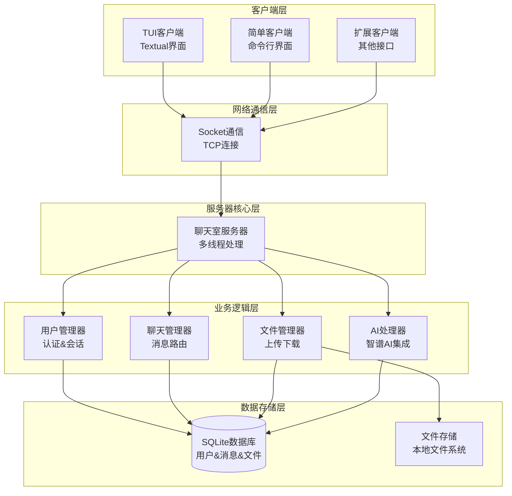
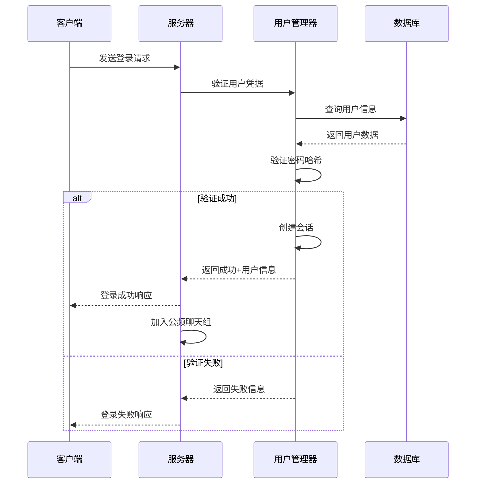
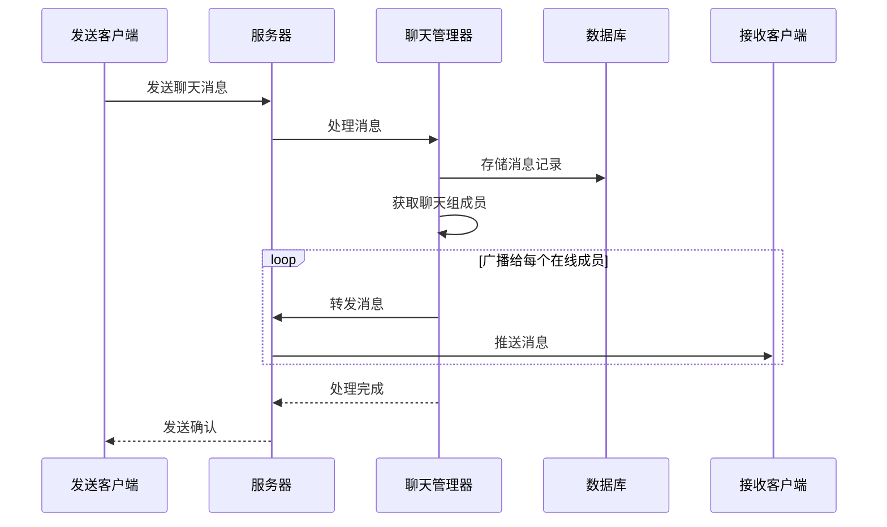
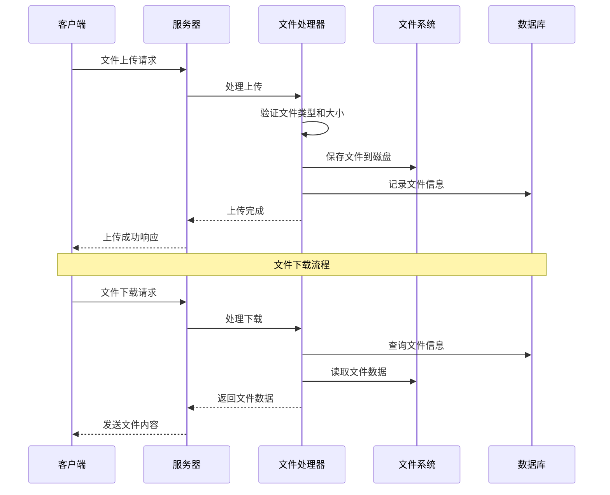
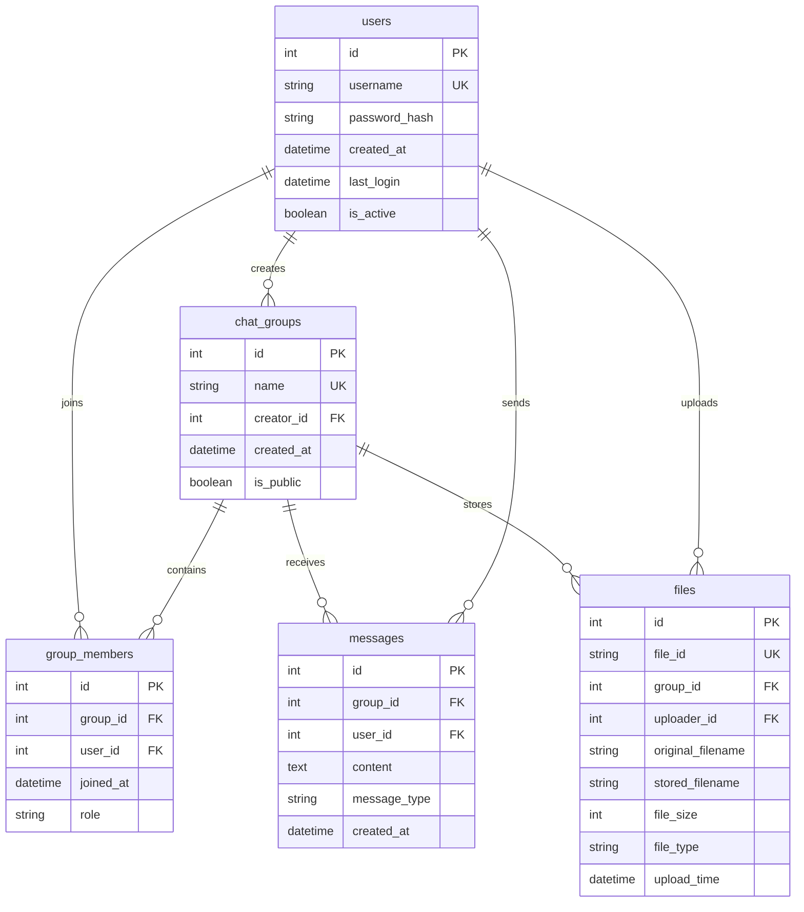

# Chat-Room 架构设计文档

## 📋 概述

Chat-Room采用经典的客户端-服务器架构，通过Socket进行网络通信，使用SQLite作为数据存储，Textual构建用户界面。整个系统采用模块化设计，各模块职责清晰，耦合度低，易于维护和扩展。

## 🏗️ 整体架构

### 系统架构图



### 核心组件

#### 1. 客户端层 (Client Layer)
- **TUI客户端**: 基于Textual的现代化界面
- **简单客户端**: 基础命令行界面
- **网络通信模块**: Socket客户端封装

#### 2. 服务器层 (Server Layer)
- **Socket服务器**: 处理客户端连接和消息路由
- **用户管理器**: 用户认证、会话管理、状态跟踪
- **聊天管理器**: 聊天组管理、消息广播、历史记录
- **AI处理器**: 智谱AI集成、智能回复

#### 3. 数据层 (Data Layer)
- **SQLite数据库**: 用户数据、聊天记录、文件信息
- **文件存储**: 上传文件的本地存储

#### 4. 共享层 (Shared Layer)
- **通信协议**: 客户端-服务器消息格式
- **常量定义**: 系统配置常量
- **异常处理**: 统一异常类定义

## 🔧 模块设计

### 客户端模块 (client/)

#### 核心通信模块 (client/core/)
```python
class ChatClient:
    """聊天客户端核心类"""
    
    def __init__(self, host: str, port: int)
    def connect() -> bool
    def login(username: str, password: str) -> Tuple[bool, str]
    def send_message(content: str) -> bool
    def upload_file(file_path: str) -> Tuple[bool, str]
    def download_file(file_id: str) -> Tuple[bool, str]
```

**职责**:
- Socket连接管理
- 消息发送接收
- 文件传输处理
- 协议解析封装

#### TUI界面模块 (client/ui/)
```python
class ChatApp(App):
    """主应用界面"""
    
    def compose() -> ComposeResult
    def on_mount() -> None
    def handle_message(message: Message) -> None
```

**职责**:
- 用户界面渲染
- 用户交互处理
- 实时状态更新
- 主题管理

#### 命令处理模块 (client/commands/)
```python
class CommandParser:
    """命令解析器"""
    
    def parse_command(input_text: str) -> Command
    def execute_command(command: Command) -> CommandResult
    def get_help(command_name: str) -> str
```

**职责**:
- 斜杠命令解析
- 命令参数验证
- 命令执行调度
- 帮助信息提供

### 服务器模块 (server/)

#### 核心服务器 (server/core/server.py)
```python
class ChatRoomServer:
    """聊天室服务器主类"""
    
    def __init__(self, host: str, port: int)
    def start() -> None
    def stop() -> None
    def handle_client(client_socket: socket.socket) -> None
```

**职责**:
- Socket服务器管理
- 客户端连接处理
- 消息路由分发
- 多线程管理

#### 用户管理器 (server/core/user_manager.py)
```python
class UserManager:
    """用户管理器"""
    
    def register_user(username: str, password: str) -> Tuple[bool, str]
    def authenticate_user(username: str, password: str) -> Tuple[bool, User]
    def get_online_users() -> List[User]
    def update_user_status(user_id: int, status: str) -> bool
```

**职责**:
- 用户注册登录
- 会话状态管理
- 在线用户跟踪
- 用户信息查询

#### 聊天管理器 (server/core/chat_manager.py)
```python
class ChatManager:
    """聊天管理器"""
    
    def create_chat_group(name: str, creator_id: int) -> Tuple[bool, str]
    def join_chat_group(group_id: int, user_id: int) -> Tuple[bool, str]
    def send_message(group_id: int, user_id: int, content: str) -> bool
    def broadcast_message(group_id: int, message: Message) -> None
```

**职责**:
- 聊天组管理
- 消息广播
- 历史记录存储
- 成员权限管理

### 数据库模块 (server/database/)

#### 数据模型 (server/database/models.py)
```python
class User:
    """用户数据模型"""
    id: int
    username: str
    password_hash: str
    created_at: datetime
    last_login: datetime

class ChatGroup:
    """聊天组数据模型"""
    id: int
    name: str
    creator_id: int
    created_at: datetime
    is_public: bool

class Message:
    """消息数据模型"""
    id: int
    group_id: int
    user_id: int
    content: str
    message_type: str
    created_at: datetime
```

**职责**:
- 数据结构定义
- 数据库操作封装
- 数据验证
- 关系映射

### AI集成模块 (server/ai/)

#### AI处理器 (server/ai/ai_handler.py)
```python
class AIHandler:
    """AI处理器"""
    
    def __init__(self, api_key: str, model: str)
    def should_respond(message: str, context: dict) -> bool
    def generate_response(message: str, context: dict) -> str
    def update_context(user_id: int, message: str) -> None
```

**职责**:
- 智谱AI API调用
- 对话上下文管理
- 智能回复判断
- AI功能配置

## 🔄 核心流程

### 用户登录流程



### 消息发送流程



### 文件传输流程



## 📡 通信协议

### 消息格式

所有客户端-服务器通信使用JSON格式：

```json
{
    "type": "message_type",
    "data": {
        "key": "value"
    },
    "timestamp": "2025-06-16T10:30:00Z",
    "request_id": "unique_id"
}
```

### 消息类型

#### 认证消息
- `login_request`: 登录请求
- `login_response`: 登录响应
- `register_request`: 注册请求
- `register_response`: 注册响应

#### 聊天消息
- `chat_message`: 聊天消息
- `system_message`: 系统消息
- `user_joined`: 用户加入通知
- `user_left`: 用户离开通知

#### 文件传输
- `file_upload_request`: 文件上传请求
- `file_upload_response`: 文件上传响应
- `file_download_request`: 文件下载请求
- `file_download_response`: 文件下载响应

#### AI交互
- `ai_request`: AI对话请求
- `ai_response`: AI对话响应

## 🔒 安全设计

### 认证安全
- 密码使用bcrypt哈希存储
- 会话token验证
- 输入数据验证和清理

### 通信安全
- 消息格式验证
- 文件类型和大小限制
- 防止SQL注入和XSS攻击

### 数据安全
- 敏感信息加密存储
- 定期清理过期会话
- 访问权限控制

## 📈 性能优化

### 并发处理
- 多线程处理客户端连接
- 异步消息处理
- 连接池管理

### 数据库关系图



### 数据库优化
- 索引优化
- 查询缓存
- 批量操作

### 内存管理
- 对象池复用
- 及时释放资源
- 内存使用监控

## 🔄 扩展性设计

### 插件系统
- 命令插件接口
- AI模型插件接口
- 界面主题插件

### 分布式支持
- 服务器集群部署
- 负载均衡
- 数据同步

### 多协议支持
- WebSocket协议
- HTTP REST API
- gRPC接口

## 📊 监控和日志

### 日志系统
- 分级日志记录
- 日志轮转管理
- 性能指标记录

### 监控指标
- 连接数统计
- 消息吞吐量
- 错误率监控
- 资源使用情况

这个架构设计确保了系统的可维护性、可扩展性和高性能，为Chat-Room项目的长期发展奠定了坚实的基础。
