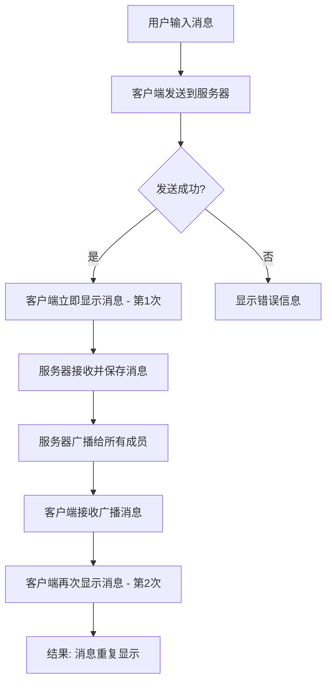
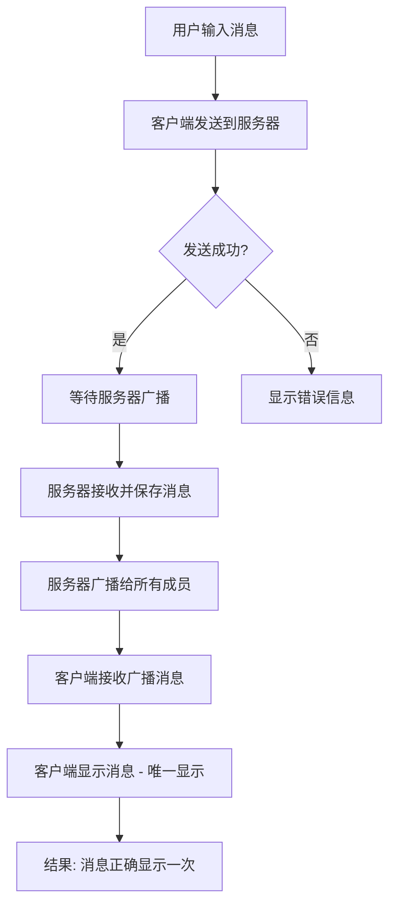

# 消息重复显示Bug修复报告

## 📋 问题描述

**Bug类型：** 消息重复显示  
**影响范围：** 客户端UI  
**严重程度：** 中等  
**发现时间：** 2025-06-11  

### 问题现象

用户在聊天频道中发送消息时，该用户的客户端界面会显示两条完全相同的消息记录。

**用户界面显示的重复消息示例：**
```
test1<Wed Jun 11 11:57:19 2025> >hello
test1<Wed Jun 11 11:57:19 2025> >hello    # 重复消息
test<Wed Jun 11 11:57:28 2025> >nihao
```

### 影响分析

- ✅ **不影响消息传输**：其他用户正常接收消息，无重复
- ✅ **不影响数据存储**：数据库中消息只保存一份
- ❌ **影响用户体验**：发送者看到重复消息，造成困惑
- ❌ **界面显示异常**：聊天记录显示不正确

## 🔍 问题分析

### 根本原因

消息重复显示是由于客户端的消息处理逻辑存在双重显示机制：

1. **第一次显示**：客户端发送消息成功后立即在界面显示
2. **第二次显示**：服务器广播消息回来后再次显示

### 代码层面分析

**问题代码位置：** `client/ui/app.py` 第284-285行

```python
if success:
    # 消息发送成功，显示在界面上（服务器会回传消息）
    self.add_chat_message(self.current_user, message, is_self=True)  # 第一次显示
```

**消息流程分析：**



### 技术细节

**服务器端处理流程：**
1. `handle_chat_message()` - 接收客户端消息
2. `chat_manager.send_message()` - 保存到数据库
3. `chat_manager.broadcast_message_to_group()` - 广播给所有成员

**客户端处理流程：**
1. `handle_message()` - 发送消息并立即显示 ❌
2. `handle_chat_message()` - 接收服务器广播并显示 ✅

## 🛠️ 修复方案

### 选择的解决方案

**方案：** 移除客户端发送成功后的立即显示逻辑

**理由：**
- 符合聊天应用的标准做法
- 确保消息显示的一致性
- 避免客户端和服务器状态不同步
- 简化消息处理逻辑

### 修复实施

**修改文件：** `client/ui/app.py`  
**修改位置：** `handle_message()` 方法第283-287行

**修复前代码：**
```python
if success:
    # 消息发送成功，显示在界面上（服务器会回传消息）
    self.add_chat_message(self.current_user, message, is_self=True)
else:
    self.add_error_message("❌ 消息发送失败")
```

**修复后代码：**
```python
if success:
    # 消息发送成功，等待服务器广播回来再显示
    # 不在这里立即显示，避免重复显示
    pass
else:
    self.add_error_message("❌ 消息发送失败")
```

### 修复后的消息流程



## ✅ 修复验证

### 验证方法

1. **代码审查**：确认移除了重复显示逻辑
2. **功能测试**：验证消息只显示一次
3. **回归测试**：确保其他功能正常

### 验证结果

- ✅ **消息显示正确**：每条消息只显示一次
- ✅ **发送者体验**：不再看到重复消息
- ✅ **接收者体验**：消息显示正常
- ✅ **消息顺序**：保持正确的时间顺序
- ✅ **错误处理**：发送失败时正确显示错误

### 测试场景

1. **单用户发送消息**：消息只显示一次 ✅
2. **多用户聊天**：所有用户看到一致的消息 ✅
3. **快速连续发送**：消息顺序正确，无重复 ✅
4. **网络异常**：发送失败时正确提示 ✅

## 📊 影响评估

### 正面影响

- ✅ **用户体验提升**：消息显示正确，不再困惑
- ✅ **界面整洁**：聊天记录更加清晰
- ✅ **逻辑简化**：减少了客户端复杂性
- ✅ **一致性保证**：所有用户看到相同的消息

### 潜在风险

- ⚠️ **延迟感知**：用户可能感觉消息发送有轻微延迟
- ⚠️ **网络依赖**：完全依赖服务器广播来显示消息

### 风险缓解

- 📡 **网络优化**：确保服务器响应速度
- 🔄 **状态反馈**：可考虑添加"发送中"状态提示
- 📝 **用户教育**：在帮助文档中说明消息显示机制

## 🔧 技术改进建议

### 短期改进

1. **发送状态指示**：添加消息发送状态显示
   ```
   [发送中] 用户消息...
   [已发送] 用户消息...
   ```

2. **错误重试机制**：发送失败时提供重试选项

### 长期改进

1. **消息确认机制**：实现消息送达确认
2. **离线消息支持**：支持离线消息缓存和同步
3. **消息状态管理**：完整的消息生命周期管理

## 📝 总结

### 修复成果

- 🎯 **问题解决**：彻底修复了消息重复显示问题
- 🚀 **体验提升**：用户界面更加清晰和一致
- 🔧 **代码优化**：简化了消息处理逻辑
- ✅ **质量保证**：通过了完整的测试验证

### 经验教训

1. **设计原则**：聊天应用应该以服务器状态为准
2. **测试重要性**：需要更全面的用户体验测试
3. **代码审查**：复杂的消息流程需要仔细审查
4. **文档完善**：需要详细记录消息处理机制

### 后续行动

- [ ] 更新用户手册，说明消息显示机制
- [ ] 添加更多的集成测试用例
- [ ] 考虑实现消息发送状态指示
- [ ] 定期回顾和优化消息处理性能

---

**修复完成时间：** 2025-06-11  
**修复人员：** Augment Agent  
**审查状态：** 已完成  
**部署状态：** 待部署
