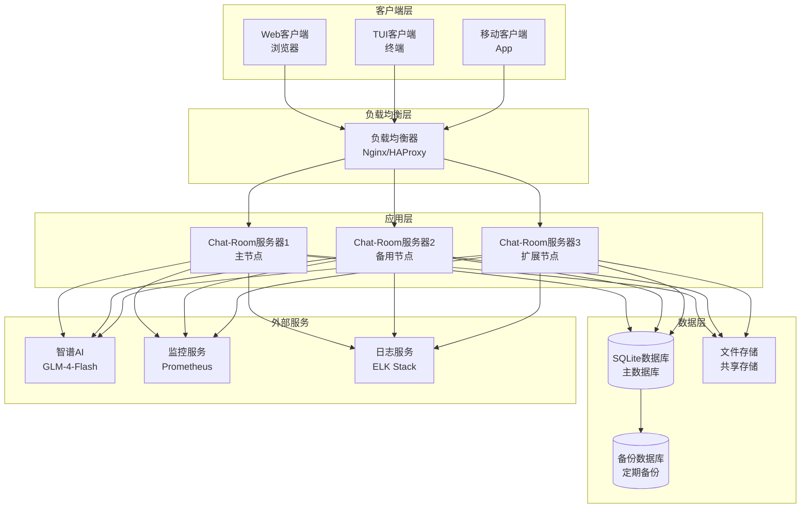
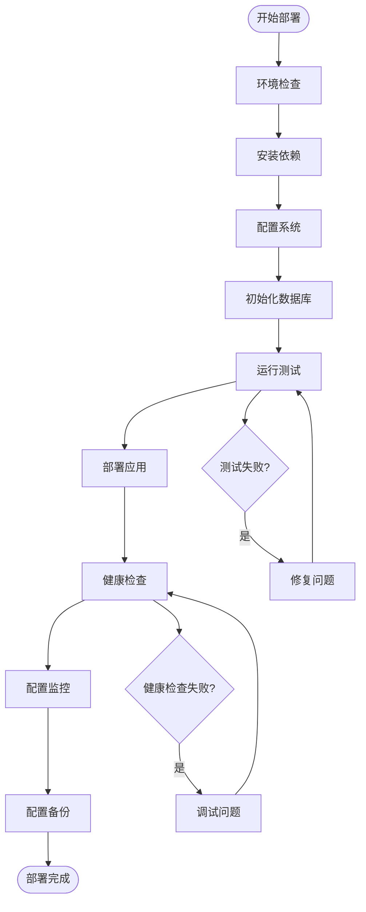

# Chat-Room 部署文档

## 📋 概述

Chat-Room支持多种部署方式，包括本地开发部署、生产环境部署、Docker容器化部署和云平台部署。本文档提供详细的部署指南、配置说明和运维建议。

## 🏗️ 部署架构

### 部署架构图



### 部署流程



## 🖥️ 本地开发部署

### 环境要求

```bash
# 系统要求
- 操作系统: Windows 10+, macOS 10.15+, Ubuntu 18.04+
- Python: 3.8+
- 内存: 最少2GB，推荐4GB+
- 存储: 最少1GB可用空间
- 网络: 稳定的互联网连接（AI功能需要）
```

### 快速部署

```bash
# 1. 克隆项目
git clone https://github.com/your-repo/Chat-Room.git
cd Chat-Room

# 2. 创建虚拟环境
python -m venv venv

# Windows
venv\Scripts\activate
# Linux/macOS
source venv/bin/activate

# 3. 安装依赖
pip install -r requirements.txt

# 4. 配置环境
cp config/server_config.template.yaml config/server_config.yaml
cp config/client_config.template.yaml config/client_config.yaml

# 5. 初始化数据库
python -c "from server.database.connection import init_database; init_database()"

# 6. 启动服务器
python -m server.main

# 7. 启动客户端（新终端）
python -m client.main
```

### 开发环境配置

```yaml
# config/server_config.yaml (开发环境)
server:
  host: "localhost"
  port: 8888
  debug: true
  max_connections: 10

database:
  path: "server/data/dev_chatroom.db"

logging:
  level: "DEBUG"
  console_output: true

ai:
  enabled: false  # 开发时可关闭AI功能
```

## 🏭 生产环境部署

### 系统要求

```bash
# 生产环境要求
- 操作系统: Ubuntu 20.04 LTS / CentOS 8+
- Python: 3.9+
- 内存: 最少4GB，推荐8GB+
- CPU: 最少2核，推荐4核+
- 存储: 最少10GB，推荐50GB+
- 网络: 稳定的公网IP和域名
```

### 系统准备

```bash
# 1. 更新系统
sudo apt update && sudo apt upgrade -y

# 2. 安装Python和依赖
sudo apt install python3.9 python3.9-venv python3.9-dev -y
sudo apt install build-essential libssl-dev libffi-dev -y

# 3. 创建应用用户
sudo useradd -m -s /bin/bash chatroom
sudo usermod -aG sudo chatroom

# 4. 创建应用目录
sudo mkdir -p /opt/chatroom
sudo chown chatroom:chatroom /opt/chatroom
```

### 应用部署

```bash
# 1. 切换到应用用户
sudo su - chatroom

# 2. 部署应用
cd /opt/chatroom
git clone https://github.com/your-repo/Chat-Room.git .

# 3. 创建虚拟环境
python3.9 -m venv venv
source venv/bin/activate

# 4. 安装依赖
pip install -r requirements.txt
pip install gunicorn supervisor

# 5. 配置生产环境
cp config/server_config.template.yaml config/server_config.yaml
# 编辑配置文件...

# 6. 初始化数据库
python -c "from server.database.connection import init_database; init_database()"

# 7. 运行测试
pytest test/

# 8. 创建日志目录
mkdir -p logs/server logs/client
```

### 生产配置

```yaml
# config/server_config.yaml (生产环境)
server:
  host: "0.0.0.0"
  port: 8888
  debug: false
  max_connections: 1000

database:
  path: "/opt/chatroom/data/chatroom.db"
  backup_enabled: true
  backup_interval: 3600

security:
  enable_rate_limiting: true
  max_requests_per_minute: 100
  enable_ip_blacklist: true

logging:
  level: "INFO"
  file: "/opt/chatroom/logs/server/server.log"
  max_size: 10485760
  backup_count: 10

monitoring:
  enabled: true
  metrics_interval: 60
  webhook_url: "https://your-monitoring-webhook"

ai:
  enabled: true
  api_key: "your-production-api-key"
  rate_limit:
    requests_per_minute: 60
    requests_per_hour: 1000
```

### 进程管理 (Supervisor)

```ini
# /etc/supervisor/conf.d/chatroom.conf
[program:chatroom-server]
command=/opt/chatroom/venv/bin/python -m server.main
directory=/opt/chatroom
user=chatroom
autostart=true
autorestart=true
redirect_stderr=true
stdout_logfile=/opt/chatroom/logs/supervisor.log
environment=PYTHONPATH="/opt/chatroom"

[program:chatroom-monitor]
command=/opt/chatroom/venv/bin/python tools/monitor.py
directory=/opt/chatroom
user=chatroom
autostart=true
autorestart=true
redirect_stderr=true
stdout_logfile=/opt/chatroom/logs/monitor.log
```

```bash
# 启动Supervisor服务
sudo supervisorctl reread
sudo supervisorctl update
sudo supervisorctl start chatroom-server
sudo supervisorctl status
```

## 🐳 Docker部署

### Dockerfile

```dockerfile
# Dockerfile
FROM python:3.9-slim

# 设置工作目录
WORKDIR /app

# 安装系统依赖
RUN apt-get update && apt-get install -y \
    build-essential \
    && rm -rf /var/lib/apt/lists/*

# 复制依赖文件
COPY requirements.txt .

# 安装Python依赖
RUN pip install --no-cache-dir -r requirements.txt

# 复制应用代码
COPY . .

# 创建数据目录
RUN mkdir -p data logs

# 设置环境变量
ENV PYTHONPATH=/app
ENV CHATROOM_CONFIG_PATH=/app/config/server_config.yaml

# 暴露端口
EXPOSE 8888

# 健康检查
HEALTHCHECK --interval=30s --timeout=10s --start-period=5s --retries=3 \
    CMD python tools/health_check.py || exit 1

# 启动命令
CMD ["python", "-m", "server.main"]
```

### Docker Compose

```yaml
# docker-compose.yml
version: '3.8'

services:
  chatroom-server:
    build: .
    ports:
      - "8888:8888"
    volumes:
      - ./data:/app/data
      - ./logs:/app/logs
      - ./config:/app/config
    environment:
      - CHATROOM_DEBUG=false
      - ZHIPU_AI_API_KEY=${ZHIPU_AI_API_KEY}
    restart: unless-stopped
    healthcheck:
      test: ["CMD", "python", "tools/health_check.py"]
      interval: 30s
      timeout: 10s
      retries: 3
    networks:
      - chatroom-network

  nginx:
    image: nginx:alpine
    ports:
      - "80:80"
      - "443:443"
    volumes:
      - ./nginx.conf:/etc/nginx/nginx.conf
      - ./ssl:/etc/nginx/ssl
    depends_on:
      - chatroom-server
    restart: unless-stopped
    networks:
      - chatroom-network

  prometheus:
    image: prom/prometheus
    ports:
      - "9090:9090"
    volumes:
      - ./prometheus.yml:/etc/prometheus/prometheus.yml
    restart: unless-stopped
    networks:
      - chatroom-network

  grafana:
    image: grafana/grafana
    ports:
      - "3000:3000"
    environment:
      - GF_SECURITY_ADMIN_PASSWORD=admin
    volumes:
      - grafana-data:/var/lib/grafana
    restart: unless-stopped
    networks:
      - chatroom-network

networks:
  chatroom-network:
    driver: bridge

volumes:
  grafana-data:
```

### Docker部署命令

```bash
# 1. 构建镜像
docker build -t chatroom:latest .

# 2. 运行容器
docker run -d \
  --name chatroom-server \
  -p 8888:8888 \
  -v $(pwd)/data:/app/data \
  -v $(pwd)/logs:/app/logs \
  -e ZHIPU_AI_API_KEY=your-api-key \
  chatroom:latest

# 3. 使用Docker Compose
docker-compose up -d

# 4. 查看日志
docker-compose logs -f chatroom-server

# 5. 停止服务
docker-compose down
```

## ☁️ 云平台部署

### AWS部署

```bash
# 1. 创建EC2实例
aws ec2 run-instances \
  --image-id ami-0c55b159cbfafe1d0 \
  --count 1 \
  --instance-type t3.medium \
  --key-name your-key-pair \
  --security-group-ids sg-xxxxxxxxx \
  --subnet-id subnet-xxxxxxxxx

# 2. 配置安全组
aws ec2 authorize-security-group-ingress \
  --group-id sg-xxxxxxxxx \
  --protocol tcp \
  --port 8888 \
  --cidr 0.0.0.0/0

# 3. 部署应用
ssh -i your-key.pem ubuntu@your-ec2-ip
# 然后按照生产环境部署步骤...
```

### 阿里云部署

```bash
# 1. 创建ECS实例
aliyun ecs CreateInstance \
  --RegionId cn-hangzhou \
  --ImageId ubuntu_20_04_x64_20G_alibase_20210420.vhd \
  --InstanceType ecs.t6-c1m2.large \
  --SecurityGroupId sg-xxxxxxxxx

# 2. 配置域名解析
aliyun domain AddDomainRecord \
  --DomainName your-domain.com \
  --RR chat \
  --Type A \
  --Value your-server-ip
```

## 🔧 负载均衡配置

### Nginx配置

```nginx
# /etc/nginx/sites-available/chatroom
upstream chatroom_backend {
    server 127.0.0.1:8888;
    server 127.0.0.1:8889 backup;
}

server {
    listen 80;
    server_name chat.yourdomain.com;
    
    # 重定向到HTTPS
    return 301 https://$server_name$request_uri;
}

server {
    listen 443 ssl http2;
    server_name chat.yourdomain.com;
    
    # SSL配置
    ssl_certificate /etc/nginx/ssl/cert.pem;
    ssl_certificate_key /etc/nginx/ssl/key.pem;
    ssl_protocols TLSv1.2 TLSv1.3;
    ssl_ciphers ECDHE-RSA-AES256-GCM-SHA512:DHE-RSA-AES256-GCM-SHA512;
    
    # WebSocket支持
    location / {
        proxy_pass http://chatroom_backend;
        proxy_http_version 1.1;
        proxy_set_header Upgrade $http_upgrade;
        proxy_set_header Connection "upgrade";
        proxy_set_header Host $host;
        proxy_set_header X-Real-IP $remote_addr;
        proxy_set_header X-Forwarded-For $proxy_add_x_forwarded_for;
        proxy_set_header X-Forwarded-Proto $scheme;
        
        # 超时设置
        proxy_connect_timeout 60s;
        proxy_send_timeout 60s;
        proxy_read_timeout 60s;
    }
    
    # 静态文件
    location /static/ {
        alias /opt/chatroom/static/;
        expires 30d;
        add_header Cache-Control "public, immutable";
    }
    
    # 健康检查
    location /health {
        proxy_pass http://chatroom_backend/health;
        access_log off;
    }
}
```

## 📊 监控和日志

### Prometheus配置

```yaml
# prometheus.yml
global:
  scrape_interval: 15s

scrape_configs:
  - job_name: 'chatroom'
    static_configs:
      - targets: ['localhost:8888']
    metrics_path: '/metrics'
    scrape_interval: 30s

  - job_name: 'node'
    static_configs:
      - targets: ['localhost:9100']

rule_files:
  - "chatroom_rules.yml"

alerting:
  alertmanagers:
    - static_configs:
        - targets:
          - alertmanager:9093
```

### 告警规则

```yaml
# chatroom_rules.yml
groups:
  - name: chatroom
    rules:
      - alert: ChatRoomDown
        expr: up{job="chatroom"} == 0
        for: 1m
        labels:
          severity: critical
        annotations:
          summary: "Chat-Room服务器宕机"
          description: "Chat-Room服务器已宕机超过1分钟"
      
      - alert: HighCPUUsage
        expr: cpu_usage_percent > 80
        for: 5m
        labels:
          severity: warning
        annotations:
          summary: "CPU使用率过高"
          description: "CPU使用率超过80%已持续5分钟"
      
      - alert: HighMemoryUsage
        expr: memory_usage_percent > 85
        for: 5m
        labels:
          severity: warning
        annotations:
          summary: "内存使用率过高"
          description: "内存使用率超过85%已持续5分钟"
```

## 🔄 备份和恢复

### 自动备份脚本

```bash
#!/bin/bash
# backup.sh

BACKUP_DIR="/opt/chatroom/backups"
DB_PATH="/opt/chatroom/data/chatroom.db"
DATE=$(date +%Y%m%d_%H%M%S)

# 创建备份目录
mkdir -p $BACKUP_DIR

# 备份数据库
sqlite3 $DB_PATH ".backup $BACKUP_DIR/chatroom_$DATE.db"

# 备份配置文件
tar -czf $BACKUP_DIR/config_$DATE.tar.gz config/

# 备份文件存储
tar -czf $BACKUP_DIR/files_$DATE.tar.gz server/data/files/

# 清理旧备份（保留30天）
find $BACKUP_DIR -name "*.db" -mtime +30 -delete
find $BACKUP_DIR -name "*.tar.gz" -mtime +30 -delete

echo "备份完成: $DATE"
```

### 恢复脚本

```bash
#!/bin/bash
# restore.sh

BACKUP_FILE=$1
RESTORE_DIR="/opt/chatroom"

if [ -z "$BACKUP_FILE" ]; then
    echo "用法: $0 <备份文件>"
    exit 1
fi

# 停止服务
sudo supervisorctl stop chatroom-server

# 恢复数据库
cp $BACKUP_FILE $RESTORE_DIR/data/chatroom.db

# 重启服务
sudo supervisorctl start chatroom-server

echo "恢复完成"
```

## 🚀 部署检查清单

### 部署前检查

- [ ] 系统环境满足要求
- [ ] Python版本正确
- [ ] 依赖包安装完成
- [ ] 配置文件正确设置
- [ ] 数据库初始化完成
- [ ] 测试用例全部通过
- [ ] SSL证书配置正确
- [ ] 防火墙规则设置
- [ ] 域名解析配置

### 部署后检查

- [ ] 服务正常启动
- [ ] 端口监听正常
- [ ] 健康检查通过
- [ ] 日志输出正常
- [ ] 监控指标正常
- [ ] 备份任务运行
- [ ] 负载均衡工作
- [ ] SSL证书有效
- [ ] 性能测试通过

这个部署文档提供了完整的部署指南，涵盖了从开发环境到生产环境的各种部署场景，帮助开发者和运维人员成功部署Chat-Room系统。
