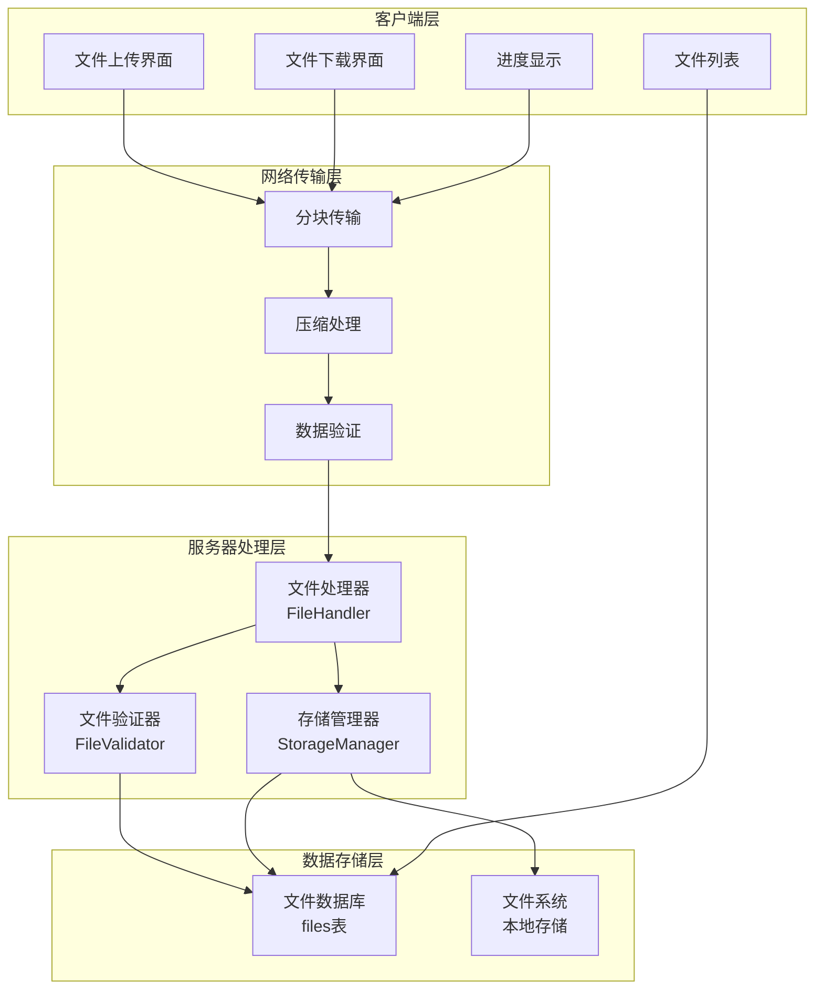
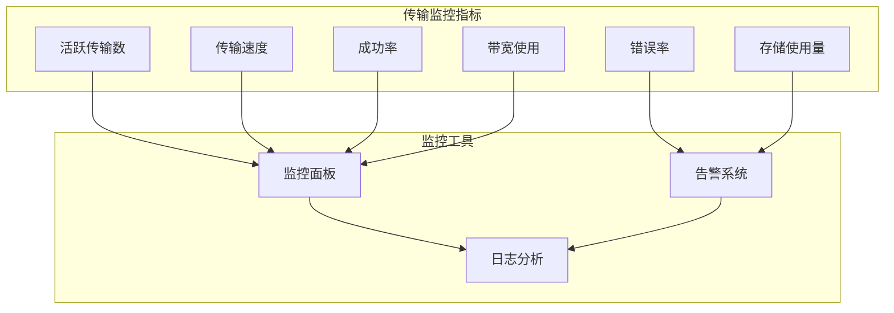

# Chat-Room 文件传输文档

## 📋 概述

Chat-Room支持完整的文件传输功能，用户可以在聊天组中上传和下载文件。系统支持多种文件类型，提供文件大小限制、类型检查、进度显示等功能，确保文件传输的安全性和可靠性。

## 🏗️ 文件传输架构

### 文件传输架构图



### 文件传输流程


## 📁 文件处理器实现

### 核心文件处理器 (server/core/file_handler.py)

```python
class FileHandler:
    """文件处理器核心类"""
    
    def __init__(self, config: dict):
        self.config = config
        self.validator = FileValidator(config)
        self.storage_manager = StorageManager(config)
        self.upload_dir = config.get('upload_dir', 'server/data/files/uploads')
        self.chunk_size = config.get('chunk_size', 8192)
    
    def handle_file_upload(self, user_id: int, group_id: int, 
                          file_info: dict, file_data: bytes) -> Tuple[bool, str]:
        """处理文件上传"""
        try:
            # 验证文件信息
            is_valid, error_msg = self.validator.validate_upload(file_info, user_id, group_id)
            if not is_valid:
                return False, error_msg
            
            # 生成文件ID和存储路径
            file_id = self._generate_file_id()
            storage_path = self.storage_manager.get_storage_path(file_id, file_info['filename'])
            
            # 保存文件到磁盘
            success = self.storage_manager.save_file(storage_path, file_data)
            if not success:
                return False, "文件保存失败"
            
            # 记录文件信息到数据库
            file_record = {
                'file_id': file_id,
                'group_id': group_id,
                'uploader_id': user_id,
                'original_filename': file_info['filename'],
                'stored_filename': os.path.basename(storage_path),
                'file_size': len(file_data),
                'file_type': self._get_file_type(file_info['filename']),
                'upload_time': datetime.now()
            }
            
            from server.database.models import File
            file_obj = File(**file_record)
            file_obj.save()
            
            return True, f"文件上传成功，文件ID: {file_id}"
            
        except Exception as e:
            logger.error(f"文件上传处理失败: {e}")
            return False, "文件上传处理失败"
    
    def handle_file_download(self, user_id: int, file_id: str) -> Tuple[bool, str, bytes]:
        """处理文件下载"""
        try:
            # 查询文件信息
            from server.database.models import File
            file_obj = File.get_by_file_id(file_id)
            if not file_obj:
                return False, "文件不存在", b''
            
            # 验证下载权限
            has_permission = self.validator.validate_download_permission(user_id, file_obj)
            if not has_permission:
                return False, "没有下载权限", b''
            
            # 读取文件数据
            storage_path = self.storage_manager.get_file_path(file_obj.stored_filename)
            file_data = self.storage_manager.read_file(storage_path)
            
            if file_data is None:
                return False, "文件读取失败", b''
            
            return True, "文件下载成功", file_data
            
        except Exception as e:
            logger.error(f"文件下载处理失败: {e}")
            return False, "文件下载处理失败", b''
    
    def list_group_files(self, group_id: int, user_id: int) -> List[dict]:
        """列出聊天组文件"""
        try:
            from server.database.models import File
            files = File.get_group_files(group_id)
            
            file_list = []
            for file_obj in files:
                file_info = {
                    'file_id': file_obj.file_id,
                    'original_filename': file_obj.original_filename,
                    'file_size': file_obj.file_size,
                    'file_type': file_obj.file_type,
                    'uploader': file_obj.uploader.username,
                    'upload_time': file_obj.upload_time.isoformat(),
                    'can_download': self.validator.validate_download_permission(user_id, file_obj)
                }
                file_list.append(file_info)
            
            return file_list
            
        except Exception as e:
            logger.error(f"获取文件列表失败: {e}")
            return []
```

### 文件验证器 (server/core/file_validator.py)

```python
class FileValidator:
    """文件验证器"""
    
    def __init__(self, config: dict):
        self.config = config
        self.max_file_size = config.get('max_file_size', 10 * 1024 * 1024)  # 10MB
        self.allowed_types = config.get('allowed_types', [])
        self.blocked_types = config.get('blocked_types', [])
    
    def validate_upload(self, file_info: dict, user_id: int, group_id: int) -> Tuple[bool, str]:
        """验证文件上传"""
        # 检查文件名
        if not self._validate_filename(file_info['filename']):
            return False, "文件名包含非法字符"
        
        # 检查文件大小
        if file_info['file_size'] > self.max_file_size:
            return False, f"文件大小超过限制({self.max_file_size}字节)"
        
        # 检查文件类型
        if not self._validate_file_type(file_info['filename']):
            return False, "不支持的文件类型"
        
        # 检查用户权限
        if not self._validate_upload_permission(user_id, group_id):
            return False, "没有上传权限"
        
        return True, "验证通过"
    
    def validate_download_permission(self, user_id: int, file_obj) -> bool:
        """验证下载权限"""
        # 检查用户是否在文件所属聊天组中
        from server.database.models import GroupMember
        is_member = GroupMember.is_user_in_group(user_id, file_obj.group_id)
        return is_member
    
    def _validate_filename(self, filename: str) -> bool:
        """验证文件名"""
        # 检查文件名长度
        if len(filename) > 255:
            return False
        
        # 检查非法字符
        illegal_chars = ['<', '>', ':', '"', '|', '?', '*', '\\', '/']
        for char in illegal_chars:
            if char in filename:
                return False
        
        return True
    
    def _validate_file_type(self, filename: str) -> bool:
        """验证文件类型"""
        file_ext = os.path.splitext(filename)[1].lower()
        
        # 检查是否在禁止列表中
        if file_ext in self.blocked_types:
            return False
        
        # 如果有允许列表，检查是否在允许列表中
        if self.allowed_types and file_ext not in self.allowed_types:
            return False
        
        return True
```

### 存储管理器 (server/core/storage_manager.py)

```python
class StorageManager:
    """存储管理器"""
    
    def __init__(self, config: dict):
        self.config = config
        self.base_dir = config.get('upload_dir', 'server/data/files/uploads')
        self.ensure_base_dir()
    
    def get_storage_path(self, file_id: str, filename: str) -> str:
        """获取文件存储路径"""
        # 按日期组织目录结构
        now = datetime.now()
        date_path = now.strftime("%Y/%m/%d")
        
        # 创建目录
        full_dir = os.path.join(self.base_dir, date_path)
        os.makedirs(full_dir, exist_ok=True)
        
        # 生成存储文件名
        file_ext = os.path.splitext(filename)[1]
        stored_filename = f"{file_id}{file_ext}"
        
        return os.path.join(full_dir, stored_filename)
    
    def save_file(self, file_path: str, file_data: bytes) -> bool:
        """保存文件到磁盘"""
        try:
            with open(file_path, 'wb') as f:
                f.write(file_data)
            return True
        except Exception as e:
            logger.error(f"文件保存失败: {e}")
            return False
    
    def read_file(self, file_path: str) -> Optional[bytes]:
        """从磁盘读取文件"""
        try:
            if not os.path.exists(file_path):
                return None
            
            with open(file_path, 'rb') as f:
                return f.read()
        except Exception as e:
            logger.error(f"文件读取失败: {e}")
            return None
    
    def delete_file(self, file_path: str) -> bool:
        """删除文件"""
        try:
            if os.path.exists(file_path):
                os.remove(file_path)
            return True
        except Exception as e:
            logger.error(f"文件删除失败: {e}")
            return False
```

## 🗄️ 文件数据模型

### 文件信息表结构

```sql
CREATE TABLE files (
    id INTEGER PRIMARY KEY AUTOINCREMENT,
    file_id TEXT UNIQUE NOT NULL,
    group_id INTEGER NOT NULL,
    uploader_id INTEGER NOT NULL,
    original_filename TEXT NOT NULL,
    stored_filename TEXT NOT NULL,
    file_size INTEGER NOT NULL,
    file_type TEXT NOT NULL,
    file_hash TEXT,
    upload_time TIMESTAMP DEFAULT CURRENT_TIMESTAMP,
    download_count INTEGER DEFAULT 0,
    is_deleted BOOLEAN DEFAULT 0,
    FOREIGN KEY (group_id) REFERENCES chat_groups (id),
    FOREIGN KEY (uploader_id) REFERENCES users (id)
);

-- 创建索引
CREATE INDEX idx_files_group_id ON files (group_id, upload_time DESC);
CREATE INDEX idx_files_uploader ON files (uploader_id, upload_time DESC);
CREATE INDEX idx_files_file_id ON files (file_id);
```

### 文件传输记录表

```sql
CREATE TABLE file_transfers (
    id INTEGER PRIMARY KEY AUTOINCREMENT,
    file_id TEXT NOT NULL,
    user_id INTEGER NOT NULL,
    transfer_type TEXT NOT NULL, -- 'upload' or 'download'
    transfer_status TEXT NOT NULL, -- 'started', 'completed', 'failed'
    bytes_transferred INTEGER DEFAULT 0,
    total_bytes INTEGER NOT NULL,
    start_time TIMESTAMP DEFAULT CURRENT_TIMESTAMP,
    end_time TIMESTAMP,
    error_message TEXT,
    FOREIGN KEY (file_id) REFERENCES files (file_id),
    FOREIGN KEY (user_id) REFERENCES users (id)
);
```

## ⚙️ 文件传输配置

### 服务器文件配置 (config/server_config.yaml)

```yaml
# 文件传输配置
file_transfer:
  # 基础设置
  enabled: true
  max_file_size: 10485760  # 10MB
  chunk_size: 8192  # 8KB
  
  # 存储设置
  upload_dir: "server/data/files/uploads"
  temp_dir: "server/data/files/temp"
  auto_cleanup: true
  cleanup_interval: 3600  # 1小时
  
  # 文件类型设置
  allowed_types:
    - ".txt"
    - ".pdf"
    - ".doc"
    - ".docx"
    - ".xls"
    - ".xlsx"
    - ".ppt"
    - ".pptx"
    - ".jpg"
    - ".jpeg"
    - ".png"
    - ".gif"
    - ".bmp"
    - ".zip"
    - ".rar"
    - ".7z"
    - ".tar"
    - ".gz"
  
  blocked_types:
    - ".exe"
    - ".bat"
    - ".cmd"
    - ".scr"
    - ".com"
    - ".pif"
  
  # 安全设置
  scan_uploads: true
  quarantine_suspicious: true
  max_files_per_user: 100
  max_files_per_group: 1000
  
  # 性能设置
  max_concurrent_uploads: 10
  max_concurrent_downloads: 20
  transfer_timeout: 300  # 5分钟
  
  # 备份设置
  backup_enabled: false
  backup_interval: 86400  # 24小时
  backup_retention: 30  # 30天
```

### 客户端文件配置 (config/client_config.yaml)

```yaml
# 文件传输配置
file_transfer:
  # 下载设置
  download_dir: "client/Downloads"
  auto_create_dirs: true
  overwrite_existing: false
  
  # 传输设置
  chunk_size: 8192
  max_concurrent_downloads: 3
  resume_downloads: true
  
  # 确认设置
  confirm_downloads: true
  confirm_large_files: true
  large_file_threshold: 5242880  # 5MB
  
  # 进度显示
  show_progress: true
  progress_update_interval: 1  # 1秒
```

## 🚀 文件传输使用指南

### 文件上传

```bash
# 上传单个文件
/send_files document.pdf

# 上传多个文件
/send_files document.pdf image.jpg data.xlsx

# 上传指定路径的文件
/send_files /home/user/documents/report.pdf

# 上传时显示进度
/send_files --progress document.pdf
```

### 文件下载

```bash
# 列出可下载文件
/recv_files -l
/recv_files --list

# 下载指定文件
/recv_files -n document.pdf
/recv_files --name document.pdf

# 下载指定ID的文件
/recv_files -i file_12345
/recv_files --id file_12345

# 下载所有文件
/recv_files -a
/recv_files --all

# 下载到指定目录
/recv_files -n document.pdf -d /home/user/downloads
```

### 文件管理

```bash
# 查看文件详情
/file_info file_12345

# 删除文件（仅上传者和管理员）
/delete_file file_12345

# 搜索文件
/search_files keyword

# 查看上传历史
/upload_history

# 查看下载历史
/download_history
```

## 📊 文件传输监控

### 传输状态监控



### 性能优化建议

1. **传输优化**
   - 使用适当的分块大小
   - 实现断点续传功能
   - 并行传输多个文件

2. **存储优化**
   - 按日期组织文件目录
   - 定期清理临时文件
   - 实现文件压缩存储

3. **安全优化**
   - 文件类型白名单控制
   - 病毒扫描集成
   - 文件完整性校验

4. **用户体验优化**
   - 实时进度显示
   - 传输速度显示
   - 错误重试机制

这个文件传输文档提供了完整的文件传输架构、实现细节、配置管理和使用指南，帮助开发者理解和使用Chat-Room的文件传输功能。
