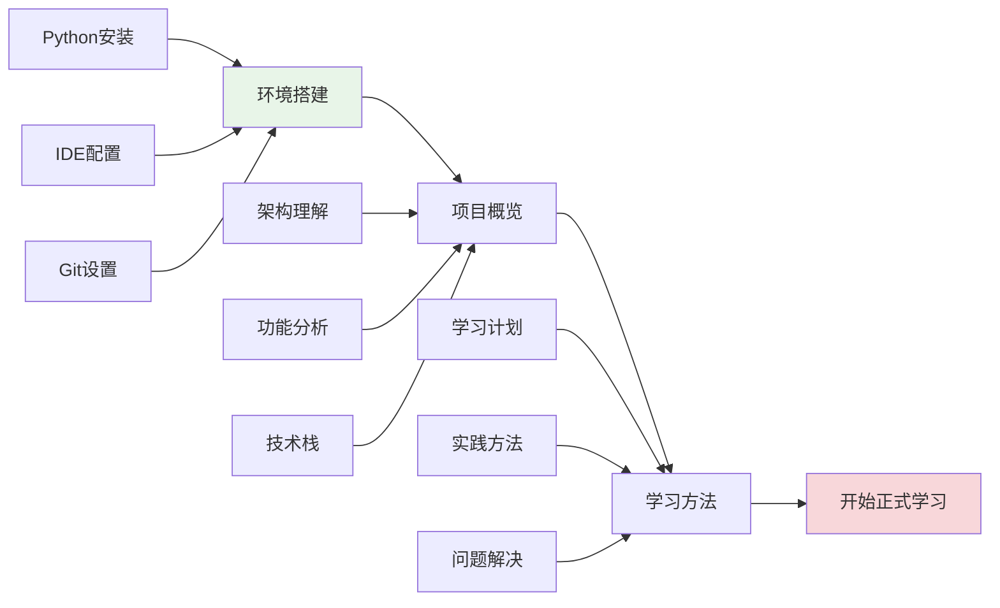

# 第0章：学习准备工作

## 🎯 学习目标

通过本章学习，您将能够：
- 搭建完整的Chat-Room开发环境
- 理解项目的整体架构和学习路径
- 掌握高效的学习方法和技巧
- 为后续的深入学习做好充分准备

## 📖 本章概览

本章是整个学习路径的起点，将帮助您建立学习的基础设施和正确的学习心态。我们将从环境搭建开始，逐步了解项目全貌，最后掌握适合的学习方法。

### 学习路径

## 📚 章节内容

### 1. [环境搭建](environment-setup.md)
**学习时间：** 2-3小时  
**难度等级：** ⭐

学习内容：
- Python开发环境安装和配置
- 代码编辑器（VS Code）设置
- Git版本控制工具配置
- 项目依赖安装和虚拟环境管理

**为什么重要：** 良好的开发环境是高效学习的基础，正确的环境配置可以避免后续学习中的技术障碍。

### 2. [项目概览](project-overview.md)
**学习时间：** 1-2小时  
**难度等级：** ⭐

学习内容：
- Chat-Room项目的整体架构
- 核心功能模块介绍
- 技术栈选择和原因
- 项目目录结构解析

**为什么重要：** 理解项目全貌有助于建立学习的整体框架，明确学习目标和方向。

### 3. [学习方法指导](learning-guide.md)
**学习时间：** 1小时  
**难度等级：** ⭐

学习内容：
- 项目驱动学习法
- 理论与实践结合的方法
- 问题解决和调试技巧
- 学习进度管理

**为什么重要：** 正确的学习方法可以大大提高学习效率，避免走弯路。

## 🔧 前置知识要求

- **计算机基础：** 了解基本的计算机操作
- **编程概念：** 对编程有基本的认识（不要求有Python经验）
- **学习态度：** 愿意动手实践，遇到问题主动思考和解决

## ⏱️ 预计学习时间

| 内容 | 预计时间 | 建议安排 |
|------|----------|----------|
| 环境搭建 | 2-3小时 | 第1天完成 |
| 项目概览 | 1-2小时 | 第1天完成 |
| 学习方法 | 1小时 | 第1天完成 |
| **总计** | **4-6小时** | **1天内完成** |

## 📋 学习顺序建议

1. **首先完成环境搭建**
   - 这是后续所有学习的基础
   - 遇到问题及时解决，不要拖延

2. **然后了解项目概览**
   - 建立对项目的整体认识
   - 理解学习路径的设计思路

3. **最后掌握学习方法**
   - 为后续的深入学习做好方法论准备
   - 制定个人学习计划

## ✅ 学习检查清单

完成本章学习后，请确认以下内容：

### 环境搭建检查
- [ ] Python 3.8+ 已正确安装
- [ ] VS Code 已安装并配置Python扩展
- [ ] Git 已安装并配置用户信息
- [ ] 项目代码已克隆到本地
- [ ] 虚拟环境已创建并激活
- [ ] 项目依赖已安装完成

### 项目理解检查
- [ ] 理解Chat-Room的核心功能
- [ ] 了解客户端-服务器架构
- [ ] 熟悉项目目录结构
- [ ] 明确学习路径和目标

### 学习方法检查
- [ ] 制定了个人学习计划
- [ ] 了解项目驱动学习法
- [ ] 掌握问题解决的基本方法
- [ ] 准备好学习笔记工具

## 🚨 常见问题解决

### 环境问题
- **Python版本冲突：** 使用虚拟环境隔离不同项目
- **依赖安装失败：** 检查网络连接，使用国内镜像源
- **IDE配置问题：** 参考官方文档，确保扩展正确安装

### 学习问题
- **进度太慢：** 调整学习计划，专注核心内容
- **理解困难：** 多看代码示例，动手实践
- **缺乏动力：** 设定小目标，及时庆祝进步

## 🎉 完成奖励

完成本章学习后，您将获得：
- ✅ 完整的开发环境
- 🎯 清晰的学习目标
- 🛠️ 有效的学习方法
- 🚀 开始正式学习的信心

## 📚 下一步学习

准备工作完成后，请继续学习：
- [第1章：Python编程基础](../01-python-basics/README.md) - 掌握Python语言基础

---

**良好的开始是成功的一半！让我们开始这段精彩的学习之旅吧！** 🚀

*本章最后更新：2025-01-17*
