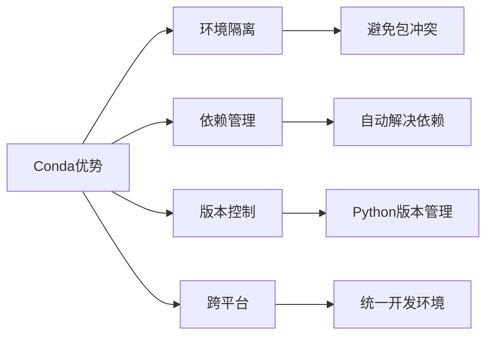
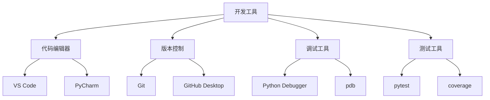

# 开发环境搭建指南

## 🎯 学习目标

通过本章学习，您将能够：
- 搭建完整的Python开发环境
- 配置Chat-Room项目的运行环境
- 掌握基本的开发工具使用
- 理解项目依赖管理

## 📋 环境要求

### 系统要求
- **操作系统**：Windows 10+、macOS 10.14+、Linux (Ubuntu 18.04+)
- **Python版本**：3.8 或更高版本
- **内存**：至少 4GB RAM
- **存储空间**：至少 2GB 可用空间

### 必需软件
- Python 3.8+
- Git
- 代码编辑器（推荐 VS Code）
- 终端/命令行工具

## 🔧 安装步骤

### 1. Python 环境安装

#### Windows 系统
```bash
# 1. 下载Python安装包
# 访问 https://www.python.org/downloads/
# 下载最新的Python 3.x版本

# 2. 安装时勾选以下选项：
# ✅ Add Python to PATH
# ✅ Install pip

# 3. 验证安装
python --version
pip --version
```

#### macOS 系统
```bash
# 方法1：使用Homebrew（推荐）
/bin/bash -c "$(curl -fsSL https://raw.githubusercontent.com/Homebrew/install/HEAD/install.sh)"
brew install python

# 方法2：官网下载
# 访问 https://www.python.org/downloads/

# 验证安装
python3 --version
pip3 --version
```

#### Linux 系统
```bash
# Ubuntu/Debian
sudo apt update
sudo apt install python3 python3-pip python3-venv

# CentOS/RHEL
sudo yum install python3 python3-pip

# 验证安装
python3 --version
pip3 --version
```

### 2. Conda 环境管理（推荐）

```bash
# 1. 下载并安装Miniconda
# 访问 https://docs.conda.io/en/latest/miniconda.html

# 2. 创建Chat-Room专用环境
conda create -n chatroom python=3.10
conda activate chatroom

# 3. 验证环境
python --version
which python
```

**为什么使用Conda？**


### 3. Git 版本控制

#### 安装Git
```bash
# Windows: 下载Git for Windows
# https://git-scm.com/download/win

# macOS
brew install git

# Linux
sudo apt install git  # Ubuntu/Debian
sudo yum install git   # CentOS/RHEL
```

#### 配置Git
```bash
# 设置用户信息
git config --global user.name "您的姓名"
git config --global user.email "您的邮箱"

# 验证配置
git config --list
```

### 4. 代码编辑器配置

#### VS Code（推荐）
```bash
# 1. 下载安装VS Code
# https://code.visualstudio.com/

# 2. 安装Python扩展
# 在VS Code中按Ctrl+Shift+X，搜索并安装：
# - Python (Microsoft)
# - Python Docstring Generator
# - GitLens
# - Better Comments
```

#### VS Code 配置文件
创建 `.vscode/settings.json`：
```json
{
    "python.defaultInterpreterPath": "~/miniconda3/envs/chatroom/bin/python",
    "python.linting.enabled": true,
    "python.linting.pylintEnabled": true,
    "python.formatting.provider": "black",
    "python.testing.pytestEnabled": true,
    "files.encoding": "utf8",
    "editor.tabSize": 4,
    "editor.insertSpaces": true
}
```

## 📦 项目环境搭建

### 1. 获取项目代码

```bash
# 克隆项目（如果有Git仓库）
git clone <项目地址>
cd Chat-Room

# 或者下载项目压缩包并解压
```

### 2. 创建虚拟环境

```bash
# 激活conda环境
conda activate chatroom

# 或使用venv（如果不用conda）
python -m venv venv
source venv/bin/activate  # Linux/macOS
# 或
venv\Scripts\activate     # Windows
```

### 3. 安装项目依赖

```bash
# 安装基础依赖
pip install -r requirements.txt

# 安装开发依赖（可选）
pip install -r requirements-dev.txt

# 安装测试依赖（可选）
pip install -r test/requirements.txt
```

### 4. 验证安装

```bash
# 检查Python环境
python --version
pip list

# 测试项目导入
python -c "import socket; import sqlite3; import json; print('基础模块导入成功')"

# 测试可选依赖
python -c "import textual; print('TUI界面支持正常')"
```

## 🗂️ 项目目录结构

```
Chat-Room/
├── client/                 # 客户端代码
├── server/                 # 服务器端代码
├── shared/                 # 共享模块
├── config/                 # 配置文件
├── docs/                   # 文档
├── test/                   # 测试代码
├── requirements.txt        # 项目依赖
├── README.md              # 项目说明
└── .gitignore             # Git忽略文件
```

## 🚀 快速验证

### 1. 运行服务器
```bash
# 激活环境
conda activate chatroom

# 启动服务器
python -m server.main
```

### 2. 运行客户端
```bash
# 新开终端，激活环境
conda activate chatroom

# 启动TUI客户端
python -m client.main --mode tui

# 或启动简单客户端
python -m client.main --mode simple
```

### 3. 验证功能
- 注册新用户
- 登录系统
- 发送消息
- 查看用户列表

## 🛠️ 开发工具推荐

### 必备工具


### 可选工具
- **数据库管理**：DB Browser for SQLite
- **API测试**：Postman 或 curl
- **性能分析**：cProfile、memory_profiler
- **代码质量**：pylint、black、isort

## 🔍 故障排除

### 常见问题

#### 1. Python版本问题
```bash
# 问题：python命令找不到
# 解决：检查PATH环境变量
echo $PATH  # Linux/macOS
echo %PATH% # Windows

# 使用python3命令
python3 --version
```

#### 2. 包安装失败
```bash
# 问题：pip install失败
# 解决：升级pip
python -m pip install --upgrade pip

# 使用国内镜像
pip install -i https://pypi.tuna.tsinghua.edu.cn/simple package_name
```

#### 3. 权限问题
```bash
# Linux/macOS权限问题
sudo chown -R $USER:$USER ~/miniconda3

# Windows权限问题：以管理员身份运行命令行
```

#### 4. 端口占用
```bash
# 检查端口占用
netstat -an | grep 8888  # Linux/macOS
netstat -an | findstr 8888  # Windows

# 杀死占用进程
kill -9 <PID>  # Linux/macOS
taskkill /PID <PID> /F  # Windows
```

## ✅ 环境检查清单

完成环境搭建后，请确认以下项目：

- [ ] Python 3.8+ 安装成功
- [ ] pip 工具可用
- [ ] conda 环境创建成功
- [ ] Git 配置完成
- [ ] VS Code 及扩展安装
- [ ] 项目依赖安装完成
- [ ] 服务器可以启动
- [ ] 客户端可以连接
- [ ] 基本功能验证通过

## 📚 下一步

环境搭建完成后，请继续学习：
- [项目整体介绍](project-overview.md)
- [学习方法指导](learning-guide.md)

---

**恭喜！您已经完成了开发环境的搭建。** 🎉
