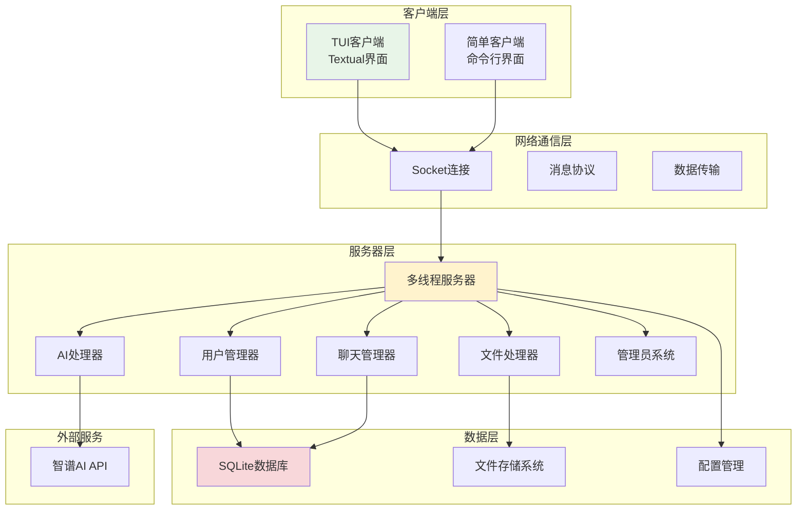
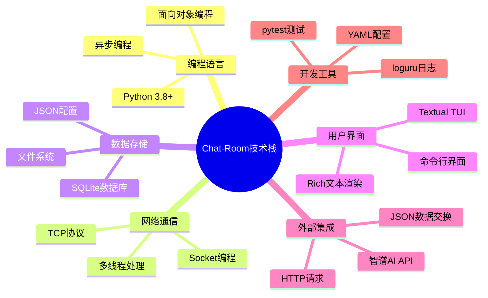
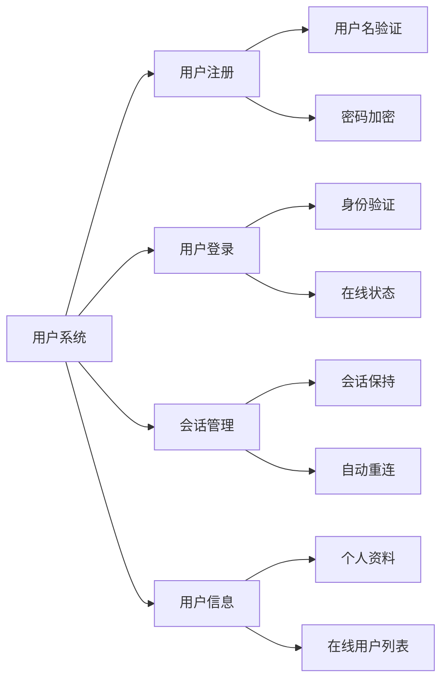
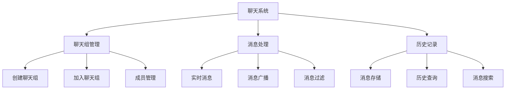
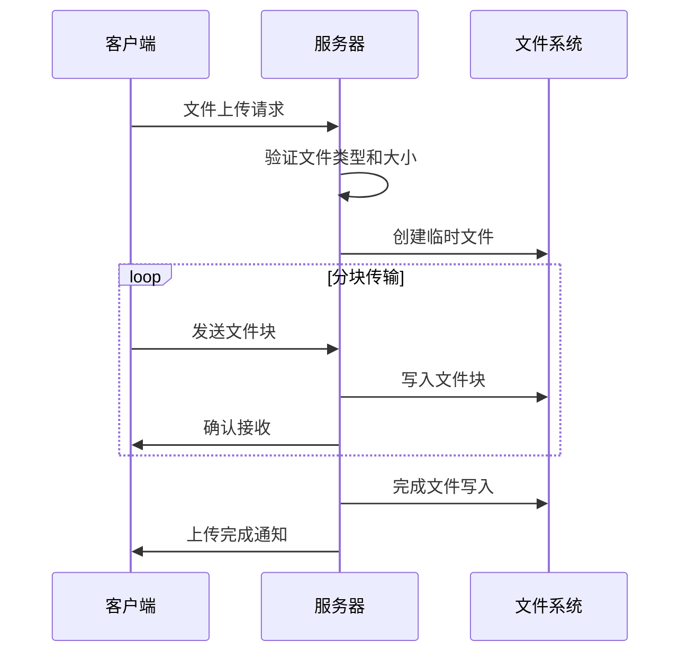
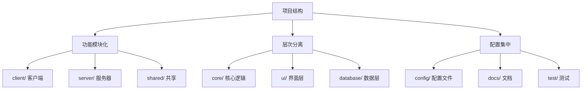
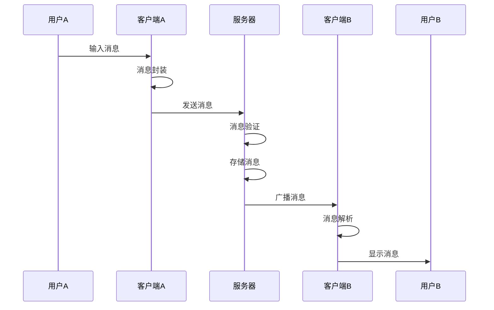
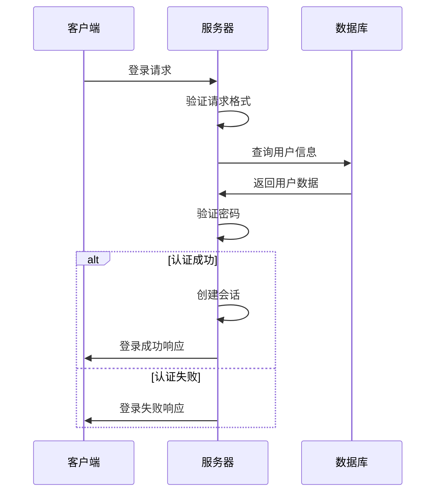

# Chat-Room 项目整体介绍

## 🎯 学习目标

通过本章学习，您将能够：
- 理解Chat-Room项目的整体架构
- 掌握项目的核心功能和技术栈
- 了解项目的设计理念和实现思路
- 为后续深入学习做好准备

## 📖 项目简介

Chat-Room是一个功能完整的实时聊天室系统，采用客户端-服务器架构，使用Socket进行网络通信，SQLite作为数据存储，Textual库构建现代化TUI界面。

### 项目特点
- **教学导向**：专为学习Socket编程和Python开发而设计
- **模块化设计**：代码结构清晰，易于理解和扩展
- **功能完整**：涵盖现代聊天应用的主要功能
- **技术先进**：使用现代Python开发技术和最佳实践

## 🏗️ 系统架构

### 整体架构图


### 技术栈概览


## 🎯 核心功能

### 1. 用户系统


**核心代码示例**：
```python
# server/core/user_manager.py
class UserManager:
    """用户管理器 - 处理用户注册、登录、会话管理"""
    
    def register_user(self, username: str, password: str) -> bool:
        """
        用户注册功能
        
        Args:
            username: 用户名（需要唯一性验证）
            password: 密码（会进行哈希加密存储）
            
        Returns:
            注册是否成功
        """
        # 验证用户名格式和唯一性
        if not validate_username(username):
            raise ValueError("用户名格式不正确")
            
        # 密码哈希加密
        password_hash = hashlib.sha256(password.encode()).hexdigest()
        
        # 存储到数据库
        return self.db_manager.create_user(username, password_hash)
```

### 2. 聊天系统


**核心代码示例**：
```python
# server/core/chat_manager.py
class ChatManager:
    """聊天管理器 - 处理聊天组和消息管理"""
    
    def broadcast_message(self, group_id: int, message: ChatMessage):
        """
        消息广播功能
        
        Args:
            group_id: 聊天组ID
            message: 要广播的消息
        """
        # 获取聊天组成员
        members = self.get_group_members(group_id)
        
        # 向所有在线成员广播消息
        for member in members:
            if member.is_online:
                self.send_message_to_user(member.user_id, message)
        
        # 存储消息到数据库
        self.db_manager.save_message(message)
```

### 3. 文件传输


### 4. AI智能助手
```mermaid
graph LR
    A[AI助手] --> B[触发机制]
    A --> C[上下文管理]
    A --> D[API调用]
    A --> E[响应处理]
    
    B --> B1[@AI提及]
    B --> B2[私聊模式]
    C --> C1[对话历史]
    C --> C2[上下文窗口]
    D --> D1[GLM-4-Flash]
    D --> D2[异步请求]
    E --> E1[消息格式化]
    E --> E2[错误处理]
```

## 📁 项目结构详解

### 目录组织原则


### 关键目录说明

#### 客户端模块 (client/)
```
client/
├── main.py              # 客户端入口程序
├── core/                # 核心通信模块
│   └── client.py        # Socket客户端封装
├── ui/                  # 用户界面
│   ├── app.py          # TUI主应用
│   ├── components/     # UI组件
│   └── themes/         # 主题系统
├── commands/           # 命令处理
└── config/             # 客户端配置
```

#### 服务器模块 (server/)
```
server/
├── main.py             # 服务器入口程序
├── core/               # 核心业务逻辑
│   ├── server.py       # 多线程Socket服务器
│   ├── user_manager.py # 用户管理器
│   └── chat_manager.py # 聊天管理器
├── database/           # 数据库操作
├── ai/                 # AI集成模块
└── utils/              # 工具函数
```

#### 共享模块 (shared/)
```
shared/
├── messages.py         # 消息协议定义
├── constants.py        # 常量定义
├── exceptions.py       # 异常类定义
└── logger.py          # 日志系统
```

## 🔄 数据流程

### 消息传输流程


### 用户认证流程


## 🎨 设计理念

### 1. 模块化设计
- **单一职责**：每个模块只负责一个特定功能
- **低耦合**：模块间依赖关系最小化
- **高内聚**：模块内部功能紧密相关

### 2. 可扩展性
- **插件架构**：支持功能插件扩展
- **配置驱动**：通过配置文件控制行为
- **接口抽象**：定义清晰的接口边界

### 3. 用户体验
- **响应式设计**：界面适应不同终端大小
- **错误友好**：提供清晰的错误信息
- **操作直观**：简化用户操作流程

## 🚀 技术亮点

### 1. 网络编程
- **多线程服务器**：支持并发连接
- **协议设计**：自定义JSON消息协议
- **连接管理**：自动重连和心跳检测

### 2. 数据库设计
- **关系模型**：规范化的数据库设计
- **事务处理**：保证数据一致性
- **性能优化**：索引和查询优化

### 3. 用户界面
- **现代TUI**：基于Textual的现代终端界面
- **主题系统**：支持多种界面主题
- **响应式布局**：自适应界面布局

### 4. AI集成
- **智能对话**：集成GLM-4-Flash模型
- **上下文管理**：维护对话上下文
- **异步处理**：非阻塞AI请求处理

## 📚 学习价值

通过Chat-Room项目，您将学到：

1. **网络编程**：Socket编程、TCP协议、多线程处理
2. **数据库技术**：SQLite使用、数据建模、SQL查询
3. **软件架构**：模块化设计、设计模式、系统架构
4. **用户界面**：TUI开发、组件化设计、用户体验
5. **API集成**：第三方API使用、异步编程、错误处理
6. **开发实践**：测试驱动开发、日志系统、配置管理

## ✅ 学习检查

完成本章学习后，请确认您能够：

- [ ] 理解Chat-Room的整体架构
- [ ] 说明各个模块的职责和关系
- [ ] 解释核心功能的实现思路
- [ ] 识别项目中使用的技术栈
- [ ] 理解项目的设计理念

## 📚 下一步

项目概览完成后，请继续学习：
- [学习方法指导](learning-guide.md)
- [第1章：Python基础与环境搭建](../01-python-basics/syntax-fundamentals.md)

---

**现在您已经对Chat-Room项目有了全面的了解！** 🎉
