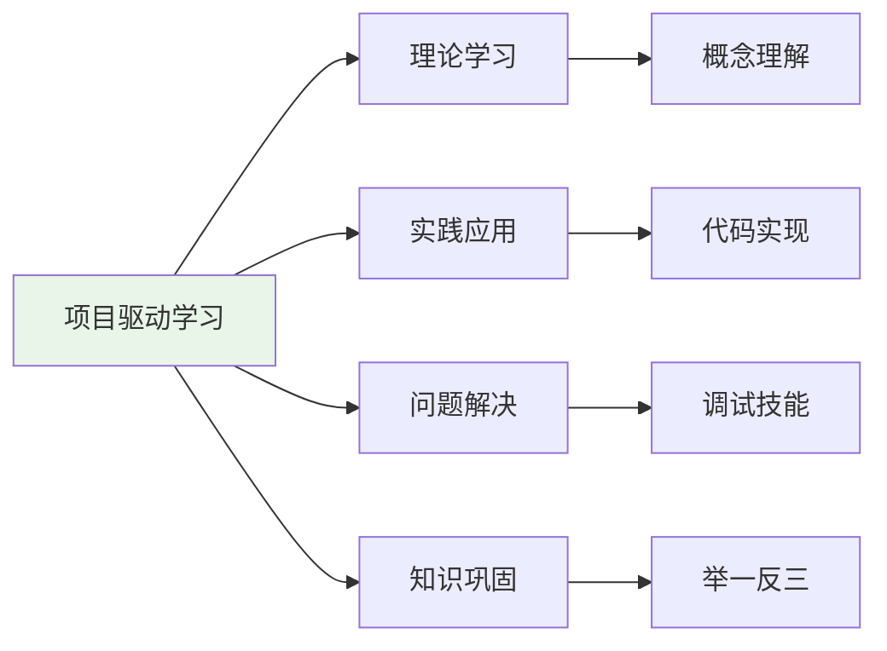
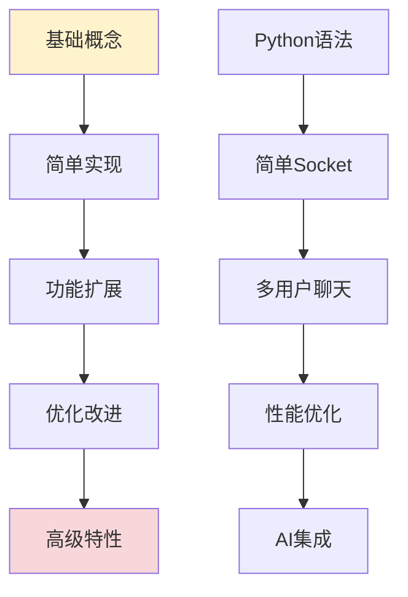
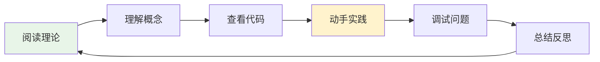
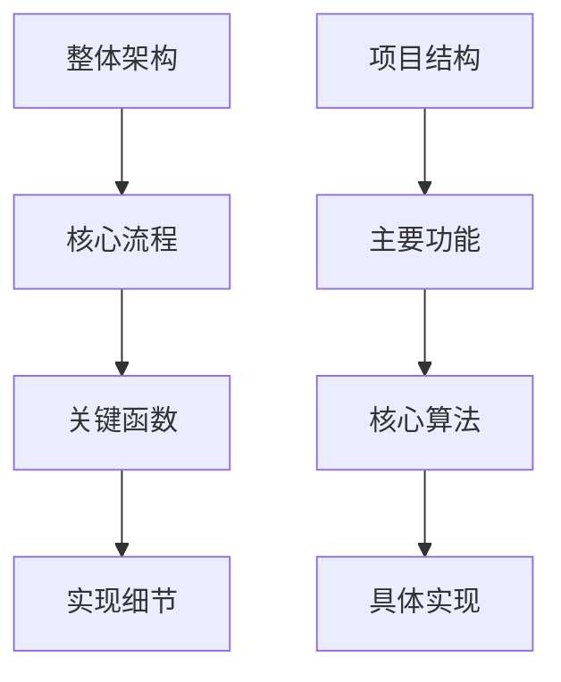
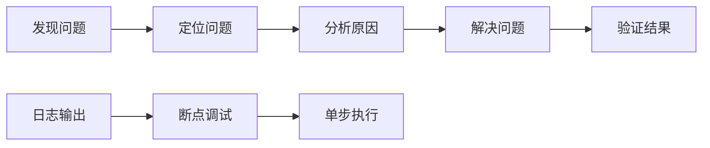
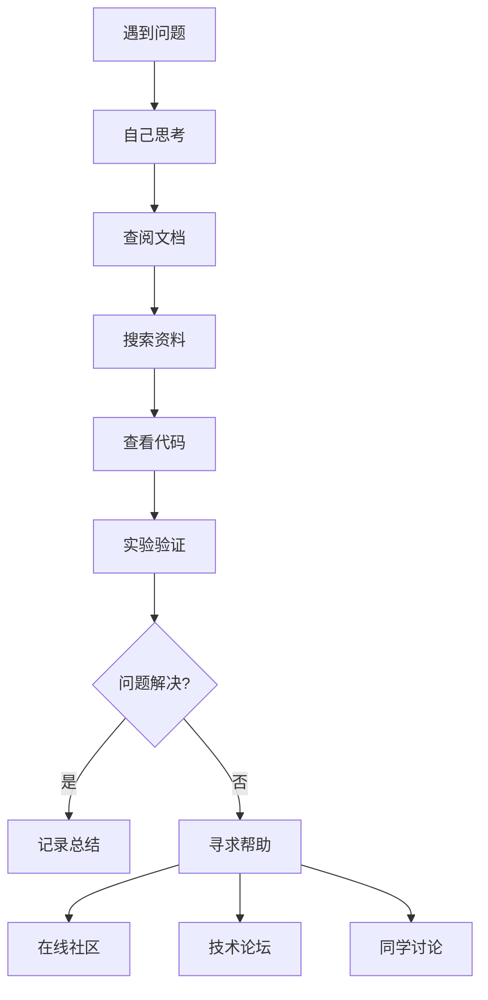

# 学习方法指导

## 🎯 学习目标

通过本章学习，您将能够：
- 掌握高效的编程学习方法
- 理解如何通过项目实践学习技术
- 建立良好的学习习惯和思维模式
- 制定个人学习计划和目标

## 📚 学习理念

### 1. 项目驱动学习


**为什么选择项目驱动？**
- **目标明确**：每个功能都有具体的实现目标
- **即时反馈**：代码运行结果立即可见
- **知识连贯**：技术点在项目中自然串联
- **实用性强**：学到的都是实际开发技能

### 2. 渐进式学习


## 🛠️ 学习方法

### 1. 理论与实践结合

#### 学习循环


#### 具体步骤
1. **阅读文档**：先理解要学习的概念和原理
2. **分析代码**：仔细阅读项目中的相关实现
3. **动手实践**：自己编写代码，验证理解
4. **调试运行**：解决遇到的问题和错误
5. **总结归纳**：整理学到的知识点

### 2. 代码阅读技巧

#### 代码阅读顺序


#### 阅读方法
```python
# 1. 先看函数签名和文档注释
def register_user(self, username: str, password: str) -> bool:
    """
    用户注册功能
    
    Args:
        username: 用户名（需要唯一性验证）
        password: 密码（会进行哈希加密存储）
        
    Returns:
        注册是否成功
    """

# 2. 理解函数的输入输出
# 输入：用户名和密码字符串
# 输出：布尔值表示是否成功

# 3. 分析实现逻辑
# - 验证用户名格式
# - 检查用户名唯一性
# - 密码哈希加密
# - 存储到数据库

# 4. 关注错误处理
# - 输入验证
# - 异常捕获
# - 错误返回
```

### 3. 调试技能培养

#### 调试思路


#### 调试工具使用
```python
# 1. 使用print调试（简单有效）
def send_message(self, message):
    print(f"发送消息: {message}")  # 调试输出
    result = self.socket.send(message.encode())
    print(f"发送结果: {result}")   # 调试输出
    return result

# 2. 使用日志系统（推荐）
from shared.logger import get_logger
logger = get_logger("client.core")

def send_message(self, message):
    logger.debug(f"准备发送消息: {message}")
    try:
        result = self.socket.send(message.encode())
        logger.info(f"消息发送成功: {len(message)} 字节")
        return result
    except Exception as e:
        logger.error(f"消息发送失败: {e}")
        return False

# 3. 使用Python调试器
import pdb

def complex_function(data):
    pdb.set_trace()  # 设置断点
    # 在这里可以交互式调试
    processed_data = process(data)
    return processed_data
```

## 📝 学习记录

### 1. 学习笔记模板

```markdown
# 学习笔记 - [章节名称]

## 日期
2024-XX-XX

## 学习内容
- 主要概念：
- 核心技术：
- 重要代码：

## 理解要点
1. 为什么这样设计？
2. 解决了什么问题？
3. 有什么优缺点？

## 实践练习
- 完成的练习：
- 遇到的问题：
- 解决方案：

## 疑问和思考
- 不理解的地方：
- 需要进一步学习：
- 扩展思考：

## 总结
今天学到的最重要的3个知识点：
1. 
2. 
3. 
```

### 2. 代码注释习惯

```python
class ChatManager:
    """
    聊天管理器
    
    职责：
    1. 管理聊天组的创建、加入、离开
    2. 处理消息的接收、验证、广播
    3. 维护聊天组成员状态
    4. 提供聊天历史查询功能
    
    设计思路：
    - 使用字典存储聊天组信息，提高查询效率
    - 消息广播采用异步方式，避免阻塞
    - 集成权限检查，确保操作安全性
    """
    
    def __init__(self, user_manager: UserManager):
        """
        初始化聊天管理器
        
        Args:
            user_manager: 用户管理器实例，用于验证用户权限
        
        设计考虑：
        - 依赖注入用户管理器，降低耦合度
        - 初始化时创建必要的数据结构
        """
        self.user_manager = user_manager
        self.chat_groups = {}  # 聊天组字典：{group_id: group_info}
        self.group_members = {}  # 成员字典：{group_id: [user_ids]}
```

## 🎯 学习计划制定

### 1. 时间安排建议

#### 每日学习计划

```mermaid
gantt
    title 每日学习时间安排
    dateFormat HH:mm
    axisFormat %H:%M
    
    section 学习时间
    理论学习    :09:00, 10:00
    代码实践    :10:00, 11:30
    休息时间    :11:30, 12:00
    问题解决    :14:00, 15:00
    总结复习    :15:00, 15:30
```


#### 周学习计划
- **周一-周三**：新知识学习
- **周四-周五**：实践和练习
- **周六**：复习和总结
- **周日**：休息或扩展学习

### 2. 学习目标设定

#### SMART目标原则
- **Specific（具体）**：明确要学什么
- **Measurable（可测量）**：有明确的完成标准
- **Achievable（可实现）**：符合当前能力水平
- **Relevant（相关）**：与整体学习目标相关
- **Time-bound（有时限）**：有明确的完成时间

#### 目标示例
```markdown
# 第1周学习目标

## 具体目标
- 完成Python基础语法学习
- 理解Socket编程基本概念
- 实现简单的客户端-服务器通信

## 成功标准
- [ ] 能够解释Python基本数据类型
- [ ] 能够编写简单的Socket客户端
- [ ] 能够运行项目的基础通信功能

## 时间安排
- 每天学习2-3小时
- 周末完成练习和复习
```

## 🤝 学习支持

### 1. 获取帮助的方法

#### 问题解决流程


#### 提问技巧
1. **描述清楚**：说明具体的问题现象
2. **提供上下文**：包含相关的代码和错误信息
3. **展示尝试**：说明已经尝试过的解决方法
4. **简化问题**：提供最小可复现的例子

### 2. 学习资源推荐

#### 在线资源
- **官方文档**：Python、SQLite、Textual官方文档
- **教程网站**：菜鸟教程、廖雪峰Python教程
- **视频课程**：B站、慕课网相关课程
- **技术博客**：CSDN、博客园、知乎专栏

#### 实用工具
- **代码编辑器**：VS Code、PyCharm
- **调试工具**：Python Debugger、pdb
- **版本控制**：Git、GitHub
- **文档工具**：Markdown编辑器

## ✅ 学习效果评估

### 1. 自我检查清单

每章学习完成后，请检查：
- [ ] 理解了核心概念
- [ ] 能够解释实现原理
- [ ] 成功运行了代码示例
- [ ] 完成了练习题目
- [ ] 能够独立实现类似功能

### 2. 知识掌握程度

#### 掌握层次
1. **了解**：知道有这个概念
2. **理解**：明白基本原理和用法
3. **应用**：能够在项目中使用
4. **分析**：能够分析优缺点
5. **创造**：能够设计新的解决方案

#### 评估方法
- **概念测试**：能否用自己的话解释概念
- **代码阅读**：能否理解他人的代码
- **问题解决**：能否独立解决类似问题
- **知识迁移**：能否应用到其他场景

## 🚀 学习建议

### 1. 保持学习动力
- **设定小目标**：每天完成一个小功能
- **记录进步**：写学习日记，记录成长
- **分享交流**：与他人分享学习心得
- **实际应用**：将学到的知识用于实际项目

### 2. 避免常见误区
- **不要急于求成**：扎实掌握基础再进阶
- **不要只看不练**：一定要动手编写代码
- **不要害怕错误**：错误是学习的重要部分
- **不要孤立学习**：技术点要在项目中理解

### 3. 培养编程思维
- **分解问题**：将复杂问题分解为简单问题
- **抽象思维**：从具体实现中抽象出通用模式
- **系统思维**：理解各个模块之间的关系
- **优化思维**：思考如何改进现有实现

## 📚 下一步

学习方法掌握后，请开始正式的学习之旅：
- [第1章：Python基础与环境搭建](../01-python-basics/syntax-fundamentals.md)

## ✅ 学习检查

完成本章学习后，请确认您能够：

- [ ] 理解项目驱动学习的优势
- [ ] 掌握代码阅读和调试技巧
- [ ] 制定了个人学习计划
- [ ] 建立了学习记录习惯
- [ ] 知道如何获取学习支持

---

**现在您已经掌握了高效的学习方法，开始您的编程学习之旅吧！** 🚀
