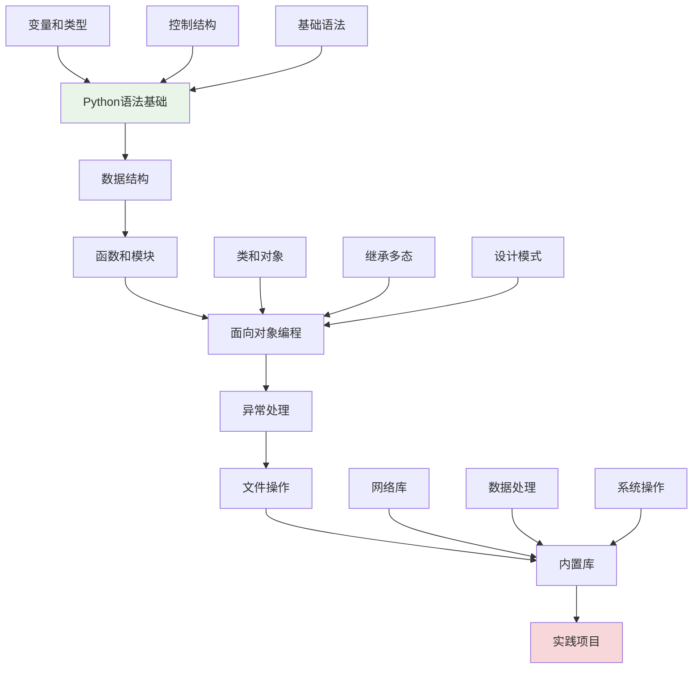

# 第1章：Python编程基础

## 🎯 学习目标

通过本章学习，您将能够：
- 掌握Python语言的基础语法和核心概念
- 理解面向对象编程的基本思想
- 学会使用Python的常用内置库
- 具备开发Chat-Room项目的语言基础
- 培养良好的Python编程习惯

## 📖 本章概览

本章是整个学习路径的语言基础部分。我们将从Python的基本语法开始，逐步深入到面向对象编程、异常处理、文件操作等高级特性，最后介绍常用的内置库。

### 学习路径

## 📚 章节内容

### 1. [Python语法基础](syntax-fundamentals.md)
**学习时间：** 6-8小时  
**难度等级：** ⭐⭐

学习内容：
- Python语言特性和设计哲学
- 变量、数据类型和运算符
- 控制结构（条件、循环）
- 基础异常处理

**Chat-Room应用：** 用户输入验证、消息格式化、基础逻辑控制

### 2. [数据结构](data-structures.md)
**学习时间：** 4-6小时  
**难度等级：** ⭐⭐

学习内容：
- 列表、元组、字典、集合的使用
- 数据结构的选择和优化
- 列表推导式和生成器
- 数据结构在实际项目中的应用

**Chat-Room应用：** 用户列表管理、消息队列、配置数据存储

### 3. [函数和模块](functions-modules.md)
**学习时间：** 4-6小时  
**难度等级：** ⭐⭐

学习内容：
- 函数定义、参数和返回值
- 作用域和闭包
- 装饰器的使用
- 模块和包的组织

**Chat-Room应用：** 消息处理函数、工具模块、代码组织

### 4. [面向对象编程基础](oop-basics.md)
**学习时间：** 6-8小时  
**难度等级：** ⭐⭐⭐

学习内容：
- 类和对象的概念
- 继承、封装、多态
- 特殊方法和属性
- 设计模式入门

**Chat-Room应用：** 用户类、消息类、服务器类的设计

### 5. [异常处理基础](exception-handling.md)
**学习时间：** 3-4小时  
**难度等级：** ⭐⭐

学习内容：
- 异常处理的重要性
- try-except-finally语句
- 自定义异常类
- 异常处理最佳实践

**Chat-Room应用：** 网络异常处理、用户输入验证、错误恢复

### 6. [文件操作和I/O](file-io.md)
**学习时间：** 3-4小时  
**难度等级：** ⭐⭐

学习内容：
- 文件读写操作
- 路径和目录管理
- 配置文件处理
- 文件传输基础

**Chat-Room应用：** 配置文件读取、日志记录、文件传输功能

### 7. [常用内置库介绍](builtin-libraries.md)
**学习时间：** 4-6小时  
**难度等级：** ⭐⭐

学习内容：
- socket网络编程库
- json数据处理库
- threading多线程库
- sqlite3数据库库

**Chat-Room应用：** 网络通信、数据序列化、并发处理、数据存储

## 🔧 前置知识要求

- **计算机基础：** 了解基本的计算机概念
- **编程思维：** 具备基本的逻辑思维能力
- **学习环境：** 已完成第0章的环境搭建

## ⏱️ 预计学习时间

| 内容 | 预计时间 | 累计时间 |
|------|----------|----------|
| Python语法基础 | 6-8小时 | 6-8小时 |
| 数据结构 | 4-6小时 | 10-14小时 |
| 函数和模块 | 4-6小时 | 14-20小时 |
| 面向对象编程 | 6-8小时 | 20-28小时 |
| 异常处理 | 3-4小时 | 23-32小时 |
| 文件操作 | 3-4小时 | 26-36小时 |
| 内置库 | 4-6小时 | 30-42小时 |
| **总计** | **30-42小时** | **5-7天** |

## 📋 学习顺序建议

### 第1-2天：语言基础
1. **Python语法基础** - 建立语言基础
2. **数据结构** - 掌握数据组织方式

### 第3-4天：编程进阶
3. **函数和模块** - 学会代码组织
4. **面向对象编程** - 理解高级编程概念

### 第5-6天：实用技能
5. **异常处理** - 提高程序健壮性
6. **文件操作** - 掌握数据持久化

### 第7天：库和实践
7. **内置库** - 了解Python生态
8. **综合练习** - 巩固所学知识

## ✅ 学习检查清单

### 基础语法掌握
- [ ] 能够编写基本的Python程序
- [ ] 理解变量、数据类型和运算符
- [ ] 熟练使用条件语句和循环
- [ ] 掌握基础的异常处理

### 数据结构应用
- [ ] 熟练使用列表、字典、集合
- [ ] 能够选择合适的数据结构
- [ ] 理解数据结构的性能特点
- [ ] 会使用列表推导式

### 函数和模块
- [ ] 能够定义和使用函数
- [ ] 理解作用域和参数传递
- [ ] 会使用装饰器
- [ ] 能够组织模块和包

### 面向对象编程
- [ ] 理解类和对象的概念
- [ ] 能够设计简单的类
- [ ] 理解继承和多态
- [ ] 会使用特殊方法

### 实用技能
- [ ] 能够处理各种异常情况
- [ ] 熟练进行文件操作
- [ ] 了解常用内置库的使用
- [ ] 能够编写完整的小程序

## 🎯 实践项目

### 阶段性项目：简单聊天程序
在学习过程中，您将逐步构建一个简单的聊天程序：

1. **语法基础阶段：** 实现用户输入和消息显示
2. **数据结构阶段：** 管理用户列表和消息历史
3. **函数模块阶段：** 组织代码结构
4. **面向对象阶段：** 设计用户和消息类
5. **异常处理阶段：** 添加错误处理
6. **文件操作阶段：** 实现消息持久化
7. **内置库阶段：** 添加网络功能

## 🚨 学习难点和解决方案

### 常见难点
1. **面向对象概念理解**
   - 解决方案：多看实例，从简单类开始
   - 重点理解：类是模板，对象是实例

2. **异常处理的时机**
   - 解决方案：先写功能，再添加异常处理
   - 重点理解：预防性编程思维

3. **模块导入和组织**
   - 解决方案：从小项目开始，逐步扩大
   - 重点理解：模块化的好处

### 学习技巧
- **多动手实践：** 每个概念都要编写代码验证
- **循序渐进：** 不要跳跃式学习，打好基础
- **结合项目：** 将知识点应用到Chat-Room项目中
- **及时总结：** 每天学习后总结重点和难点

## 📚 下一步学习

Python基础掌握后，请继续学习：
- [第2章：开发环境配置](../02-development-environment/README.md) - 配置专业开发环境

---

**Python是一门优美而强大的语言，掌握它将为您的编程之路奠定坚实基础！** 🐍

*本章最后更新：2025-01-17*
