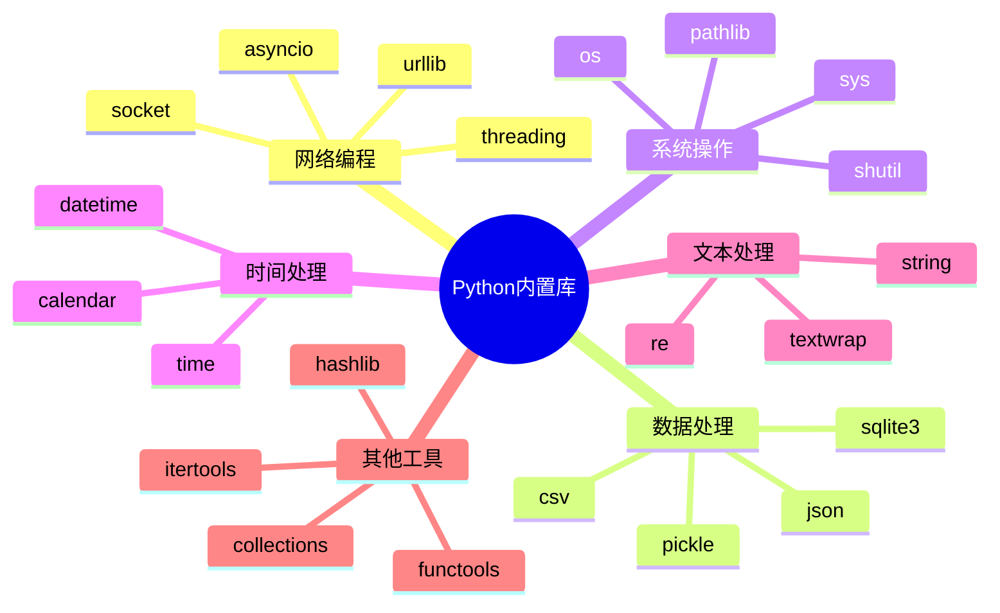

# Python常用内置库介绍

## 🎯 学习目标

通过本章学习，您将能够：
- 掌握Python常用内置库的使用方法
- 理解各个库在Chat-Room项目中的应用场景
- 学会选择合适的库来解决具体问题
- 提高编程效率和代码质量
- 为后续的网络编程和项目开发打下基础

## 📚 内置库概述

Python的强大之处在于其丰富的标准库。在Chat-Room项目中，我们会用到许多内置库来处理网络通信、数据处理、时间管理等任务。



## 🌐 网络编程相关库

### socket - 网络通信基础

```python
# server/core/socket_server.py - Socket服务器示例
import socket
import threading
from typing import Dict, List

class ChatServer:
    """使用socket库实现的聊天服务器"""
    
    def __init__(self, host: str = 'localhost', port: int = 8888):
        self.host = host
        self.port = port
        self.clients: Dict[socket.socket, str] = {}  # 客户端连接字典
        self.running = False
    
    def start_server(self):
        """启动服务器"""
        try:
            # 创建TCP socket
            self.server_socket = socket.socket(socket.AF_INET, socket.SOCK_STREAM)
            
            # 设置socket选项，允许地址重用
            self.server_socket.setsockopt(socket.SOL_SOCKET, socket.SO_REUSEADDR, 1)
            
            # 绑定地址和端口
            self.server_socket.bind((self.host, self.port))
            
            # 开始监听，最大连接数为5
            self.server_socket.listen(5)
            self.running = True
            
            print(f"✅ 服务器启动成功，监听 {self.host}:{self.port}")
            
            while self.running:
                try:
                    # 接受客户端连接
                    client_socket, client_address = self.server_socket.accept()
                    print(f"新客户端连接: {client_address}")
                    
                    # 为每个客户端创建处理线程
                    client_thread = threading.Thread(
                        target=self.handle_client,
                        args=(client_socket, client_address)
                    )
                    client_thread.daemon = True
                    client_thread.start()
                    
                except socket.error as e:
                    if self.running:
                        print(f"接受连接时出错: {e}")
                        
        except Exception as e:
            print(f"服务器启动失败: {e}")
        finally:
            self.stop_server()
    
    def handle_client(self, client_socket: socket.socket, client_address):
        """处理客户端连接"""
        try:
            while self.running:
                # 接收客户端消息
                data = client_socket.recv(1024)
                if not data:
                    break
                
                message = data.decode('utf-8')
                print(f"收到消息 from {client_address}: {message}")
                
                # 广播消息给所有客户端
                self.broadcast_message(message, client_socket)
                
        except socket.error as e:
            print(f"处理客户端 {client_address} 时出错: {e}")
        finally:
            # 清理客户端连接
            if client_socket in self.clients:
                del self.clients[client_socket]
            client_socket.close()
            print(f"客户端 {client_address} 断开连接")
    
    def broadcast_message(self, message: str, sender_socket: socket.socket):
        """广播消息给所有客户端"""
        for client_socket in list(self.clients.keys()):
            if client_socket != sender_socket:
                try:
                    client_socket.send(message.encode('utf-8'))
                except socket.error:
                    # 如果发送失败，移除该客户端
                    if client_socket in self.clients:
                        del self.clients[client_socket]
                    client_socket.close()
```

### threading - 多线程处理

```python
# shared/utils/thread_pool.py - 线程池管理
import threading
import queue
import time
from typing import Callable, Any, Optional

class ThreadPool:
    """简单的线程池实现"""
    
    def __init__(self, max_workers: int = 5):
        self.max_workers = max_workers
        self.workers: List[threading.Thread] = []
        self.task_queue = queue.Queue()
        self.shutdown = False
        
        # 创建工作线程
        for i in range(max_workers):
            worker = threading.Thread(target=self._worker, name=f"Worker-{i}")
            worker.daemon = True
            worker.start()
            self.workers.append(worker)
    
    def _worker(self):
        """工作线程函数"""
        while not self.shutdown:
            try:
                # 从队列中获取任务
                task, args, kwargs = self.task_queue.get(timeout=1)
                if task is None:  # 停止信号
                    break
                
                # 执行任务
                try:
                    task(*args, **kwargs)
                except Exception as e:
                    print(f"任务执行出错: {e}")
                finally:
                    self.task_queue.task_done()
                    
            except queue.Empty:
                continue
    
    def submit(self, func: Callable, *args, **kwargs):
        """提交任务到线程池"""
        if not self.shutdown:
            self.task_queue.put((func, args, kwargs))
    
    def stop(self):
        """停止线程池"""
        self.shutdown = True
        
        # 发送停止信号给所有工作线程
        for _ in self.workers:
            self.task_queue.put((None, (), {}))
        
        # 等待所有线程结束
        for worker in self.workers:
            worker.join()

# 使用示例
def demo_threading():
    """演示多线程使用"""
    def process_message(user_id: int, message: str):
        """模拟消息处理"""
        print(f"处理用户 {user_id} 的消息: {message}")
        time.sleep(1)  # 模拟处理时间
        print(f"用户 {user_id} 的消息处理完成")
    
    # 创建线程池
    pool = ThreadPool(max_workers=3)
    
    # 提交多个任务
    for i in range(10):
        pool.submit(process_message, i, f"消息内容 {i}")
    
    # 等待一段时间后停止
    time.sleep(5)
    pool.stop()
    print("线程池已停止")
```

## 📊 数据处理相关库

### json - JSON数据处理

```python
# shared/protocol/message_protocol.py - 消息协议处理
import json
import time
from typing import Dict, Any, Optional
from enum import Enum

class MessageType(Enum):
    """消息类型枚举"""
    LOGIN = "login"
    LOGOUT = "logout"
    CHAT = "chat"
    SYSTEM = "system"
    ERROR = "error"

class MessageProtocol:
    """消息协议处理类"""
    
    @staticmethod
    def create_message(msg_type: MessageType, content: str, 
                      sender: str = None, recipient: str = None,
                      extra_data: Dict[str, Any] = None) -> str:
        """
        创建标准格式的消息
        
        Args:
            msg_type: 消息类型
            content: 消息内容
            sender: 发送者
            recipient: 接收者
            extra_data: 额外数据
            
        Returns:
            JSON格式的消息字符串
        """
        message = {
            "type": msg_type.value,
            "content": content,
            "timestamp": time.time(),
            "sender": sender,
            "recipient": recipient
        }
        
        if extra_data:
            message.update(extra_data)
        
        try:
            return json.dumps(message, ensure_ascii=False, separators=(',', ':'))
        except (TypeError, ValueError) as e:
            raise ValueError(f"消息序列化失败: {e}")
    
    @staticmethod
    def parse_message(message_str: str) -> Dict[str, Any]:
        """
        解析消息字符串
        
        Args:
            message_str: JSON格式的消息字符串
            
        Returns:
            消息字典
            
        Raises:
            ValueError: 消息格式错误
        """
        try:
            message = json.loads(message_str)
            
            # 验证必需字段
            required_fields = ["type", "content", "timestamp"]
            for field in required_fields:
                if field not in message:
                    raise ValueError(f"缺少必需字段: {field}")
            
            return message
            
        except json.JSONDecodeError as e:
            raise ValueError(f"JSON解析失败: {e}")
    
    @staticmethod
    def create_login_message(username: str, password: str) -> str:
        """创建登录消息"""
        return MessageProtocol.create_message(
            MessageType.LOGIN,
            "用户登录请求",
            extra_data={"username": username, "password": password}
        )
    
    @staticmethod
    def create_chat_message(sender: str, content: str, recipient: str = None) -> str:
        """创建聊天消息"""
        return MessageProtocol.create_message(
            MessageType.CHAT,
            content,
            sender=sender,
            recipient=recipient
        )

# 使用示例
def demo_json_operations():
    """演示JSON操作"""
    protocol = MessageProtocol()
    
    # 创建不同类型的消息
    login_msg = protocol.create_login_message("alice", "password123")
    chat_msg = protocol.create_chat_message("alice", "Hello, everyone!")
    
    print("创建的消息:")
    print(f"登录消息: {login_msg}")
    print(f"聊天消息: {chat_msg}")
    
    # 解析消息
    try:
        parsed_login = protocol.parse_message(login_msg)
        parsed_chat = protocol.parse_message(chat_msg)
        
        print("\n解析的消息:")
        print(f"登录消息类型: {parsed_login['type']}")
        print(f"聊天消息发送者: {parsed_chat['sender']}")
        print(f"聊天消息内容: {parsed_chat['content']}")
        
    except ValueError as e:
        print(f"消息解析失败: {e}")
```

### sqlite3 - 轻量级数据库

```python
# server/database/db_manager.py - 数据库管理
import sqlite3
import os
from typing import List, Dict, Any, Optional
from contextlib import contextmanager

class DatabaseManager:
    """SQLite数据库管理器"""
    
    def __init__(self, db_path: str = "data/chatroom.db"):
        self.db_path = db_path
        
        # 确保数据目录存在
        os.makedirs(os.path.dirname(db_path), exist_ok=True)
        
        # 初始化数据库
        self.init_database()
    
    @contextmanager
    def get_connection(self):
        """获取数据库连接的上下文管理器"""
        conn = sqlite3.connect(self.db_path)
        conn.row_factory = sqlite3.Row  # 使结果可以像字典一样访问
        try:
            yield conn
        finally:
            conn.close()
    
    def init_database(self):
        """初始化数据库表结构"""
        with self.get_connection() as conn:
            cursor = conn.cursor()
            
            # 创建用户表
            cursor.execute("""
                CREATE TABLE IF NOT EXISTS users (
                    id INTEGER PRIMARY KEY AUTOINCREMENT,
                    username TEXT UNIQUE NOT NULL,
                    password_hash TEXT NOT NULL,
                    email TEXT,
                    is_admin BOOLEAN DEFAULT FALSE,
                    is_banned BOOLEAN DEFAULT FALSE,
                    created_at TIMESTAMP DEFAULT CURRENT_TIMESTAMP,
                    last_login TIMESTAMP
                )
            """)
            
            # 创建聊天组表
            cursor.execute("""
                CREATE TABLE IF NOT EXISTS chat_groups (
                    id INTEGER PRIMARY KEY AUTOINCREMENT,
                    name TEXT NOT NULL,
                    description TEXT,
                    created_by INTEGER,
                    created_at TIMESTAMP DEFAULT CURRENT_TIMESTAMP,
                    FOREIGN KEY (created_by) REFERENCES users (id)
                )
            """)
            
            # 创建消息表
            cursor.execute("""
                CREATE TABLE IF NOT EXISTS messages (
                    id INTEGER PRIMARY KEY AUTOINCREMENT,
                    sender_id INTEGER NOT NULL,
                    group_id INTEGER,
                    recipient_id INTEGER,
                    content TEXT NOT NULL,
                    message_type TEXT DEFAULT 'chat',
                    created_at TIMESTAMP DEFAULT CURRENT_TIMESTAMP,
                    FOREIGN KEY (sender_id) REFERENCES users (id),
                    FOREIGN KEY (group_id) REFERENCES chat_groups (id),
                    FOREIGN KEY (recipient_id) REFERENCES users (id)
                )
            """)
            
            conn.commit()
            print("✅ 数据库初始化完成")
    
    def create_user(self, username: str, password_hash: str, 
                   email: str = None, is_admin: bool = False) -> int:
        """创建新用户"""
        with self.get_connection() as conn:
            cursor = conn.cursor()
            
            cursor.execute("""
                INSERT INTO users (username, password_hash, email, is_admin)
                VALUES (?, ?, ?, ?)
            """, (username, password_hash, email, is_admin))
            
            user_id = cursor.lastrowid
            conn.commit()
            
            print(f"✅ 用户 {username} 创建成功，ID: {user_id}")
            return user_id
    
    def get_user_by_username(self, username: str) -> Optional[Dict[str, Any]]:
        """根据用户名获取用户信息"""
        with self.get_connection() as conn:
            cursor = conn.cursor()
            
            cursor.execute("SELECT * FROM users WHERE username = ?", (username,))
            row = cursor.fetchone()
            
            return dict(row) if row else None
    
    def save_message(self, sender_id: int, content: str, 
                    group_id: int = None, recipient_id: int = None) -> int:
        """保存消息到数据库"""
        with self.get_connection() as conn:
            cursor = conn.cursor()
            
            cursor.execute("""
                INSERT INTO messages (sender_id, group_id, recipient_id, content)
                VALUES (?, ?, ?, ?)
            """, (sender_id, group_id, recipient_id, content))
            
            message_id = cursor.lastrowid
            conn.commit()
            
            return message_id
    
    def get_recent_messages(self, group_id: int = None, limit: int = 50) -> List[Dict[str, Any]]:
        """获取最近的消息"""
        with self.get_connection() as conn:
            cursor = conn.cursor()
            
            if group_id:
                cursor.execute("""
                    SELECT m.*, u.username as sender_name
                    FROM messages m
                    JOIN users u ON m.sender_id = u.id
                    WHERE m.group_id = ?
                    ORDER BY m.created_at DESC
                    LIMIT ?
                """, (group_id, limit))
            else:
                cursor.execute("""
                    SELECT m.*, u.username as sender_name
                    FROM messages m
                    JOIN users u ON m.sender_id = u.id
                    ORDER BY m.created_at DESC
                    LIMIT ?
                """, (limit,))
            
            rows = cursor.fetchall()
            return [dict(row) for row in rows]

# 使用示例
def demo_database_operations():
    """演示数据库操作"""
    db = DatabaseManager("test_chatroom.db")
    
    try:
        # 创建测试用户
        user_id = db.create_user("alice", "hashed_password", "alice@example.com")
        
        # 获取用户信息
        user = db.get_user_by_username("alice")
        if user:
            print(f"用户信息: {user['username']}, 邮箱: {user['email']}")
        
        # 保存消息
        message_id = db.save_message(user_id, "Hello, world!")
        print(f"消息保存成功，ID: {message_id}")
        
        # 获取最近消息
        messages = db.get_recent_messages(limit=10)
        print(f"最近消息数量: {len(messages)}")
        
    finally:
        # 清理测试数据库
        if os.path.exists("test_chatroom.db"):
            os.remove("test_chatroom.db")
```

## 🎯 实践练习

### 练习1：消息队列系统
```python
def practice_message_queue():
    """
    消息队列系统练习
    
    要求：
    1. 使用queue模块实现消息队列
    2. 支持优先级消息
    3. 实现消息持久化
    4. 处理队列满的情况
    """
    # TODO: 实现消息队列系统
    pass
```

### 练习2：配置管理系统
```python
def practice_config_system():
    """
    配置管理系统练习
    
    要求：
    1. 支持多种配置格式（JSON, YAML, INI）
    2. 实现配置热重载
    3. 提供配置验证功能
    4. 支持环境变量覆盖
    """
    # TODO: 实现配置管理系统
    pass
```

## ✅ 学习检查

完成本章学习后，请确认您能够：

- [ ] 熟练使用socket进行网络编程
- [ ] 使用threading处理并发任务
- [ ] 使用json处理数据序列化
- [ ] 使用sqlite3进行数据库操作
- [ ] 使用time和datetime处理时间
- [ ] 选择合适的内置库解决问题
- [ ] 完成实践练习

## 📚 下一步

Python基础知识掌握后，请继续学习：
- [开发环境配置](../02-development-environment/README.md) - 配置专业的开发环境

---

**掌握内置库是Python编程的重要基础！** 📚
