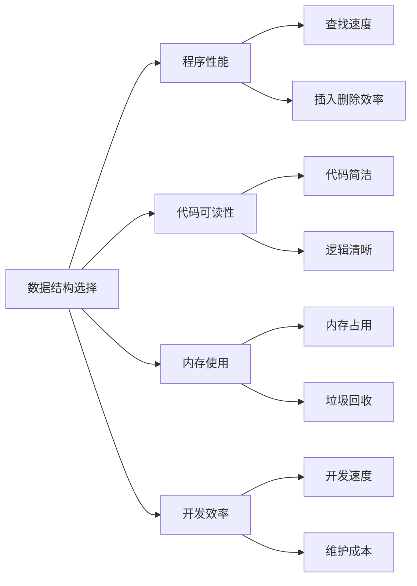
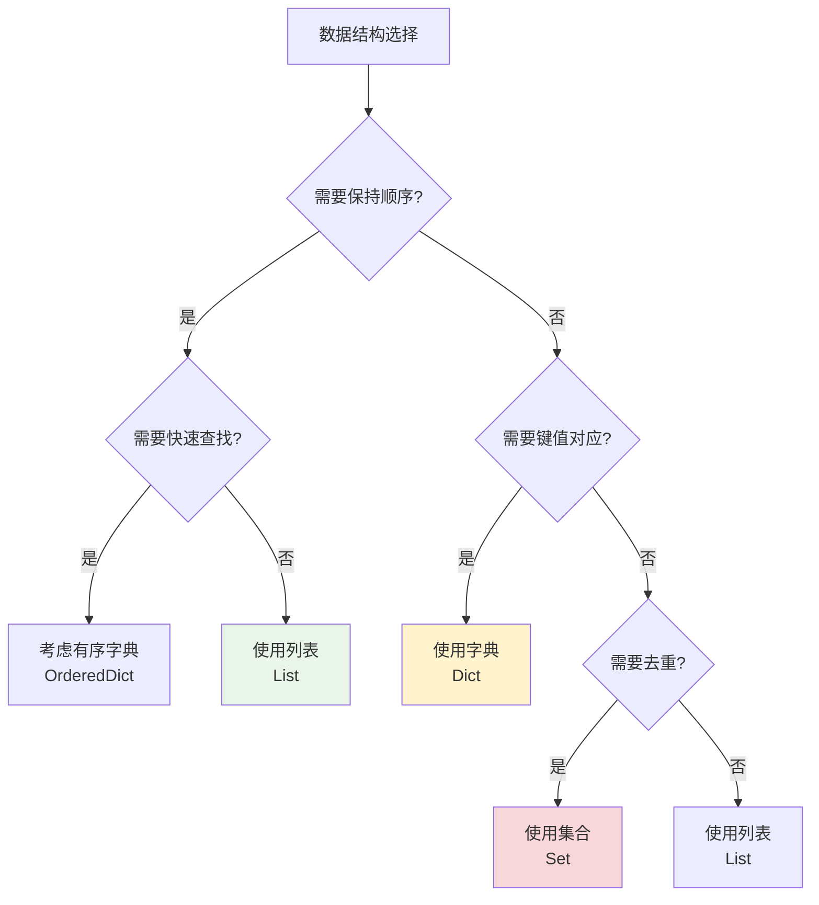

# Python数据结构详解

## 🎯 学习目标

通过本章学习，您将能够：
- 深入理解Python核心数据结构的特性和用法
- 掌握列表、字典、集合的高级操作技巧
- 学会在Chat-Room项目中合理选择和使用数据结构
- 理解数据结构对程序性能的影响

## 📚 为什么数据结构很重要？

在Chat-Room项目中，合适的数据结构选择直接影响程序的性能和可维护性：



## 📋 列表（List）- 有序可变序列

### 基础操作回顾
```python
# server/core/chat_manager.py - 聊天组成员管理
class ChatManager:
    def __init__(self):
        # 使用列表存储聊天组成员（保持加入顺序）
        self.group_members = {}  # {group_id: [user_id1, user_id2, ...]}
    
    def add_member_to_group(self, group_id: int, user_id: int):
        """
        添加成员到聊天组
        
        为什么使用列表：
        1. 需要保持成员加入的顺序
        2. 支持快速遍历所有成员
        3. 允许重复操作（虽然我们会检查重复）
        """
        if group_id not in self.group_members:
            self.group_members[group_id] = []
        
        # 检查是否已存在（避免重复）
        if user_id not in self.group_members[group_id]:
            self.group_members[group_id].append(user_id)
            print(f"用户 {user_id} 已加入聊天组 {group_id}")
        else:
            print(f"用户 {user_id} 已在聊天组 {group_id} 中")
```

### 高级列表操作
```python
# server/core/server.py - 客户端连接管理
class ChatRoomServer:
    def __init__(self):
        # 使用列表存储活跃连接
        self.active_connections = []  # [(socket, user_id, last_activity), ...]
    
    def cleanup_inactive_connections(self, timeout_seconds: int = 300):
        """
        清理不活跃的连接
        
        高级列表操作技巧：
        1. 列表推导式过滤
        2. 多条件筛选
        3. 原地修改列表
        """
        import time
        current_time = time.time()
        
        # 方法1：列表推导式（创建新列表）
        active_connections = [
            (sock, user_id, last_activity)
            for sock, user_id, last_activity in self.active_connections
            if current_time - last_activity < timeout_seconds
        ]
        
        # 方法2：原地过滤（节省内存）
        i = 0
        while i < len(self.active_connections):
            sock, user_id, last_activity = self.active_connections[i]
            if current_time - last_activity >= timeout_seconds:
                # 关闭超时连接
                try:
                    sock.close()
                    print(f"关闭超时连接: 用户 {user_id}")
                except:
                    pass
                # 从列表中移除
                self.active_connections.pop(i)
            else:
                i += 1
    
    def get_recent_messages(self, group_id: int, limit: int = 50):
        """
        获取最近的消息（列表切片应用）
        
        列表切片技巧：
        - 负索引：从末尾开始
        - 切片：高效的子序列操作
        """
        all_messages = self.get_all_messages(group_id)
        
        # 获取最后50条消息
        recent_messages = all_messages[-limit:] if len(all_messages) > limit else all_messages
        
        # 按时间排序（使用key参数）
        recent_messages.sort(key=lambda msg: msg.timestamp)
        
        return recent_messages
```

### 列表性能优化
```python
# 性能对比：不同操作的时间复杂度
def list_performance_demo():
    """
    列表操作性能分析
    
    时间复杂度：
    - 访问元素：O(1)
    - 末尾添加：O(1)
    - 开头插入：O(n)
    - 查找元素：O(n)
    - 删除元素：O(n)
    """
    import time
    
    # 大量数据测试
    large_list = list(range(100000))
    
    # 高效操作：末尾添加
    start_time = time.time()
    for i in range(1000):
        large_list.append(i)
    print(f"末尾添加1000个元素耗时: {time.time() - start_time:.4f}秒")
    
    # 低效操作：开头插入
    start_time = time.time()
    for i in range(100):  # 只测试100个，因为太慢了
        large_list.insert(0, i)
    print(f"开头插入100个元素耗时: {time.time() - start_time:.4f}秒")
    
    # Chat-Room中的优化策略
    print("\nChat-Room优化策略：")
    print("1. 消息列表：使用append()添加新消息")
    print("2. 用户列表：避免频繁的insert(0, item)")
    print("3. 大量查找：考虑使用字典或集合")
```

## 📖 字典（Dict）- 键值对映射

### Chat-Room中的字典应用
```python
# server/core/user_manager.py - 用户管理
class UserManager:
    def __init__(self):
        """
        字典在用户管理中的应用
        
        为什么使用字典：
        1. 快速查找：O(1)时间复杂度
        2. 键值对应：用户ID -> 用户信息
        3. 动态添加：随时添加新用户
        """
        # 在线用户字典：{user_id: socket_connection}
        self.online_users = {}
        
        # 用户会话字典：{user_id: session_info}
        self.user_sessions = {}
        
        # 用户权限字典：{user_id: permission_level}
        self.user_permissions = {}
    
    def login_user(self, user_id: int, socket_conn, username: str):
        """
        用户登录处理
        
        字典操作技巧：
        1. 多个相关字典同步更新
        2. 使用get()方法安全访问
        3. 字典推导式创建复杂结构
        """
        # 检查是否已登录
        if user_id in self.online_users:
            return False, "用户已在其他地方登录"
        
        # 更新多个字典
        self.online_users[user_id] = socket_conn
        self.user_sessions[user_id] = {
            'username': username,
            'login_time': time.time(),
            'last_activity': time.time(),
            'ip_address': socket_conn.getpeername()[0]
        }
        
        # 设置默认权限
        self.user_permissions[user_id] = self.user_permissions.get(user_id, 'user')
        
        return True, "登录成功"
    
    def get_online_users_info(self):
        """
        获取在线用户信息
        
        字典推导式应用：
        - 过滤和转换数据
        - 创建新的数据结构
        """
        # 字典推导式：创建用户信息摘要
        users_info = {
            user_id: {
                'username': session['username'],
                'online_duration': time.time() - session['login_time'],
                'permission': self.user_permissions.get(user_id, 'user')
            }
            for user_id, session in self.user_sessions.items()
            if user_id in self.online_users  # 只包含在线用户
        }
        
        return users_info
```

### 高级字典操作
```python
# shared/config/config_manager.py - 配置管理
class ConfigManager:
    def __init__(self):
        """
        配置管理中的字典高级用法
        
        技巧：
        1. 嵌套字典处理
        2. 字典合并
        3. 默认值处理
        """
        self.config = {}
        self.default_config = {
            'server': {
                'host': 'localhost',
                'port': 8888,
                'max_connections': 100
            },
            'database': {
                'path': 'data/chatroom.db',
                'backup_enabled': True
            },
            'logging': {
                'level': 'INFO',
                'file_enabled': True
            }
        }
    
    def deep_merge_dict(self, base_dict: dict, update_dict: dict) -> dict:
        """
        深度合并字典
        
        应用场景：
        - 用户配置覆盖默认配置
        - 保持嵌套结构完整性
        """
        result = base_dict.copy()
        
        for key, value in update_dict.items():
            if key in result and isinstance(result[key], dict) and isinstance(value, dict):
                # 递归合并嵌套字典
                result[key] = self.deep_merge_dict(result[key], value)
            else:
                # 直接覆盖
                result[key] = value
        
        return result
    
    def get_config_value(self, key_path: str, default=None):
        """
        使用点号路径访问嵌套字典
        
        示例：get_config_value('server.host') -> 'localhost'
        """
        keys = key_path.split('.')
        current = self.config
        
        try:
            for key in keys:
                current = current[key]
            return current
        except (KeyError, TypeError):
            return default
    
    def set_config_value(self, key_path: str, value):
        """
        使用点号路径设置嵌套字典值
        
        示例：set_config_value('server.port', 9999)
        """
        keys = key_path.split('.')
        current = self.config
        
        # 创建嵌套结构
        for key in keys[:-1]:
            if key not in current:
                current[key] = {}
            current = current[key]
        
        # 设置最终值
        current[keys[-1]] = value
```

## 🔗 集合（Set）- 无序不重复元素

### Chat-Room中的集合应用
```python
# server/core/admin_manager.py - 管理员系统
class AdminManager:
    def __init__(self):
        """
        集合在权限管理中的应用
        
        为什么使用集合：
        1. 快速成员检查：O(1)时间复杂度
        2. 自动去重：避免重复权限
        3. 集合运算：权限的交集、并集操作
        """
        # 管理员用户ID集合
        self.admin_users = set()
        
        # 被禁用的用户ID集合
        self.banned_users = set()
        
        # 被禁用的聊天组ID集合
        self.banned_groups = set()
        
        # 在线管理员集合
        self.online_admins = set()
    
    def add_admin(self, user_id: int):
        """
        添加管理员
        
        集合操作优势：
        - 自动去重，不用检查是否已存在
        - O(1)时间复杂度
        """
        self.admin_users.add(user_id)
        
        # 如果用户在线，添加到在线管理员集合
        if self.is_user_online(user_id):
            self.online_admins.add(user_id)
        
        print(f"用户 {user_id} 已设置为管理员")
    
    def ban_user(self, user_id: int, admin_id: int):
        """
        禁用用户
        
        集合运算应用：
        - 检查权限（管理员集合）
        - 添加到禁用集合
        """
        # 检查操作权限
        if admin_id not in self.admin_users:
            return False, "权限不足"
        
        # 不能禁用管理员
        if user_id in self.admin_users:
            return False, "不能禁用管理员用户"
        
        # 添加到禁用集合
        self.banned_users.add(user_id)
        
        # 从在线用户中移除
        self.online_admins.discard(user_id)  # discard不会抛出异常
        
        return True, f"用户 {user_id} 已被禁用"
    
    def get_user_permissions(self, user_id: int) -> set:
        """
        获取用户权限集合
        
        集合运算示例：
        - 并集：基础权限 + 特殊权限
        - 差集：移除被禁用的权限
        """
        # 基础权限
        base_permissions = {'read_messages', 'send_messages', 'join_groups'}
        
        # 管理员权限
        admin_permissions = {
            'ban_users', 'delete_messages', 'manage_groups', 
            'view_logs', 'system_admin'
        }
        
        # 计算最终权限
        if user_id in self.banned_users:
            # 被禁用用户：空权限集合
            return set()
        elif user_id in self.admin_users:
            # 管理员：基础权限 + 管理员权限
            return base_permissions | admin_permissions  # 并集运算
        else:
            # 普通用户：基础权限
            return base_permissions
    
    def check_permission(self, user_id: int, required_permission: str) -> bool:
        """
        检查用户权限
        
        集合成员检查：O(1)时间复杂度
        """
        user_permissions = self.get_user_permissions(user_id)
        return required_permission in user_permissions
```

### 集合运算实战
```python
# server/utils/group_analytics.py - 聊天组分析
def analyze_group_activity(group_members: dict, active_users: set, 
                          banned_users: set) -> dict:
    """
    聊天组活跃度分析
    
    集合运算的实际应用：
    1. 交集：找出活跃的组成员
    2. 差集：排除被禁用的用户
    3. 并集：合并多个组的成员
    """
    analysis = {}
    
    for group_id, members in group_members.items():
        # 转换为集合以便进行集合运算
        member_set = set(members)
        
        # 活跃成员：组成员 ∩ 活跃用户 - 被禁用用户
        active_members = (member_set & active_users) - banned_users
        
        # 不活跃成员：组成员 - 活跃用户 - 被禁用用户
        inactive_members = member_set - active_users - banned_users
        
        # 被禁用成员：组成员 ∩ 被禁用用户
        banned_members = member_set & banned_users
        
        analysis[group_id] = {
            'total_members': len(member_set),
            'active_members': len(active_members),
            'inactive_members': len(inactive_members),
            'banned_members': len(banned_members),
            'activity_rate': len(active_members) / len(member_set) if member_set else 0
        }
    
    return analysis

# 使用示例
def demo_set_operations():
    """集合运算演示"""
    # 模拟数据
    group_members = {
        1: [101, 102, 103, 104, 105],  # 公频聊天组
        2: [102, 103, 106, 107],       # 技术讨论组
        3: [101, 104, 108, 109]        # 游戏交流组
    }
    
    active_users = {101, 102, 103, 106, 108}
    banned_users = {105, 107}
    
    # 分析结果
    analysis = analyze_group_activity(group_members, active_users, banned_users)
    
    for group_id, stats in analysis.items():
        print(f"聊天组 {group_id}:")
        print(f"  总成员: {stats['total_members']}")
        print(f"  活跃成员: {stats['active_members']}")
        print(f"  活跃率: {stats['activity_rate']:.2%}")
        print()
```

## 🔄 数据结构选择指南

### 性能对比表
```python
def performance_comparison():
    """
    数据结构性能对比
    
    操作复杂度对比：
    """
    comparison_table = {
        '操作': ['访问', '查找', '插入', '删除'],
        'List': ['O(1)', 'O(n)', 'O(n)', 'O(n)'],
        'Dict': ['O(1)', 'O(1)', 'O(1)', 'O(1)'],
        'Set': ['N/A', 'O(1)', 'O(1)', 'O(1)']
    }
    
    print("数据结构性能对比:")
    print("-" * 40)
    for i, op in enumerate(comparison_table['操作']):
        print(f"{op:6} | List: {comparison_table['List'][i]:6} | "
              f"Dict: {comparison_table['Dict'][i]:6} | Set: {comparison_table['Set'][i]:6}")
```

### Chat-Room中的选择策略


## 🎯 实践练习

### 练习1：消息缓存系统
```python
class MessageCache:
    """
    实现一个消息缓存系统
    
    要求：
    1. 使用合适的数据结构存储最近的消息
    2. 支持按聊天组分类
    3. 限制每个组的消息数量
    4. 提供快速查找功能
    """
    
    def __init__(self, max_messages_per_group: int = 100):
        # TODO: 选择合适的数据结构
        pass
    
    def add_message(self, group_id: int, message: dict):
        """添加消息到缓存"""
        # TODO: 实现消息添加逻辑
        pass
    
    def get_recent_messages(self, group_id: int, count: int = 10):
        """获取最近的消息"""
        # TODO: 实现消息获取逻辑
        pass
    
    def search_messages(self, group_id: int, keyword: str):
        """搜索包含关键词的消息"""
        # TODO: 实现消息搜索逻辑
        pass
```

### 练习2：用户关系管理
```python
class UserRelationshipManager:
    """
    用户关系管理系统
    
    要求：
    1. 管理用户的好友关系
    2. 支持好友推荐（共同好友）
    3. 检测用户群体（好友圈）
    4. 高效的关系查询
    """
    
    def __init__(self):
        # TODO: 设计数据结构存储用户关系
        pass
    
    def add_friendship(self, user1_id: int, user2_id: int):
        """添加好友关系"""
        # TODO: 实现好友关系添加
        pass
    
    def get_mutual_friends(self, user1_id: int, user2_id: int):
        """获取共同好友"""
        # TODO: 使用集合运算实现
        pass
    
    def recommend_friends(self, user_id: int, limit: int = 5):
        """推荐好友（基于共同好友）"""
        # TODO: 实现好友推荐算法
        pass
```

## ✅ 学习检查

完成本章学习后，请确认您能够：

- [ ] 理解列表、字典、集合的特性和适用场景
- [ ] 掌握各种数据结构的高级操作技巧
- [ ] 能够根据需求选择合适的数据结构
- [ ] 理解不同操作的时间复杂度
- [ ] 在Chat-Room项目中正确应用数据结构
- [ ] 完成实践练习

## 📚 下一步

数据结构掌握后，请继续学习：
- [函数与模块](functions-modules.md)
- [面向对象编程基础](oop-basics.md)

---

**现在您已经掌握了Python数据结构的高级用法！** 🎉
