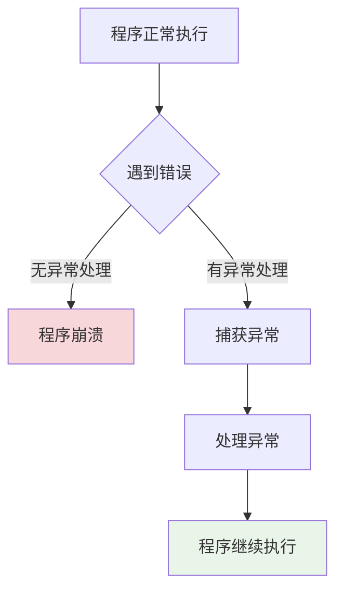

# Python异常处理基础

## 🎯 学习目标

通过本章学习，您将能够：
- 理解Python异常处理的基本概念和重要性
- 掌握try-except-finally语句的使用方法
- 学会创建和抛出自定义异常
- 在Chat-Room项目中应用异常处理最佳实践
- 提高程序的健壮性和用户体验

## 🚨 异常处理概述

### 什么是异常？

异常是程序运行时发生的错误，它会中断程序的正常执行流程。在Chat-Room项目中，异常处理至关重要，因为网络编程涉及许多不可预测的情况。



### Chat-Room中的常见异常场景

```python
# shared/exceptions.py - 项目自定义异常
"""
Chat-Room项目异常定义
定义项目中可能出现的各种异常类型
"""

class ChatRoomException(Exception):
    """Chat-Room基础异常类"""
    def __init__(self, message: str, error_code: int = None):
        super().__init__(message)
        self.message = message
        self.error_code = error_code

class NetworkException(ChatRoomException):
    """网络相关异常"""
    pass

class AuthenticationException(ChatRoomException):
    """身份验证异常"""
    pass

class DatabaseException(ChatRoomException):
    """数据库操作异常"""
    pass

class ValidationException(ChatRoomException):
    """数据验证异常"""
    pass

class FileTransferException(ChatRoomException):
    """文件传输异常"""
    pass
```

## 🛡️ 基础异常处理

### try-except语句

```python
# client/core/network_client.py - 网络连接异常处理
import socket
import time
from typing import Optional
from shared.exceptions import NetworkException

class NetworkClient:
    """网络客户端类，演示异常处理的实际应用"""
    
    def __init__(self):
        self.socket: Optional[socket.socket] = None
        self.connected = False
    
    def connect_to_server(self, host: str, port: int, timeout: int = 10) -> bool:
        """
        连接到服务器，包含完整的异常处理
        
        Args:
            host: 服务器地址
            port: 服务器端口
            timeout: 连接超时时间（秒）
            
        Returns:
            连接是否成功
            
        Raises:
            NetworkException: 网络连接失败
        """
        try:
            # 创建socket对象
            self.socket = socket.socket(socket.AF_INET, socket.SOCK_STREAM)
            self.socket.settimeout(timeout)
            
            print(f"正在连接服务器 {host}:{port}...")
            
            # 尝试连接
            self.socket.connect((host, port))
            self.connected = True
            
            print("✅ 服务器连接成功！")
            return True
            
        except socket.timeout:
            # 连接超时
            error_msg = f"连接超时（{timeout}秒），请检查网络连接"
            print(f"❌ {error_msg}")
            raise NetworkException(error_msg, error_code=1001)
            
        except socket.gaierror as e:
            # 域名解析失败
            error_msg = f"域名解析失败: {e}"
            print(f"❌ {error_msg}")
            raise NetworkException(error_msg, error_code=1002)
            
        except ConnectionRefusedError:
            # 连接被拒绝
            error_msg = "连接被拒绝，请确认服务器是否启动"
            print(f"❌ {error_msg}")
            raise NetworkException(error_msg, error_code=1003)
            
        except OSError as e:
            # 其他系统错误
            if e.errno == 10048:  # Windows: 地址已在使用
                error_msg = "端口已被占用"
            elif e.errno == 10061:  # Windows: 连接被拒绝
                error_msg = "无法连接到服务器"
            else:
                error_msg = f"网络错误: {e}"
            
            print(f"❌ {error_msg}")
            raise NetworkException(error_msg, error_code=1004)
            
        except Exception as e:
            # 未预期的异常
            error_msg = f"未知连接错误: {e}"
            print(f"❌ {error_msg}")
            raise NetworkException(error_msg, error_code=1999)
        
        finally:
            # 清理资源（如果连接失败）
            if not self.connected and self.socket:
                try:
                    self.socket.close()
                except:
                    pass  # 忽略关闭时的异常
                self.socket = None

# 使用示例
def demo_network_connection():
    """演示网络连接异常处理"""
    client = NetworkClient()
    
    try:
        # 尝试连接到服务器
        success = client.connect_to_server("localhost", 8888, timeout=5)
        if success:
            print("可以开始发送消息了")
            
    except NetworkException as e:
        print(f"网络连接失败: {e.message}")
        print(f"错误代码: {e.error_code}")
        
        # 根据错误代码提供不同的解决建议
        if e.error_code == 1001:
            print("💡 建议：检查网络连接，或增加超时时间")
        elif e.error_code == 1003:
            print("💡 建议：确认服务器已启动，检查端口号是否正确")
        else:
            print("💡 建议：检查网络设置和防火墙配置")
```

### 多重异常处理

```python
# server/database/user_manager.py - 数据库操作异常处理
import sqlite3
import hashlib
from typing import Optional, Dict, Any
from shared.exceptions import DatabaseException, ValidationException, AuthenticationException

class UserManager:
    """用户管理类，演示数据库操作的异常处理"""
    
    def __init__(self, db_path: str):
        self.db_path = db_path
    
    def create_user(self, username: str, password: str, email: str = None) -> int:
        """
        创建新用户，包含多层异常处理
        
        Args:
            username: 用户名
            password: 密码
            email: 邮箱（可选）
            
        Returns:
            新用户的ID
            
        Raises:
            ValidationException: 输入数据验证失败
            DatabaseException: 数据库操作失败
        """
        try:
            # 第一层：输入验证
            self._validate_user_input(username, password, email)
            
            # 第二层：数据库操作
            with sqlite3.connect(self.db_path) as conn:
                cursor = conn.cursor()
                
                # 检查用户名是否已存在
                cursor.execute("SELECT id FROM users WHERE username = ?", (username,))
                if cursor.fetchone():
                    raise ValidationException(f"用户名 '{username}' 已存在")
                
                # 密码加密
                password_hash = hashlib.sha256(password.encode()).hexdigest()
                
                # 插入新用户
                cursor.execute("""
                    INSERT INTO users (username, password_hash, email, created_at)
                    VALUES (?, ?, ?, datetime('now'))
                """, (username, password_hash, email))
                
                user_id = cursor.lastrowid
                conn.commit()
                
                print(f"✅ 用户 '{username}' 创建成功，ID: {user_id}")
                return user_id
                
        except ValidationException:
            # 重新抛出验证异常
            raise
            
        except sqlite3.IntegrityError as e:
            # 数据库完整性约束违反
            if "UNIQUE constraint failed" in str(e):
                raise ValidationException("用户名或邮箱已存在")
            else:
                raise DatabaseException(f"数据完整性错误: {e}")
                
        except sqlite3.OperationalError as e:
            # 数据库操作错误
            raise DatabaseException(f"数据库操作失败: {e}")
            
        except sqlite3.Error as e:
            # 其他数据库错误
            raise DatabaseException(f"数据库错误: {e}")
            
        except Exception as e:
            # 未预期的异常
            raise DatabaseException(f"创建用户时发生未知错误: {e}")
    
    def _validate_user_input(self, username: str, password: str, email: str = None):
        """
        验证用户输入数据
        
        Raises:
            ValidationException: 验证失败
        """
        # 用户名验证
        if not username or not isinstance(username, str):
            raise ValidationException("用户名不能为空")
        
        if len(username) < 3 or len(username) > 20:
            raise ValidationException("用户名长度必须在3-20字符之间")
        
        if not username.replace('_', '').isalnum():
            raise ValidationException("用户名只能包含字母、数字和下划线")
        
        # 密码验证
        if not password or not isinstance(password, str):
            raise ValidationException("密码不能为空")
        
        if len(password) < 6:
            raise ValidationException("密码长度不能少于6位")
        
        # 邮箱验证（如果提供）
        if email and not self._is_valid_email(email):
            raise ValidationException("邮箱格式不正确")
    
    def _is_valid_email(self, email: str) -> bool:
        """简单的邮箱格式验证"""
        import re
        pattern = r'^[a-zA-Z0-9._%+-]+@[a-zA-Z0-9.-]+\.[a-zA-Z]{2,}$'
        return re.match(pattern, email) is not None

# 使用示例
def demo_user_creation():
    """演示用户创建的异常处理"""
    user_manager = UserManager("chatroom.db")
    
    test_users = [
        ("alice", "password123", "alice@example.com"),
        ("", "password123", None),  # 无效用户名
        ("bob", "123", None),       # 密码太短
        ("charlie", "password123", "invalid-email"),  # 无效邮箱
    ]
    
    for username, password, email in test_users:
        try:
            user_id = user_manager.create_user(username, password, email)
            print(f"✅ 用户创建成功: {username} (ID: {user_id})")
            
        except ValidationException as e:
            print(f"❌ 输入验证失败: {e.message}")
            
        except DatabaseException as e:
            print(f"❌ 数据库操作失败: {e.message}")
            
        except Exception as e:
            print(f"❌ 未知错误: {e}")
        
        print("-" * 50)
```

## 🎯 实践练习

### 练习1：消息发送异常处理
```python
def practice_message_sending():
    """
    消息发送异常处理练习
    
    要求：
    1. 处理网络连接异常
    2. 处理消息格式验证异常
    3. 处理发送超时异常
    4. 提供用户友好的错误提示
    """
    # TODO: 实现消息发送的异常处理
    pass

def practice_file_operations():
    """
    文件操作异常处理练习
    
    要求：
    1. 处理文件不存在异常
    2. 处理权限不足异常
    3. 处理磁盘空间不足异常
    4. 确保文件资源正确释放
    """
    # TODO: 实现文件操作的异常处理
    pass
```

## ✅ 学习检查

完成本章学习后，请确认您能够：

- [ ] 理解异常处理的重要性和基本概念
- [ ] 熟练使用try-except-finally语句
- [ ] 创建和使用自定义异常类
- [ ] 在网络编程中应用异常处理
- [ ] 在数据库操作中应用异常处理
- [ ] 提供用户友好的错误信息
- [ ] 完成实践练习

## 📚 下一步

异常处理基础掌握后，请继续学习：
- [文件操作和I/O](file-io.md) - 学习文件处理和输入输出操作

---

**异常处理是编写健壮程序的关键技能！** 🛡️
