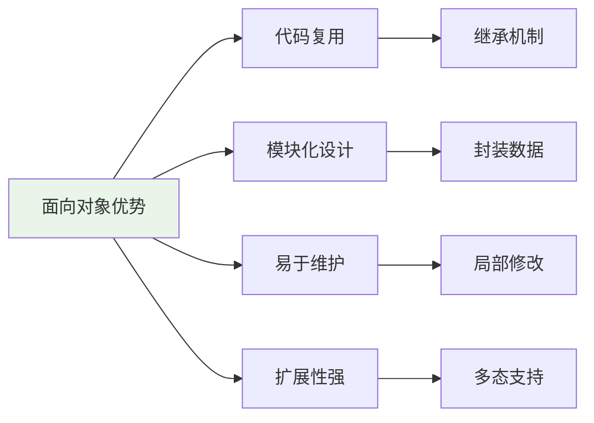

# 面向对象编程基础

## 🎯 学习目标

通过本章学习，您将能够：
- 深入理解面向对象编程的核心概念
- 掌握类、继承、多态、封装的实际应用
- 学会在Chat-Room项目中应用设计模式
- 理解面向对象设计的最佳实践

## 🏗️ 面向对象设计思想

### 为什么使用面向对象？



在Chat-Room项目中，面向对象帮助我们：
- **用户管理**：User类封装用户属性和行为
- **消息系统**：Message类层次结构处理不同类型消息
- **网络通信**：Client/Server类抽象网络操作
- **数据库操作**：Model类封装数据访问逻辑

## 🎭 类和对象基础

### Chat-Room中的用户类设计
```python
# shared/models/user.py - 用户模型类
from datetime import datetime
from typing import Optional, List
import hashlib

class User:
    """
    用户类 - 封装用户的属性和行为
    
    面向对象设计原则：
    1. 封装：将用户数据和操作封装在一起
    2. 抽象：隐藏内部实现细节
    3. 单一职责：只负责用户相关的功能
    """
    
    def __init__(self, user_id: int, username: str, password_hash: str):
        """
        用户初始化
        
        设计考虑：
        - 使用私有属性保护敏感数据
        - 提供公共接口访问数据
        - 初始化时进行数据验证
        """
        self._user_id = user_id
        self._username = username
        self._password_hash = password_hash
        self._is_online = False
        self._is_banned = False
        self._created_at = datetime.now()
        self._last_activity = None
        self._joined_groups: List[int] = []
    
    # 属性访问器（Property装饰器）
    @property
    def user_id(self) -> int:
        """用户ID（只读）"""
        return self._user_id
    
    @property
    def username(self) -> str:
        """用户名（只读）"""
        return self._username
    
    @property
    def is_online(self) -> bool:
        """在线状态"""
        return self._is_online
    
    @is_online.setter
    def is_online(self, value: bool):
        """设置在线状态"""
        self._is_online = value
        if value:
            self._last_activity = datetime.now()
    
    @property
    def is_banned(self) -> bool:
        """禁用状态"""
        return self._is_banned
    
    @is_banned.setter
    def is_banned(self, value: bool):
        """设置禁用状态"""
        if value and self._is_online:
            self._is_online = False  # 禁用时自动下线
        self._is_banned = value
    
    # 行为方法
    def verify_password(self, password: str) -> bool:
        """
        验证密码
        
        封装原则：隐藏密码验证的具体实现
        """
        password_hash = hashlib.sha256(password.encode()).hexdigest()
        return password_hash == self._password_hash
    
    def join_group(self, group_id: int) -> bool:
        """
        加入聊天组
        
        业务逻辑封装：
        - 检查是否已加入
        - 检查用户状态
        - 更新用户数据
        """
        if self._is_banned:
            return False
        
        if group_id not in self._joined_groups:
            self._joined_groups.append(group_id)
            return True
        
        return False
    
    def leave_group(self, group_id: int) -> bool:
        """离开聊天组"""
        if group_id in self._joined_groups:
            self._joined_groups.remove(group_id)
            return True
        return False
    
    def get_joined_groups(self) -> List[int]:
        """获取已加入的聊天组（返回副本，保护内部数据）"""
        return self._joined_groups.copy()
    
    def update_activity(self):
        """更新活动时间"""
        self._last_activity = datetime.now()
    
    def to_dict(self) -> dict:
        """
        转换为字典格式
        
        用于序列化和网络传输
        """
        return {
            'user_id': self._user_id,
            'username': self._username,
            'is_online': self._is_online,
            'is_banned': self._is_banned,
            'created_at': self._created_at.isoformat(),
            'last_activity': self._last_activity.isoformat() if self._last_activity else None,
            'joined_groups': self._joined_groups.copy()
        }
    
    def __str__(self) -> str:
        """字符串表示"""
        status = "在线" if self._is_online else "离线"
        return f"User({self._username}, {status})"
    
    def __repr__(self) -> str:
        """开发者表示"""
        return f"User(id={self._user_id}, username='{self._username}', online={self._is_online})"
```

## 🧬 继承和多态

### 消息类层次结构
```python
# shared/models/message.py - 消息类继承体系
from abc import ABC, abstractmethod
from datetime import datetime
from typing import Dict, Any, Optional

class BaseMessage(ABC):
    """
    消息基类（抽象基类）
    
    继承设计原则：
    1. 定义公共接口
    2. 提供默认实现
    3. 强制子类实现特定方法
    """
    
    def __init__(self, sender_id: int, content: str):
        """
        基类初始化
        
        公共属性：所有消息都有的属性
        """
        self.sender_id = sender_id
        self.content = content
        self.timestamp = datetime.now()
        self.message_id = self._generate_message_id()
    
    def _generate_message_id(self) -> str:
        """生成消息ID（私有方法）"""
        import uuid
        return str(uuid.uuid4())
    
    @abstractmethod
    def get_message_type(self) -> str:
        """获取消息类型（抽象方法，子类必须实现）"""
        pass
    
    @abstractmethod
    def validate_content(self) -> bool:
        """验证消息内容（抽象方法，子类必须实现）"""
        pass
    
    def to_dict(self) -> Dict[str, Any]:
        """
        转换为字典（模板方法模式）
        
        提供基础实现，子类可以扩展
        """
        return {
            'message_id': self.message_id,
            'message_type': self.get_message_type(),
            'sender_id': self.sender_id,
            'content': self.content,
            'timestamp': self.timestamp.isoformat()
        }
    
    def __str__(self) -> str:
        return f"{self.get_message_type()}: {self.content[:50]}..."

class TextMessage(BaseMessage):
    """
    文本消息类
    
    继承BaseMessage，实现文本消息的特定功能
    """
    
    def __init__(self, sender_id: int, content: str, group_id: Optional[int] = None):
        super().__init__(sender_id, content)
        self.group_id = group_id
    
    def get_message_type(self) -> str:
        """实现抽象方法"""
        return "text"
    
    def validate_content(self) -> bool:
        """实现抽象方法 - 文本消息验证"""
        if not self.content or not self.content.strip():
            return False
        
        if len(self.content) > 1000:  # 限制长度
            return False
        
        return True
    
    def to_dict(self) -> Dict[str, Any]:
        """扩展基类方法"""
        data = super().to_dict()
        data['group_id'] = self.group_id
        return data

class FileMessage(BaseMessage):
    """
    文件消息类
    
    继承BaseMessage，添加文件特定的属性和方法
    """
    
    def __init__(self, sender_id: int, filename: str, file_size: int, 
                 file_path: str, group_id: Optional[int] = None):
        # 文件消息的content是文件名
        super().__init__(sender_id, filename)
        self.filename = filename
        self.file_size = file_size
        self.file_path = file_path
        self.group_id = group_id
    
    def get_message_type(self) -> str:
        """实现抽象方法"""
        return "file"
    
    def validate_content(self) -> bool:
        """实现抽象方法 - 文件消息验证"""
        # 检查文件名
        if not self.filename or not self.filename.strip():
            return False
        
        # 检查文件大小
        if self.file_size <= 0 or self.file_size > 100 * 1024 * 1024:  # 100MB限制
            return False
        
        # 检查文件扩展名
        allowed_extensions = {'.txt', '.jpg', '.png', '.pdf', '.doc', '.docx'}
        import os
        _, ext = os.path.splitext(self.filename.lower())
        if ext not in allowed_extensions:
            return False
        
        return True
    
    def get_file_size_mb(self) -> float:
        """获取文件大小（MB）"""
        return self.file_size / (1024 * 1024)
    
    def to_dict(self) -> Dict[str, Any]:
        """扩展基类方法"""
        data = super().to_dict()
        data.update({
            'filename': self.filename,
            'file_size': self.file_size,
            'file_path': self.file_path,
            'group_id': self.group_id
        })
        return data

class SystemMessage(BaseMessage):
    """
    系统消息类
    
    用于系统通知、用户加入/离开等
    """
    
    def __init__(self, content: str, system_type: str = "info"):
        # 系统消息的sender_id为0
        super().__init__(0, content)
        self.system_type = system_type  # info, warning, error
    
    def get_message_type(self) -> str:
        """实现抽象方法"""
        return "system"
    
    def validate_content(self) -> bool:
        """实现抽象方法 - 系统消息验证"""
        return bool(self.content and self.content.strip())
    
    def to_dict(self) -> Dict[str, Any]:
        """扩展基类方法"""
        data = super().to_dict()
        data['system_type'] = self.system_type
        return data
```

### 多态的实际应用
```python
# server/core/message_processor.py - 消息处理器
class MessageProcessor:
    """
    消息处理器
    
    多态应用：统一处理不同类型的消息
    """
    
    def __init__(self):
        self.message_handlers = {
            'text': self._handle_text_message,
            'file': self._handle_file_message,
            'system': self._handle_system_message
        }
    
    def process_message(self, message: BaseMessage) -> bool:
        """
        处理消息（多态应用）
        
        不需要知道具体的消息类型，统一调用接口
        """
        # 验证消息（多态：每种消息有自己的验证逻辑）
        if not message.validate_content():
            print(f"消息验证失败: {message}")
            return False
        
        # 获取消息类型（多态：每种消息返回不同的类型）
        message_type = message.get_message_type()
        
        # 根据类型选择处理器
        handler = self.message_handlers.get(message_type)
        if handler:
            return handler(message)
        else:
            print(f"未知消息类型: {message_type}")
            return False
    
    def _handle_text_message(self, message: TextMessage) -> bool:
        """处理文本消息"""
        print(f"处理文本消息: {message.content}")
        # 具体的文本消息处理逻辑
        return True
    
    def _handle_file_message(self, message: FileMessage) -> bool:
        """处理文件消息"""
        print(f"处理文件消息: {message.filename} ({message.get_file_size_mb():.2f}MB)")
        # 具体的文件消息处理逻辑
        return True
    
    def _handle_system_message(self, message: SystemMessage) -> bool:
        """处理系统消息"""
        print(f"处理系统消息: {message.content}")
        # 具体的系统消息处理逻辑
        return True

# 多态使用示例
def demo_polymorphism():
    """多态演示"""
    processor = MessageProcessor()
    
    # 创建不同类型的消息
    messages = [
        TextMessage(101, "Hello everyone!", 1),
        FileMessage(102, "document.pdf", 1024*1024, "/files/doc.pdf", 1),
        SystemMessage("用户Alice加入了聊天室", "info")
    ]
    
    # 统一处理（多态）
    for message in messages:
        print(f"消息类型: {message.get_message_type()}")
        success = processor.process_message(message)
        print(f"处理结果: {'成功' if success else '失败'}")
        print("-" * 40)
```

## 🔒 封装和数据保护

### 访问控制和属性管理
```python
# server/core/connection_manager.py - 连接管理器
class ConnectionManager:
    """
    连接管理器
    
    封装原则：
    1. 隐藏内部实现细节
    2. 提供清晰的公共接口
    3. 保护关键数据不被误操作
    """
    
    def __init__(self, max_connections: int = 100):
        # 私有属性（Python约定：以_开头）
        self._connections = {}  # {user_id: socket}
        self._connection_info = {}  # {user_id: connection_info}
        self._max_connections = max_connections
        self.__secret_key = "server_secret_123"  # 强私有属性（以__开头）
    
    @property
    def connection_count(self) -> int:
        """当前连接数（只读属性）"""
        return len(self._connections)
    
    @property
    def max_connections(self) -> int:
        """最大连接数（只读属性）"""
        return self._max_connections
    
    @property
    def is_full(self) -> bool:
        """是否已满（计算属性）"""
        return self.connection_count >= self._max_connections
    
    def add_connection(self, user_id: int, socket_conn, ip_address: str) -> bool:
        """
        添加连接（公共接口）
        
        封装了连接添加的复杂逻辑
        """
        # 检查连接数限制
        if self.is_full:
            return False
        
        # 检查用户是否已连接
        if user_id in self._connections:
            return False
        
        # 添加连接
        self._connections[user_id] = socket_conn
        self._connection_info[user_id] = {
            'ip_address': ip_address,
            'connect_time': datetime.now(),
            'last_activity': datetime.now()
        }
        
        return True
    
    def remove_connection(self, user_id: int) -> bool:
        """移除连接（公共接口）"""
        if user_id in self._connections:
            # 清理连接数据
            del self._connections[user_id]
            del self._connection_info[user_id]
            return True
        return False
    
    def get_connection(self, user_id: int):
        """获取连接（受保护的访问）"""
        return self._connections.get(user_id)
    
    def update_activity(self, user_id: int):
        """更新活动时间"""
        if user_id in self._connection_info:
            self._connection_info[user_id]['last_activity'] = datetime.now()
    
    def get_connection_stats(self) -> dict:
        """
        获取连接统计信息
        
        返回安全的统计数据，不暴露内部结构
        """
        return {
            'total_connections': self.connection_count,
            'max_connections': self.max_connections,
            'usage_rate': self.connection_count / self.max_connections,
            'is_full': self.is_full
        }
    
    def _cleanup_inactive_connections(self, timeout_minutes: int = 30):
        """
        清理不活跃连接（私有方法）
        
        内部维护方法，不对外暴露
        """
        current_time = datetime.now()
        inactive_users = []
        
        for user_id, info in self._connection_info.items():
            last_activity = info['last_activity']
            if (current_time - last_activity).total_seconds() > timeout_minutes * 60:
                inactive_users.append(user_id)
        
        # 移除不活跃连接
        for user_id in inactive_users:
            self.remove_connection(user_id)
        
        return len(inactive_users)
    
    def __validate_secret(self, provided_key: str) -> bool:
        """
        验证密钥（强私有方法）
        
        Python名称修饰：实际方法名为_ConnectionManager__validate_secret
        """
        return provided_key == self.__secret_key
```

## 🎨 设计模式应用

### 单例模式 - 配置管理器
```python
# shared/config/singleton_config.py - 单例模式
class ConfigManager:
    """
    配置管理器（单例模式）
    
    确保整个应用只有一个配置管理器实例
    """
    
    _instance = None
    _initialized = False
    
    def __new__(cls):
        """控制实例创建"""
        if cls._instance is None:
            cls._instance = super().__new__(cls)
        return cls._instance
    
    def __init__(self):
        """初始化（只执行一次）"""
        if not ConfigManager._initialized:
            self._config = {}
            self._load_default_config()
            ConfigManager._initialized = True
    
    def _load_default_config(self):
        """加载默认配置"""
        self._config = {
            'server': {
                'host': 'localhost',
                'port': 8888,
                'max_connections': 100
            },
            'database': {
                'path': 'data/chatroom.db'
            }
        }
    
    def get(self, key: str, default=None):
        """获取配置值"""
        keys = key.split('.')
        current = self._config
        
        try:
            for k in keys:
                current = current[k]
            return current
        except (KeyError, TypeError):
            return default
    
    def set(self, key: str, value):
        """设置配置值"""
        keys = key.split('.')
        current = self._config
        
        for k in keys[:-1]:
            if k not in current:
                current[k] = {}
            current = current[k]
        
        current[keys[-1]] = value

# 使用示例
def demo_singleton():
    """单例模式演示"""
    # 创建两个实例
    config1 = ConfigManager()
    config2 = ConfigManager()
    
    # 验证是同一个实例
    print(f"是否为同一实例: {config1 is config2}")  # True
    
    # 修改配置
    config1.set('server.port', 9999)
    print(f"config2中的端口: {config2.get('server.port')}")  # 9999
```

### 观察者模式 - 事件系统
```python
# shared/events/event_system.py - 观察者模式
from typing import List, Callable, Dict, Any
from abc import ABC, abstractmethod

class EventObserver(ABC):
    """事件观察者接口"""
    
    @abstractmethod
    def on_event(self, event_type: str, event_data: Dict[str, Any]):
        """处理事件"""
        pass

class EventPublisher:
    """
    事件发布者
    
    观察者模式：管理观察者列表，发布事件通知
    """
    
    def __init__(self):
        self._observers: Dict[str, List[EventObserver]] = {}
    
    def subscribe(self, event_type: str, observer: EventObserver):
        """订阅事件"""
        if event_type not in self._observers:
            self._observers[event_type] = []
        
        if observer not in self._observers[event_type]:
            self._observers[event_type].append(observer)
    
    def unsubscribe(self, event_type: str, observer: EventObserver):
        """取消订阅"""
        if event_type in self._observers:
            if observer in self._observers[event_type]:
                self._observers[event_type].remove(observer)
    
    def publish(self, event_type: str, event_data: Dict[str, Any]):
        """发布事件"""
        if event_type in self._observers:
            for observer in self._observers[event_type]:
                try:
                    observer.on_event(event_type, event_data)
                except Exception as e:
                    print(f"观察者处理事件失败: {e}")

# 具体观察者实现
class LoggingObserver(EventObserver):
    """日志观察者"""
    
    def on_event(self, event_type: str, event_data: Dict[str, Any]):
        print(f"[LOG] 事件: {event_type}, 数据: {event_data}")

class NotificationObserver(EventObserver):
    """通知观察者"""
    
    def on_event(self, event_type: str, event_data: Dict[str, Any]):
        if event_type == "user_login":
            print(f"欢迎用户 {event_data.get('username')} 登录！")
        elif event_type == "message_sent":
            print(f"新消息通知: {event_data.get('content')[:20]}...")
```

## 🎯 实践练习

### 练习1：聊天室类设计
```python
class ChatRoom:
    """
    聊天室类设计练习
    
    要求：
    1. 使用面向对象设计原则
    2. 实现用户管理、消息处理
    3. 应用适当的设计模式
    4. 提供清晰的接口
    """
    
    def __init__(self, room_id: int, name: str, max_members: int = 50):
        # TODO: 实现聊天室初始化
        pass
    
    def add_member(self, user: User) -> bool:
        """添加成员"""
        # TODO: 实现成员添加逻辑
        pass
    
    def remove_member(self, user_id: int) -> bool:
        """移除成员"""
        # TODO: 实现成员移除逻辑
        pass
    
    def send_message(self, message: BaseMessage) -> bool:
        """发送消息"""
        # TODO: 实现消息发送逻辑
        pass
    
    def get_message_history(self, limit: int = 50) -> List[BaseMessage]:
        """获取消息历史"""
        # TODO: 实现消息历史获取
        pass
```

### 练习2：权限管理系统
```python
class Permission:
    """权限类"""
    pass

class Role:
    """角色类"""
    pass

class PermissionManager:
    """
    权限管理系统
    
    要求：
    1. 实现角色-权限模型
    2. 支持权限继承
    3. 提供权限检查接口
    4. 使用适当的设计模式
    """
    pass
```

## ✅ 学习检查

完成本章学习后，请确认您能够：

- [ ] 理解面向对象编程的核心概念
- [ ] 设计合理的类层次结构
- [ ] 正确使用继承和多态
- [ ] 应用封装原则保护数据
- [ ] 识别和应用常见设计模式
- [ ] 在实际项目中应用OOP思想
- [ ] 完成实践练习

## 📚 下一步

Python基础完成后，请继续学习：
- [第2章：Socket网络编程](../02-socket-programming/tcp-basics.md)

---

**恭喜！您已经完成了Python基础的学习！** 🎉
