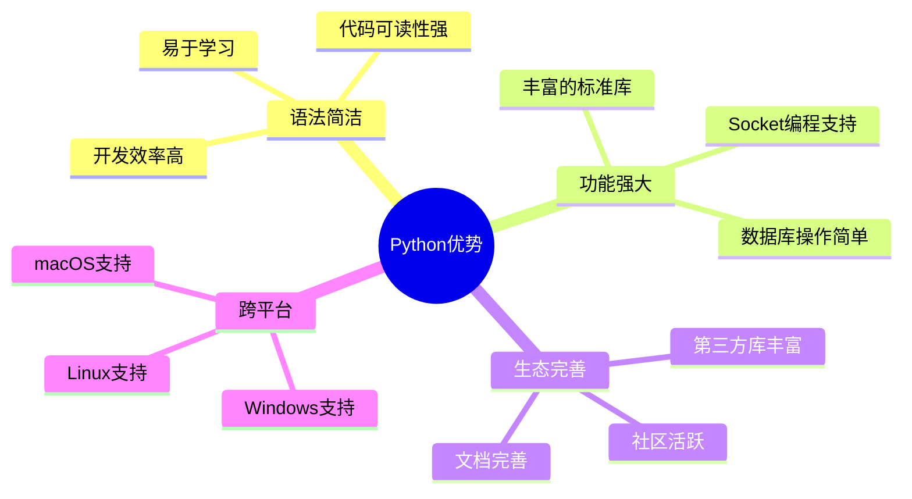

# Python语法基础

## 🎯 学习目标

通过本章学习，您将能够：
- 掌握Python基本语法和数据类型
- 理解变量、函数、类的概念和使用
- 学会使用Python进行基本的程序设计
- 为后续的网络编程学习打下坚实基础

## 📚 为什么选择Python？

### Python在Chat-Room项目中的优势


### Chat-Room项目中的Python应用
```python
# 网络编程 - Socket通信
import socket
server_socket = socket.socket(socket.AF_INET, socket.SOCK_STREAM)

# 数据库操作 - SQLite
import sqlite3
conn = sqlite3.connect('chatroom.db')

# JSON数据处理 - 消息协议
import json
message = {"type": "chat", "content": "Hello World"}

# 多线程处理 - 并发连接
import threading
thread = threading.Thread(target=handle_client)
```

## 🔤 Python基础语法

### 1. 变量和数据类型

#### 基本数据类型
```python
# 在Chat-Room项目中的实际应用

# 字符串 - 用户名、消息内容
username = "alice"
message_content = "Hello, everyone!"
server_host = "localhost"

# 整数 - 端口号、用户ID
server_port = 8888
user_id = 12345
group_id = 1

# 布尔值 - 状态标识
is_connected = True
is_logged_in = False
is_admin = False

# 浮点数 - 时间戳
import time
timestamp = time.time()  # 1703123456.789

print(f"用户 {username} 在 {timestamp} 发送消息: {message_content}")
```

#### 字符串操作（Chat-Room中的应用）
```python
# shared/utils/auth.py - 用户名验证
def validate_username(username: str) -> bool:
    """
    验证用户名格式
    
    规则：
    - 长度3-20字符
    - 只能包含字母、数字、下划线
    - 不能以数字开头
    """
    if not username:
        return False
    
    # 长度检查
    if len(username) < 3 or len(username) > 20:
        return False
    
    # 字符检查
    if not username.replace('_', '').isalnum():
        return False
    
    # 首字符检查
    if username[0].isdigit():
        return False
    
    return True

# 使用示例
usernames = ["alice", "bob123", "user_name", "123invalid", ""]
for name in usernames:
    result = validate_username(name)
    print(f"用户名 '{name}': {'有效' if result else '无效'}")
```

### 2. 控制结构

#### 条件语句在Chat-Room中的应用
```python
# server/core/user_manager.py - 用户登录验证
def authenticate_user(self, username: str, password: str) -> tuple:
    """
    用户身份验证
    
    Returns:
        (success: bool, user_id: int, message: str)
    """
    # 检查用户是否存在
    user = self.db_manager.get_user_by_username(username)
    if not user:
        return False, None, "用户不存在"
    
    # 检查用户是否被禁用
    if user.is_banned:
        return False, None, "用户已被禁用"
    
    # 验证密码
    password_hash = hashlib.sha256(password.encode()).hexdigest()
    if user.password_hash != password_hash:
        return False, None, "密码错误"
    
    # 检查用户是否已在线
    if user.is_online:
        return False, None, "用户已在其他地方登录"
    
    # 验证成功
    return True, user.id, "登录成功"

# 使用示例
success, user_id, message = user_manager.authenticate_user("alice", "password123")
if success:
    print(f"用户 {user_id} 登录成功")
else:
    print(f"登录失败: {message}")
```

#### 循环语句在Chat-Room中的应用
```python
# server/core/chat_manager.py - 消息广播
def broadcast_message(self, group_id: int, message: ChatMessage, sender_id: int):
    """
    向聊天组所有成员广播消息
    
    Args:
        group_id: 聊天组ID
        message: 要广播的消息
        sender_id: 发送者ID（不向发送者重复发送）
    """
    # 获取聊天组所有成员
    members = self.get_group_members(group_id)
    
    # 遍历所有成员，发送消息
    for member in members:
        # 跳过发送者自己
        if member.user_id == sender_id:
            continue
        
        # 只向在线用户发送
        if not member.is_online:
            continue
        
        try:
            # 发送消息到客户端
            self.send_message_to_user(member.user_id, message)
            print(f"消息已发送给用户 {member.username}")
        except Exception as e:
            print(f"向用户 {member.username} 发送消息失败: {e}")
    
    # 存储消息到数据库
    self.db_manager.save_message(message)
```

### 3. 函数定义和使用

#### 函数基础
```python
# shared/utils/validation.py - 输入验证函数
def sanitize_message_content(content: str) -> str:
    """
    清理消息内容，防止恶意输入
    
    Args:
        content: 原始消息内容
        
    Returns:
        清理后的消息内容
        
    功能：
    1. 移除首尾空白字符
    2. 限制消息长度
    3. 过滤特殊字符
    4. 防止HTML注入
    """
    if not content:
        return ""
    
    # 移除首尾空白
    content = content.strip()
    
    # 限制长度（最大1000字符）
    if len(content) > 1000:
        content = content[:1000]
    
    # 替换HTML特殊字符
    html_escape_table = {
        "&": "&amp;",
        "<": "&lt;",
        ">": "&gt;",
        '"': "&quot;",
        "'": "&#x27;"
    }
    
    for char, escape in html_escape_table.items():
        content = content.replace(char, escape)
    
    return content

# 使用示例
messages = [
    "Hello World!",
    "  带空格的消息  ",
    "<script>alert('xss')</script>",
    "很长的消息" * 100
]

for msg in messages:
    clean_msg = sanitize_message_content(msg)
    print(f"原始: {msg[:50]}...")
    print(f"清理: {clean_msg[:50]}...")
    print("-" * 50)
```

#### 函数参数和返回值
```python
# server/database/models.py - 数据库操作函数
def create_user(self, username: str, password_hash: str, 
                is_admin: bool = False) -> int:
    """
    创建新用户
    
    Args:
        username: 用户名（必需）
        password_hash: 密码哈希（必需）
        is_admin: 是否为管理员（可选，默认False）
        
    Returns:
        新创建用户的ID
        
    Raises:
        UserAlreadyExistsError: 用户名已存在
        DatabaseError: 数据库操作失败
    """
    try:
        with self.get_connection() as conn:
            cursor = conn.cursor()
            
            # 检查用户名是否已存在
            cursor.execute(
                "SELECT id FROM users WHERE username = ?", 
                (username,)
            )
            if cursor.fetchone():
                raise UserAlreadyExistsError(f"用户名 {username} 已存在")
            
            # 插入新用户
            cursor.execute("""
                INSERT INTO users (username, password_hash, is_admin)
                VALUES (?, ?, ?)
            """, (username, password_hash, is_admin))
            
            user_id = cursor.lastrowid
            conn.commit()
            
            print(f"用户 {username} 创建成功，ID: {user_id}")
            return user_id
            
    except sqlite3.Error as e:
        raise DatabaseError(f"创建用户失败: {e}")

# 使用示例
try:
    # 创建普通用户
    user_id = db_manager.create_user("alice", "hashed_password")
    
    # 创建管理员用户
    admin_id = db_manager.create_user("admin", "admin_hash", is_admin=True)
    
except UserAlreadyExistsError as e:
    print(f"用户创建失败: {e}")
except DatabaseError as e:
    print(f"数据库错误: {e}")
```

### 4. 异常处理

#### Chat-Room中的异常处理策略
```python
# client/core/client.py - 网络连接异常处理
def connect_to_server(self, host: str, port: int) -> bool:
    """
    连接到服务器，包含完整的异常处理
    
    Args:
        host: 服务器地址
        port: 服务器端口
        
    Returns:
        连接是否成功
    """
    try:
        # 创建Socket连接
        self.socket = socket.socket(socket.AF_INET, socket.SOCK_STREAM)
        self.socket.settimeout(10)  # 设置超时时间
        
        print(f"正在连接服务器 {host}:{port}...")
        self.socket.connect((host, port))
        
        self.connected = True
        print("服务器连接成功！")
        return True
        
    except socket.timeout:
        print("连接超时，请检查网络连接")
        return False
        
    except socket.gaierror as e:
        print(f"域名解析失败: {e}")
        return False
        
    except ConnectionRefusedError:
        print("连接被拒绝，请确认服务器是否启动")
        return False
        
    except OSError as e:
        if e.errno == 10048:  # Windows: 地址已在使用
            print("端口已被占用")
        elif e.errno == 10061:  # Windows: 连接被拒绝
            print("无法连接到服务器")
        else:
            print(f"网络错误: {e}")
        return False
        
    except Exception as e:
        print(f"未知错误: {e}")
        return False
    
    finally:
        # 如果连接失败，清理资源
        if not self.connected and self.socket:
            self.socket.close()
            self.socket = None
```

## 📦 模块和包

### Chat-Room项目的模块组织
```python
# shared/constants.py - 常量定义模块
"""
项目常量定义
集中管理所有常量，避免魔法数字
"""

# 网络配置
DEFAULT_HOST = "localhost"
DEFAULT_PORT = 8888
BUFFER_SIZE = 4096
MAX_CONNECTIONS = 100

# 消息类型
class MessageType:
    LOGIN_REQUEST = "login_request"
    LOGIN_RESPONSE = "login_response"
    CHAT_MESSAGE = "chat_message"
    SYSTEM_MESSAGE = "system_message"
    ERROR_MESSAGE = "error_message"

# 用户状态
class UserStatus:
    OFFLINE = 0
    ONLINE = 1
    AWAY = 2
    BUSY = 3

# 聊天组类型
class ChatType:
    PUBLIC = 0      # 公开聊天组
    PRIVATE = 1     # 私人聊天组
    GROUP = 2       # 群组聊天

# 文件配置
MAX_FILE_SIZE = 100 * 1024 * 1024  # 100MB
ALLOWED_EXTENSIONS = ['.txt', '.jpg', '.png', '.pdf', '.doc']
```

### 模块导入和使用
```python
# server/main.py - 主程序模块导入
"""
服务器主程序
演示如何正确导入和使用模块
"""

# 标准库导入
import sys
import os
import signal
import argparse
from pathlib import Path

# 第三方库导入
import yaml
from loguru import logger

# 项目模块导入
from server.core.server import ChatRoomServer
from server.database.connection import init_database
from shared.constants import DEFAULT_HOST, DEFAULT_PORT
from shared.logger import init_logger, get_logger
from shared.exceptions import DatabaseError, ConfigError

def main():
    """主函数 - 程序入口点"""
    try:
        # 解析命令行参数
        parser = argparse.ArgumentParser(description='Chat-Room 服务器')
        parser.add_argument('--host', default=DEFAULT_HOST, help='服务器地址')
        parser.add_argument('--port', type=int, default=DEFAULT_PORT, help='服务器端口')
        parser.add_argument('--config', default='config/server_config.yaml', help='配置文件路径')
        
        args = parser.parse_args()
        
        # 初始化日志系统
        init_logger({'level': 'INFO'}, 'server')
        logger = get_logger('server.main')
        
        # 初始化数据库
        init_database()
        logger.info("数据库初始化完成")
        
        # 创建并启动服务器
        server = ChatRoomServer(args.host, args.port)
        
        # 设置信号处理（优雅关闭）
        def signal_handler(signum, frame):
            logger.info("接收到关闭信号，正在关闭服务器...")
            server.stop()
            sys.exit(0)
        
        signal.signal(signal.SIGINT, signal_handler)
        signal.signal(signal.SIGTERM, signal_handler)
        
        # 启动服务器
        logger.info(f"启动服务器 {args.host}:{args.port}")
        server.start()
        
    except KeyboardInterrupt:
        logger.info("用户中断程序")
    except Exception as e:
        logger.error(f"程序运行错误: {e}", exc_info=True)
        sys.exit(1)

if __name__ == "__main__":
    main()
```

## 🎯 实践练习

### 练习1：用户名验证器
```python
def advanced_username_validator(username: str) -> tuple[bool, str]:
    """
    高级用户名验证器
    
    要求：
    1. 长度3-20字符
    2. 只能包含字母、数字、下划线、连字符
    3. 不能以数字开头
    4. 不能包含连续的特殊字符
    5. 不能是保留关键字
    
    Returns:
        (is_valid: bool, error_message: str)
    """
    # TODO: 实现验证逻辑
    pass

# 测试用例
test_cases = [
    "alice",           # 有效
    "bob123",          # 有效
    "user_name",       # 有效
    "123invalid",      # 无效：数字开头
    "ab",              # 无效：太短
    "user__name",      # 无效：连续下划线
    "admin",           # 无效：保留关键字
]

for username in test_cases:
    is_valid, message = advanced_username_validator(username)
    print(f"{username}: {'✓' if is_valid else '✗'} {message}")
```

### 练习2：消息格式化器
```python
def format_chat_message(username: str, content: str, timestamp: float) -> str:
    """
    格式化聊天消息显示
    
    要求：
    1. 时间格式：HH:MM:SS
    2. 用户名最大显示10字符，超出用...表示
    3. 消息内容自动换行（每行最大50字符）
    4. 特殊用户（admin）显示特殊标记
    
    Args:
        username: 用户名
        content: 消息内容
        timestamp: 时间戳
        
    Returns:
        格式化后的消息字符串
    """
    # TODO: 实现格式化逻辑
    pass

# 测试用例
import time
test_messages = [
    ("alice", "Hello everyone!", time.time()),
    ("very_long_username", "Short message", time.time()),
    ("admin", "System announcement", time.time()),
    ("bob", "This is a very long message that should be wrapped to multiple lines", time.time()),
]

for username, content, timestamp in test_messages:
    formatted = format_chat_message(username, content, timestamp)
    print(formatted)
    print("-" * 60)
```

## ✅ 学习检查

完成本章学习后，请确认您能够：

- [ ] 理解Python基本数据类型和变量
- [ ] 使用条件语句和循环语句
- [ ] 定义和调用函数
- [ ] 处理异常和错误
- [ ] 组织和导入模块
- [ ] 完成实践练习

## 📚 下一步

Python基础掌握后，请继续学习：
- [数据结构详解](data-structures.md)
- [函数与模块](functions-modules.md)
- [面向对象编程基础](oop-basics.md)

---

**恭喜！您已经掌握了Python的基础语法。** 🎉
