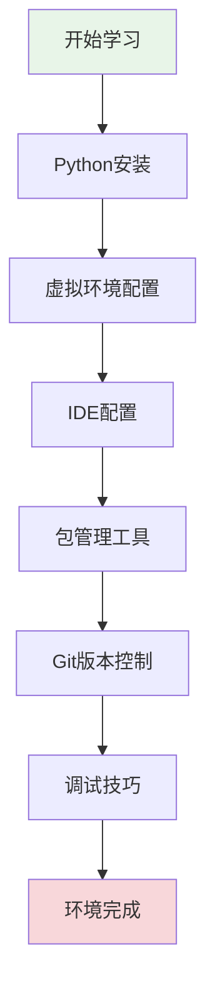

# 第1章：开发环境与工具链

## 🎯 学习目标

通过本章学习，您将能够：
- 掌握Python安装和版本管理
- 配置专业的开发环境（IDE/编辑器）
- 理解并使用虚拟环境管理
- 熟练使用包管理工具
- 掌握Git版本控制基础
- 学会使用调试工具和技巧

## 📚 章节内容

### 1. Python环境管理
- [Python安装与版本管理](python-installation.md)
- [虚拟环境的创建和使用](virtual-environments.md)

### 2. 开发工具配置
- [IDE选择与配置](ide-configuration.md)
- [调试工具与技巧](debugging-tools.md)

### 3. 包管理与版本控制
- [包管理工具详解](package-management.md)
- [Git版本控制基础](git-basics.md)

## 🎨 学习路径



## 🛠️ 环境要求

### 系统要求
- **操作系统**：Windows 10+、macOS 10.14+、Linux（Ubuntu 18.04+）
- **内存**：至少4GB RAM
- **存储空间**：至少2GB可用空间
- **网络**：稳定的互联网连接

### 软件版本
- **Python**：3.8或更高版本
- **Git**：2.20或更高版本
- **IDE**：VS Code、PyCharm或其他Python IDE

## 🚀 快速开始

### 检查当前环境
```bash
# 检查Python版本
python --version
python3 --version

# 检查pip版本
pip --version
pip3 --version

# 检查Git版本
git --version
```

### 环境验证脚本
```python
#!/usr/bin/env python3
"""
开发环境验证脚本
用于检查Chat-Room项目所需的开发环境是否正确配置
"""

import sys
import subprocess
import importlib.util

def check_python_version():
    """检查Python版本"""
    version = sys.version_info
    print(f"Python版本: {version.major}.{version.minor}.{version.micro}")
    
    if version.major == 3 and version.minor >= 8:
        print("✅ Python版本符合要求")
        return True
    else:
        print("❌ Python版本过低，需要3.8或更高版本")
        return False

def check_pip():
    """检查pip是否可用"""
    try:
        result = subprocess.run([sys.executable, "-m", "pip", "--version"], 
                              capture_output=True, text=True)
        if result.returncode == 0:
            print(f"✅ pip可用: {result.stdout.strip()}")
            return True
        else:
            print("❌ pip不可用")
            return False
    except Exception as e:
        print(f"❌ pip检查失败: {e}")
        return False

def check_git():
    """检查Git是否安装"""
    try:
        result = subprocess.run(["git", "--version"], 
                              capture_output=True, text=True)
        if result.returncode == 0:
            print(f"✅ Git可用: {result.stdout.strip()}")
            return True
        else:
            print("❌ Git不可用")
            return False
    except Exception as e:
        print(f"❌ Git检查失败: {e}")
        return False

def check_virtual_env():
    """检查虚拟环境工具"""
    tools = ['venv', 'virtualenv']
    available_tools = []
    
    # 检查内置venv模块
    if importlib.util.find_spec('venv'):
        available_tools.append('venv (内置)')
    
    # 检查virtualenv
    try:
        result = subprocess.run([sys.executable, "-m", "virtualenv", "--version"], 
                              capture_output=True, text=True)
        if result.returncode == 0:
            available_tools.append(f'virtualenv ({result.stdout.strip()})')
    except:
        pass
    
    if available_tools:
        print(f"✅ 虚拟环境工具: {', '.join(available_tools)}")
        return True
    else:
        print("❌ 没有找到虚拟环境工具")
        return False

def main():
    """主函数"""
    print("=" * 50)
    print("Chat-Room 开发环境检查")
    print("=" * 50)
    
    checks = [
        check_python_version(),
        check_pip(),
        check_git(),
        check_virtual_env()
    ]
    
    print("\n" + "=" * 50)
    if all(checks):
        print("🎉 开发环境检查通过！可以开始Chat-Room项目开发")
    else:
        print("⚠️  开发环境存在问题，请根据上述提示进行修复")
    print("=" * 50)

if __name__ == "__main__":
    main()
```

## 📋 学习检查清单

完成本章学习后，请确认您能够：

- [ ] 成功安装Python 3.8+
- [ ] 创建和激活虚拟环境
- [ ] 配置并使用IDE进行Python开发
- [ ] 使用pip安装和管理Python包
- [ ] 掌握Git基本操作（clone、add、commit、push）
- [ ] 使用调试器调试Python程序
- [ ] 运行环境验证脚本并通过所有检查

## 🔗 相关资源

### 官方文档
- [Python官方文档](https://docs.python.org/3/)
- [pip用户指南](https://pip.pypa.io/en/stable/user_guide/)
- [Git官方文档](https://git-scm.com/doc)

### 推荐工具
- **IDE**: [VS Code](https://code.visualstudio.com/), [PyCharm](https://www.jetbrains.com/pycharm/)
- **终端**: [Windows Terminal](https://github.com/microsoft/terminal), [iTerm2](https://iterm2.com/)
- **包管理**: [Poetry](https://python-poetry.org/), [Pipenv](https://pipenv.pypa.io/)

## 📚 下一步

环境配置完成后，请继续学习：
- [第2章：计算机基础知识](../02-computer-fundamentals/README.md)
- [第0章：Python编程基础](../00-python-basics/README.md)（如需复习Python基础）

---

**准备好开发环境，让我们开始Chat-Room项目的学习之旅！** 🚀
