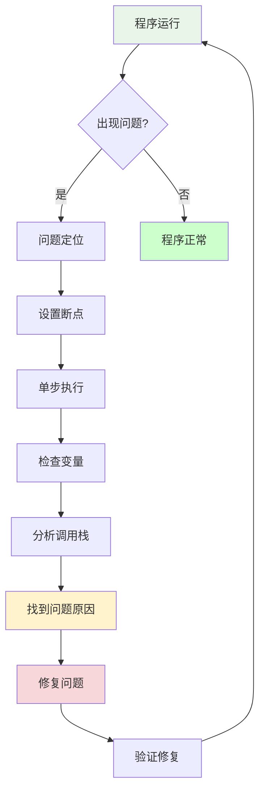

# 调试工具与技巧

## 🎯 学习目标

通过本节学习，您将能够：
- 掌握Python调试的基本概念和方法
- 学会使用VS Code调试器
- 了解Chat-Room项目的调试策略
- 掌握日志调试和性能分析技巧

## 🐛 调试基础概念

### 什么是调试？



**调试的重要性**：
- **问题定位**：快速找到bug的根本原因
- **代码理解**：通过调试深入理解程序执行流程
- **性能优化**：识别性能瓶颈
- **学习工具**：理解复杂代码的最佳方式

### 调试方法分类

```python
"""
调试方法分类

1. 打印调试 (Print Debugging)
   - 优点：简单直接，无需额外工具
   - 缺点：需要修改代码，输出信息有限
   - 适用：简单问题的快速定位

2. 交互式调试 (Interactive Debugging)
   - 优点：可以实时检查变量，控制执行流程
   - 缺点：需要学习调试器使用
   - 适用：复杂问题的深入分析

3. 日志调试 (Logging)
   - 优点：不影响程序正常运行，可以记录历史
   - 缺点：需要预先设置日志点
   - 适用：生产环境问题排查

4. 单元测试调试 (Unit Test Debugging)
   - 优点：可重复，自动化
   - 缺点：需要编写测试用例
   - 适用：功能验证和回归测试
"""

# Chat-Room项目调试策略
debugging_strategy = {
    "开发阶段": "交互式调试 + 打印调试",
    "测试阶段": "单元测试调试 + 日志调试", 
    "生产阶段": "日志调试 + 性能监控"
}
```

## 🔧 VS Code调试器使用

### 基本调试操作

```python
# 示例：Chat-Room服务器调试
"""
server/core/server.py - 服务器核心模块调试示例
"""

import socket
import threading
from shared.logger import get_logger

logger = get_logger("server.core.server")

class ChatRoomServer:
    def __init__(self, host="localhost", port=8888):
        self.host = host
        self.port = port
        self.running = False
        self.clients = {}  # 设置断点检查客户端连接
        
    def start(self):
        """启动服务器 - 调试重点方法"""
        try:
            # 断点1: 检查服务器启动参数
            logger.info(f"启动服务器 {self.host}:{self.port}")
            
            self.server_socket = socket.socket(socket.AF_INET, socket.SOCK_STREAM)
            self.server_socket.setsockopt(socket.SOL_SOCKET, socket.SO_REUSEADDR, 1)
            
            # 断点2: 检查socket绑定是否成功
            self.server_socket.bind((self.host, self.port))
            self.server_socket.listen(5)
            
            self.running = True
            logger.info("服务器启动成功，等待客户端连接...")
            
            while self.running:
                try:
                    # 断点3: 检查客户端连接
                    client_socket, address = self.server_socket.accept()
                    logger.info(f"新客户端连接: {address}")
                    
                    # 断点4: 检查线程创建
                    client_thread = threading.Thread(
                        target=self.handle_client,
                        args=(client_socket, address)
                    )
                    client_thread.daemon = True
                    client_thread.start()
                    
                except Exception as e:
                    # 断点5: 检查异常处理
                    logger.error(f"接受连接时出错: {e}")
                    
        except Exception as e:
            logger.error(f"服务器启动失败: {e}")
            raise
    
    def handle_client(self, client_socket, address):
        """处理客户端连接 - 调试重点方法"""
        try:
            # 断点6: 检查客户端处理逻辑
            while self.running:
                data = client_socket.recv(4096)
                if not data:
                    break
                
                # 断点7: 检查消息解析
                message = data.decode('utf-8')
                logger.debug(f"收到消息: {message}")
                
                # 处理消息逻辑...
                
        except Exception as e:
            logger.error(f"处理客户端 {address} 时出错: {e}")
        finally:
            # 断点8: 检查资源清理
            client_socket.close()
            logger.info(f"客户端 {address} 断开连接")
```

### 调试配置详解

```json
// .vscode/launch.json - 详细调试配置
{
  "version": "0.2.0",
  "configurations": [
    {
      "name": "调试服务器",
      "type": "python",
      "request": "launch",
      "program": "${workspaceFolder}/server/main.py",
      "console": "integratedTerminal",
      "cwd": "${workspaceFolder}",
      "env": {
        "PYTHONPATH": "${workspaceFolder}",
        "CHATROOM_DEBUG": "true"
      },
      "args": ["--debug"],
      "stopOnEntry": false,
      "justMyCode": false,  // 允许调试第三方库
      "subProcess": true    // 调试子进程
    },
    {
      "name": "调试客户端",
      "type": "python", 
      "request": "launch",
      "program": "${workspaceFolder}/client/main.py",
      "console": "integratedTerminal",
      "cwd": "${workspaceFolder}",
      "env": {
        "PYTHONPATH": "${workspaceFolder}"
      },
      "args": ["--host", "localhost", "--port", "8888"]
    },
    {
      "name": "调试特定模块",
      "type": "python",
      "request": "launch",
      "module": "server.core.user_manager",
      "console": "integratedTerminal",
      "cwd": "${workspaceFolder}",
      "env": {
        "PYTHONPATH": "${workspaceFolder}"
      }
    },
    {
      "name": "附加到运行中的进程",
      "type": "python",
      "request": "attach",
      "connect": {
        "host": "localhost",
        "port": 5678
      },
      "pathMappings": [
        {
          "localRoot": "${workspaceFolder}",
          "remoteRoot": "."
        }
      ]
    }
  ]
}
```

### 断点类型和使用

```python
"""
VS Code断点类型详解
"""

def example_debugging_techniques():
    """演示不同的调试技巧"""
    
    # 1. 普通断点 - 在行号左侧点击设置
    users = ["alice", "bob", "charlie"]
    
    # 2. 条件断点 - 右键断点设置条件
    for i, user in enumerate(users):
        # 条件: i == 1 (只在处理第二个用户时停止)
        process_user(user)
    
    # 3. 日志断点 - 不停止执行，只输出信息
    # 日志消息: "处理用户: {user}, 索引: {i}"
    
    # 4. 函数断点 - 在函数入口处停止
    def process_user(username):
        # 函数断点会在这里停止
        print(f"处理用户: {username}")
        
        # 5. 异常断点 - 在异常发生时停止
        try:
            result = risky_operation(username)
        except Exception as e:
            # 异常断点会在这里停止
            print(f"操作失败: {e}")
            raise

def risky_operation(username):
    """可能抛出异常的操作"""
    if username == "bob":
        raise ValueError("Bob用户处理失败")
    return f"处理{username}成功"
```

## 📊 日志调试技巧

### Chat-Room项目日志配置

```python
"""
shared/logger.py - Chat-Room项目日志配置
"""

from loguru import logger
import sys
import os

def setup_logger():
    """配置项目日志系统"""
    
    # 移除默认处理器
    logger.remove()
    
    # 控制台输出 - 开发环境
    logger.add(
        sys.stdout,
        format="<green>{time:YYYY-MM-DD HH:mm:ss}</green> | "
               "<level>{level: <8}</level> | "
               "<cyan>{name}</cyan>:<cyan>{function}</cyan>:<cyan>{line}</cyan> | "
               "<level>{message}</level>",
        level="DEBUG" if os.getenv("CHATROOM_DEBUG") else "INFO",
        colorize=True
    )
    
    # 文件输出 - 所有环境
    logger.add(
        "logs/chatroom.log",
        format="{time:YYYY-MM-DD HH:mm:ss} | {level: <8} | {name}:{function}:{line} | {message}",
        level="DEBUG",
        rotation="10 MB",
        retention="7 days",
        compression="zip"
    )
    
    # 错误日志单独记录
    logger.add(
        "logs/error.log",
        format="{time:YYYY-MM-DD HH:mm:ss} | {level: <8} | {name}:{function}:{line} | {message}",
        level="ERROR",
        rotation="5 MB",
        retention="30 days"
    )

def get_logger(name: str):
    """获取指定名称的日志记录器"""
    return logger.bind(name=name)

# 使用示例
if __name__ == "__main__":
    setup_logger()
    
    # 不同级别的日志
    test_logger = get_logger("test")
    test_logger.debug("调试信息")
    test_logger.info("普通信息") 
    test_logger.warning("警告信息")
    test_logger.error("错误信息")
    test_logger.critical("严重错误")
```

### 调试日志最佳实践

```python
"""
Chat-Room项目调试日志示例
"""

from shared.logger import get_logger

logger = get_logger("server.core.chat_manager")

class ChatManager:
    def __init__(self):
        self.groups = {}
        self.users = {}
        logger.info("ChatManager初始化完成")
    
    def create_group(self, group_name: str, creator_id: int):
        """创建聊天组 - 带调试日志"""
        
        # 入参日志
        logger.debug(f"创建聊天组请求: group_name={group_name}, creator_id={creator_id}")
        
        # 验证逻辑日志
        if group_name in self.groups:
            logger.warning(f"聊天组已存在: {group_name}")
            return False
        
        # 业务逻辑日志
        try:
            group_info = {
                "name": group_name,
                "creator_id": creator_id,
                "members": [creator_id],
                "created_at": datetime.now()
            }
            
            self.groups[group_name] = group_info
            logger.info(f"聊天组创建成功: {group_name}, 创建者: {creator_id}")
            
            # 状态日志
            logger.debug(f"当前聊天组数量: {len(self.groups)}")
            
            return True
            
        except Exception as e:
            # 异常日志
            logger.error(f"创建聊天组失败: {group_name}, 错误: {e}")
            logger.exception("详细异常信息:")  # 包含堆栈跟踪
            return False
    
    def send_message(self, group_name: str, user_id: int, message: str):
        """发送消息 - 性能调试日志"""
        
        # 性能监控
        import time
        start_time = time.time()
        
        logger.debug(f"发送消息: group={group_name}, user={user_id}, msg_len={len(message)}")
        
        try:
            # 业务逻辑...
            result = self._process_message(group_name, user_id, message)
            
            # 性能日志
            elapsed = time.time() - start_time
            logger.debug(f"消息处理完成，耗时: {elapsed:.3f}秒")
            
            if elapsed > 0.1:  # 超过100ms记录警告
                logger.warning(f"消息处理较慢: {elapsed:.3f}秒, group={group_name}")
            
            return result
            
        except Exception as e:
            logger.error(f"发送消息失败: {e}")
            raise
```

## 🔍 性能调试和分析

### 性能分析工具

```python
"""
性能调试工具示例
"""

import time
import functools
import cProfile
import pstats
from memory_profiler import profile

def timing_decorator(func):
    """函数执行时间装饰器"""
    @functools.wraps(func)
    def wrapper(*args, **kwargs):
        start_time = time.time()
        result = func(*args, **kwargs)
        end_time = time.time()
        
        logger.debug(f"{func.__name__} 执行时间: {end_time - start_time:.3f}秒")
        return result
    return wrapper

def memory_usage_decorator(func):
    """内存使用监控装饰器"""
    @functools.wraps(func)
    def wrapper(*args, **kwargs):
        import psutil
        import os
        
        process = psutil.Process(os.getpid())
        mem_before = process.memory_info().rss / 1024 / 1024  # MB
        
        result = func(*args, **kwargs)
        
        mem_after = process.memory_info().rss / 1024 / 1024  # MB
        mem_diff = mem_after - mem_before
        
        logger.debug(f"{func.__name__} 内存使用: {mem_diff:.2f}MB")
        return result
    return wrapper

# 使用示例
class PerformanceDebugExample:
    
    @timing_decorator
    @memory_usage_decorator
    def process_large_data(self, data_size=10000):
        """处理大量数据的性能测试"""
        data = list(range(data_size))
        
        # 模拟数据处理
        result = []
        for item in data:
            result.append(item * 2)
        
        return result
    
    def profile_function(self):
        """使用cProfile进行详细性能分析"""
        profiler = cProfile.Profile()
        profiler.enable()
        
        # 执行需要分析的代码
        self.process_large_data(50000)
        
        profiler.disable()
        
        # 保存分析结果
        stats = pstats.Stats(profiler)
        stats.sort_stats('cumulative')
        stats.print_stats(10)  # 显示前10个最耗时的函数
        
        # 保存到文件
        stats.dump_stats('performance_profile.prof')

# 内存分析示例
@profile  # 需要安装memory_profiler
def memory_intensive_function():
    """内存密集型函数分析"""
    # 创建大量对象
    data = []
    for i in range(100000):
        data.append({"id": i, "value": f"item_{i}"})
    
    # 处理数据
    processed = [item for item in data if item["id"] % 2 == 0]
    
    return processed
```

## 🛠️ 实践练习

### 练习1：调试Chat-Room连接问题

```python
#!/usr/bin/env python3
"""
Chat-Room连接问题调试练习
模拟常见的网络连接问题并学习调试方法
"""

import socket
import time
from shared.logger import get_logger

logger = get_logger("debug.practice")

def debug_connection_issue():
    """调试连接问题的示例"""
    
    # 问题1: 端口被占用
    def test_port_binding():
        """测试端口绑定问题"""
        try:
            # 设置断点，检查端口状态
            sock = socket.socket(socket.AF_INET, socket.SOCK_STREAM)
            sock.bind(("localhost", 8888))
            logger.info("端口8888绑定成功")
            sock.close()
        except OSError as e:
            # 断点：检查异常详情
            logger.error(f"端口绑定失败: {e}")
            # 调试技巧：检查端口占用
            import subprocess
            result = subprocess.run(["netstat", "-an"], capture_output=True, text=True)
            logger.debug(f"端口状态:\n{result.stdout}")
    
    # 问题2: 连接超时
    def test_connection_timeout():
        """测试连接超时问题"""
        try:
            # 设置断点，检查连接参数
            sock = socket.socket(socket.AF_INET, socket.SOCK_STREAM)
            sock.settimeout(5.0)  # 5秒超时
            
            start_time = time.time()
            sock.connect(("192.168.1.100", 8888))  # 不存在的服务器
            
        except socket.timeout:
            elapsed = time.time() - start_time
            logger.warning(f"连接超时，耗时: {elapsed:.2f}秒")
        except Exception as e:
            logger.error(f"连接失败: {e}")
        finally:
            sock.close()
    
    # 问题3: 数据传输问题
    def test_data_transmission():
        """测试数据传输问题"""
        # 模拟数据传输调试
        test_data = "Hello, Chat-Room!" * 1000  # 大数据包
        
        # 断点：检查数据大小
        logger.debug(f"发送数据大小: {len(test_data)} 字节")
        
        # 模拟分块传输
        chunk_size = 1024
        chunks = [test_data[i:i+chunk_size] for i in range(0, len(test_data), chunk_size)]
        
        # 断点：检查分块结果
        logger.debug(f"数据分为 {len(chunks)} 块")
        
        for i, chunk in enumerate(chunks):
            logger.debug(f"发送第 {i+1} 块，大小: {len(chunk)} 字节")
            # 模拟发送...
    
    # 执行调试测试
    test_port_binding()
    test_connection_timeout()
    test_data_transmission()

if __name__ == "__main__":
    debug_connection_issue()
```

### 练习2：性能问题调试

```python
#!/usr/bin/env python3
"""
Chat-Room性能问题调试练习
"""

import time
import threading
from concurrent.futures import ThreadPoolExecutor
from shared.logger import get_logger

logger = get_logger("debug.performance")

class PerformanceDebugPractice:
    def __init__(self):
        self.users = {}
        self.messages = []
    
    def slow_user_lookup(self, user_id: int):
        """模拟慢速用户查找 - 性能问题"""
        # 断点：检查查找逻辑
        for uid, user_info in self.users.items():
            if uid == user_id:
                # 模拟慢速操作
                time.sleep(0.01)  # 10ms延迟
                return user_info
        return None
    
    def optimized_user_lookup(self, user_id: int):
        """优化后的用户查找"""
        # 断点：对比性能差异
        return self.users.get(user_id)
    
    def benchmark_user_lookup(self):
        """用户查找性能基准测试"""
        # 准备测试数据
        for i in range(1000):
            self.users[i] = {"id": i, "name": f"user_{i}"}
        
        # 测试慢速查找
        start_time = time.time()
        for i in range(100):
            self.slow_user_lookup(i)
        slow_time = time.time() - start_time
        
        # 测试优化查找
        start_time = time.time()
        for i in range(100):
            self.optimized_user_lookup(i)
        fast_time = time.time() - start_time
        
        # 断点：检查性能对比
        logger.info(f"慢速查找耗时: {slow_time:.3f}秒")
        logger.info(f"优化查找耗时: {fast_time:.3f}秒")
        logger.info(f"性能提升: {slow_time/fast_time:.1f}倍")
    
    def test_concurrent_performance(self):
        """并发性能测试"""
        def worker_task(task_id):
            """工作线程任务"""
            start_time = time.time()
            
            # 模拟工作负载
            for i in range(100):
                self.optimized_user_lookup(i % 1000)
            
            elapsed = time.time() - start_time
            logger.debug(f"任务 {task_id} 完成，耗时: {elapsed:.3f}秒")
            return elapsed
        
        # 串行执行
        start_time = time.time()
        for i in range(10):
            worker_task(i)
        serial_time = time.time() - start_time
        
        # 并行执行
        start_time = time.time()
        with ThreadPoolExecutor(max_workers=4) as executor:
            futures = [executor.submit(worker_task, i) for i in range(10)]
            results = [future.result() for future in futures]
        parallel_time = time.time() - start_time
        
        # 断点：检查并发性能
        logger.info(f"串行执行耗时: {serial_time:.3f}秒")
        logger.info(f"并行执行耗时: {parallel_time:.3f}秒")
        logger.info(f"并发加速比: {serial_time/parallel_time:.1f}倍")

def main():
    """主函数"""
    practice = PerformanceDebugPractice()
    
    logger.info("开始性能调试练习...")
    practice.benchmark_user_lookup()
    practice.test_concurrent_performance()
    logger.info("性能调试练习完成")

if __name__ == "__main__":
    main()
```

## 📋 学习检查清单

完成本节学习后，请确认您能够：

- [ ] 理解调试的基本概念和重要性
- [ ] 熟练使用VS Code调试器
- [ ] 设置和使用不同类型的断点
- [ ] 配置调试启动参数
- [ ] 使用日志进行调试
- [ ] 进行性能分析和优化
- [ ] 调试多线程程序
- [ ] 排查网络连接问题

## 🔗 相关资源

- [VS Code Python调试](https://code.visualstudio.com/docs/python/debugging)
- [Python调试器pdb](https://docs.python.org/3/library/pdb.html)
- [Loguru文档](https://loguru.readthedocs.io/)
- [Python性能分析](https://docs.python.org/3/library/profile.html)

## 📚 下一步

调试技能掌握后，请继续学习：
- [第2章：计算机基础知识](../02-computer-fundamentals/README.md)

---

**现在您已经掌握了强大的调试技能！** 🐛
