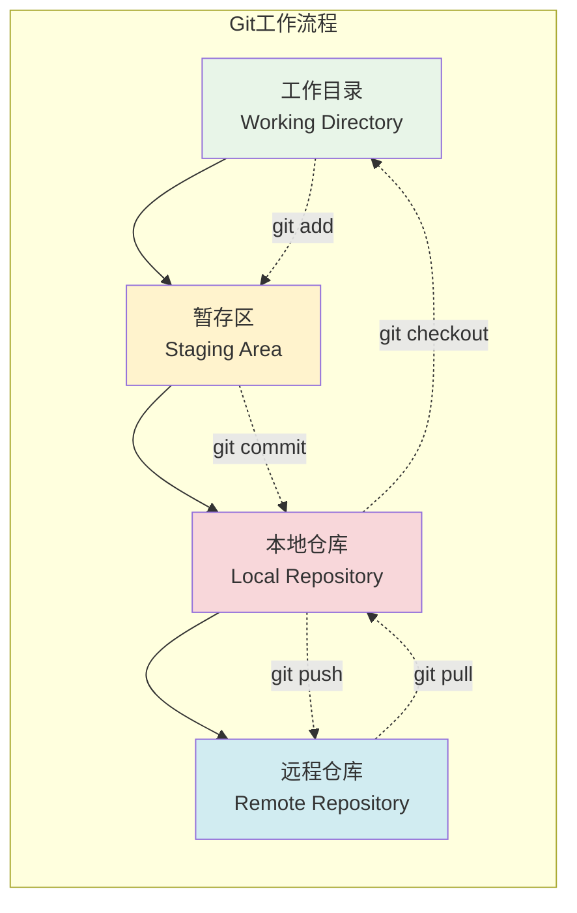
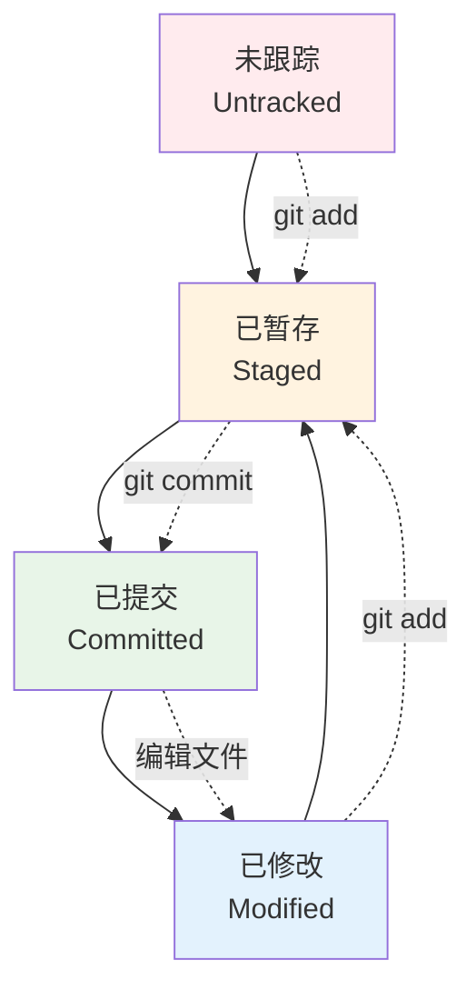
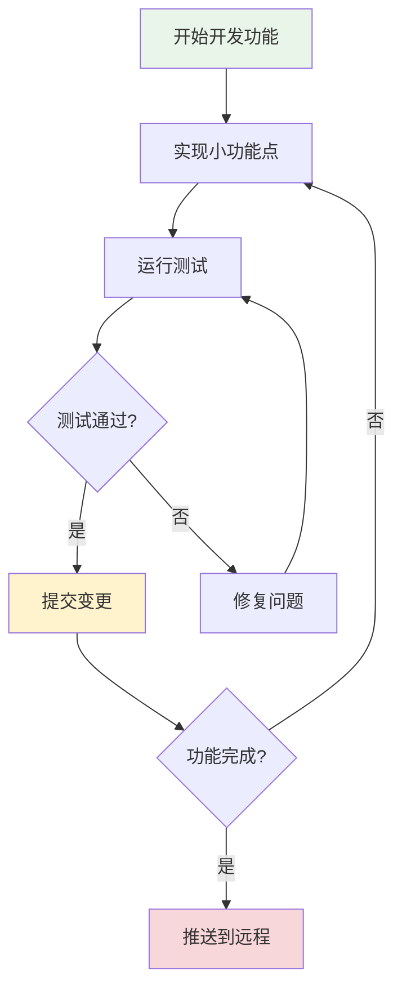

# Git版本控制基础

## 🎯 学习目标

通过本节学习，您将能够：
- 理解版本控制系统的概念和重要性
- 掌握Git的基本概念和工作原理
- 熟练使用Git的基础操作命令
- 学会分支管理和合并操作
- 掌握远程仓库的使用方法
- 建立规范的Git工作流程

## 📖 Git基础概念

### 什么是版本控制

版本控制是一种记录文件内容变化，以便将来查阅特定版本修订情况的系统。对于软件开发来说，版本控制系统可以：

- **追踪变更**：记录每次文件的修改
- **协作开发**：多人同时开发同一项目
- **版本回退**：回到之前的任何版本
- **分支开发**：并行开发不同功能
- **变更对比**：查看文件的具体变化

### Git工作原理



### Git三个区域

1. **工作目录（Working Directory）**
   - 项目的某个版本独立提取出来的内容
   - 你正在编辑的文件所在的目录

2. **暂存区（Staging Area）**
   - 保存了下次将提交的文件列表信息
   - 也叫做"索引"（index）

3. **Git仓库（Repository）**
   - 保存项目的元数据和对象数据库的地方
   - 这是Git中最重要的部分

## 🛠️ Git安装与配置

### 安装Git

```bash
# Windows (使用Chocolatey)
choco install git

# macOS (使用Homebrew)
brew install git

# Ubuntu/Debian
sudo apt-get install git

# CentOS/RHEL
sudo yum install git
```

### 初始配置

```bash
# 配置用户信息（必需）
git config --global user.name "Your Name"
git config --global user.email "your.email@example.com"

# 配置默认编辑器
git config --global core.editor "code --wait"  # VS Code
git config --global core.editor "vim"          # Vim

# 配置默认分支名
git config --global init.defaultBranch main

# 查看配置
git config --list
git config --global --list
```

### 配置SSH密钥（推荐）

```bash
# 生成SSH密钥
ssh-keygen -t rsa -b 4096 -C "your.email@example.com"

# 启动ssh-agent
eval "$(ssh-agent -s)"

# 添加SSH私钥到ssh-agent
ssh-add ~/.ssh/id_rsa

# 复制公钥到剪贴板
cat ~/.ssh/id_rsa.pub
# 然后将公钥添加到GitHub/GitLab等平台
```

## 📝 Git基础操作

### 仓库初始化

```bash
# 在现有目录中初始化仓库
cd /path/to/your/project
git init

# 克隆远程仓库
git clone https://github.com/username/repository.git
git clone git@github.com:username/repository.git  # SSH方式
```

### 文件状态管理



### 基本命令操作

```bash
# 查看仓库状态
git status

# 查看文件差异
git diff                    # 工作目录与暂存区的差异
git diff --staged          # 暂存区与最后一次提交的差异
git diff HEAD              # 工作目录与最后一次提交的差异

# 添加文件到暂存区
git add filename           # 添加特定文件
git add .                  # 添加当前目录所有文件
git add -A                 # 添加所有变更（包括删除）
git add *.py              # 添加所有Python文件

# 提交变更
git commit -m "提交信息"
git commit -am "提交信息"   # 自动暂存已跟踪文件并提交

# 查看提交历史
git log                    # 详细历史
git log --oneline         # 简洁历史
git log --graph           # 图形化历史
git log --author="作者名"  # 特定作者的提交
```

### 撤销操作

```bash
# 撤销工作目录的修改
git checkout -- filename
git restore filename       # Git 2.23+

# 撤销暂存区的文件
git reset HEAD filename
git restore --staged filename  # Git 2.23+

# 修改最后一次提交
git commit --amend -m "新的提交信息"

# 回退到特定提交
git reset --soft HEAD~1    # 软回退，保留暂存区
git reset --mixed HEAD~1   # 混合回退（默认），清空暂存区
git reset --hard HEAD~1    # 硬回退，丢弃所有修改
```

## 🌿 分支管理

### 分支概念

分支是Git最强大的功能之一，它允许你：
- 并行开发不同功能
- 实验新想法而不影响主分支
- 团队协作时避免冲突
- 维护不同版本的代码

### 分支操作

```bash
# 查看分支
git branch                 # 查看本地分支
git branch -r             # 查看远程分支
git branch -a             # 查看所有分支

# 创建分支
git branch feature-login   # 创建新分支
git checkout -b feature-login  # 创建并切换到新分支
git switch -c feature-login    # Git 2.23+

# 切换分支
git checkout main
git switch main           # Git 2.23+

# 合并分支
git checkout main         # 切换到目标分支
git merge feature-login   # 合并指定分支

# 删除分支
git branch -d feature-login    # 删除已合并的分支
git branch -D feature-login    # 强制删除分支
```

### 分支工作流程

```mermaid
gitgraph
    commit id: "初始提交"
    commit id: "添加基础功能"
    
    branch feature-login
    checkout feature-login
    commit id: "添加登录页面"
    commit id: "实现登录逻辑"
    
    checkout main
    commit id: "修复主页bug"
    
    checkout feature-login
    commit id: "完善登录功能"
    
    checkout main
    merge feature-login
    commit id: "发布v1.1"
```

## 🌐 远程仓库操作

### 远程仓库管理

```bash
# 查看远程仓库
git remote -v

# 添加远程仓库
git remote add origin https://github.com/username/repo.git

# 修改远程仓库URL
git remote set-url origin git@github.com:username/repo.git

# 删除远程仓库
git remote remove origin
```

### 推送和拉取

```bash
# 推送到远程仓库
git push origin main       # 推送main分支
git push -u origin main    # 首次推送并设置上游分支
git push --all            # 推送所有分支

# 从远程仓库拉取
git pull origin main       # 拉取并合并
git fetch origin          # 仅获取远程更新
git pull --rebase         # 使用rebase方式拉取

# 推送新分支
git push -u origin feature-branch
```

### 处理冲突

当多人修改同一文件时，可能会产生冲突：

```bash
# 拉取时出现冲突
git pull origin main

# Git会标记冲突文件，手动解决冲突后：
git add conflicted-file.py
git commit -m "解决合并冲突"
```

冲突文件的格式：
```
<<<<<<< HEAD
你的修改
=======
别人的修改
>>>>>>> branch-name
```

## 🔄 Chat-Room项目Git工作流

### 项目初始化

```bash
# 1. 克隆项目
git clone https://github.com/your-username/Chat-Room.git
cd Chat-Room

# 2. 创建开发分支
git checkout -b develop

# 3. 激活虚拟环境
conda activate chatroom

# 4. 安装依赖
pip install -r requirements.txt
```

### 功能开发流程

```bash
# 1. 从develop分支创建功能分支
git checkout develop
git pull origin develop
git checkout -b feature/user-authentication

# 2. 开发功能
# ... 编写代码 ...

# 3. 提交变更
git add .
git commit -m "新增: 实现用户认证功能

- 添加用户注册和登录接口
- 实现密码加密存储
- 添加JWT token验证
- 完善用户权限管理"

# 4. 推送功能分支
git push -u origin feature/user-authentication

# 5. 创建Pull Request（在GitHub上）
# 6. 代码审查通过后合并到develop分支
# 7. 删除功能分支
git checkout develop
git pull origin develop
git branch -d feature/user-authentication
```

### 提交信息规范

使用规范的提交信息格式：

```
类型: 简短描述

详细描述（可选）

相关问题: #123
```

**提交类型：**
- `新增`: 新功能
- `修复`: Bug修复
- `优化`: 性能优化
- `重构`: 代码重构
- `文档`: 文档更新
- `测试`: 测试相关
- `配置`: 配置文件修改

**示例：**
```bash
git commit -m "新增: 实现消息路由功能

- 添加消息路由器类
- 支持群组消息广播
- 实现私聊消息转发
- 添加离线消息存储

相关问题: #45"
```

## 📋 学习检查清单

完成本节学习后，请确认您能够：

- [ ] 理解Git的基本概念和工作原理
- [ ] 配置Git用户信息和SSH密钥
- [ ] 初始化Git仓库或克隆远程仓库
- [ ] 使用git add、commit、push等基本命令
- [ ] 查看文件状态和提交历史
- [ ] 创建、切换和合并分支
- [ ] 处理合并冲突
- [ ] 与远程仓库进行同步
- [ ] 编写规范的提交信息
- [ ] 建立适合项目的Git工作流程

## 🚀 下一步

掌握Git基础后，请继续学习：
- [IDE配置](ide-configuration.md) - 配置Git集成
- [调试工具](debugging-tools.md) - 学习调试技巧
- [第2章：计算机基础知识](../02-computer-fundamentals/README.md)

## 🔧 Git高级技巧

### 标签管理

标签用于标记重要的版本节点：

```bash
# 创建轻量标签
git tag v1.0.0

# 创建附注标签
git tag -a v1.0.0 -m "发布版本1.0.0"

# 查看标签
git tag
git tag -l "v1.*"

# 推送标签
git push origin v1.0.0
git push origin --tags

# 删除标签
git tag -d v1.0.0
git push origin --delete v1.0.0
```

### 储藏（Stash）

临时保存工作进度：

```bash
# 储藏当前工作
git stash
git stash save "临时保存登录功能开发"

# 查看储藏列表
git stash list

# 应用储藏
git stash apply
git stash apply stash@{0}

# 应用并删除储藏
git stash pop

# 删除储藏
git stash drop stash@{0}
git stash clear  # 清空所有储藏
```

### 子模块（Submodules）

管理项目依赖：

```bash
# 添加子模块
git submodule add https://github.com/user/library.git libs/library

# 克隆包含子模块的项目
git clone --recursive https://github.com/user/project.git

# 更新子模块
git submodule update --init --recursive
git submodule update --remote
```

## 🛠️ Git配置优化

### 常用别名配置

```bash
# 设置常用别名
git config --global alias.st status
git config --global alias.co checkout
git config --global alias.br branch
git config --global alias.ci commit
git config --global alias.unstage 'reset HEAD --'
git config --global alias.last 'log -1 HEAD'
git config --global alias.visual '!gitk'

# 美化日志显示
git config --global alias.lg "log --color --graph --pretty=format:'%Cred%h%Creset -%C(yellow)%d%Creset %s %Cgreen(%cr) %C(bold blue)<%an>%Creset' --abbrev-commit"
```

### .gitignore文件

创建`.gitignore`文件忽略不需要版本控制的文件：

```gitignore
# Python
__pycache__/
*.py[cod]
*$py.class
*.so
.Python
env/
venv/
ENV/
env.bak/
venv.bak/

# IDE
.vscode/
.idea/
*.swp
*.swo
*~

# 操作系统
.DS_Store
Thumbs.db

# 项目特定
config/local_config.py
logs/
*.log
temp/
.env

# 数据库
*.db
*.sqlite3

# 编译文件
*.pyc
*.pyo
*.pyd
```

### Git钩子（Hooks）

自动化工作流程：

```bash
# 进入钩子目录
cd .git/hooks

# 创建pre-commit钩子
cat > pre-commit << 'EOF'
#!/bin/sh
# 提交前运行代码检查
echo "运行代码质量检查..."

# 运行flake8检查
if command -v flake8 >/dev/null 2>&1; then
    flake8 . --count --select=E9,F63,F7,F82 --show-source --statistics
    if [ $? -ne 0 ]; then
        echo "代码质量检查失败，请修复后再提交"
        exit 1
    fi
fi

# 运行测试
if [ -f "pytest.ini" ] || [ -f "setup.cfg" ] || [ -f "pyproject.toml" ]; then
    echo "运行测试..."
    python -m pytest tests/ -x
    if [ $? -ne 0 ]; then
        echo "测试失败，请修复后再提交"
        exit 1
    fi
fi

echo "所有检查通过，允许提交"
EOF

# 设置执行权限
chmod +x pre-commit
```

## 🚨 常见问题解决

### 撤销操作

```bash
# 撤销最后一次提交但保留修改
git reset --soft HEAD~1

# 撤销最后一次提交并丢弃修改
git reset --hard HEAD~1

# 撤销特定文件的修改
git checkout HEAD -- filename

# 撤销已推送的提交（创建新提交）
git revert HEAD
git revert commit-hash
```

### 修改历史

```bash
# 交互式变基（修改最近3次提交）
git rebase -i HEAD~3

# 修改提交作者
git commit --amend --author="New Author <email@example.com>"

# 合并多个提交
git rebase -i HEAD~3  # 在编辑器中将pick改为squash
```

### 清理仓库

```bash
# 清理未跟踪的文件
git clean -f        # 删除未跟踪的文件
git clean -fd       # 删除未跟踪的文件和目录
git clean -n        # 预览将要删除的文件

# 垃圾回收
git gc              # 清理不必要的文件并优化仓库
git gc --aggressive # 更彻底的清理
```

## 📊 Git最佳实践

### 提交频率和粒度



### 分支命名规范

```
feature/功能名称     # 新功能开发
bugfix/问题描述      # Bug修复
hotfix/紧急修复      # 紧急修复
release/版本号       # 发布准备
experiment/实验名称   # 实验性功能
```

### 团队协作规范

1. **代码审查流程**
   ```bash
   # 1. 创建功能分支
   git checkout -b feature/new-feature

   # 2. 开发并提交
   git add .
   git commit -m "新增: 实现新功能"

   # 3. 推送并创建PR
   git push -u origin feature/new-feature

   # 4. 代码审查通过后合并
   # 5. 删除功能分支
   ```

2. **冲突解决策略**
   ```bash
   # 保持分支更新
   git checkout feature-branch
   git rebase main  # 或 git merge main

   # 解决冲突后
   git add .
   git rebase --continue
   ```

## 🎯 Chat-Room项目实践

### 项目Git工作流程图

```mermaid
gitgraph
    commit id: "项目初始化"
    commit id: "基础架构"

    branch develop
    checkout develop
    commit id: "开发环境配置"

    branch feature/server-core
    checkout feature/server-core
    commit id: "服务器核心"
    commit id: "连接管理"

    checkout develop
    merge feature/server-core

    branch feature/client-ui
    checkout feature/client-ui
    commit id: "客户端界面"
    commit id: "消息显示"

    checkout develop
    merge feature/client-ui

    checkout main
    merge develop
    commit id: "v1.0.0发布"
```

### 实际操作示例

```bash
# Chat-Room项目开发流程示例

# 1. 克隆项目
git clone https://github.com/your-username/Chat-Room.git
cd Chat-Room

# 2. 设置开发环境
conda activate chatroom
pip install -r requirements.txt

# 3. 创建功能分支开发消息路由功能
git checkout -b feature/message-routing

# 4. 开发过程中的提交
git add server/chat/message_router.py
git commit -m "新增: 实现消息路由器基础类

- 添加MessageRouter类
- 实现消息类型枚举
- 添加路由上下文数据结构"

git add tests/test_message_router.py
git commit -m "测试: 添加消息路由器单元测试

- 测试消息路由基本功能
- 测试错误处理机制
- 添加性能测试用例"

# 5. 功能完成后推送
git push -u origin feature/message-routing

# 6. 在GitHub上创建Pull Request
# 7. 代码审查通过后合并到develop分支

# 8. 清理本地分支
git checkout develop
git pull origin develop
git branch -d feature/message-routing
```

---

**Git是现代软件开发的必备技能，熟练掌握它将大大提高你的开发效率！** 🌟
