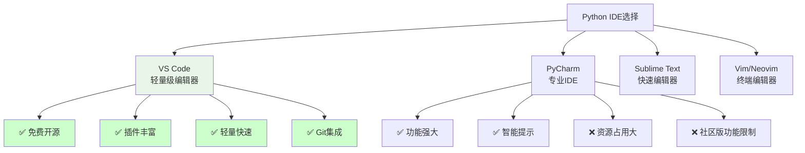

# IDE选择与配置

## 🎯 学习目标

通过本节学习，您将能够：
- 了解不同IDE的特点和适用场景
- 掌握VS Code的安装和配置
- 学会配置Python开发环境
- 掌握IDE的基本使用技巧

## 🛠️ IDE选择指南

### 主流Python IDE对比



### Chat-Room项目推荐：VS Code

**选择VS Code的原因**：
- **轻量级**：启动快速，资源占用少
- **扩展性强**：丰富的插件生态系统
- **Git集成**：内置Git支持，便于版本控制
- **跨平台**：Windows、macOS、Linux统一体验
- **免费开源**：完全免费，社区活跃
- **Python支持**：官方Python插件功能完善

## 📥 VS Code安装与配置

### 安装VS Code

```bash
# 方法1：官网下载
# 访问 https://code.visualstudio.com/
# 下载对应操作系统的安装包

# 方法2：包管理器安装
# Windows (使用Chocolatey)
choco install vscode

# macOS (使用Homebrew)
brew install --cask visual-studio-code

# Ubuntu/Debian
wget -qO- https://packages.microsoft.com/keys/microsoft.asc | gpg --dearmor > packages.microsoft.gpg
sudo install -o root -g root -m 644 packages.microsoft.gpg /etc/apt/trusted.gpg.d/
sudo sh -c 'echo "deb [arch=amd64,arm64,armhf signed-by=/etc/apt/trusted.gpg.d/packages.microsoft.gpg] https://packages.microsoft.com/repos/code stable main" > /etc/apt/sources.list.d/vscode.list'
sudo apt update
sudo apt install code

# 验证安装
code --version
```

### 必装插件配置

```json
{
  "recommendations": [
    // Python开发核心插件
    "ms-python.python",
    "ms-python.vscode-pylance",
    "ms-python.black-formatter",
    "ms-python.flake8",
    
    // Git和版本控制
    "eamodio.gitlens",
    "mhutchie.git-graph",
    
    // 文件和项目管理
    "ms-vscode.vscode-json",
    "redhat.vscode-yaml",
    "ms-vscode.vscode-markdown",
    
    // 代码质量
    "ms-vscode.vscode-eslint",
    "streetsidesoftware.code-spell-checker",
    
    // 主题和界面
    "PKief.material-icon-theme",
    "GitHub.github-vscode-theme",
    
    // 实用工具
    "ms-vscode.vscode-todo-highlight",
    "formulahendry.code-runner",
    "ms-vscode-remote.remote-ssh"
  ]
}
```

### Chat-Room项目专用配置

```json
// .vscode/settings.json - 项目级配置
{
  // Python解释器配置
  "python.defaultInterpreterPath": "~/miniconda3/envs/chatroom/bin/python",
  "python.terminal.activateEnvironment": true,
  
  // 代码格式化
  "python.formatting.provider": "black",
  "python.formatting.blackArgs": ["--line-length=100"],
  "editor.formatOnSave": true,
  
  // 代码检查
  "python.linting.enabled": true,
  "python.linting.flake8Enabled": true,
  "python.linting.flake8Args": ["--max-line-length=100"],
  
  // 类型检查
  "python.analysis.typeCheckingMode": "basic",
  "python.analysis.autoImportCompletions": true,
  
  // 文件关联
  "files.associations": {
    "*.yaml": "yaml",
    "*.yml": "yaml"
  },
  
  // 排除文件
  "files.exclude": {
    "**/__pycache__": true,
    "**/*.pyc": true,
    "**/logs": true,
    "**/server/data": true
  },
  
  // 终端配置
  "terminal.integrated.defaultProfile.linux": "bash",
  "terminal.integrated.defaultProfile.osx": "zsh",
  "terminal.integrated.defaultProfile.windows": "PowerShell",
  
  // 编辑器配置
  "editor.rulers": [100],
  "editor.tabSize": 4,
  "editor.insertSpaces": true,
  "editor.trimAutoWhitespace": true,
  
  // Git配置
  "git.enableSmartCommit": true,
  "git.confirmSync": false,
  "git.autofetch": true
}
```

### 调试配置

```json
// .vscode/launch.json - 调试配置
{
  "version": "0.2.0",
  "configurations": [
    {
      "name": "Chat-Room Server",
      "type": "python",
      "request": "launch",
      "program": "${workspaceFolder}/server/main.py",
      "console": "integratedTerminal",
      "cwd": "${workspaceFolder}",
      "env": {
        "PYTHONPATH": "${workspaceFolder}"
      },
      "args": []
    },
    {
      "name": "Chat-Room Client",
      "type": "python",
      "request": "launch",
      "program": "${workspaceFolder}/client/main.py",
      "console": "integratedTerminal",
      "cwd": "${workspaceFolder}",
      "env": {
        "PYTHONPATH": "${workspaceFolder}"
      },
      "args": []
    },
    {
      "name": "Chat-Room TUI Client",
      "type": "python",
      "request": "launch",
      "program": "${workspaceFolder}/client/main.py",
      "console": "integratedTerminal",
      "cwd": "${workspaceFolder}",
      "env": {
        "PYTHONPATH": "${workspaceFolder}"
      },
      "args": ["--tui"]
    },
    {
      "name": "Run Tests",
      "type": "python",
      "request": "launch",
      "module": "pytest",
      "console": "integratedTerminal",
      "cwd": "${workspaceFolder}",
      "env": {
        "PYTHONPATH": "${workspaceFolder}"
      },
      "args": ["test/", "-v"]
    }
  ]
}
```

### 任务配置

```json
// .vscode/tasks.json - 任务配置
{
  "version": "2.0.0",
  "tasks": [
    {
      "label": "启动服务器",
      "type": "shell",
      "command": "python",
      "args": ["-m", "server.main"],
      "group": "build",
      "presentation": {
        "echo": true,
        "reveal": "always",
        "focus": false,
        "panel": "new"
      },
      "options": {
        "cwd": "${workspaceFolder}"
      }
    },
    {
      "label": "启动客户端",
      "type": "shell",
      "command": "python",
      "args": ["-m", "client.main"],
      "group": "build",
      "presentation": {
        "echo": true,
        "reveal": "always",
        "focus": false,
        "panel": "new"
      },
      "options": {
        "cwd": "${workspaceFolder}"
      }
    },
    {
      "label": "运行测试",
      "type": "shell",
      "command": "python",
      "args": ["-m", "pytest", "test/", "-v"],
      "group": "test",
      "presentation": {
        "echo": true,
        "reveal": "always",
        "focus": false,
        "panel": "shared"
      },
      "options": {
        "cwd": "${workspaceFolder}"
      }
    },
    {
      "label": "代码格式化",
      "type": "shell",
      "command": "black",
      "args": [".", "--line-length=100"],
      "group": "build",
      "presentation": {
        "echo": true,
        "reveal": "silent",
        "focus": false,
        "panel": "shared"
      },
      "options": {
        "cwd": "${workspaceFolder}"
      }
    },
    {
      "label": "代码检查",
      "type": "shell",
      "command": "flake8",
      "args": [".", "--max-line-length=100"],
      "group": "build",
      "presentation": {
        "echo": true,
        "reveal": "always",
        "focus": false,
        "panel": "shared"
      },
      "options": {
        "cwd": "${workspaceFolder}"
      }
    }
  ]
}
```

## 🎨 界面和主题配置

### 推荐主题配置

```json
// 用户设置 - settings.json
{
  // 主题配置
  "workbench.colorTheme": "GitHub Dark",
  "workbench.iconTheme": "material-icon-theme",
  
  // 字体配置
  "editor.fontFamily": "'Fira Code', 'Cascadia Code', 'JetBrains Mono', Consolas, monospace",
  "editor.fontSize": 14,
  "editor.fontLigatures": true,
  
  // 界面配置
  "workbench.startupEditor": "welcomePage",
  "workbench.sideBar.location": "left",
  "workbench.panel.defaultLocation": "bottom",
  
  // 编辑器配置
  "editor.minimap.enabled": true,
  "editor.lineNumbers": "on",
  "editor.renderWhitespace": "boundary",
  "editor.bracketPairColorization.enabled": true,
  
  // 终端配置
  "terminal.integrated.fontSize": 13,
  "terminal.integrated.fontFamily": "'Fira Code', monospace"
}
```

## 🔧 开发工作流配置

### 代码片段配置

```json
// Python代码片段 - python.json
{
  "Chat-Room Class Template": {
    "prefix": "chatroom-class",
    "body": [
      "class ${1:ClassName}:",
      "    \"\"\"${2:类描述}\"\"\"",
      "    ",
      "    def __init__(self${3:, args}):",
      "        \"\"\"",
      "        初始化${1:ClassName}",
      "        ",
      "        Args:",
      "            ${4:参数描述}",
      "        \"\"\"",
      "        ${5:# 初始化代码}",
      "    ",
      "    def ${6:method_name}(self${7:, args}):",
      "        \"\"\"${8:方法描述}\"\"\"",
      "        ${9:pass}",
      "$0"
    ],
    "description": "Chat-Room项目类模板"
  },
  
  "Chat-Room Function Template": {
    "prefix": "chatroom-func",
    "body": [
      "def ${1:function_name}(${2:args}) -> ${3:return_type}:",
      "    \"\"\"",
      "    ${4:函数描述}",
      "    ",
      "    Args:",
      "        ${5:参数描述}",
      "    ",
      "    Returns:",
      "        ${6:返回值描述}",
      "    \"\"\"",
      "    ${7:pass}",
      "$0"
    ],
    "description": "Chat-Room项目函数模板"
  },
  
  "Logger Setup": {
    "prefix": "logger-setup",
    "body": [
      "from shared.logger import get_logger",
      "",
      "logger = get_logger(\"${1:module_name}\")",
      "$0"
    ],
    "description": "设置日志记录器"
  }
}
```

### 快捷键配置

```json
// 键盘快捷键 - keybindings.json
[
  {
    "key": "ctrl+shift+r",
    "command": "workbench.action.tasks.runTask",
    "args": "启动服务器"
  },
  {
    "key": "ctrl+shift+c",
    "command": "workbench.action.tasks.runTask",
    "args": "启动客户端"
  },
  {
    "key": "ctrl+shift+t",
    "command": "workbench.action.tasks.runTask",
    "args": "运行测试"
  },
  {
    "key": "ctrl+shift+f",
    "command": "workbench.action.tasks.runTask",
    "args": "代码格式化"
  },
  {
    "key": "ctrl+shift+l",
    "command": "workbench.action.tasks.runTask",
    "args": "代码检查"
  }
]
```

## 🛠️ 实践练习

### 练习1：VS Code环境配置

```python
#!/usr/bin/env python3
"""
VS Code配置验证脚本
检查VS Code是否正确配置用于Chat-Room开发
"""

import os
import json
import subprocess
import sys

def check_vscode_installation():
    """检查VS Code是否安装"""
    try:
        result = subprocess.run(["code", "--version"], 
                              capture_output=True, text=True)
        if result.returncode == 0:
            version_info = result.stdout.strip().split('\n')
            print(f"✅ VS Code已安装")
            print(f"   版本: {version_info[0]}")
            return True
        else:
            print("❌ VS Code未安装或不在PATH中")
            return False
    except FileNotFoundError:
        print("❌ VS Code未安装")
        return False

def check_python_extension():
    """检查Python扩展是否安装"""
    try:
        result = subprocess.run(["code", "--list-extensions"], 
                              capture_output=True, text=True)
        if result.returncode == 0:
            extensions = result.stdout.strip().split('\n')
            python_extensions = [ext for ext in extensions if 'python' in ext.lower()]
            
            if python_extensions:
                print("✅ Python扩展已安装:")
                for ext in python_extensions:
                    print(f"   - {ext}")
                return True
            else:
                print("❌ Python扩展未安装")
                return False
    except:
        print("❌ 无法检查扩展")
        return False

def check_workspace_config():
    """检查工作区配置"""
    config_files = [
        ".vscode/settings.json",
        ".vscode/launch.json",
        ".vscode/tasks.json"
    ]
    
    print("\n=== 工作区配置检查 ===")
    for config_file in config_files:
        if os.path.exists(config_file):
            print(f"✅ {config_file} 存在")
            try:
                with open(config_file, 'r', encoding='utf-8') as f:
                    json.load(f)
                print(f"   - JSON格式正确")
            except json.JSONDecodeError:
                print(f"   - ❌ JSON格式错误")
        else:
            print(f"❌ {config_file} 不存在")

def create_sample_config():
    """创建示例配置文件"""
    print("\n=== 创建示例配置 ===")
    
    # 创建.vscode目录
    os.makedirs(".vscode", exist_ok=True)
    
    # 基本设置
    settings = {
        "python.defaultInterpreterPath": "python",
        "python.formatting.provider": "black",
        "editor.formatOnSave": True,
        "python.linting.enabled": True,
        "python.linting.flake8Enabled": True
    }
    
    with open(".vscode/settings.json", "w", encoding="utf-8") as f:
        json.dump(settings, f, indent=2, ensure_ascii=False)
    
    print("✅ 创建了基本的settings.json配置")

def main():
    """主函数"""
    print("VS Code配置检查工具")
    print("=" * 50)
    
    checks = [
        check_vscode_installation(),
        check_python_extension()
    ]
    
    check_workspace_config()
    
    if not all(checks):
        print("\n⚠️  VS Code配置不完整")
        response = input("是否创建示例配置文件？(y/N): ")
        if response.lower() == 'y':
            create_sample_config()
    else:
        print("\n🎉 VS Code配置完成！")

if __name__ == "__main__":
    main()
```

### 练习2：开发工作流测试

```bash
#!/bin/bash
# VS Code开发工作流测试脚本

echo "=== VS Code开发工作流测试 ==="

# 1. 打开项目
echo "1. 打开Chat-Room项目..."
code .

# 2. 等待VS Code启动
sleep 3

# 3. 测试Python解释器
echo "2. 测试Python解释器..."
code --command "python.setInterpreter"

# 4. 测试代码格式化
echo "3. 测试代码格式化..."
echo "def test_function():
    x=1
    y=2
    return x+y" > test_format.py

code test_format.py
sleep 2
code --command "editor.action.formatDocument"

# 5. 清理测试文件
rm -f test_format.py

echo "✅ 工作流测试完成！"
```

## 📋 学习检查清单

完成本节学习后，请确认您能够：

- [ ] 理解不同IDE的特点和选择标准
- [ ] 成功安装VS Code和必要插件
- [ ] 配置Python开发环境
- [ ] 设置项目级配置文件
- [ ] 使用调试功能调试代码
- [ ] 配置代码格式化和检查
- [ ] 使用快捷键提高开发效率
- [ ] 自定义代码片段和主题

## 🔗 相关资源

- [VS Code官方文档](https://code.visualstudio.com/docs)
- [Python in VS Code](https://code.visualstudio.com/docs/languages/python)
- [VS Code插件市场](https://marketplace.visualstudio.com/)
- [Fira Code字体](https://github.com/tonsky/FiraCode)

## 📚 下一步

IDE配置完成后，请继续学习：
- [调试工具与技巧](debugging-tools.md)

---

**现在您已经拥有了专业的Python开发环境！** 💻
