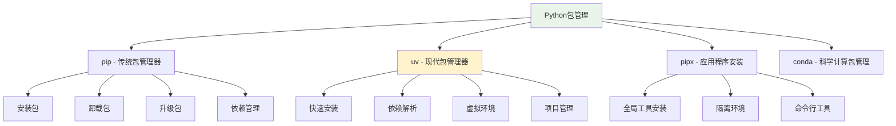

# Python包管理工具详解

## 🎯 学习目标

通过本章学习，您将能够：
- 掌握pip包管理器的使用方法
- 了解现代Python包管理工具（uv, pipx等）
- 学会管理项目依赖和虚拟环境
- 在Chat-Room项目中应用包管理最佳实践
- 解决常见的包管理问题

## 📦 包管理概述

Python包管理是现代Python开发的重要技能。在Chat-Room项目中，我们需要管理多个第三方库，如网络库、数据库库、UI库等。



## 🔧 pip - 传统包管理器

### pip基础使用

```bash
# Chat-Room项目依赖安装示例

# 1. 安装单个包
pip install requests          # HTTP请求库
pip install pyyaml           # YAML配置文件处理
pip install loguru           # 现代日志库
pip install textual          # TUI界面框架

# 2. 安装指定版本
pip install requests==2.31.0
pip install "pyyaml>=6.0,<7.0"

# 3. 从requirements.txt安装
pip install -r requirements.txt

# 4. 升级包
pip install --upgrade requests
pip install --upgrade-strategy eager requests  # 同时升级依赖

# 5. 卸载包
pip uninstall requests
pip uninstall -r requirements.txt

# 6. 查看已安装包
pip list
pip list --outdated          # 查看可升级的包
pip show requests            # 查看包详细信息

# 7. 生成requirements.txt
pip freeze > requirements.txt
pip freeze --local > requirements.txt  # 只包含当前环境的包
```

### Chat-Room项目的requirements.txt

```txt
# requirements.txt - Chat-Room项目依赖文件
# 核心依赖
requests>=2.31.0,<3.0.0      # HTTP请求库，用于AI API调用
pyyaml>=6.0.0,<7.0.0         # YAML配置文件处理
loguru>=0.7.0,<1.0.0         # 现代日志系统

# 数据库相关
sqlite3                       # SQLite数据库（内置）

# 用户界面
textual>=0.41.0,<1.0.0       # TUI界面框架
rich>=13.0.0,<14.0.0         # 终端美化库

# 开发工具
pytest>=7.4.0,<8.0.0        # 测试框架
pytest-cov>=4.1.0,<5.0.0    # 测试覆盖率
black>=23.7.0,<24.0.0        # 代码格式化
flake8>=6.0.0,<7.0.0         # 代码检查

# 可选依赖（用于特定功能）
cryptography>=41.0.0,<42.0.0 # 加密功能
pillow>=10.0.0,<11.0.0       # 图片处理（文件传输）
```

### pip配置和优化

```bash
# ~/.pip/pip.conf (Linux/macOS) 或 %APPDATA%\pip\pip.ini (Windows)
[global]
# 使用国内镜像源加速下载
index-url = https://pypi.tuna.tsinghua.edu.cn/simple
trusted-host = pypi.tuna.tsinghua.edu.cn

# 缓存配置
cache-dir = ~/.cache/pip

# 超时设置
timeout = 60

[install]
# 默认升级依赖
upgrade-strategy = eager
```

## ⚡ uv - 现代包管理器

### uv简介和安装

uv是一个用Rust编写的极快的Python包管理器，比pip快10-100倍。

```bash
# 安装uv
curl -LsSf https://astral.sh/uv/install.sh | sh

# 或者使用pip安装
pip install uv

# 验证安装
uv --version
```

### uv在Chat-Room项目中的应用

```bash
# 1. 创建项目和虚拟环境
cd Chat-Room
uv venv                      # 创建虚拟环境
source .venv/bin/activate    # 激活环境 (Linux/macOS)
# 或 .venv\Scripts\activate  # Windows

# 2. 安装依赖（比pip快很多）
uv pip install -r requirements.txt

# 3. 添加新依赖
uv add requests              # 添加并安装包
uv add "pyyaml>=6.0"        # 添加指定版本

# 4. 移除依赖
uv remove requests

# 5. 同步依赖（确保环境与配置一致）
uv pip sync requirements.txt

# 6. 生成锁文件
uv pip freeze > requirements.lock

# 7. 运行Python脚本
uv run python server/main.py
uv run pytest tests/
```

### pyproject.toml配置

```toml
# pyproject.toml - 现代Python项目配置文件
[project]
name = "chat-room"
version = "1.0.0"
description = "A simple chat room application for learning socket programming"
authors = [
    {name = "Your Name", email = "your.email@example.com"}
]
readme = "README.md"
license = {text = "MIT"}
requires-python = ">=3.8"

# 项目依赖
dependencies = [
    "requests>=2.31.0,<3.0.0",
    "pyyaml>=6.0.0,<7.0.0",
    "loguru>=0.7.0,<1.0.0",
    "textual>=0.41.0,<1.0.0",
    "rich>=13.0.0,<14.0.0",
]

# 可选依赖组
[project.optional-dependencies]
dev = [
    "pytest>=7.4.0,<8.0.0",
    "pytest-cov>=4.1.0,<5.0.0",
    "black>=23.7.0,<24.0.0",
    "flake8>=6.0.0,<7.0.0",
]
crypto = [
    "cryptography>=41.0.0,<42.0.0",
]
image = [
    "pillow>=10.0.0,<11.0.0",
]

# 项目脚本
[project.scripts]
chat-server = "server.main:main"
chat-client = "client.main:main"

# 构建系统
[build-system]
requires = ["hatchling"]
build-backend = "hatchling.build"

# 工具配置
[tool.black]
line-length = 88
target-version = ['py38']

[tool.pytest.ini_options]
testpaths = ["tests"]
python_files = ["test_*.py"]
python_classes = ["Test*"]
python_functions = ["test_*"]
```

## 🛠️ pipx - 应用程序安装

pipx用于安装和运行Python应用程序，每个应用都在独立的虚拟环境中运行。

```bash
# 安装pipx
pip install pipx
pipx ensurepath

# 安装开发工具
pipx install black           # 代码格式化工具
pipx install flake8          # 代码检查工具
pipx install pytest          # 测试框架
pipx install pre-commit      # Git钩子管理

# 运行工具
black server/ client/        # 格式化代码
flake8 server/ client/       # 检查代码
pytest tests/               # 运行测试

# 管理已安装的应用
pipx list                   # 查看已安装应用
pipx upgrade black          # 升级应用
pipx uninstall black        # 卸载应用
```

## 📋 依赖管理最佳实践

### 1. 项目依赖管理脚本

```python
# scripts/manage_deps.py - 依赖管理脚本
import subprocess
import sys
from pathlib import Path

class DependencyManager:
    """依赖管理工具"""
    
    def __init__(self, project_root: str = "."):
        self.project_root = Path(project_root)
        self.requirements_file = self.project_root / "requirements.txt"
        self.requirements_dev = self.project_root / "requirements-dev.txt"
    
    def install_dependencies(self, dev: bool = False):
        """安装项目依赖"""
        print("🔄 安装项目依赖...")
        
        # 安装生产依赖
        if self.requirements_file.exists():
            subprocess.run([
                sys.executable, "-m", "pip", "install", 
                "-r", str(self.requirements_file)
            ], check=True)
            print("✅ 生产依赖安装完成")
        
        # 安装开发依赖
        if dev and self.requirements_dev.exists():
            subprocess.run([
                sys.executable, "-m", "pip", "install", 
                "-r", str(self.requirements_dev)
            ], check=True)
            print("✅ 开发依赖安装完成")
    
    def update_dependencies(self):
        """更新依赖到最新版本"""
        print("🔄 更新项目依赖...")
        
        # 读取当前依赖
        if not self.requirements_file.exists():
            print("❌ requirements.txt 不存在")
            return
        
        with open(self.requirements_file, 'r') as f:
            packages = []
            for line in f:
                line = line.strip()
                if line and not line.startswith('#'):
                    # 提取包名（去掉版本限制）
                    package_name = line.split('>=')[0].split('==')[0].split('<')[0]
                    packages.append(package_name)
        
        # 升级包
        for package in packages:
            try:
                subprocess.run([
                    sys.executable, "-m", "pip", "install", 
                    "--upgrade", package
                ], check=True)
                print(f"✅ {package} 升级完成")
            except subprocess.CalledProcessError:
                print(f"❌ {package} 升级失败")
    
    def check_security(self):
        """检查依赖安全性"""
        print("🔍 检查依赖安全性...")
        
        try:
            # 使用pip-audit检查安全漏洞
            subprocess.run([
                sys.executable, "-m", "pip", "install", "pip-audit"
            ], check=True)
            
            subprocess.run([
                sys.executable, "-m", "pip_audit"
            ], check=True)
            
            print("✅ 安全检查完成")
            
        except subprocess.CalledProcessError:
            print("❌ 安全检查失败，请手动检查依赖")
    
    def generate_requirements(self):
        """生成requirements.txt文件"""
        print("📝 生成requirements.txt...")
        
        result = subprocess.run([
            sys.executable, "-m", "pip", "freeze"
        ], capture_output=True, text=True)
        
        if result.returncode == 0:
            with open(self.requirements_file, 'w') as f:
                f.write(result.stdout)
            print(f"✅ requirements.txt 已生成: {self.requirements_file}")
        else:
            print("❌ 生成requirements.txt失败")

# 使用示例
if __name__ == "__main__":
    manager = DependencyManager()
    
    import argparse
    parser = argparse.ArgumentParser(description="依赖管理工具")
    parser.add_argument("--install", action="store_true", help="安装依赖")
    parser.add_argument("--dev", action="store_true", help="包含开发依赖")
    parser.add_argument("--update", action="store_true", help="更新依赖")
    parser.add_argument("--security", action="store_true", help="安全检查")
    parser.add_argument("--generate", action="store_true", help="生成requirements.txt")
    
    args = parser.parse_args()
    
    if args.install:
        manager.install_dependencies(dev=args.dev)
    elif args.update:
        manager.update_dependencies()
    elif args.security:
        manager.check_security()
    elif args.generate:
        manager.generate_requirements()
    else:
        print("请指定操作参数，使用 --help 查看帮助")
```

### 2. 自动化脚本

```bash
#!/bin/bash
# scripts/setup_env.sh - 环境设置脚本

set -e  # 遇到错误立即退出

echo "🚀 设置Chat-Room开发环境..."

# 检查Python版本
python_version=$(python3 --version 2>&1 | cut -d' ' -f2)
echo "Python版本: $python_version"

# 创建虚拟环境
if [ ! -d ".venv" ]; then
    echo "📦 创建虚拟环境..."
    python3 -m venv .venv
fi

# 激活虚拟环境
echo "🔄 激活虚拟环境..."
source .venv/bin/activate

# 升级pip
echo "⬆️ 升级pip..."
pip install --upgrade pip

# 安装uv（如果可用）
if command -v uv &> /dev/null; then
    echo "⚡ 使用uv安装依赖..."
    uv pip install -r requirements.txt
    if [ -f "requirements-dev.txt" ]; then
        uv pip install -r requirements-dev.txt
    fi
else
    echo "📦 使用pip安装依赖..."
    pip install -r requirements.txt
    if [ -f "requirements-dev.txt" ]; then
        pip install -r requirements-dev.txt
    fi
fi

# 安装pre-commit钩子
if command -v pre-commit &> /dev/null; then
    echo "🪝 安装pre-commit钩子..."
    pre-commit install
fi

echo "✅ 环境设置完成！"
echo "💡 使用 'source .venv/bin/activate' 激活环境"
```

## 🎯 实践练习

### 练习1：依赖冲突解决
```python
def practice_dependency_conflicts():
    """
    依赖冲突解决练习
    
    要求：
    1. 识别依赖冲突
    2. 使用虚拟环境隔离
    3. 选择合适的版本约束
    4. 测试兼容性
    """
    # TODO: 模拟和解决依赖冲突
    pass
```

### 练习2：自动化依赖管理
```python
def practice_automated_dependency_management():
    """
    自动化依赖管理练习
    
    要求：
    1. 编写依赖更新脚本
    2. 实现安全漏洞检查
    3. 自动生成requirements文件
    4. 集成到CI/CD流程
    """
    # TODO: 实现自动化依赖管理
    pass
```

## ✅ 学习检查

完成本章学习后，请确认您能够：

- [ ] 熟练使用pip管理Python包
- [ ] 了解并使用现代包管理工具（uv）
- [ ] 使用pipx安装命令行工具
- [ ] 编写和维护requirements.txt文件
- [ ] 配置pyproject.toml项目文件
- [ ] 解决常见的依赖问题
- [ ] 实现自动化依赖管理
- [ ] 完成实践练习

## 📚 下一步

包管理工具掌握后，请继续学习：
- [计算机基础知识](../03-computer-fundamentals/README.md) - 学习网络和系统基础

---

**良好的包管理是项目成功的基础！** 📦
