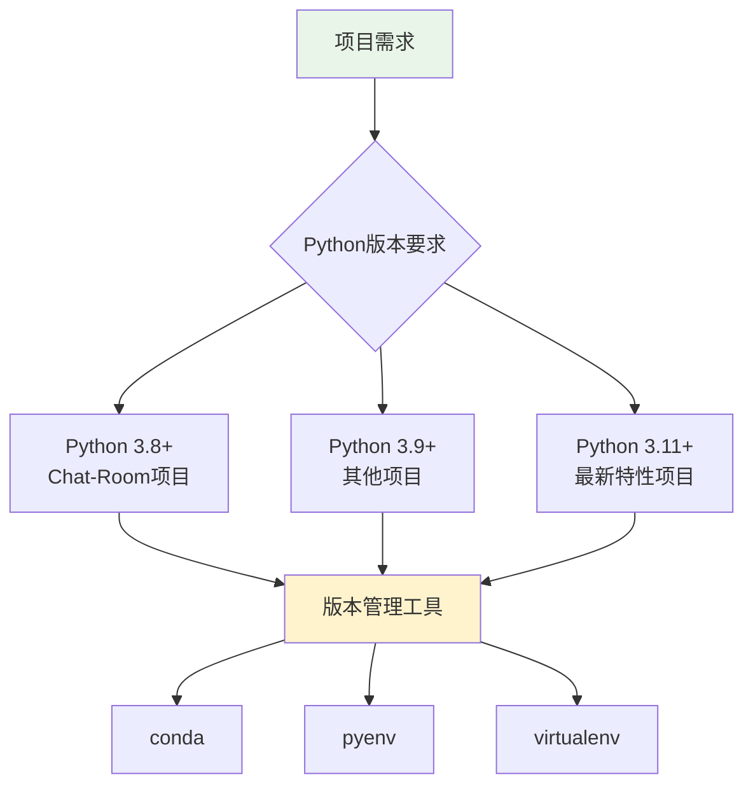

# Python安装与版本管理

## 🎯 学习目标

通过本节学习，您将能够：
- 理解Python版本管理的重要性
- 掌握Python的安装方法
- 学会使用conda进行Python版本管理
- 了解不同Python版本的特性差异

## 🐍 Python版本概述

### 为什么需要版本管理？



**版本管理的好处**：
- **项目隔离**：不同项目使用不同Python版本
- **依赖管理**：避免包版本冲突
- **环境一致性**：开发、测试、生产环境保持一致
- **向后兼容**：支持旧项目的维护

## 📦 Python安装方法

### 方法1：官方安装包（推荐新手）

```bash
# 1. 访问Python官网
# https://www.python.org/downloads/

# 2. 下载对应操作系统的安装包
# Windows: python-3.x.x-amd64.exe
# macOS: python-3.x.x-macos11.pkg
# Linux: 通常预装或使用包管理器

# 3. 运行安装程序，注意勾选：
# ✅ Add Python to PATH
# ✅ Install pip
```

### 方法2：Conda安装（推荐Chat-Room项目）

```bash
# 1. 安装Miniconda（轻量版）
# 下载地址：https://docs.conda.io/en/latest/miniconda.html

# 2. 验证安装
conda --version

# 3. 创建Chat-Room专用环境
conda create -n chatroom python=3.10
conda activate chatroom

# 4. 验证Python版本
python --version
# 输出：Python 3.10.x
```

### 方法3：系统包管理器

```bash
# Ubuntu/Debian
sudo apt update
sudo apt install python3 python3-pip python3-venv

# CentOS/RHEL
sudo yum install python3 python3-pip

# macOS (使用Homebrew)
brew install python@3.10

# Arch Linux
sudo pacman -S python python-pip
```

## 🔧 Conda环境管理详解

### 为什么选择Conda？

```python
"""
Conda vs pip vs venv 对比

Conda优势：
1. 跨语言包管理（Python、R、C++等）
2. 二进制包分发，安装速度快
3. 依赖解析能力强
4. 环境隔离更彻底
5. 适合科学计算和数据科学
"""

# Chat-Room项目使用Conda的原因
reasons = {
    "依赖管理": "项目依赖包较多，Conda能更好地解决依赖冲突",
    "环境隔离": "确保项目环境与系统环境完全隔离",
    "团队协作": "团队成员可以快速复现相同的开发环境",
    "跨平台": "Windows、macOS、Linux统一的环境管理方式"
}
```

### Conda基本操作

```bash
# 环境管理
conda create -n 环境名 python=版本号    # 创建环境
conda activate 环境名                   # 激活环境
conda deactivate                       # 退出当前环境
conda env list                         # 列出所有环境
conda remove -n 环境名 --all           # 删除环境

# Chat-Room项目环境设置
conda create -n chatroom python=3.10
conda activate chatroom

# 包管理
conda install 包名                     # 安装包
conda install 包名=版本号              # 安装指定版本
conda update 包名                      # 更新包
conda remove 包名                      # 卸载包
conda list                            # 列出已安装包

# 环境导出和导入
conda env export > environment.yml    # 导出环境
conda env create -f environment.yml   # 从文件创建环境
```

### Chat-Room项目环境配置

```yaml
# environment.yml - Chat-Room项目环境配置
name: chatroom
channels:
  - conda-forge
  - defaults
dependencies:
  - python=3.10
  - pip
  - pip:
    - textual==0.47.1
    - bcrypt==4.1.2
    - zhipuai>=2.0.1
    - requests==2.31.0
    - python-dateutil==2.8.2
    - loguru==0.7.2
    - pyyaml==6.0.1
    - jsonschema==4.17.3
    - pytest==7.4.3
    - black==23.11.0
    - flake8==6.1.0
```

## 🔍 Python版本特性对比

### Python 3.8+ 特性（Chat-Room最低要求）

```python
# 1. 海象运算符 (:=) - Python 3.8
def process_messages():
    """处理消息的示例"""
    messages = get_messages()
    
    # 传统写法
    if len(messages) > 0:
        print(f"处理 {len(messages)} 条消息")
    
    # 海象运算符写法（更简洁）
    if (msg_count := len(messages)) > 0:
        print(f"处理 {msg_count} 条消息")

# 2. 位置参数限定 - Python 3.8
def create_user(username, /, password, *, email=None):
    """
    创建用户函数
    username: 只能作为位置参数
    password: 可以是位置参数或关键字参数
    email: 只能作为关键字参数
    """
    return {"username": username, "password": password, "email": email}

# 正确调用
user1 = create_user("alice", "password123", email="alice@example.com")
user2 = create_user("bob", password="password456")

# 错误调用（会报错）
# user3 = create_user(username="charlie", "password789")  # username不能用关键字
# user4 = create_user("dave", "password", "dave@example.com")  # email必须用关键字
```

### Python 3.9+ 特性

```python
# 1. 字典合并运算符
server_config = {"host": "localhost", "port": 8888}
user_config = {"port": 9999, "debug": True}

# Python 3.9+
merged_config = server_config | user_config
print(merged_config)  # {'host': 'localhost', 'port': 9999, 'debug': True}

# 2. 类型提示改进
from typing import List, Dict

# Python 3.8
def process_users(users: List[Dict[str, str]]) -> None:
    pass

# Python 3.9+（更简洁）
def process_users(users: list[dict[str, str]]) -> None:
    pass
```

### Python 3.10+ 特性

```python
# 1. 结构化模式匹配（match-case）
def handle_message(message_type: str, data: dict):
    """处理不同类型的消息"""
    match message_type:
        case "login":
            return handle_login(data)
        case "chat":
            return handle_chat_message(data)
        case "file_upload":
            return handle_file_upload(data)
        case "ai_request":
            return handle_ai_request(data)
        case _:  # 默认情况
            return {"error": "未知消息类型"}

# 2. 更好的错误信息
def calculate_average(numbers):
    """计算平均值"""
    return sum(numbers) / len(numbers)

# Python 3.10+ 会提供更详细的错误位置信息
```

## 🛠️ 实践练习

### 练习1：环境设置验证

```python
#!/usr/bin/env python3
"""
Python环境验证脚本
验证Chat-Room项目所需的Python环境是否正确配置
"""

import sys
import platform
import subprocess

def check_python_version():
    """检查Python版本是否符合要求"""
    version = sys.version_info
    print(f"当前Python版本: {version.major}.{version.minor}.{version.micro}")
    print(f"Python实现: {platform.python_implementation()}")
    print(f"Python编译器: {platform.python_compiler()}")
    
    # Chat-Room项目要求Python 3.8+
    if version.major == 3 and version.minor >= 8:
        print("✅ Python版本符合Chat-Room项目要求")
        return True
    else:
        print("❌ Python版本过低，Chat-Room项目需要Python 3.8+")
        return False

def check_conda_environment():
    """检查是否在conda环境中"""
    conda_env = os.environ.get('CONDA_DEFAULT_ENV')
    if conda_env:
        print(f"✅ 当前conda环境: {conda_env}")
        if conda_env == 'chatroom':
            print("✅ 正在使用Chat-Room专用环境")
            return True
        else:
            print("⚠️  建议切换到chatroom环境: conda activate chatroom")
            return False
    else:
        print("⚠️  未检测到conda环境")
        return False

def main():
    """主函数"""
    print("=" * 60)
    print("Chat-Room Python环境检查")
    print("=" * 60)
    
    checks = [
        check_python_version(),
        check_conda_environment()
    ]
    
    print("\n" + "=" * 60)
    if all(checks):
        print("🎉 Python环境配置完美！")
    else:
        print("⚠️  环境配置需要调整")
    print("=" * 60)

if __name__ == "__main__":
    import os
    main()
```

### 练习2：版本特性测试

```python
"""
测试不同Python版本的特性
帮助理解版本差异
"""

def test_python_features():
    """测试Python特性"""
    print("测试Python版本特性...")
    
    # 测试海象运算符（Python 3.8+）
    try:
        if (x := 42) > 40:
            print("✅ 海象运算符支持 (Python 3.8+)")
    except SyntaxError:
        print("❌ 海象运算符不支持，需要Python 3.8+")
    
    # 测试字典合并（Python 3.9+）
    try:
        dict1 = {"a": 1}
        dict2 = {"b": 2}
        merged = dict1 | dict2
        print("✅ 字典合并运算符支持 (Python 3.9+)")
    except TypeError:
        print("❌ 字典合并运算符不支持，需要Python 3.9+")
    
    # 测试match-case（Python 3.10+）
    try:
        value = "test"
        match value:
            case "test":
                print("✅ match-case语句支持 (Python 3.10+)")
            case _:
                pass
    except SyntaxError:
        print("❌ match-case语句不支持，需要Python 3.10+")

if __name__ == "__main__":
    test_python_features()
```

## 📋 学习检查清单

完成本节学习后，请确认您能够：

- [ ] 理解Python版本管理的重要性
- [ ] 成功安装Python 3.8+版本
- [ ] 创建并激活conda环境
- [ ] 使用conda管理Python包
- [ ] 理解不同Python版本的特性差异
- [ ] 运行环境验证脚本并通过检查

## 🔗 相关资源

- [Python官方下载](https://www.python.org/downloads/)
- [Conda官方文档](https://docs.conda.io/)
- [Python版本发布历史](https://www.python.org/doc/versions/)
- [PEP 572 - 海象运算符](https://peps.python.org/pep-0572/)

## 📚 下一步

Python安装完成后，请继续学习：
- [虚拟环境的创建和使用](virtual-environments.md)

---

**现在您已经掌握了Python的安装和版本管理！** 🐍
