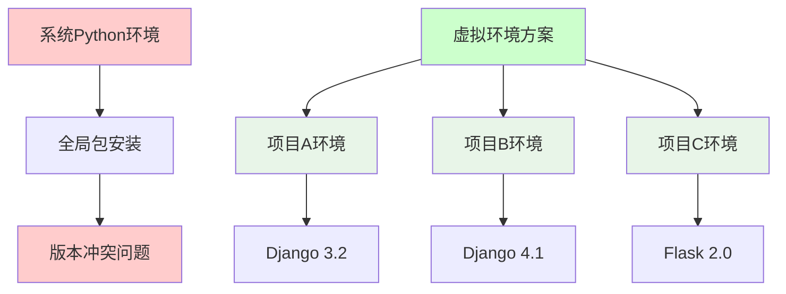

# 虚拟环境的创建和使用

## 🎯 学习目标

通过本节学习，您将能够：
- 理解虚拟环境的概念和重要性
- 掌握conda虚拟环境的创建和管理
- 学会在虚拟环境中安装和管理包
- 了解虚拟环境的最佳实践

## 🏠 虚拟环境概念

### 什么是虚拟环境？



**虚拟环境的作用**：
- **依赖隔离**：每个项目有独立的包环境
- **版本管理**：不同项目可以使用不同版本的包
- **环境复现**：可以轻松复制和分享开发环境
- **系统保护**：避免污染系统Python环境

### 虚拟环境工具对比

```python
"""
虚拟环境工具对比

1. venv (Python内置)
   - 优点：Python标准库，无需额外安装
   - 缺点：只管理Python包，不管理Python版本
   - 适用：简单Python项目

2. virtualenv (第三方)
   - 优点：功能比venv更强大，支持Python 2
   - 缺点：需要额外安装
   - 适用：需要兼容旧版本Python的项目

3. conda (推荐用于Chat-Room)
   - 优点：管理Python版本和包，支持非Python包，依赖解析强
   - 缺点：体积较大
   - 适用：科学计算、数据科学、复杂依赖项目
"""

# Chat-Room项目选择conda的原因
chat_room_requirements = {
    "Python版本": "需要Python 3.8+，conda可以管理Python版本",
    "复杂依赖": "textual、bcrypt等包有复杂的系统依赖",
    "跨平台": "Windows、macOS、Linux统一环境管理",
    "团队协作": "environment.yml文件便于环境共享"
}
```

## 🔧 Conda虚拟环境管理

### 创建Chat-Room项目环境

```bash
# 1. 创建专用环境（推荐方式）
conda create -n chatroom python=3.10

# 2. 激活环境
conda activate chatroom

# 3. 验证环境
python --version
which python  # Linux/macOS
where python  # Windows

# 4. 查看环境信息
conda info
conda env list
```

### 环境配置文件

```yaml
# environment.yml - Chat-Room项目环境配置文件
name: chatroom
channels:
  - conda-forge  # 社区维护的包仓库，包更新更及时
  - defaults     # conda官方仓库

dependencies:
  # Python版本
  - python=3.10
  
  # 系统工具
  - pip
  - git
  
  # 开发工具
  - ipython      # 增强的Python交互环境
  - jupyter      # 可选：用于学习和实验
  
  # 通过pip安装的包
  - pip:
    # TUI界面库
    - textual==0.47.1
    
    # 密码加密
    - bcrypt==4.1.2
    
    # AI集成
    - zhipuai>=2.0.1
    
    # HTTP请求
    - requests==2.31.0
    
    # 日期时间处理
    - python-dateutil==2.8.2
    
    # 日志系统
    - loguru==0.7.2
    
    # 配置文件处理
    - pyyaml==6.0.1
    - jsonschema==4.17.3
    
    # 开发和测试工具
    - pytest==7.4.3
    - pytest-asyncio==0.21.1
    - black==23.11.0
    - flake8==6.1.0
```

### 使用环境配置文件

```bash
# 从配置文件创建环境
conda env create -f environment.yml

# 激活环境
conda activate chatroom

# 更新环境（当environment.yml文件更新时）
conda env update -f environment.yml --prune

# 导出当前环境配置
conda env export > environment.yml

# 导出跨平台兼容的配置（推荐）
conda env export --no-builds > environment.yml
```

## 📦 包管理实践

### 在虚拟环境中安装包

```bash
# 确保在正确的环境中
conda activate chatroom

# 方法1：使用conda安装（优先）
conda install requests
conda install -c conda-forge textual

# 方法2：使用pip安装
pip install zhipuai
pip install loguru

# 方法3：从requirements.txt安装
pip install -r requirements.txt

# 查看已安装的包
conda list
pip list
```

### Chat-Room项目依赖安装

```bash
# 1. 激活环境
conda activate chatroom

# 2. 安装Chat-Room项目依赖
pip install -r requirements.txt

# 3. 验证关键包安装
python -c "import textual; print('Textual版本:', textual.__version__)"
python -c "import bcrypt; print('bcrypt可用')"
python -c "import zhipuai; print('智谱AI SDK可用')"
python -c "import loguru; print('loguru可用')"

# 4. 运行环境检查脚本
python -c "
import sys
print('Python版本:', sys.version)
print('Python路径:', sys.executable)

# 检查关键模块
modules = ['textual', 'bcrypt', 'zhipuai', 'loguru', 'yaml', 'requests']
for module in modules:
    try:
        __import__(module)
        print(f'✅ {module} 可用')
    except ImportError:
        print(f'❌ {module} 不可用')
"
```

## 🔄 环境管理最佳实践

### 日常工作流程

```bash
# 每次开始工作时
conda activate chatroom

# 检查环境状态
conda info --envs
python --version

# 开发完成后（可选）
conda deactivate
```

### 环境维护

```python
#!/usr/bin/env python3
"""
虚拟环境维护脚本
定期检查和清理虚拟环境
"""

import subprocess
import sys
import os

def check_environment():
    """检查当前环境状态"""
    print("=== 环境状态检查 ===")
    
    # 检查conda环境
    conda_env = os.environ.get('CONDA_DEFAULT_ENV')
    if conda_env:
        print(f"当前conda环境: {conda_env}")
        if conda_env == 'chatroom':
            print("✅ 正在使用Chat-Room专用环境")
        else:
            print("⚠️  建议切换到chatroom环境")
    else:
        print("❌ 未激活conda环境")
    
    # 检查Python路径
    python_path = sys.executable
    print(f"Python路径: {python_path}")
    
    # 检查关键包
    required_packages = [
        'textual', 'bcrypt', 'zhipuai', 'loguru', 
        'yaml', 'requests', 'pytest'
    ]
    
    print("\n=== 包状态检查 ===")
    missing_packages = []
    
    for package in required_packages:
        try:
            __import__(package)
            print(f"✅ {package}")
        except ImportError:
            print(f"❌ {package} - 缺失")
            missing_packages.append(package)
    
    if missing_packages:
        print(f"\n⚠️  缺失包: {', '.join(missing_packages)}")
        print("请运行: pip install -r requirements.txt")
    else:
        print("\n🎉 所有必需包都已安装！")

def clean_environment():
    """清理环境中的无用包"""
    print("\n=== 环境清理 ===")
    
    try:
        # 清理pip缓存
        result = subprocess.run([sys.executable, "-m", "pip", "cache", "purge"], 
                              capture_output=True, text=True)
        if result.returncode == 0:
            print("✅ pip缓存已清理")
        
        # 清理conda缓存
        result = subprocess.run(["conda", "clean", "--all", "-y"], 
                              capture_output=True, text=True)
        if result.returncode == 0:
            print("✅ conda缓存已清理")
            
    except Exception as e:
        print(f"清理过程中出现错误: {e}")

def update_environment():
    """更新环境中的包"""
    print("\n=== 环境更新 ===")
    
    try:
        # 更新conda包
        result = subprocess.run(["conda", "update", "--all", "-y"], 
                              capture_output=True, text=True)
        if result.returncode == 0:
            print("✅ conda包已更新")
        
        # 更新pip包
        result = subprocess.run([sys.executable, "-m", "pip", "list", "--outdated"], 
                              capture_output=True, text=True)
        if result.stdout:
            print("可更新的pip包:")
            print(result.stdout)
            
    except Exception as e:
        print(f"更新过程中出现错误: {e}")

def main():
    """主函数"""
    print("Chat-Room 虚拟环境维护工具")
    print("=" * 50)
    
    check_environment()
    
    # 询问是否执行维护操作
    response = input("\n是否执行环境清理和更新？(y/N): ")
    if response.lower() == 'y':
        clean_environment()
        update_environment()
    
    print("\n维护完成！")

if __name__ == "__main__":
    main()
```

### 环境备份和恢复

```bash
# 备份当前环境
conda env export > chatroom-backup-$(date +%Y%m%d).yml

# 从备份恢复环境
conda env create -f chatroom-backup-20240101.yml

# 克隆环境
conda create --name chatroom-backup --clone chatroom

# 删除环境（谨慎操作）
conda remove --name old-env --all
```

## 🛠️ 实践练习

### 练习1：创建和配置Chat-Room环境

```bash
# 1. 创建环境
conda create -n chatroom-practice python=3.10

# 2. 激活环境
conda activate chatroom-practice

# 3. 安装基础包
pip install textual loguru pyyaml

# 4. 测试安装
python -c "
import textual
import loguru
import yaml
print('环境配置成功！')
print(f'Textual版本: {textual.__version__}')
"

# 5. 导出环境配置
conda env export > practice-environment.yml

# 6. 清理练习环境
conda deactivate
conda remove -n chatroom-practice --all
```

### 练习2：环境问题排查

```python
#!/usr/bin/env python3
"""
虚拟环境问题排查脚本
帮助诊断常见的环境问题
"""

import sys
import os
import subprocess
import importlib.util

def diagnose_environment():
    """诊断环境问题"""
    print("=== 虚拟环境诊断 ===")
    
    # 1. 检查Python版本
    version = sys.version_info
    print(f"Python版本: {version.major}.{version.minor}.{version.micro}")
    
    if version.major != 3 or version.minor < 8:
        print("❌ Python版本过低，需要3.8+")
        return False
    
    # 2. 检查Python路径
    python_path = sys.executable
    print(f"Python路径: {python_path}")
    
    # 检查是否在虚拟环境中
    if 'conda' in python_path or 'venv' in python_path or 'virtualenv' in python_path:
        print("✅ 正在使用虚拟环境")
    else:
        print("⚠️  可能在使用系统Python")
    
    # 3. 检查环境变量
    conda_env = os.environ.get('CONDA_DEFAULT_ENV')
    if conda_env:
        print(f"Conda环境: {conda_env}")
    
    virtual_env = os.environ.get('VIRTUAL_ENV')
    if virtual_env:
        print(f"Virtual环境: {virtual_env}")
    
    # 4. 检查包管理器
    try:
        pip_version = subprocess.run([sys.executable, "-m", "pip", "--version"], 
                                   capture_output=True, text=True)
        if pip_version.returncode == 0:
            print(f"✅ pip: {pip_version.stdout.strip()}")
        else:
            print("❌ pip不可用")
    except:
        print("❌ pip检查失败")
    
    # 5. 检查关键模块
    modules_to_check = ['textual', 'bcrypt', 'loguru', 'yaml']
    print("\n=== 模块检查 ===")
    
    for module_name in modules_to_check:
        if importlib.util.find_spec(module_name):
            try:
                module = __import__(module_name)
                version = getattr(module, '__version__', '未知版本')
                print(f"✅ {module_name}: {version}")
            except:
                print(f"⚠️  {module_name}: 导入失败")
        else:
            print(f"❌ {module_name}: 未安装")
    
    return True

def provide_solutions():
    """提供解决方案"""
    print("\n=== 常见问题解决方案 ===")
    
    solutions = {
        "Python版本过低": [
            "1. 安装Python 3.8+",
            "2. 使用conda创建新环境: conda create -n chatroom python=3.10"
        ],
        "包缺失": [
            "1. 激活正确的环境: conda activate chatroom",
            "2. 安装依赖: pip install -r requirements.txt"
        ],
        "环境混乱": [
            "1. 删除旧环境: conda remove -n old-env --all",
            "2. 重新创建环境: conda env create -f environment.yml"
        ],
        "权限问题": [
            "1. 检查文件权限",
            "2. 避免使用sudo安装包",
            "3. 使用虚拟环境而非系统Python"
        ]
    }
    
    for problem, steps in solutions.items():
        print(f"\n{problem}:")
        for step in steps:
            print(f"  {step}")

if __name__ == "__main__":
    diagnose_environment()
    provide_solutions()
```

## 📋 学习检查清单

完成本节学习后，请确认您能够：

- [ ] 理解虚拟环境的概念和重要性
- [ ] 创建和激活conda虚拟环境
- [ ] 使用environment.yml配置文件
- [ ] 在虚拟环境中安装和管理包
- [ ] 导出和导入环境配置
- [ ] 排查常见的环境问题
- [ ] 维护和清理虚拟环境

## 🔗 相关资源

- [Conda用户指南](https://docs.conda.io/projects/conda/en/latest/user-guide/)
- [Python venv文档](https://docs.python.org/3/library/venv.html)
- [虚拟环境最佳实践](https://docs.python-guide.org/dev/virtualenvs/)

## 📚 下一步

虚拟环境配置完成后，请继续学习：
- [IDE选择与配置](ide-configuration.md)

---

**现在您已经掌握了虚拟环境的创建和管理！** 🏠
