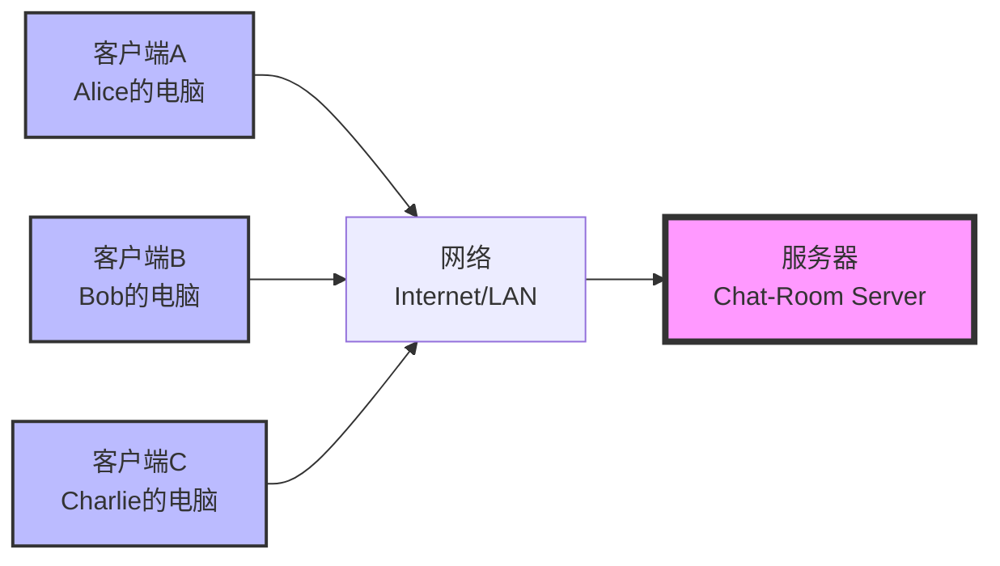
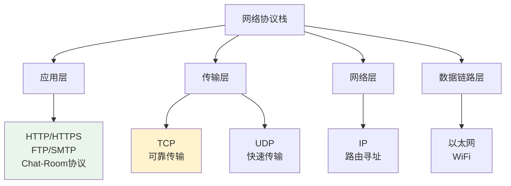
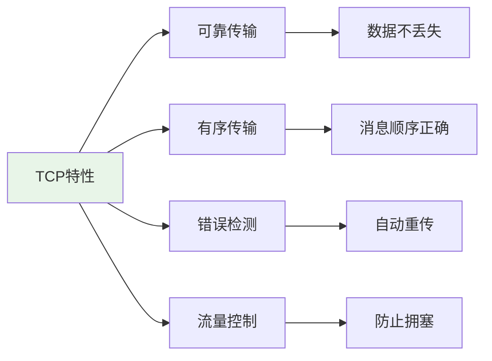
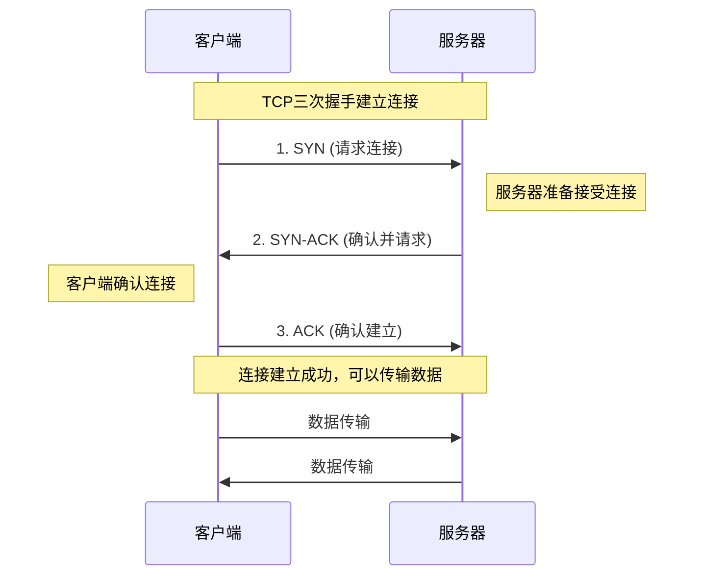
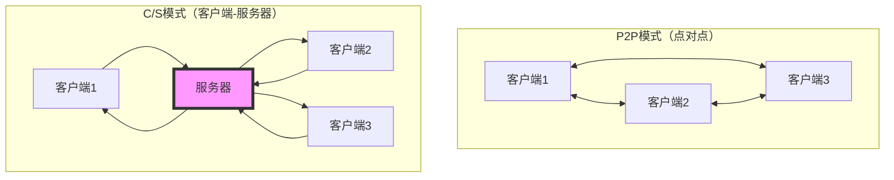
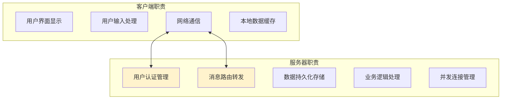
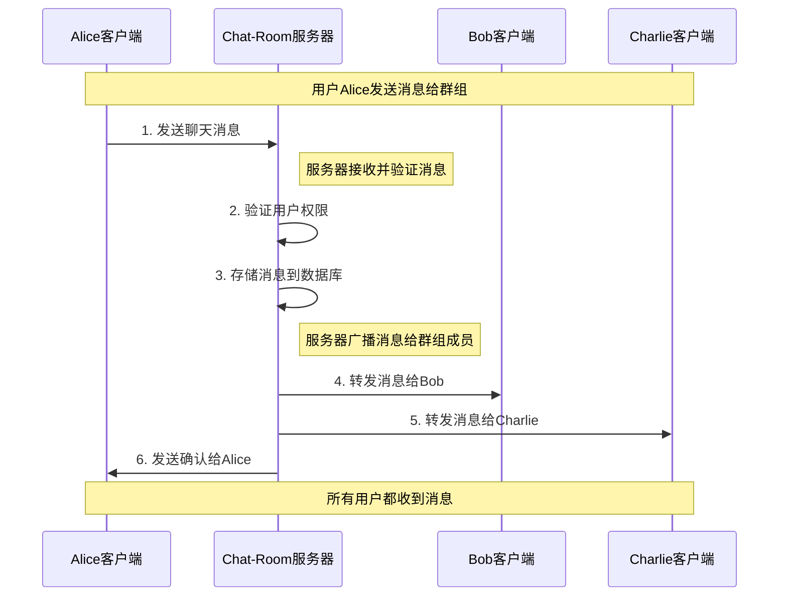
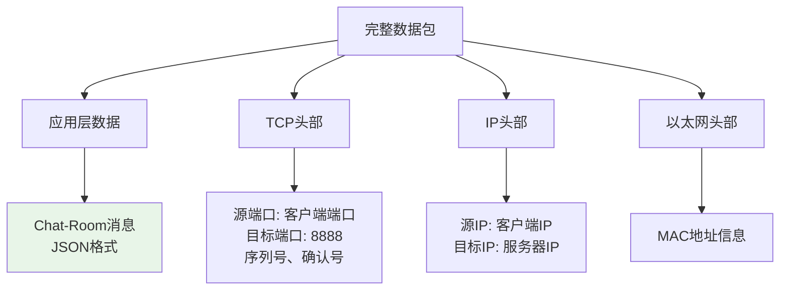

# 网络编程基础概念

## 🎯 学习目标

通过本章学习，您将能够：
- 理解网络通信的基本原理
- 掌握TCP/IP协议栈的核心概念
- 了解客户端-服务器架构模式
- 为Socket编程学习打下理论基础

## 🌐 网络通信基础

### 什么是网络通信？

网络通信是指不同计算机之间通过网络进行数据交换的过程。在Chat-Room项目中，客户端和服务器就是通过网络通信来实现实时聊天功能的。



### 网络通信的关键要素

#### 1. IP地址（网络地址）
```python
# Chat-Room项目中的IP地址使用
DEFAULT_HOST = "localhost"    # 本地回环地址 127.0.0.1
# DEFAULT_HOST = "192.168.1.100"  # 局域网地址
# DEFAULT_HOST = "0.0.0.0"         # 监听所有网络接口

# 在server/main.py中的应用
server = ChatRoomServer(host="localhost", port=8888)
```

**IP地址类型**：
- **localhost/127.0.0.1**：本地回环地址，用于本机测试
- **192.168.x.x**：私有网络地址，用于局域网通信
- **公网IP**：互联网上的唯一地址

#### 2. 端口号（应用标识）
```python
# Chat-Room项目中的端口配置
DEFAULT_PORT = 8888  # Chat-Room服务器端口

# 常见端口号
# 80   - HTTP网页服务
# 443  - HTTPS安全网页服务
# 22   - SSH远程登录
# 3306 - MySQL数据库
# 8888 - Chat-Room自定义端口
```

**端口号范围**：
- **0-1023**：系统保留端口（需要管理员权限）
- **1024-65535**：用户可用端口

#### 3. 协议（通信规则）


## 🔗 TCP协议详解

### 为什么Chat-Room选择TCP？



**TCP vs UDP对比**：

| 特性 | TCP | UDP | Chat-Room需求 |
|------|-----|-----|---------------|
| 可靠性 | ✅ 保证送达 | ❌ 可能丢失 | ✅ 聊天消息不能丢失 |
| 有序性 | ✅ 保证顺序 | ❌ 可能乱序 | ✅ 消息顺序很重要 |
| 连接性 | ✅ 面向连接 | ❌ 无连接 | ✅ 需要维持会话 |
| 开销 | 较大 | 较小 | ✅ 可接受 |

### TCP连接建立过程（三次握手）



**在Chat-Room中的体现**：
```python
# client/core/client.py - 客户端连接建立
def connect(self) -> bool:
    """连接到服务器"""
    try:
        # 创建TCP Socket
        self.socket = socket.socket(socket.AF_INET, socket.SOCK_STREAM)
        
        # 连接服务器（触发三次握手）
        self.socket.connect((self.host, self.port))
        
        self.connected = True
        return True
    except Exception as e:
        print(f"连接失败: {e}")
        return False
```

## 🏗️ 客户端-服务器架构

### 架构模式对比



**Chat-Room选择C/S架构的原因**：

| 优势 | 说明 | Chat-Room应用 |
|------|------|---------------|
| 集中管理 | 统一的数据和用户管理 | 用户认证、聊天记录存储 |
| 安全性 | 服务器控制访问权限 | 管理员功能、用户禁言 |
| 可扩展性 | 易于添加新功能 | AI助手、文件传输 |
| 数据一致性 | 避免数据冲突 | 消息顺序、用户状态 |

### Chat-Room的C/S架构实现



**代码实现示例**：
```python
# server/core/server.py - 服务器架构核心
class ChatRoomServer:
    """
    Chat-Room服务器主类
    
    职责分工：
    1. 网络连接管理 - 接受客户端连接
    2. 消息路由 - 将消息转发给目标用户
    3. 业务逻辑 - 用户管理、聊天组管理
    4. 数据存储 - 消息历史、用户信息
    """
    
    def __init__(self, host: str, port: int):
        self.host = host
        self.port = port
        
        # 网络相关
        self.server_socket = None
        self.client_sockets = set()  # 管理所有客户端连接
        
        # 业务管理器
        self.user_manager = UserManager()      # 用户管理
        self.chat_manager = ChatManager()      # 聊天管理
        self.admin_manager = AdminManager()    # 管理员功能
        self.ai_manager = AIManager()          # AI助手
    
    def start(self):
        """启动服务器"""
        # 创建服务器Socket
        self.server_socket = socket.socket(socket.AF_INET, socket.SOCK_STREAM)
        self.server_socket.setsockopt(socket.SOL_SOCKET, socket.SO_REUSEADDR, 1)
        
        # 绑定地址和端口
        self.server_socket.bind((self.host, self.port))
        
        # 开始监听连接
        self.server_socket.listen(MAX_CONNECTIONS)
        print(f"服务器启动，监听 {self.host}:{self.port}")
        
        # 主循环：接受客户端连接
        while self.running:
            try:
                client_socket, address = self.server_socket.accept()
                print(f"新客户端连接: {address}")
                
                # 为每个客户端创建处理线程
                client_thread = threading.Thread(
                    target=self.handle_client,
                    args=(client_socket, address)
                )
                client_thread.daemon = True
                client_thread.start()
                
            except Exception as e:
                print(f"接受连接失败: {e}")
```

## 📡 网络通信流程

### Chat-Room消息传输流程



### 网络数据包结构



**Chat-Room消息格式示例**：
```python
# shared/messages.py - 消息协议定义
{
    "message_type": "chat_message",
    "timestamp": 1703123456.789,
    "sender_id": 12345,
    "group_id": 1,
    "content": "Hello everyone!",
    "message_id": "uuid-string"
}
```

## 🔧 网络编程挑战

### 1. 并发处理
```python
# 问题：如何同时处理多个客户端？
# 解决方案：多线程处理

def handle_client(self, client_socket, address):
    """
    处理单个客户端连接
    每个客户端在独立线程中运行
    """
    try:
        while True:
            # 接收客户端消息
            data = client_socket.recv(BUFFER_SIZE)
            if not data:
                break
            
            # 处理消息
            self.process_message(client_socket, data)
            
    except Exception as e:
        print(f"客户端 {address} 处理错误: {e}")
    finally:
        # 清理连接
        self.cleanup_client(client_socket)
```

### 2. 网络异常处理
```python
# 常见网络异常及处理
try:
    client_socket.send(message.encode())
except ConnectionResetError:
    # 客户端强制断开连接
    print("客户端连接被重置")
except BrokenPipeError:
    # 管道破裂（对方已关闭连接）
    print("连接管道已断开")
except socket.timeout:
    # 网络超时
    print("网络操作超时")
except OSError as e:
    # 其他系统级网络错误
    print(f"网络系统错误: {e}")
```

### 3. 数据完整性
```python
# 问题：TCP是流式协议，消息可能被分割
# 解决方案：消息边界处理

def receive_complete_message(self, client_socket):
    """
    接收完整的消息
    使用换行符作为消息边界
    """
    buffer = ""
    while True:
        try:
            data = client_socket.recv(1024).decode('utf-8')
            if not data:
                break
            
            buffer += data
            
            # 检查是否有完整消息
            while '\n' in buffer:
                line, buffer = buffer.split('\n', 1)
                if line.strip():
                    yield line.strip()
                    
        except Exception as e:
            print(f"接收消息错误: {e}")
            break
```

## 🎯 实践思考

### 思考题1：协议选择
**问题**：如果Chat-Room要添加语音通话功能，应该选择TCP还是UDP？为什么？

**分析要点**：
- 语音数据的实时性要求
- 少量数据丢失的可接受性
- 网络延迟的影响
- 实现复杂度

### 思考题2：架构扩展
**问题**：如果Chat-Room需要支持10万用户同时在线，现有的C/S架构需要如何改进？

**考虑因素**：
- 单服务器的连接数限制
- 负载均衡策略
- 数据库性能瓶颈
- 消息广播效率

## ✅ 学习检查

完成本章学习后，请确认您能够：

- [ ] 理解网络通信的基本原理
- [ ] 解释TCP协议的特点和优势
- [ ] 说明客户端-服务器架构的工作原理
- [ ] 识别网络编程中的常见挑战
- [ ] 理解Chat-Room项目的网络架构设计

## 📚 下一步

网络概念掌握后，请继续学习：
- [TCP协议基础](tcp-basics.md)
- [Socket API详解](socket-api.md)
- [简单客户端-服务器实现](simple-client-server.md)

---

**现在您已经理解了网络编程的基础概念！** 🌐
