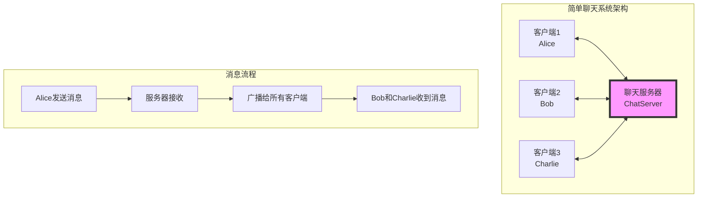

# 简单客户端-服务器实现

## 🎯 学习目标

通过本章学习，您将能够：
- 从零开始实现一个完整的客户端-服务器应用
- 理解网络编程的实际开发流程
- 掌握调试和测试网络应用的方法
- 为Chat-Room项目的开发做好准备

## 🚀 项目概述

我们将实现一个简单的聊天系统，包含以下功能：
- 多客户端连接支持
- 实时消息广播
- 用户昵称管理
- 基本的错误处理



## 🖥️ 服务器端实现

### 完整的聊天服务器
```python
#!/usr/bin/env python3
"""
简单聊天服务器实现
演示Socket编程的基本概念和实践
"""

import socket
import threading
import json
import time
from typing import Dict, List, Optional

class SimpleChatServer:
    """
    简单聊天服务器
    
    功能：
    1. 接受多个客户端连接
    2. 管理用户昵称
    3. 广播消息给所有客户端
    4. 处理客户端断开连接
    """
    
    def __init__(self, host: str = "localhost", port: int = 8888):
        self.host = host
        self.port = port
        self.server_socket: Optional[socket.socket] = None
        self.running = False
        
        # 客户端管理
        self.clients: Dict[socket.socket, str] = {}  # {socket: nickname}
        self.clients_lock = threading.Lock()  # 线程安全
        
        print(f"初始化聊天服务器: {host}:{port}")
    
    def start(self):
        """启动服务器"""
        try:
            # 创建服务器Socket
            self.server_socket = socket.socket(socket.AF_INET, socket.SOCK_STREAM)
            
            # 设置Socket选项
            self.server_socket.setsockopt(socket.SOL_SOCKET, socket.SO_REUSEADDR, 1)
            
            # 绑定地址和端口
            self.server_socket.bind((self.host, self.port))
            
            # 开始监听
            self.server_socket.listen(10)
            self.running = True
            
            print(f"🚀 聊天服务器启动成功！")
            print(f"📡 监听地址: {self.host}:{self.port}")
            print(f"⏳ 等待客户端连接...")
            
            # 主循环：接受客户端连接
            self._accept_connections()
            
        except Exception as e:
            print(f"❌ 服务器启动失败: {e}")
        finally:
            self.stop()
    
    def _accept_connections(self):
        """接受客户端连接的主循环"""
        while self.running:
            try:
                # 接受新连接
                client_socket, client_address = self.server_socket.accept()
                print(f"🔗 新客户端连接: {client_address}")
                
                # 为每个客户端创建处理线程
                client_thread = threading.Thread(
                    target=self._handle_client,
                    args=(client_socket, client_address),
                    daemon=True
                )
                client_thread.start()
                
            except OSError:
                # 服务器Socket被关闭
                break
            except Exception as e:
                print(f"❌ 接受连接时发生错误: {e}")
    
    def _handle_client(self, client_socket: socket.socket, client_address):
        """
        处理单个客户端
        
        每个客户端在独立线程中运行
        """
        nickname = None
        
        try:
            # 1. 客户端昵称注册
            nickname = self._register_client(client_socket)
            if not nickname:
                return
            
            # 2. 发送欢迎消息
            self._send_welcome_message(client_socket, nickname)
            
            # 3. 广播用户加入消息
            self._broadcast_system_message(f"🎉 {nickname} 加入了聊天室")
            
            # 4. 处理客户端消息
            self._process_client_messages(client_socket, nickname)
            
        except Exception as e:
            print(f"❌ 处理客户端 {client_address} 时发生错误: {e}")
        finally:
            # 5. 清理客户端连接
            self._cleanup_client(client_socket, nickname)
    
    def _register_client(self, client_socket: socket.socket) -> Optional[str]:
        """
        注册客户端昵称
        
        Returns:
            客户端昵称，如果注册失败返回None
        """
        try:
            # 发送昵称请求
            request_msg = {
                "type": "nickname_request",
                "message": "请输入您的昵称："
            }
            self._send_message(client_socket, request_msg)
            
            # 接收昵称响应
            response = self._receive_message(client_socket)
            if not response or response.get("type") != "nickname_response":
                print("❌ 客户端昵称注册失败")
                return None
            
            nickname = response.get("nickname", "").strip()
            
            # 验证昵称
            if not self._validate_nickname(nickname):
                error_msg = {
                    "type": "error",
                    "message": "昵称无效，请使用3-20个字符"
                }
                self._send_message(client_socket, error_msg)
                return None
            
            # 检查昵称是否已被使用
            with self.clients_lock:
                if nickname in self.clients.values():
                    error_msg = {
                        "type": "error", 
                        "message": f"昵称 '{nickname}' 已被使用"
                    }
                    self._send_message(client_socket, error_msg)
                    return None
                
                # 注册成功
                self.clients[client_socket] = nickname
            
            print(f"✅ 客户端注册成功: {nickname}")
            return nickname
            
        except Exception as e:
            print(f"❌ 客户端注册失败: {e}")
            return None
    
    def _validate_nickname(self, nickname: str) -> bool:
        """验证昵称格式"""
        if not nickname:
            return False
        if len(nickname) < 3 or len(nickname) > 20:
            return False
        if not nickname.replace('_', '').replace('-', '').isalnum():
            return False
        return True
    
    def _send_welcome_message(self, client_socket: socket.socket, nickname: str):
        """发送欢迎消息"""
        welcome_msg = {
            "type": "system",
            "message": f"🎊 欢迎 {nickname}！您已成功连接到聊天室",
            "timestamp": time.time()
        }
        self._send_message(client_socket, welcome_msg)
        
        # 发送在线用户列表
        with self.clients_lock:
            online_users = list(self.clients.values())
        
        users_msg = {
            "type": "user_list",
            "users": online_users,
            "message": f"📋 当前在线用户 ({len(online_users)}): {', '.join(online_users)}"
        }
        self._send_message(client_socket, users_msg)
    
    def _process_client_messages(self, client_socket: socket.socket, nickname: str):
        """
        处理客户端消息的主循环
        
        持续接收和处理客户端发送的消息
        """
        while self.running:
            try:
                message = self._receive_message(client_socket)
                if not message:
                    break
                
                # 处理不同类型的消息
                msg_type = message.get("type")
                
                if msg_type == "chat":
                    self._handle_chat_message(message, nickname)
                elif msg_type == "ping":
                    self._handle_ping_message(client_socket)
                else:
                    print(f"⚠️ 未知消息类型: {msg_type}")
                
            except Exception as e:
                print(f"❌ 处理 {nickname} 的消息时发生错误: {e}")
                break
    
    def _handle_chat_message(self, message: dict, sender_nickname: str):
        """处理聊天消息"""
        content = message.get("content", "").strip()
        if not content:
            return
        
        # 构造广播消息
        broadcast_msg = {
            "type": "chat",
            "sender": sender_nickname,
            "content": content,
            "timestamp": time.time()
        }
        
        # 广播给所有客户端
        self._broadcast_message(broadcast_msg)
        
        print(f"💬 [{sender_nickname}]: {content}")
    
    def _handle_ping_message(self, client_socket: socket.socket):
        """处理心跳消息"""
        pong_msg = {
            "type": "pong",
            "timestamp": time.time()
        }
        self._send_message(client_socket, pong_msg)
    
    def _send_message(self, client_socket: socket.socket, message: dict) -> bool:
        """
        发送消息给指定客户端
        
        消息格式：[4字节长度][JSON数据]
        """
        try:
            # 序列化消息
            message_json = json.dumps(message, ensure_ascii=False)
            message_bytes = message_json.encode('utf-8')
            
            # 发送长度头
            length_header = len(message_bytes).to_bytes(4, byteorder='big')
            client_socket.send(length_header)
            
            # 发送消息体
            client_socket.send(message_bytes)
            
            return True
            
        except Exception as e:
            print(f"❌ 发送消息失败: {e}")
            return False
    
    def _receive_message(self, client_socket: socket.socket) -> Optional[dict]:
        """
        接收完整消息
        
        Returns:
            解析后的消息字典，如果失败返回None
        """
        try:
            # 接收长度头（4字节）
            length_data = self._receive_exact(client_socket, 4)
            if not length_data:
                return None
            
            # 解析消息长度
            message_length = int.from_bytes(length_data, byteorder='big')
            
            # 接收消息体
            message_data = self._receive_exact(client_socket, message_length)
            if not message_data:
                return None
            
            # 解析JSON消息
            message_json = message_data.decode('utf-8')
            message = json.loads(message_json)
            
            return message
            
        except Exception as e:
            print(f"❌ 接收消息失败: {e}")
            return None
    
    def _receive_exact(self, client_socket: socket.socket, length: int) -> Optional[bytes]:
        """
        接收指定长度的数据
        
        确保接收到完整的数据
        """
        data = b""
        while len(data) < length:
            chunk = client_socket.recv(length - len(data))
            if not chunk:
                return None
            data += chunk
        return data
    
    def _broadcast_message(self, message: dict):
        """广播消息给所有客户端"""
        with self.clients_lock:
            disconnected_clients = []
            
            for client_socket in self.clients.keys():
                if not self._send_message(client_socket, message):
                    disconnected_clients.append(client_socket)
            
            # 清理断开的客户端
            for client_socket in disconnected_clients:
                nickname = self.clients.get(client_socket, "未知用户")
                self._cleanup_client(client_socket, nickname)
    
    def _broadcast_system_message(self, content: str):
        """广播系统消息"""
        system_msg = {
            "type": "system",
            "message": content,
            "timestamp": time.time()
        }
        self._broadcast_message(system_msg)
        print(f"📢 系统消息: {content}")
    
    def _cleanup_client(self, client_socket: socket.socket, nickname: Optional[str]):
        """清理客户端连接"""
        try:
            client_socket.close()
        except:
            pass
        
        with self.clients_lock:
            if client_socket in self.clients:
                nickname = self.clients[client_socket]
                del self.clients[client_socket]
        
        if nickname:
            print(f"👋 {nickname} 离开了聊天室")
            self._broadcast_system_message(f"👋 {nickname} 离开了聊天室")
    
    def stop(self):
        """停止服务器"""
        print("🛑 正在关闭服务器...")
        self.running = False
        
        # 关闭所有客户端连接
        with self.clients_lock:
            for client_socket in list(self.clients.keys()):
                try:
                    client_socket.close()
                except:
                    pass
            self.clients.clear()
        
        # 关闭服务器Socket
        if self.server_socket:
            try:
                self.server_socket.close()
            except:
                pass
        
        print("✅ 服务器已关闭")

def main():
    """服务器主函数"""
    server = SimpleChatServer()
    
    try:
        server.start()
    except KeyboardInterrupt:
        print("\n收到中断信号")
    finally:
        server.stop()

if __name__ == "__main__":
    main()
```

## 💻 客户端实现

### 完整的聊天客户端
```python
#!/usr/bin/env python3
"""
简单聊天客户端实现
演示Socket编程的客户端开发
"""

import socket
import threading
import json
import time
from typing import Optional

class SimpleChatClient:
    """
    简单聊天客户端
    
    功能：
    1. 连接到聊天服务器
    2. 注册用户昵称
    3. 发送和接收消息
    4. 处理服务器断开
    """
    
    def __init__(self, host: str = "localhost", port: int = 8888):
        self.host = host
        self.port = port
        self.socket: Optional[socket.socket] = None
        self.connected = False
        self.nickname = ""
        
        # 接收线程
        self.receive_thread: Optional[threading.Thread] = None
        
        print(f"初始化聊天客户端: {host}:{port}")
    
    def start(self):
        """启动客户端"""
        try:
            # 1. 连接服务器
            if not self._connect_to_server():
                return
            
            # 2. 注册昵称
            if not self._register_nickname():
                return
            
            # 3. 启动接收线程
            self._start_receive_thread()
            
            # 4. 开始用户输入循环
            self._input_loop()
            
        except KeyboardInterrupt:
            print("\n用户中断程序")
        except Exception as e:
            print(f"❌ 客户端运行错误: {e}")
        finally:
            self.disconnect()
    
    def _connect_to_server(self) -> bool:
        """连接到服务器"""
        try:
            print(f"🔗 正在连接服务器 {self.host}:{self.port}...")
            
            # 创建Socket
            self.socket = socket.socket(socket.AF_INET, socket.SOCK_STREAM)
            self.socket.settimeout(10.0)  # 10秒连接超时
            
            # 连接服务器
            self.socket.connect((self.host, self.port))
            self.connected = True
            
            print("✅ 连接服务器成功！")
            return True
            
        except Exception as e:
            print(f"❌ 连接服务器失败: {e}")
            return False
    
    def _register_nickname(self) -> bool:
        """注册昵称"""
        try:
            # 接收昵称请求
            request = self._receive_message()
            if not request or request.get("type") != "nickname_request":
                print("❌ 服务器昵称请求格式错误")
                return False
            
            # 获取用户输入的昵称
            print(request.get("message", "请输入昵称："))
            nickname = input("👤 昵称: ").strip()
            
            if not nickname:
                print("❌ 昵称不能为空")
                return False
            
            # 发送昵称响应
            response = {
                "type": "nickname_response",
                "nickname": nickname
            }
            
            if not self._send_message(response):
                return False
            
            # 等待服务器响应
            result = self._receive_message()
            if not result:
                return False
            
            if result.get("type") == "error":
                print(f"❌ 注册失败: {result.get('message')}")
                return False
            
            self.nickname = nickname
            print(f"✅ 昵称注册成功: {nickname}")
            return True
            
        except Exception as e:
            print(f"❌ 昵称注册失败: {e}")
            return False
    
    def _start_receive_thread(self):
        """启动消息接收线程"""
        self.receive_thread = threading.Thread(
            target=self._receive_loop,
            daemon=True
        )
        self.receive_thread.start()
        print("📡 消息接收线程已启动")
    
    def _receive_loop(self):
        """消息接收循环"""
        while self.connected:
            try:
                message = self._receive_message()
                if not message:
                    break
                
                self._handle_received_message(message)
                
            except Exception as e:
                if self.connected:
                    print(f"❌ 接收消息错误: {e}")
                break
        
        print("📡 消息接收线程已停止")
    
    def _handle_received_message(self, message: dict):
        """处理接收到的消息"""
        msg_type = message.get("type")
        
        if msg_type == "chat":
            # 聊天消息
            sender = message.get("sender")
            content = message.get("content")
            timestamp = message.get("timestamp", time.time())
            
            time_str = time.strftime("%H:%M:%S", time.localtime(timestamp))
            print(f"[{time_str}] {sender}: {content}")
            
        elif msg_type == "system":
            # 系统消息
            content = message.get("message")
            timestamp = message.get("timestamp", time.time())
            
            time_str = time.strftime("%H:%M:%S", time.localtime(timestamp))
            print(f"[{time_str}] 📢 {content}")
            
        elif msg_type == "user_list":
            # 用户列表
            print(f"📋 {message.get('message')}")
            
        elif msg_type == "pong":
            # 心跳响应
            print("💓 服务器心跳正常")
            
        else:
            print(f"⚠️ 未知消息类型: {msg_type}")
    
    def _input_loop(self):
        """用户输入循环"""
        print("\n🎉 欢迎来到聊天室！")
        print("💡 输入消息并按回车发送")
        print("💡 输入 '/quit' 退出程序")
        print("💡 输入 '/ping' 测试连接")
        print("-" * 50)
        
        while self.connected:
            try:
                user_input = input().strip()
                
                if not user_input:
                    continue
                
                # 处理特殊命令
                if user_input == "/quit":
                    print("👋 再见！")
                    break
                elif user_input == "/ping":
                    self._send_ping()
                    continue
                
                # 发送聊天消息
                chat_msg = {
                    "type": "chat",
                    "content": user_input
                }
                
                if not self._send_message(chat_msg):
                    print("❌ 发送消息失败")
                    break
                
            except EOFError:
                # Ctrl+D
                break
            except Exception as e:
                print(f"❌ 输入处理错误: {e}")
                break
    
    def _send_ping(self):
        """发送心跳消息"""
        ping_msg = {
            "type": "ping",
            "timestamp": time.time()
        }
        
        if self._send_message(ping_msg):
            print("💓 发送心跳消息")
        else:
            print("❌ 发送心跳失败")
    
    def _send_message(self, message: dict) -> bool:
        """发送消息到服务器"""
        if not self.connected or not self.socket:
            return False
        
        try:
            # 序列化消息
            message_json = json.dumps(message, ensure_ascii=False)
            message_bytes = message_json.encode('utf-8')
            
            # 发送长度头
            length_header = len(message_bytes).to_bytes(4, byteorder='big')
            self.socket.send(length_header)
            
            # 发送消息体
            self.socket.send(message_bytes)
            
            return True
            
        except Exception as e:
            print(f"❌ 发送消息失败: {e}")
            self.connected = False
            return False
    
    def _receive_message(self) -> Optional[dict]:
        """接收完整消息"""
        if not self.connected or not self.socket:
            return None
        
        try:
            # 接收长度头
            length_data = self._receive_exact(4)
            if not length_data:
                return None
            
            # 解析消息长度
            message_length = int.from_bytes(length_data, byteorder='big')
            
            # 接收消息体
            message_data = self._receive_exact(message_length)
            if not message_data:
                return None
            
            # 解析JSON消息
            message_json = message_data.decode('utf-8')
            message = json.loads(message_json)
            
            return message
            
        except Exception as e:
            if self.connected:
                print(f"❌ 接收消息失败: {e}")
            self.connected = False
            return None
    
    def _receive_exact(self, length: int) -> Optional[bytes]:
        """接收指定长度的数据"""
        data = b""
        while len(data) < length:
            try:
                chunk = self.socket.recv(length - len(data))
                if not chunk:
                    return None
                data += chunk
            except Exception:
                return None
        return data
    
    def disconnect(self):
        """断开连接"""
        if not self.connected:
            return
        
        print("🔌 正在断开连接...")
        self.connected = False
        
        # 关闭Socket
        if self.socket:
            try:
                self.socket.close()
            except:
                pass
            self.socket = None
        
        # 等待接收线程结束
        if self.receive_thread and self.receive_thread.is_alive():
            self.receive_thread.join(timeout=2.0)
        
        print("✅ 连接已断开")

def main():
    """客户端主函数"""
    print("🎮 简单聊天客户端")
    print("=" * 30)
    
    # 获取服务器地址
    host = input("服务器地址 (默认 localhost): ").strip() or "localhost"
    port_input = input("服务器端口 (默认 8888): ").strip()
    port = int(port_input) if port_input else 8888
    
    # 创建并启动客户端
    client = SimpleChatClient(host, port)
    client.start()

if __name__ == "__main__":
    main()
```

## 🧪 测试和调试

### 测试脚本
```python
#!/usr/bin/env python3
"""
聊天系统测试脚本
"""

import subprocess
import time
import threading

def test_server_client():
    """测试服务器和客户端"""
    
    print("🧪 开始测试聊天系统")
    
    # 1. 启动服务器
    print("1️⃣ 启动服务器...")
    server_process = subprocess.Popen(
        ["python", "simple_server.py"],
        stdout=subprocess.PIPE,
        stderr=subprocess.PIPE
    )
    
    # 等待服务器启动
    time.sleep(2)
    
    # 2. 启动多个客户端进行测试
    print("2️⃣ 启动测试客户端...")
    
    # 这里可以添加自动化测试逻辑
    # 例如：模拟客户端连接、发送消息等
    
    print("✅ 测试完成")
    
    # 清理
    server_process.terminate()

if __name__ == "__main__":
    test_server_client()
```

## 🎯 实践练习

### 练习1：添加私聊功能
```python
# 在服务器中添加私聊处理
def _handle_private_message(self, message: dict, sender_nickname: str):
    """
    处理私聊消息
    
    消息格式：
    {
        "type": "private",
        "target": "目标用户昵称",
        "content": "消息内容"
    }
    """
    # TODO: 实现私聊功能
    pass
```

### 练习2：添加聊天室功能
```python
# 添加多个聊天室支持
class ChatRoom:
    """聊天室类"""
    
    def __init__(self, name: str):
        self.name = name
        self.members = set()  # 成员集合
        self.messages = []    # 消息历史
    
    def add_member(self, nickname: str):
        """添加成员"""
        # TODO: 实现成员添加
        pass
    
    def remove_member(self, nickname: str):
        """移除成员"""
        # TODO: 实现成员移除
        pass
    
    def broadcast_message(self, message: dict):
        """广播消息给房间成员"""
        # TODO: 实现房间内广播
        pass
```

## ✅ 学习检查

完成本章学习后，请确认您能够：

- [ ] 独立实现完整的客户端-服务器应用
- [ ] 处理多客户端并发连接
- [ ] 实现可靠的消息传输机制
- [ ] 添加基本的错误处理和异常管理
- [ ] 测试和调试网络应用
- [ ] 完成实践练习

## 📚 下一步

简单客户端-服务器实现完成后，请继续学习：
- [第3章：简单聊天室](../03-simple-chat/protocol-design.md)

---

**恭喜！您已经完成了Socket网络编程的学习！** 🎉
