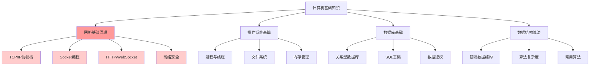
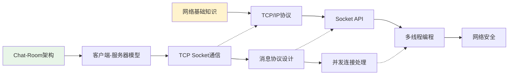
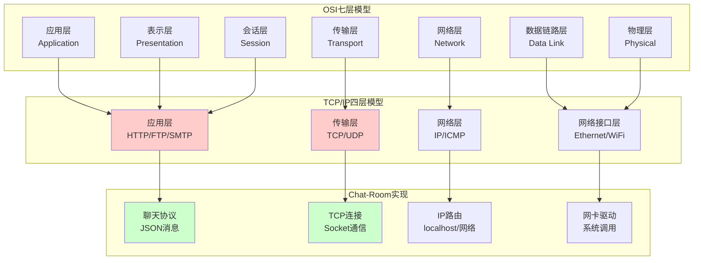
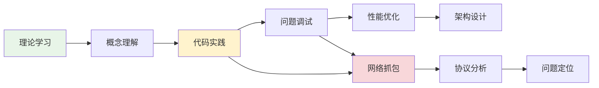

# 第2章：计算机基础知识

## 🎯 学习目标

通过本章学习，您将能够：
- 深入理解网络基础原理（TCP/IP、HTTP、WebSocket）**【重点】**
- 掌握操作系统基础概念（进程、线程、文件系统）
- 了解数据库基础知识（关系型数据库、SQL基础）
- 理解数据结构和算法基础
- 掌握编码和字符集概念
- 了解网络安全基础

> **特别说明**：本章重点关注计算机网络知识，因为Chat-Room项目是为计算机网络课程设计而开发的实战项目。

## 📚 章节内容

### 1. 网络基础原理 **【核心重点】**
- [TCP/IP协议栈深度解析](network-fundamentals.md)
- [Socket编程原理与实践](socket-programming.md)

### 2. 系统基础知识
- [操作系统核心概念](operating-systems.md)
- [数据库与数据结构基础](database-data-structures.md)

## 🌐 学习路径



## 🔗 Chat-Room项目关联

### 网络编程在Chat-Room中的应用



**实际应用场景**：
- **TCP连接管理**：理解三次握手、四次挥手在Chat-Room中的体现
- **数据传输**：JSON消息格式的序列化与反序列化
- **并发处理**：多用户同时在线的技术实现
- **错误处理**：网络异常的检测和恢复机制

## 🏗️ 知识体系架构

### 计算机网络层次模型



### 系统资源管理

```python
"""
Chat-Room项目中的系统资源管理示例
展示操作系统概念在实际项目中的应用
"""

import threading
import socket
import sqlite3
from typing import Dict, List
import os
import psutil

class SystemResourceManager:
    """系统资源管理器 - 演示操作系统概念"""
    
    def __init__(self):
        self.process_info = {}
        self.thread_pool = {}
        self.file_handles = {}
        self.network_connections = {}
    
    def monitor_process_resources(self):
        """监控进程资源使用 - 操作系统概念应用"""
        current_process = psutil.Process(os.getpid())
        
        # 内存使用情况
        memory_info = current_process.memory_info()
        memory_usage = {
            "rss": memory_info.rss / 1024 / 1024,  # 物理内存 (MB)
            "vms": memory_info.vms / 1024 / 1024,  # 虚拟内存 (MB)
            "percent": current_process.memory_percent()
        }
        
        # CPU使用情况
        cpu_usage = current_process.cpu_percent(interval=1)
        
        # 线程信息
        thread_count = current_process.num_threads()
        
        # 文件描述符
        try:
            fd_count = current_process.num_fds()  # Linux/macOS
        except AttributeError:
            fd_count = current_process.num_handles()  # Windows
        
        return {
            "memory": memory_usage,
            "cpu_percent": cpu_usage,
            "thread_count": thread_count,
            "file_descriptors": fd_count
        }
    
    def demonstrate_concurrency_concepts(self):
        """演示并发概念 - 进程vs线程"""
        
        # 1. 多线程示例 (Chat-Room服务器模型)
        def client_handler(client_id: int):
            """客户端处理线程"""
            print(f"线程 {threading.current_thread().name} 处理客户端 {client_id}")
            # 模拟处理时间
            import time
            time.sleep(2)
            print(f"客户端 {client_id} 处理完成")
        
        # 创建多个线程处理客户端
        threads = []
        for i in range(3):
            thread = threading.Thread(
                target=client_handler, 
                args=(i,),
                name=f"ClientHandler-{i}"
            )
            threads.append(thread)
            thread.start()
        
        # 等待所有线程完成
        for thread in threads:
            thread.join()
        
        print("所有客户端处理完成")
    
    def demonstrate_file_system_concepts(self):
        """演示文件系统概念"""
        
        # 文件路径操作
        chat_data_dir = "server/data"
        db_file = os.path.join(chat_data_dir, "chatroom.db")
        log_file = os.path.join("logs", "server.log")
        
        # 文件权限检查
        file_info = {
            "database": {
                "path": db_file,
                "exists": os.path.exists(db_file),
                "readable": os.access(db_file, os.R_OK) if os.path.exists(db_file) else False,
                "writable": os.access(db_file, os.W_OK) if os.path.exists(db_file) else False,
                "size": os.path.getsize(db_file) if os.path.exists(db_file) else 0
            },
            "log": {
                "path": log_file,
                "exists": os.path.exists(log_file),
                "readable": os.access(log_file, os.R_OK) if os.path.exists(log_file) else False,
                "writable": os.access(log_file, os.W_OK) if os.path.exists(log_file) else False,
                "size": os.path.getsize(log_file) if os.path.exists(log_file) else 0
            }
        }
        
        return file_info

# 网络编程基础概念演示
class NetworkConceptsDemo:
    """网络编程概念演示"""
    
    def demonstrate_tcp_concepts(self):
        """演示TCP概念"""
        
        # TCP特性演示
        tcp_features = {
            "可靠性": "确保数据完整传输，有重传机制",
            "有序性": "数据按发送顺序到达",
            "连接性": "需要建立连接（三次握手）",
            "流控制": "防止发送方发送过快",
            "拥塞控制": "网络拥塞时减慢发送速度"
        }
        
        print("TCP协议特性:")
        for feature, description in tcp_features.items():
            print(f"  {feature}: {description}")
    
    def demonstrate_socket_concepts(self):
        """演示Socket概念"""
        
        # Socket类型
        socket_types = {
            "TCP Socket": {
                "类型": "SOCK_STREAM",
                "协议": "TCP",
                "特点": "可靠、有序、面向连接",
                "用途": "Chat-Room消息传输"
            },
            "UDP Socket": {
                "类型": "SOCK_DGRAM", 
                "协议": "UDP",
                "特点": "不可靠、无序、无连接",
                "用途": "实时游戏、视频流"
            }
        }
        
        print("Socket类型对比:")
        for sock_type, info in socket_types.items():
            print(f"\n{sock_type}:")
            for key, value in info.items():
                print(f"  {key}: {value}")
    
    def demonstrate_client_server_model(self):
        """演示客户端-服务器模型"""
        
        model_concepts = {
            "服务器端": {
                "职责": ["监听端口", "接受连接", "处理请求", "发送响应"],
                "特点": ["被动等待", "多客户端支持", "资源管理"],
                "Chat-Room实现": "ChatRoomServer类"
            },
            "客户端": {
                "职责": ["发起连接", "发送请求", "接收响应", "用户交互"],
                "特点": ["主动连接", "用户界面", "状态管理"],
                "Chat-Room实现": "ChatClient类"
            }
        }
        
        print("客户端-服务器模型:")
        for role, info in model_concepts.items():
            print(f"\n{role}:")
            for aspect, details in info.items():
                if isinstance(details, list):
                    print(f"  {aspect}: {', '.join(details)}")
                else:
                    print(f"  {aspect}: {details}")

if __name__ == "__main__":
    # 演示系统概念
    resource_manager = SystemResourceManager()
    print("=== 系统资源监控 ===")
    resources = resource_manager.monitor_process_resources()
    print(f"内存使用: {resources['memory']['rss']:.2f} MB")
    print(f"CPU使用: {resources['cpu_percent']:.1f}%")
    print(f"线程数: {resources['thread_count']}")
    
    print("\n=== 并发概念演示 ===")
    resource_manager.demonstrate_concurrency_concepts()
    
    # 演示网络概念
    print("\n=== 网络概念演示 ===")
    network_demo = NetworkConceptsDemo()
    network_demo.demonstrate_tcp_concepts()
    network_demo.demonstrate_socket_concepts()
    network_demo.demonstrate_client_server_model()
```

## 🎓 学习重点说明

### 为什么重点学习网络知识？

1. **课程设计需求**：Chat-Room是计算机网络课程的实战项目
2. **核心技术栈**：项目基于Socket网络编程
3. **实际应用**：理解网络原理有助于：
   - 调试网络连接问题
   - 优化数据传输性能
   - 设计可扩展的网络架构
   - 实现网络安全措施

### 学习方法建议



## 📋 学习检查清单

完成本章学习后，请确认您能够：

### 网络基础 **【重点】**
- [ ] 理解TCP/IP协议栈的四层结构
- [ ] 掌握TCP和UDP的区别和应用场景
- [ ] 理解Socket编程的基本概念
- [ ] 了解HTTP协议和WebSocket的特点
- [ ] 掌握客户端-服务器架构模型

### 操作系统基础
- [ ] 理解进程和线程的概念及区别
- [ ] 了解文件系统的基本操作
- [ ] 掌握内存管理的基本概念
- [ ] 理解并发编程的基础知识

### 数据库基础
- [ ] 了解关系型数据库的基本概念
- [ ] 掌握SQL的基本语法
- [ ] 理解数据建模的基本原则

### 数据结构与算法
- [ ] 掌握基本数据结构（列表、字典、集合）
- [ ] 了解算法复杂度的概念
- [ ] 理解常用算法的应用场景

## 🔗 相关资源

### 网络编程资源
- [TCP/IP详解](https://www.amazon.com/TCP-Illustrated-Volume-Implementation/dp/0201633469)
- [计算机网络：自顶向下方法](https://gaia.cs.umass.edu/kurose_ross/index.php)
- [Wireshark网络分析工具](https://www.wireshark.org/)

### 系统编程资源
- [操作系统概念](https://www.os-book.com/)
- [Python并发编程](https://docs.python.org/3/library/threading.html)
- [SQLite教程](https://www.sqlite.org/docs.html)

## 📚 下一步

计算机基础知识学习完成后，请继续学习：
- [第3章：软件工程基础](../03-software-engineering/README.md)

---

**掌握这些基础知识，为Chat-Room项目开发打下坚实基础！** 🌐
