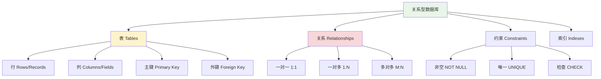

# 数据库与数据结构基础

## 🎯 学习目标

通过本节学习，您将能够：
- 理解关系型数据库的基本概念
- 掌握SQL语言的基础语法
- 了解数据建模的基本原则
- 掌握基本数据结构的概念和应用
- 理解Chat-Room项目中数据库和数据结构的应用

## 🗄️ 数据库基础

### 关系型数据库概念



### Chat-Room数据库设计

```python
"""
Chat-Room项目数据库设计
展示关系型数据库在实际项目中的应用
"""

import sqlite3
import hashlib
import datetime
from typing import List, Dict, Optional, Tuple
from shared.logger import get_logger

logger = get_logger("database.design")

class ChatRoomDatabase:
    """Chat-Room数据库管理器"""
    
    def __init__(self, db_path: str = "server/data/chatroom.db"):
        self.db_path = db_path
        self.connection: Optional[sqlite3.Connection] = None
    
    def connect(self):
        """连接数据库"""
        try:
            self.connection = sqlite3.connect(self.db_path)
            self.connection.row_factory = sqlite3.Row  # 使结果可以按列名访问
            logger.info(f"数据库连接成功: {self.db_path}")
        except sqlite3.Error as e:
            logger.error(f"数据库连接失败: {e}")
            raise
    
    def create_tables(self):
        """创建数据表 - 展示数据库设计"""
        
        if not self.connection:
            raise RuntimeError("数据库未连接")
        
        cursor = self.connection.cursor()
        
        # 1. 用户表
        cursor.execute("""
            CREATE TABLE IF NOT EXISTS users (
                id INTEGER PRIMARY KEY AUTOINCREMENT,
                username VARCHAR(50) UNIQUE NOT NULL,
                password_hash VARCHAR(255) NOT NULL,
                email VARCHAR(100),
                created_at TIMESTAMP DEFAULT CURRENT_TIMESTAMP,
                last_login TIMESTAMP,
                is_active BOOLEAN DEFAULT 1,
                is_admin BOOLEAN DEFAULT 0
            )
        """)
        
        # 2. 聊天组表
        cursor.execute("""
            CREATE TABLE IF NOT EXISTS chat_groups (
                id INTEGER PRIMARY KEY AUTOINCREMENT,
                name VARCHAR(100) UNIQUE NOT NULL,
                description TEXT,
                creator_id INTEGER NOT NULL,
                created_at TIMESTAMP DEFAULT CURRENT_TIMESTAMP,
                is_active BOOLEAN DEFAULT 1,
                FOREIGN KEY (creator_id) REFERENCES users (id)
            )
        """)
        
        # 3. 组成员表（多对多关系）
        cursor.execute("""
            CREATE TABLE IF NOT EXISTS group_members (
                id INTEGER PRIMARY KEY AUTOINCREMENT,
                group_id INTEGER NOT NULL,
                user_id INTEGER NOT NULL,
                joined_at TIMESTAMP DEFAULT CURRENT_TIMESTAMP,
                role VARCHAR(20) DEFAULT 'member',
                FOREIGN KEY (group_id) REFERENCES chat_groups (id),
                FOREIGN KEY (user_id) REFERENCES users (id),
                UNIQUE(group_id, user_id)
            )
        """)
        
        # 4. 消息表
        cursor.execute("""
            CREATE TABLE IF NOT EXISTS messages (
                id INTEGER PRIMARY KEY AUTOINCREMENT,
                group_id INTEGER NOT NULL,
                sender_id INTEGER NOT NULL,
                content TEXT NOT NULL,
                message_type VARCHAR(20) DEFAULT 'text',
                sent_at TIMESTAMP DEFAULT CURRENT_TIMESTAMP,
                is_deleted BOOLEAN DEFAULT 0,
                FOREIGN KEY (group_id) REFERENCES chat_groups (id),
                FOREIGN KEY (sender_id) REFERENCES users (id)
            )
        """)
        
        # 5. 文件表
        cursor.execute("""
            CREATE TABLE IF NOT EXISTS files (
                id INTEGER PRIMARY KEY AUTOINCREMENT,
                filename VARCHAR(255) NOT NULL,
                original_name VARCHAR(255) NOT NULL,
                file_size INTEGER NOT NULL,
                file_type VARCHAR(50),
                uploader_id INTEGER NOT NULL,
                group_id INTEGER,
                upload_path VARCHAR(500) NOT NULL,
                uploaded_at TIMESTAMP DEFAULT CURRENT_TIMESTAMP,
                is_deleted BOOLEAN DEFAULT 0,
                FOREIGN KEY (uploader_id) REFERENCES users (id),
                FOREIGN KEY (group_id) REFERENCES chat_groups (id)
            )
        """)
        
        # 创建索引提高查询性能
        indexes = [
            "CREATE INDEX IF NOT EXISTS idx_users_username ON users(username)",
            "CREATE INDEX IF NOT EXISTS idx_messages_group_id ON messages(group_id)",
            "CREATE INDEX IF NOT EXISTS idx_messages_sent_at ON messages(sent_at)",
            "CREATE INDEX IF NOT EXISTS idx_group_members_group_id ON group_members(group_id)",
            "CREATE INDEX IF NOT EXISTS idx_group_members_user_id ON group_members(user_id)",
            "CREATE INDEX IF NOT EXISTS idx_files_uploader_id ON files(uploader_id)"
        ]
        
        for index_sql in indexes:
            cursor.execute(index_sql)
        
        self.connection.commit()
        logger.info("数据表创建完成")
    
    def demonstrate_crud_operations(self):
        """演示CRUD操作"""
        
        print("=== CRUD操作演示 ===")
        
        # CREATE - 创建用户
        user_id = self.create_user("demo_user", "password123", "demo@example.com")
        logger.info(f"创建用户成功，ID: {user_id}")
        
        # READ - 查询用户
        user = self.get_user_by_username("demo_user")
        if user:
            logger.info(f"查询用户: {dict(user)}")
        
        # UPDATE - 更新用户
        self.update_user_email(user_id, "new_email@example.com")
        logger.info("用户邮箱更新成功")
        
        # DELETE - 删除用户（软删除）
        self.deactivate_user(user_id)
        logger.info("用户已停用")
    
    def create_user(self, username: str, password: str, email: str = None) -> int:
        """创建用户"""
        
        cursor = self.connection.cursor()
        
        # 密码哈希
        password_hash = hashlib.sha256(password.encode()).hexdigest()
        
        try:
            cursor.execute("""
                INSERT INTO users (username, password_hash, email)
                VALUES (?, ?, ?)
            """, (username, password_hash, email))
            
            self.connection.commit()
            return cursor.lastrowid
            
        except sqlite3.IntegrityError as e:
            logger.error(f"创建用户失败: {e}")
            raise
    
    def get_user_by_username(self, username: str) -> Optional[sqlite3.Row]:
        """根据用户名查询用户"""
        
        cursor = self.connection.cursor()
        cursor.execute("""
            SELECT id, username, email, created_at, last_login, is_active, is_admin
            FROM users
            WHERE username = ? AND is_active = 1
        """, (username,))
        
        return cursor.fetchone()
    
    def update_user_email(self, user_id: int, email: str):
        """更新用户邮箱"""
        
        cursor = self.connection.cursor()
        cursor.execute("""
            UPDATE users
            SET email = ?
            WHERE id = ?
        """, (email, user_id))
        
        self.connection.commit()
    
    def deactivate_user(self, user_id: int):
        """停用用户（软删除）"""
        
        cursor = self.connection.cursor()
        cursor.execute("""
            UPDATE users
            SET is_active = 0
            WHERE id = ?
        """, (user_id,))
        
        self.connection.commit()
    
    def demonstrate_joins(self):
        """演示表连接查询"""
        
        print("\n=== 表连接查询演示 ===")
        
        cursor = self.connection.cursor()
        
        # 查询用户及其所在的聊天组
        cursor.execute("""
            SELECT 
                u.username,
                cg.name as group_name,
                gm.role,
                gm.joined_at
            FROM users u
            JOIN group_members gm ON u.id = gm.user_id
            JOIN chat_groups cg ON gm.group_id = cg.id
            WHERE u.is_active = 1 AND cg.is_active = 1
            ORDER BY u.username, cg.name
        """)
        
        results = cursor.fetchall()
        logger.info("用户聊天组信息:")
        for row in results:
            logger.info(f"  {row['username']} -> {row['group_name']} ({row['role']})")
    
    def demonstrate_aggregation(self):
        """演示聚合查询"""
        
        print("\n=== 聚合查询演示 ===")
        
        cursor = self.connection.cursor()
        
        # 统计每个聊天组的消息数量
        cursor.execute("""
            SELECT 
                cg.name as group_name,
                COUNT(m.id) as message_count,
                MAX(m.sent_at) as last_message_time
            FROM chat_groups cg
            LEFT JOIN messages m ON cg.id = m.group_id AND m.is_deleted = 0
            WHERE cg.is_active = 1
            GROUP BY cg.id, cg.name
            ORDER BY message_count DESC
        """)
        
        results = cursor.fetchall()
        logger.info("聊天组消息统计:")
        for row in results:
            logger.info(f"  {row['group_name']}: {row['message_count']} 条消息")
    
    def close(self):
        """关闭数据库连接"""
        if self.connection:
            self.connection.close()
            logger.info("数据库连接已关闭")

# 使用示例
if __name__ == "__main__":
    db = ChatRoomDatabase(":memory:")  # 使用内存数据库进行演示
    
    try:
        db.connect()
        db.create_tables()
        db.demonstrate_crud_operations()
        db.demonstrate_joins()
        db.demonstrate_aggregation()
    finally:
        db.close()
```

## 📊 数据结构基础

### 基本数据结构

```python
"""
数据结构基础概念
以Chat-Room项目为例展示数据结构的应用
"""

from typing import List, Dict, Set, Tuple, Optional, Deque
from collections import deque, defaultdict, Counter
import heapq
import time

class DataStructuresDemo:
    """数据结构演示"""
    
    def __init__(self):
        self.demo_data = self.generate_demo_data()
    
    def generate_demo_data(self) -> Dict:
        """生成演示数据"""
        return {
            "users": ["alice", "bob", "charlie", "diana", "eve"],
            "messages": [
                {"user": "alice", "content": "Hello everyone!", "timestamp": time.time() - 300},
                {"user": "bob", "content": "Hi Alice!", "timestamp": time.time() - 250},
                {"user": "charlie", "content": "Good morning!", "timestamp": time.time() - 200},
                {"user": "diana", "content": "How are you?", "timestamp": time.time() - 150},
                {"user": "eve", "content": "Great day!", "timestamp": time.time() - 100}
            ],
            "groups": {
                "general": ["alice", "bob", "charlie"],
                "developers": ["alice", "charlie", "eve"],
                "random": ["bob", "diana", "eve"]
            }
        }
    
    def demonstrate_lists(self):
        """演示列表 - 消息历史存储"""
        
        print("=== 列表 (List) 演示 ===")
        
        # 消息历史列表
        message_history: List[Dict] = []
        
        # 添加消息
        for msg in self.demo_data["messages"]:
            message_history.append(msg)
        
        logger.info(f"消息总数: {len(message_history)}")
        
        # 获取最新消息
        if message_history:
            latest_message = message_history[-1]
            logger.info(f"最新消息: {latest_message['user']}: {latest_message['content']}")
        
        # 获取最近N条消息
        recent_messages = message_history[-3:]
        logger.info("最近3条消息:")
        for msg in recent_messages:
            logger.info(f"  {msg['user']}: {msg['content']}")
        
        # 按时间排序
        sorted_messages = sorted(message_history, key=lambda x: x['timestamp'])
        logger.info("按时间排序的消息:")
        for msg in sorted_messages:
            time_str = time.strftime("%H:%M:%S", time.localtime(msg['timestamp']))
            logger.info(f"  [{time_str}] {msg['user']}: {msg['content']}")
    
    def demonstrate_dictionaries(self):
        """演示字典 - 用户信息存储"""
        
        print("\n=== 字典 (Dictionary) 演示 ===")
        
        # 用户信息字典
        user_info: Dict[str, Dict] = {}
        
        # 添加用户信息
        for user in self.demo_data["users"]:
            user_info[user] = {
                "username": user,
                "online": True,
                "last_seen": time.time(),
                "message_count": 0
            }
        
        # 统计用户消息数量
        for msg in self.demo_data["messages"]:
            user = msg["user"]
            if user in user_info:
                user_info[user]["message_count"] += 1
        
        logger.info("用户信息:")
        for username, info in user_info.items():
            logger.info(f"  {username}: {info['message_count']} 条消息")
        
        # 快速查找用户
        target_user = "alice"
        if target_user in user_info:
            logger.info(f"用户 {target_user} 信息: {user_info[target_user]}")
    
    def demonstrate_sets(self):
        """演示集合 - 在线用户管理"""
        
        print("\n=== 集合 (Set) 演示 ===")
        
        # 在线用户集合
        online_users: Set[str] = set(self.demo_data["users"])
        
        logger.info(f"在线用户: {online_users}")
        logger.info(f"在线用户数: {len(online_users)}")
        
        # 用户下线
        offline_user = "bob"
        online_users.discard(offline_user)
        logger.info(f"{offline_user} 下线后: {online_users}")
        
        # 用户上线
        online_users.add(offline_user)
        logger.info(f"{offline_user} 上线后: {online_users}")
        
        # 集合运算 - 查找共同在线的用户
        group_members = set(self.demo_data["groups"]["general"])
        online_group_members = online_users & group_members
        logger.info(f"general组在线成员: {online_group_members}")
    
    def demonstrate_deque(self):
        """演示双端队列 - 消息缓冲区"""
        
        print("\n=== 双端队列 (Deque) 演示 ===")
        
        # 消息缓冲区（最多保存10条消息）
        message_buffer: Deque[Dict] = deque(maxlen=10)
        
        # 添加消息到缓冲区
        for msg in self.demo_data["messages"]:
            message_buffer.append(msg)
        
        logger.info(f"缓冲区消息数: {len(message_buffer)}")
        
        # 添加更多消息（会自动移除旧消息）
        for i in range(8):
            new_msg = {
                "user": f"user_{i}",
                "content": f"Message {i}",
                "timestamp": time.time() + i
            }
            message_buffer.append(new_msg)
        
        logger.info(f"添加新消息后缓冲区大小: {len(message_buffer)}")
        logger.info("缓冲区内容:")
        for msg in message_buffer:
            logger.info(f"  {msg['user']}: {msg['content']}")
    
    def demonstrate_heap(self):
        """演示堆 - 消息优先级队列"""
        
        print("\n=== 堆 (Heap) 演示 ===")
        
        # 优先级消息队列（优先级越小越重要）
        priority_queue: List[Tuple[int, Dict]] = []
        
        # 添加不同优先级的消息
        messages_with_priority = [
            (1, {"type": "system", "content": "服务器重启通知"}),
            (3, {"type": "chat", "content": "普通聊天消息"}),
            (2, {"type": "admin", "content": "管理员公告"}),
            (3, {"type": "chat", "content": "另一条聊天消息"}),
            (1, {"type": "system", "content": "紧急维护通知"})
        ]
        
        for priority, msg in messages_with_priority:
            heapq.heappush(priority_queue, (priority, msg))
        
        logger.info("按优先级处理消息:")
        while priority_queue:
            priority, msg = heapq.heappop(priority_queue)
            logger.info(f"  优先级 {priority}: {msg['type']} - {msg['content']}")
    
    def demonstrate_defaultdict(self):
        """演示默认字典 - 用户消息统计"""
        
        print("\n=== 默认字典 (DefaultDict) 演示 ===")
        
        # 用户消息统计
        user_message_count = defaultdict(int)
        user_groups = defaultdict(list)
        
        # 统计消息数量
        for msg in self.demo_data["messages"]:
            user_message_count[msg["user"]] += 1
        
        # 统计用户所在组
        for group_name, members in self.demo_data["groups"].items():
            for member in members:
                user_groups[member].append(group_name)
        
        logger.info("用户消息统计:")
        for user, count in user_message_count.items():
            groups = user_groups[user]
            logger.info(f"  {user}: {count} 条消息, 所在组: {groups}")
    
    def demonstrate_counter(self):
        """演示计数器 - 词频统计"""
        
        print("\n=== 计数器 (Counter) 演示 ===")
        
        # 统计消息中的词频
        all_words = []
        for msg in self.demo_data["messages"]:
            words = msg["content"].lower().split()
            all_words.extend(words)
        
        word_counter = Counter(all_words)
        
        logger.info("词频统计:")
        for word, count in word_counter.most_common(5):
            logger.info(f"  '{word}': {count} 次")
        
        # 统计用户活跃度
        user_activity = Counter(msg["user"] for msg in self.demo_data["messages"])
        
        logger.info("用户活跃度:")
        for user, count in user_activity.most_common():
            logger.info(f"  {user}: {count} 条消息")

# 使用示例
if __name__ == "__main__":
    demo = DataStructuresDemo()
    
    demo.demonstrate_lists()
    demo.demonstrate_dictionaries()
    demo.demonstrate_sets()
    demo.demonstrate_deque()
    demo.demonstrate_heap()
    demo.demonstrate_defaultdict()
    demo.demonstrate_counter()
```

## 🔍 算法复杂度基础

### 时间复杂度分析

```python
"""
算法复杂度分析
以Chat-Room功能为例说明不同算法的复杂度
"""

import time
from typing import List, Dict

class AlgorithmComplexityDemo:
    """算法复杂度演示"""
    
    def __init__(self):
        self.users = [f"user_{i}" for i in range(1000)]
        self.messages = [{"id": i, "content": f"Message {i}"} for i in range(1000)]
    
    def linear_search_user(self, target_user: str) -> bool:
        """线性搜索用户 - O(n)"""
        for user in self.users:
            if user == target_user:
                return True
        return False
    
    def binary_search_user(self, target_user: str) -> bool:
        """二分搜索用户 - O(log n)"""
        # 假设用户列表已排序
        sorted_users = sorted(self.users)
        
        left, right = 0, len(sorted_users) - 1
        
        while left <= right:
            mid = (left + right) // 2
            if sorted_users[mid] == target_user:
                return True
            elif sorted_users[mid] < target_user:
                left = mid + 1
            else:
                right = mid - 1
        
        return False
    
    def hash_search_user(self, target_user: str, user_set: set) -> bool:
        """哈希搜索用户 - O(1)"""
        return target_user in user_set
    
    def demonstrate_search_complexity(self):
        """演示搜索算法复杂度"""
        
        print("=== 搜索算法复杂度演示 ===")
        
        target_user = "user_999"
        user_set = set(self.users)
        
        # 线性搜索
        start_time = time.time()
        result1 = self.linear_search_user(target_user)
        linear_time = time.time() - start_time
        
        # 二分搜索
        start_time = time.time()
        result2 = self.binary_search_user(target_user)
        binary_time = time.time() - start_time
        
        # 哈希搜索
        start_time = time.time()
        result3 = self.hash_search_user(target_user, user_set)
        hash_time = time.time() - start_time
        
        logger.info(f"搜索结果: 线性={result1}, 二分={result2}, 哈希={result3}")
        logger.info(f"执行时间: 线性={linear_time:.6f}s, 二分={binary_time:.6f}s, 哈希={hash_time:.6f}s")

# 使用示例
if __name__ == "__main__":
    complexity_demo = AlgorithmComplexityDemo()
    complexity_demo.demonstrate_search_complexity()
```

## 📋 学习检查清单

完成本节学习后，请确认您能够：

- [ ] 理解关系型数据库的基本概念
- [ ] 掌握SQL的基本语法（SELECT、INSERT、UPDATE、DELETE）
- [ ] 了解数据库表设计和关系建模
- [ ] 理解数据库索引和性能优化
- [ ] 掌握Python基本数据结构的使用
- [ ] 了解算法复杂度的基本概念
- [ ] 理解Chat-Room项目中数据库和数据结构的应用

## 🔗 相关资源

- [SQLite官方文档](https://www.sqlite.org/docs.html)
- [SQL教程](https://www.w3schools.com/sql/)
- [Python数据结构文档](https://docs.python.org/3/tutorial/datastructures.html)
- [算法导论](https://mitpress.mit.edu/books/introduction-algorithms-third-edition)

## 📚 下一步

数据库和数据结构基础学习完成后，请继续学习：
- [第3章：软件工程基础](../03-software-engineering/README.md)

---

**掌握数据管理和数据结构，为高效编程奠定基础！** 📊
