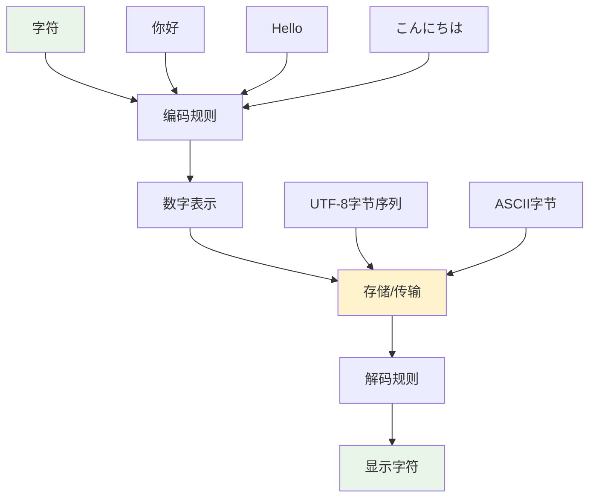

# 编码和字符集基础

## 🎯 学习目标

通过本章学习，您将能够：
- 理解字符编码的基本概念和重要性
- 掌握UTF-8、ASCII等常见编码格式
- 解决Chat-Room项目中的编码问题
- 处理多语言文本和特殊字符
- 避免常见的编码错误和乱码问题

## 📝 编码基础概念

### 什么是字符编码？

字符编码是将字符（如字母、数字、符号）转换为计算机可以处理的数字的规则。在Chat-Room项目中，正确处理编码对于支持多语言聊天至关重要。



### 常见编码格式

```python
# shared/utils/encoding_demo.py - 编码演示
def demonstrate_encodings():
    """演示不同编码格式的特点"""
    
    # 测试文本（包含中文、英文、特殊字符）
    test_text = "Hello 世界! 🌍 Chat-Room"
    
    print(f"原始文本: {test_text}")
    print(f"字符数量: {len(test_text)}")
    print("-" * 50)
    
    # 不同编码格式的字节表示
    encodings = ['utf-8', 'utf-16', 'utf-32', 'ascii', 'gbk']
    
    for encoding in encodings:
        try:
            # 编码为字节
            encoded_bytes = test_text.encode(encoding)
            print(f"{encoding.upper()}:")
            print(f"  字节长度: {len(encoded_bytes)}")
            print(f"  字节表示: {encoded_bytes[:20]}...")  # 只显示前20字节
            
            # 解码回字符串
            decoded_text = encoded_bytes.decode(encoding)
            print(f"  解码结果: {decoded_text}")
            print(f"  编码成功: ✅")
            
        except UnicodeEncodeError as e:
            print(f"{encoding.upper()}:")
            print(f"  编码失败: ❌ {e}")
        except UnicodeDecodeError as e:
            print(f"  解码失败: ❌ {e}")
        
        print()

# 运行演示
if __name__ == "__main__":
    demonstrate_encodings()
```

## 🌐 Chat-Room中的编码处理

### 网络传输中的编码

```python
# shared/protocol/encoding_handler.py - 编码处理器
import json
from typing import Union, Dict, Any

class EncodingHandler:
    """处理Chat-Room中的编码问题"""
    
    DEFAULT_ENCODING = 'utf-8'
    
    @staticmethod
    def encode_message(message: str, encoding: str = None) -> bytes:
        """
        将消息编码为字节，用于网络传输
        
        Args:
            message: 要编码的消息
            encoding: 编码格式，默认UTF-8
            
        Returns:
            编码后的字节数据
            
        Raises:
            UnicodeEncodeError: 编码失败
        """
        if encoding is None:
            encoding = EncodingHandler.DEFAULT_ENCODING
        
        try:
            return message.encode(encoding)
        except UnicodeEncodeError as e:
            print(f"❌ 消息编码失败: {e}")
            # 使用错误处理策略
            return message.encode(encoding, errors='replace')
    
    @staticmethod
    def decode_message(data: bytes, encoding: str = None) -> str:
        """
        将字节数据解码为消息字符串
        
        Args:
            data: 要解码的字节数据
            encoding: 编码格式，默认UTF-8
            
        Returns:
            解码后的消息字符串
            
        Raises:
            UnicodeDecodeError: 解码失败
        """
        if encoding is None:
            encoding = EncodingHandler.DEFAULT_ENCODING
        
        try:
            return data.decode(encoding)
        except UnicodeDecodeError as e:
            print(f"❌ 消息解码失败: {e}")
            # 使用错误处理策略
            return data.decode(encoding, errors='replace')
    
    @staticmethod
    def safe_json_dumps(data: Dict[str, Any]) -> str:
        """
        安全的JSON序列化，确保中文字符正确处理
        
        Args:
            data: 要序列化的数据
            
        Returns:
            JSON字符串
        """
        return json.dumps(data, ensure_ascii=False, separators=(',', ':'))
    
    @staticmethod
    def validate_utf8(data: bytes) -> bool:
        """
        验证字节数据是否为有效的UTF-8编码
        
        Args:
            data: 要验证的字节数据
            
        Returns:
            是否为有效UTF-8
        """
        try:
            data.decode('utf-8')
            return True
        except UnicodeDecodeError:
            return False
    
    @staticmethod
    def clean_text(text: str) -> str:
        """
        清理文本中的控制字符和无效字符
        
        Args:
            text: 原始文本
            
        Returns:
            清理后的文本
        """
        import unicodedata
        
        # 移除控制字符（除了换行符和制表符）
        cleaned = ''.join(
            char for char in text 
            if unicodedata.category(char)[0] != 'C' or char in '\n\t'
        )
        
        # 规范化Unicode字符
        normalized = unicodedata.normalize('NFC', cleaned)
        
        return normalized

# 使用示例
def demo_encoding_in_chatroom():
    """演示Chat-Room中的编码处理"""
    handler = EncodingHandler()
    
    # 测试消息（包含多种语言）
    messages = [
        "Hello World!",
        "你好，世界！",
        "こんにちは、世界！",
        "Привет, мир!",
        "مرحبا بالعالم!",
        "🌍🚀💬 Chat-Room"
    ]
    
    print("=== Chat-Room编码处理演示 ===")
    
    for i, message in enumerate(messages, 1):
        print(f"\n消息 {i}: {message}")
        
        # 编码为字节
        encoded = handler.encode_message(message)
        print(f"编码后字节长度: {len(encoded)}")
        
        # 解码回字符串
        decoded = handler.decode_message(encoded)
        print(f"解码后: {decoded}")
        print(f"编码往返成功: {'✅' if message == decoded else '❌'}")
        
        # JSON序列化
        json_data = handler.safe_json_dumps({
            "type": "chat",
            "content": message,
            "sender": "用户"
        })
        print(f"JSON序列化: {json_data}")
```

### 文件编码处理

```python
# shared/utils/file_encoding.py - 文件编码处理
import chardet
from pathlib import Path
from typing import Optional, Tuple

class FileEncodingHandler:
    """文件编码处理工具"""
    
    @staticmethod
    def detect_encoding(file_path: str) -> Optional[str]:
        """
        自动检测文件编码
        
        Args:
            file_path: 文件路径
            
        Returns:
            检测到的编码格式，如果检测失败返回None
        """
        try:
            with open(file_path, 'rb') as file:
                raw_data = file.read()
                result = chardet.detect(raw_data)
                
                if result['confidence'] > 0.7:  # 置信度阈值
                    return result['encoding']
                else:
                    print(f"⚠️ 编码检测置信度较低: {result['confidence']}")
                    return result['encoding']
                    
        except Exception as e:
            print(f"❌ 编码检测失败: {e}")
            return None
    
    @staticmethod
    def read_file_with_encoding(file_path: str, encoding: str = None) -> Tuple[str, str]:
        """
        读取文件并处理编码问题
        
        Args:
            file_path: 文件路径
            encoding: 指定编码，如果为None则自动检测
            
        Returns:
            (文件内容, 使用的编码)
        """
        if encoding is None:
            encoding = FileEncodingHandler.detect_encoding(file_path)
            if encoding is None:
                encoding = 'utf-8'  # 默认使用UTF-8
        
        try:
            with open(file_path, 'r', encoding=encoding) as file:
                content = file.read()
                return content, encoding
                
        except UnicodeDecodeError:
            # 如果指定编码失败，尝试其他常见编码
            fallback_encodings = ['utf-8', 'gbk', 'gb2312', 'latin1']
            
            for fallback_encoding in fallback_encodings:
                if fallback_encoding == encoding:
                    continue
                    
                try:
                    with open(file_path, 'r', encoding=fallback_encoding) as file:
                        content = file.read()
                        print(f"⚠️ 使用备用编码 {fallback_encoding}")
                        return content, fallback_encoding
                except UnicodeDecodeError:
                    continue
            
            # 所有编码都失败，使用错误处理策略
            with open(file_path, 'r', encoding='utf-8', errors='replace') as file:
                content = file.read()
                print("⚠️ 使用UTF-8编码，替换无法解码的字符")
                return content, 'utf-8'
    
    @staticmethod
    def write_file_with_encoding(file_path: str, content: str, encoding: str = 'utf-8'):
        """
        写入文件并确保编码正确
        
        Args:
            file_path: 文件路径
            content: 文件内容
            encoding: 编码格式
        """
        try:
            # 确保目录存在
            Path(file_path).parent.mkdir(parents=True, exist_ok=True)
            
            with open(file_path, 'w', encoding=encoding) as file:
                file.write(content)
                
            print(f"✅ 文件写入成功: {file_path} (编码: {encoding})")
            
        except UnicodeEncodeError as e:
            print(f"❌ 文件写入失败，编码错误: {e}")
            # 使用错误处理策略
            with open(file_path, 'w', encoding=encoding, errors='replace') as file:
                file.write(content)
                print(f"⚠️ 使用替换策略写入文件")

# 使用示例
def demo_file_encoding():
    """演示文件编码处理"""
    handler = FileEncodingHandler()
    
    # 创建测试文件
    test_content = """# Chat-Room 配置文件
# 这是一个包含中文的配置文件
server:
  host: localhost
  port: 8888
  
messages:
  welcome: "欢迎来到Chat-Room！"
  goodbye: "再见！👋"
"""
    
    test_file = "test_config.yaml"
    
    # 写入文件
    handler.write_file_with_encoding(test_file, test_content, 'utf-8')
    
    # 读取文件
    content, detected_encoding = handler.read_file_with_encoding(test_file)
    print(f"检测到的编码: {detected_encoding}")
    print(f"文件内容:\n{content}")
    
    # 清理测试文件
    Path(test_file).unlink(missing_ok=True)
```

## 🔧 编码问题解决方案

### 常见编码错误处理

```python
# shared/utils/encoding_fixes.py - 编码问题修复工具
import re
from typing import List, Dict

class EncodingFixer:
    """编码问题修复工具"""
    
    # 常见乱码模式
    MOJIBAKE_PATTERNS = {
        # UTF-8被错误解码为Latin1后再编码的情况
        'utf8_latin1': {
            'pattern': r'[áâãäåæçèéêëìíîï]+',
            'description': 'UTF-8被错误解码为Latin1'
        },
        # 中文乱码
        'chinese_mojibake': {
            'pattern': r'[锟斤拷]+',
            'description': '中文字符编码错误'
        }
    }
    
    @staticmethod
    def detect_mojibake(text: str) -> List[Dict[str, str]]:
        """
        检测文本中的乱码
        
        Args:
            text: 要检测的文本
            
        Returns:
            检测到的乱码信息列表
        """
        detected_issues = []
        
        for issue_type, pattern_info in EncodingFixer.MOJIBAKE_PATTERNS.items():
            matches = re.findall(pattern_info['pattern'], text)
            if matches:
                detected_issues.append({
                    'type': issue_type,
                    'description': pattern_info['description'],
                    'matches': matches,
                    'count': len(matches)
                })
        
        return detected_issues
    
    @staticmethod
    def fix_utf8_latin1_mojibake(text: str) -> str:
        """
        修复UTF-8被错误解码为Latin1的乱码
        
        Args:
            text: 包含乱码的文本
            
        Returns:
            修复后的文本
        """
        try:
            # 将文本编码为Latin1，然后解码为UTF-8
            fixed_text = text.encode('latin1').decode('utf-8')
            return fixed_text
        except (UnicodeEncodeError, UnicodeDecodeError):
            return text  # 如果修复失败，返回原文本
    
    @staticmethod
    def normalize_text(text: str) -> str:
        """
        规范化文本，处理各种编码问题
        
        Args:
            text: 原始文本
            
        Returns:
            规范化后的文本
        """
        import unicodedata
        
        # 1. Unicode规范化
        normalized = unicodedata.normalize('NFC', text)
        
        # 2. 移除零宽字符
        zero_width_chars = [
            '\u200b',  # 零宽空格
            '\u200c',  # 零宽非连接符
            '\u200d',  # 零宽连接符
            '\ufeff',  # 字节顺序标记
        ]
        
        for char in zero_width_chars:
            normalized = normalized.replace(char, '')
        
        # 3. 统一换行符
        normalized = normalized.replace('\r\n', '\n').replace('\r', '\n')
        
        return normalized

# 使用示例
def demo_encoding_fixes():
    """演示编码问题修复"""
    fixer = EncodingFixer()
    
    # 测试乱码文本
    mojibake_text = "ä½ å¥½ï¼Œä¸–ç•Œï¼"  # "你好，世界！"的UTF-8被错误解码为Latin1
    
    print(f"原始乱码文本: {mojibake_text}")
    
    # 检测乱码
    issues = fixer.detect_mojibake(mojibake_text)
    if issues:
        print("检测到的编码问题:")
        for issue in issues:
            print(f"  - {issue['description']}: {issue['count']}处")
    
    # 修复乱码
    fixed_text = fixer.fix_utf8_latin1_mojibake(mojibake_text)
    print(f"修复后文本: {fixed_text}")
    
    # 规范化文本
    normalized = fixer.normalize_text(fixed_text)
    print(f"规范化文本: {normalized}")
```

## 🎯 实践练习

### 练习1：多语言聊天支持
```python
def practice_multilingual_chat():
    """
    多语言聊天支持练习
    
    要求：
    1. 支持多种语言的消息
    2. 正确处理emoji和特殊字符
    3. 实现编码自动检测
    4. 处理编码转换错误
    """
    # TODO: 实现多语言聊天支持
    pass
```

### 练习2：文件编码转换工具
```python
def practice_encoding_converter():
    """
    文件编码转换工具练习
    
    要求：
    1. 批量转换文件编码
    2. 自动检测源文件编码
    3. 验证转换结果
    4. 处理转换失败的情况
    """
    # TODO: 实现文件编码转换工具
    pass
```

## ✅ 学习检查

完成本章学习后，请确认您能够：

- [ ] 理解字符编码的基本概念
- [ ] 掌握UTF-8、ASCII等常见编码
- [ ] 在网络传输中正确处理编码
- [ ] 处理文件读写的编码问题
- [ ] 检测和修复常见的乱码问题
- [ ] 支持多语言文本处理
- [ ] 完成实践练习

## 📚 下一步

编码和字符集基础掌握后，请继续学习：
- [安全基础概念](security-basics.md) - 学习信息安全基础知识

---

**正确处理编码是国际化应用的基础！** 🌐
