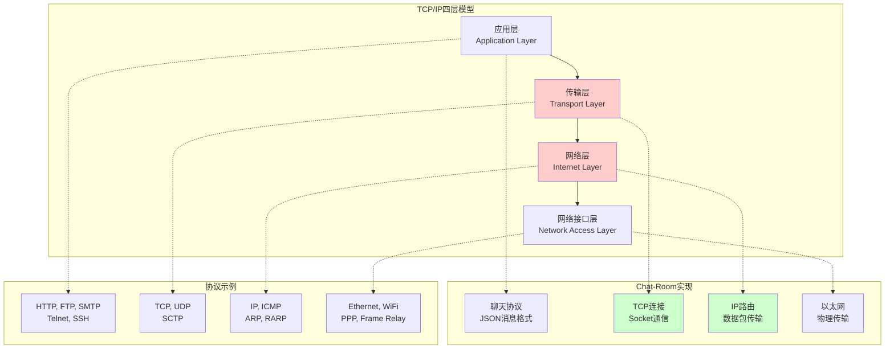
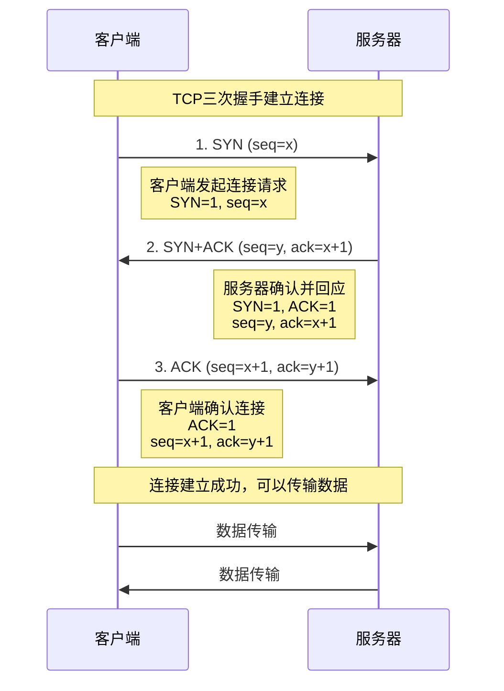
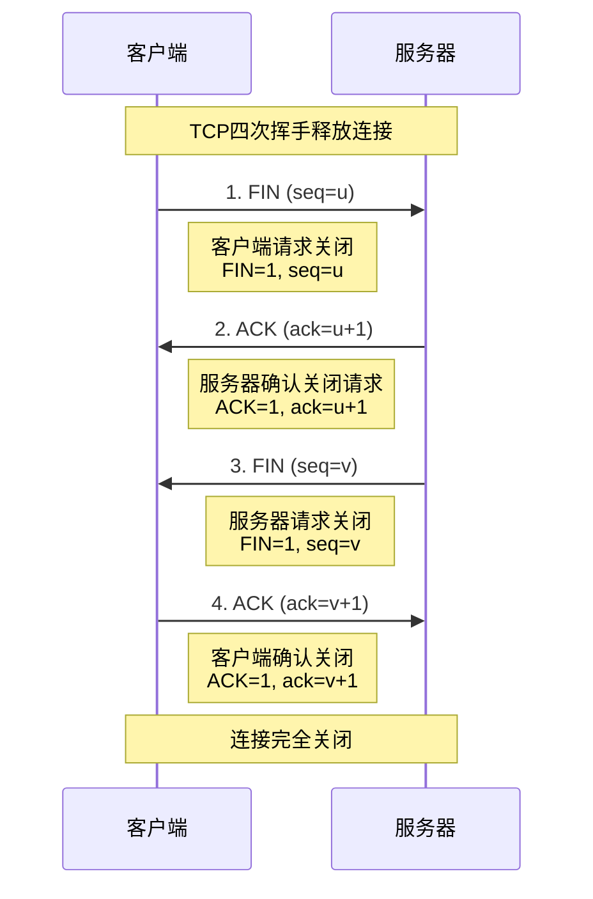

# TCP/IP协议栈深度解析

## 🎯 学习目标

通过本节学习，您将能够：
- 深入理解TCP/IP协议栈的四层结构
- 掌握TCP协议的工作原理和特性
- 理解IP协议的路由和寻址机制
- 了解Chat-Room项目中网络协议的应用
- 学会使用网络工具进行协议分析

## 🌐 TCP/IP协议栈概述

### 四层模型结构



### 各层功能详解

```python
"""
TCP/IP协议栈各层功能演示
以Chat-Room项目为例说明各层的作用
"""

class NetworkLayerDemo:
    """网络层次演示"""
    
    def application_layer_example(self):
        """应用层示例 - Chat-Room消息协议"""
        
        # Chat-Room应用层消息格式
        chat_message = {
            "type": "chat_message",
            "timestamp": "2024-01-15T10:30:00Z",
            "sender": "alice",
            "group": "general",
            "content": "Hello, everyone!",
            "message_id": "msg_12345"
        }
        
        login_request = {
            "type": "login_request",
            "username": "alice",
            "password_hash": "sha256_hash_value",
            "client_version": "1.0.0"
        }
        
        print("应用层 - Chat-Room消息协议:")
        print(f"聊天消息: {chat_message}")
        print(f"登录请求: {login_request}")
        
        return chat_message, login_request
    
    def transport_layer_example(self):
        """传输层示例 - TCP连接管理"""
        
        # TCP连接特性
        tcp_features = {
            "可靠性": {
                "描述": "确保数据完整传输",
                "机制": ["序列号", "确认应答", "重传机制"],
                "Chat-Room应用": "确保聊天消息不丢失"
            },
            "有序性": {
                "描述": "数据按发送顺序到达",
                "机制": ["序列号排序", "缓冲区重组"],
                "Chat-Room应用": "聊天消息按时间顺序显示"
            },
            "流控制": {
                "描述": "防止发送方发送过快",
                "机制": ["滑动窗口", "接收窗口"],
                "Chat-Room应用": "防止消息发送过快导致拥塞"
            },
            "拥塞控制": {
                "描述": "网络拥塞时减慢发送",
                "机制": ["慢启动", "拥塞避免", "快重传"],
                "Chat-Room应用": "网络繁忙时自动调节发送速度"
            }
        }
        
        print("\n传输层 - TCP协议特性:")
        for feature, details in tcp_features.items():
            print(f"\n{feature}:")
            print(f"  描述: {details['描述']}")
            print(f"  机制: {', '.join(details['机制'])}")
            print(f"  Chat-Room应用: {details['Chat-Room应用']}")
    
    def network_layer_example(self):
        """网络层示例 - IP路由"""
        
        # IP地址和路由概念
        ip_concepts = {
            "IP地址": {
                "IPv4": "192.168.1.100",
                "IPv6": "2001:db8::1",
                "本地回环": "127.0.0.1 (localhost)",
                "Chat-Room使用": "服务器监听地址配置"
            },
            "子网掩码": {
                "作用": "区分网络部分和主机部分",
                "示例": "255.255.255.0 (/24)",
                "Chat-Room应用": "局域网内服务器发现"
            },
            "路由": {
                "作用": "确定数据包传输路径",
                "类型": ["静态路由", "动态路由"],
                "Chat-Room应用": "客户端连接到远程服务器"
            }
        }
        
        print("\n网络层 - IP协议概念:")
        for concept, details in ip_concepts.items():
            print(f"\n{concept}:")
            for key, value in details.items():
                print(f"  {key}: {value}")
    
    def network_access_layer_example(self):
        """网络接口层示例 - 物理传输"""
        
        # 网络接口类型
        interface_types = {
            "以太网": {
                "特点": "有线连接，稳定可靠",
                "速度": "10Mbps - 100Gbps",
                "Chat-Room适用": "服务器部署环境"
            },
            "WiFi": {
                "特点": "无线连接，移动便利",
                "速度": "11Mbps - 9.6Gbps",
                "Chat-Room适用": "客户端移动设备"
            },
            "回环接口": {
                "特点": "本机内部通信",
                "地址": "127.0.0.1",
                "Chat-Room适用": "本地开发测试"
            }
        }
        
        print("\n网络接口层 - 物理传输:")
        for interface, details in interface_types.items():
            print(f"\n{interface}:")
            for key, value in details.items():
                print(f"  {key}: {value}")

# 演示使用
if __name__ == "__main__":
    demo = NetworkLayerDemo()
    demo.application_layer_example()
    demo.transport_layer_example()
    demo.network_layer_example()
    demo.network_access_layer_example()
```

## 🔗 TCP协议深度解析

### TCP连接建立（三次握手）



### TCP连接释放（四次挥手）



### Chat-Room中的TCP连接管理

```python
"""
Chat-Room项目中的TCP连接管理实现
展示TCP协议在实际项目中的应用
"""

import socket
import threading
import time
from typing import Dict, Set
from shared.logger import get_logger

logger = get_logger("network.tcp_manager")

class TCPConnectionManager:
    """TCP连接管理器"""
    
    def __init__(self):
        self.active_connections: Dict[str, socket.socket] = {}
        self.connection_stats: Dict[str, dict] = {}
        self.lock = threading.Lock()
    
    def create_server_socket(self, host: str, port: int) -> socket.socket:
        """创建服务器Socket - 演示TCP服务器端"""
        
        # 创建TCP Socket
        server_socket = socket.socket(socket.AF_INET, socket.SOCK_STREAM)
        
        # 设置Socket选项
        server_socket.setsockopt(socket.SOL_SOCKET, socket.SO_REUSEADDR, 1)
        
        # 绑定地址和端口
        try:
            server_socket.bind((host, port))
            logger.info(f"服务器Socket绑定成功: {host}:{port}")
        except OSError as e:
            logger.error(f"Socket绑定失败: {e}")
            raise
        
        # 开始监听
        server_socket.listen(5)  # 最多5个等待连接
        logger.info("服务器开始监听连接...")
        
        return server_socket
    
    def accept_client_connection(self, server_socket: socket.socket):
        """接受客户端连接 - 演示TCP三次握手"""
        
        try:
            # 接受连接（三次握手在这里完成）
            client_socket, client_address = server_socket.accept()
            
            # 记录连接信息
            connection_id = f"{client_address[0]}:{client_address[1]}"
            
            with self.lock:
                self.active_connections[connection_id] = client_socket
                self.connection_stats[connection_id] = {
                    "connected_at": time.time(),
                    "bytes_sent": 0,
                    "bytes_received": 0,
                    "messages_count": 0
                }
            
            logger.info(f"客户端连接成功: {connection_id}")
            return client_socket, client_address
            
        except Exception as e:
            logger.error(f"接受连接失败: {e}")
            return None, None
    
    def send_data(self, client_socket: socket.socket, data: bytes, connection_id: str):
        """发送数据 - 演示TCP可靠传输"""
        
        try:
            # TCP自动处理数据分片和重传
            bytes_sent = client_socket.send(data)
            
            # 更新统计信息
            with self.lock:
                if connection_id in self.connection_stats:
                    self.connection_stats[connection_id]["bytes_sent"] += bytes_sent
                    self.connection_stats[connection_id]["messages_count"] += 1
            
            logger.debug(f"数据发送成功: {bytes_sent} 字节到 {connection_id}")
            return bytes_sent
            
        except socket.error as e:
            logger.error(f"数据发送失败: {e}")
            self.close_connection(connection_id)
            return 0
    
    def receive_data(self, client_socket: socket.socket, connection_id: str, buffer_size: int = 4096):
        """接收数据 - 演示TCP数据接收"""
        
        try:
            # TCP自动处理数据重组和排序
            data = client_socket.recv(buffer_size)
            
            if not data:
                # 客户端关闭连接
                logger.info(f"客户端 {connection_id} 关闭连接")
                self.close_connection(connection_id)
                return None
            
            # 更新统计信息
            with self.lock:
                if connection_id in self.connection_stats:
                    self.connection_stats[connection_id]["bytes_received"] += len(data)
            
            logger.debug(f"数据接收成功: {len(data)} 字节从 {connection_id}")
            return data
            
        except socket.error as e:
            logger.error(f"数据接收失败: {e}")
            self.close_connection(connection_id)
            return None
    
    def close_connection(self, connection_id: str):
        """关闭连接 - 演示TCP四次挥手"""
        
        with self.lock:
            if connection_id in self.active_connections:
                client_socket = self.active_connections[connection_id]
                
                try:
                    # 关闭Socket（四次挥手在这里完成）
                    client_socket.close()
                    logger.info(f"连接关闭成功: {connection_id}")
                except Exception as e:
                    logger.error(f"关闭连接失败: {e}")
                
                # 清理连接记录
                del self.active_connections[connection_id]
                
                # 记录连接统计
                if connection_id in self.connection_stats:
                    stats = self.connection_stats[connection_id]
                    duration = time.time() - stats["connected_at"]
                    logger.info(f"连接统计 {connection_id}: "
                              f"持续时间={duration:.2f}秒, "
                              f"发送={stats['bytes_sent']}字节, "
                              f"接收={stats['bytes_received']}字节, "
                              f"消息数={stats['messages_count']}")
                    del self.connection_stats[connection_id]
    
    def get_connection_stats(self) -> dict:
        """获取连接统计信息"""
        with self.lock:
            return {
                "active_connections": len(self.active_connections),
                "connection_details": self.connection_stats.copy()
            }

# TCP协议特性演示
class TCPFeaturesDemo:
    """TCP协议特性演示"""
    
    def demonstrate_reliability(self):
        """演示TCP可靠性特性"""
        
        reliability_features = {
            "序列号": {
                "作用": "标识数据包顺序",
                "实现": "每个字节都有唯一序列号",
                "Chat-Room应用": "确保聊天消息按顺序到达"
            },
            "确认应答": {
                "作用": "确认数据包接收",
                "实现": "接收方发送ACK确认",
                "Chat-Room应用": "确认消息发送成功"
            },
            "重传机制": {
                "作用": "处理数据包丢失",
                "实现": "超时重传、快速重传",
                "Chat-Room应用": "网络不稳定时自动重发消息"
            },
            "校验和": {
                "作用": "检测数据错误",
                "实现": "TCP头部和数据的校验和",
                "Chat-Room应用": "确保消息内容完整性"
            }
        }
        
        print("TCP可靠性特性:")
        for feature, details in reliability_features.items():
            print(f"\n{feature}:")
            for key, value in details.items():
                print(f"  {key}: {value}")
    
    def demonstrate_flow_control(self):
        """演示TCP流控制"""
        
        # 滑动窗口机制
        window_example = {
            "发送窗口": "发送方可以发送的数据量",
            "接收窗口": "接收方可以接收的数据量",
            "窗口大小": "动态调整，防止缓冲区溢出",
            "Chat-Room应用": "防止服务器向客户端发送过多消息"
        }
        
        print("\nTCP流控制 - 滑动窗口:")
        for concept, description in window_example.items():
            print(f"  {concept}: {description}")
    
    def demonstrate_congestion_control(self):
        """演示TCP拥塞控制"""
        
        congestion_algorithms = {
            "慢启动": {
                "阶段": "连接初期",
                "策略": "指数增长发送速度",
                "目的": "探测网络容量"
            },
            "拥塞避免": {
                "阶段": "稳定传输期",
                "策略": "线性增长发送速度",
                "目的": "避免网络拥塞"
            },
            "快重传": {
                "阶段": "检测到丢包",
                "策略": "立即重传丢失数据",
                "目的": "快速恢复传输"
            },
            "快恢复": {
                "阶段": "快重传后",
                "策略": "减半拥塞窗口",
                "目的": "快速恢复到稳定状态"
            }
        }
        
        print("\nTCP拥塞控制算法:")
        for algorithm, details in congestion_algorithms.items():
            print(f"\n{algorithm}:")
            for key, value in details.items():
                print(f"  {key}: {value}")

if __name__ == "__main__":
    # 演示TCP协议特性
    tcp_demo = TCPFeaturesDemo()
    tcp_demo.demonstrate_reliability()
    tcp_demo.demonstrate_flow_control()
    tcp_demo.demonstrate_congestion_control()
```

## 📊 IP协议基础

### IP地址和路由

```python
"""
IP协议基础概念演示
"""

import ipaddress
import socket
import subprocess
import platform

class IPProtocolDemo:
    """IP协议演示"""
    
    def demonstrate_ip_addressing(self):
        """演示IP地址概念"""
        
        # IPv4地址类型
        ipv4_types = {
            "A类地址": {
                "范围": "1.0.0.0 - 126.255.255.255",
                "默认子网掩码": "255.0.0.0 (/8)",
                "用途": "大型网络",
                "私有地址": "10.0.0.0 - 10.255.255.255"
            },
            "B类地址": {
                "范围": "128.0.0.0 - 191.255.255.255",
                "默认子网掩码": "255.255.0.0 (/16)",
                "用途": "中型网络",
                "私有地址": "172.16.0.0 - 172.31.255.255"
            },
            "C类地址": {
                "范围": "192.0.0.0 - 223.255.255.255",
                "默认子网掩码": "255.255.255.0 (/24)",
                "用途": "小型网络",
                "私有地址": "192.168.0.0 - 192.168.255.255"
            }
        }
        
        print("IPv4地址分类:")
        for addr_class, details in ipv4_types.items():
            print(f"\n{addr_class}:")
            for key, value in details.items():
                print(f"  {key}: {value}")
    
    def demonstrate_subnetting(self):
        """演示子网划分"""
        
        # 子网划分示例
        network = ipaddress.IPv4Network("192.168.1.0/24")
        
        print(f"\n子网划分示例:")
        print(f"网络地址: {network}")
        print(f"网络地址: {network.network_address}")
        print(f"广播地址: {network.broadcast_address}")
        print(f"子网掩码: {network.netmask}")
        print(f"主机数量: {network.num_addresses - 2}")  # 减去网络地址和广播地址
        
        # 子网划分
        subnets = list(network.subnets(new_prefix=26))  # 划分为4个子网
        print(f"\n划分为 /26 子网:")
        for i, subnet in enumerate(subnets):
            print(f"  子网{i+1}: {subnet}")
    
    def get_local_ip_info(self):
        """获取本机IP信息"""
        
        try:
            # 获取本机IP地址
            hostname = socket.gethostname()
            local_ip = socket.gethostbyname(hostname)
            
            print(f"\n本机网络信息:")
            print(f"主机名: {hostname}")
            print(f"本地IP: {local_ip}")
            
            # 获取所有网络接口
            import psutil
            interfaces = psutil.net_if_addrs()
            
            print(f"\n网络接口信息:")
            for interface_name, addresses in interfaces.items():
                print(f"\n接口: {interface_name}")
                for addr in addresses:
                    if addr.family == socket.AF_INET:  # IPv4
                        print(f"  IPv4: {addr.address}")
                        print(f"  子网掩码: {addr.netmask}")
                    elif addr.family == socket.AF_INET6:  # IPv6
                        print(f"  IPv6: {addr.address}")
            
        except Exception as e:
            print(f"获取网络信息失败: {e}")
    
    def demonstrate_routing(self):
        """演示路由概念"""
        
        routing_concepts = {
            "默认网关": {
                "作用": "连接不同网络的设备",
                "通常是": "路由器的内网IP地址",
                "Chat-Room应用": "客户端连接外网服务器时使用"
            },
            "路由表": {
                "作用": "记录网络路径信息",
                "内容": "目标网络、网关、接口、跃点数",
                "查看命令": "route -n (Linux) 或 route print (Windows)"
            },
            "静态路由": {
                "特点": "手动配置，不会自动更新",
                "优点": "稳定可靠",
                "缺点": "不能适应网络变化"
            },
            "动态路由": {
                "特点": "自动学习和更新路由",
                "协议": "RIP, OSPF, BGP",
                "优点": "自动适应网络变化"
            }
        }
        
        print("\n路由概念:")
        for concept, details in routing_concepts.items():
            print(f"\n{concept}:")
            for key, value in details.items():
                print(f"  {key}: {value}")

if __name__ == "__main__":
    ip_demo = IPProtocolDemo()
    ip_demo.demonstrate_ip_addressing()
    ip_demo.demonstrate_subnetting()
    ip_demo.get_local_ip_info()
    ip_demo.demonstrate_routing()
```

## 🛠️ 网络工具实践

### 使用Wireshark分析Chat-Room流量

```bash
# Wireshark过滤器示例
# 分析Chat-Room网络流量

# 1. 过滤TCP流量
tcp.port == 8888

# 2. 过滤特定IP的流量
ip.addr == 192.168.1.100

# 3. 过滤TCP连接建立
tcp.flags.syn == 1

# 4. 过滤TCP连接关闭
tcp.flags.fin == 1

# 5. 过滤应用层数据
tcp.len > 0 and tcp.port == 8888
```

### 网络诊断命令

```bash
# 网络连接测试
ping 192.168.1.100          # 测试网络连通性
telnet 192.168.1.100 8888   # 测试端口连通性
nc -zv 192.168.1.100 8888   # 端口扫描

# 路由跟踪
traceroute 192.168.1.100    # Linux/macOS
tracert 192.168.1.100       # Windows

# 网络状态查看
netstat -an | grep 8888     # 查看端口状态
ss -tuln | grep 8888        # 现代Linux系统
lsof -i :8888               # 查看端口占用

# DNS查询
nslookup example.com        # DNS解析
dig example.com             # 详细DNS信息
```

## 📋 学习检查清单

完成本节学习后，请确认您能够：

- [ ] 理解TCP/IP四层模型的结构和功能
- [ ] 掌握TCP三次握手和四次挥手的过程
- [ ] 理解TCP的可靠性、流控制、拥塞控制机制
- [ ] 了解IP地址分类和子网划分
- [ ] 掌握路由的基本概念
- [ ] 能够使用网络工具进行协议分析
- [ ] 理解Chat-Room项目中网络协议的应用

## 🔗 相关资源

- [RFC 793 - TCP协议规范](https://tools.ietf.org/html/rfc793)
- [RFC 791 - IP协议规范](https://tools.ietf.org/html/rfc791)
- [Wireshark用户指南](https://www.wireshark.org/docs/wsug_html_chunked/)
- [TCP/IP详解 卷1：协议](https://www.amazon.com/TCP-Illustrated-Volume-Addison-Wesley-Professional/dp/0201633469)

## 📚 下一步

TCP/IP协议学习完成后，请继续学习：
- [Socket编程原理与实践](socket-programming.md)

---

**深入理解网络协议，为Chat-Room开发奠定坚实基础！** 🌐
