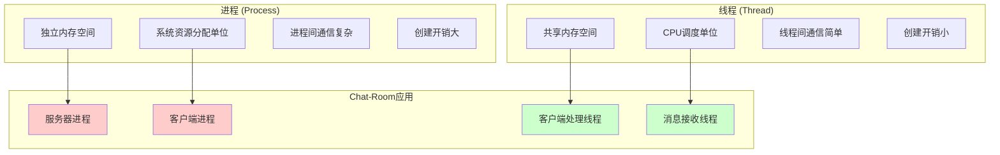

# 操作系统核心概念

## 🎯 学习目标

通过本节学习，您将能够：
- 理解进程和线程的概念及区别
- 掌握文件系统的基本操作
- 了解内存管理的基本原理
- 理解Chat-Room项目中操作系统概念的应用
- 学会使用Python进行系统编程

## 🔄 进程与线程

### 基本概念对比



### Chat-Room中的并发编程

```python
"""
Chat-Room项目中的进程和线程应用
展示操作系统并发概念的实际应用
"""

import threading
import multiprocessing
import queue
import time
import os
import psutil
from typing import Dict, List
from shared.logger import get_logger

logger = get_logger("os.concurrency")

class ConcurrencyDemo:
    """并发编程演示"""
    
    def __init__(self):
        self.thread_pool: List[threading.Thread] = []
        self.process_pool: List[multiprocessing.Process] = []
        self.message_queue = queue.Queue()
        self.thread_lock = threading.Lock()
    
    def demonstrate_threading(self):
        """演示多线程编程 - Chat-Room服务器模型"""
        
        print("=== 多线程演示 ===")
        
        def client_handler(client_id: int, duration: int):
            """模拟客户端处理线程"""
            thread_name = threading.current_thread().name
            process_id = os.getpid()
            
            logger.info(f"线程 {thread_name} (PID: {process_id}) 开始处理客户端 {client_id}")
            
            # 模拟处理时间
            for i in range(duration):
                time.sleep(1)
                
                # 线程安全的日志记录
                with self.thread_lock:
                    logger.debug(f"客户端 {client_id} 处理进度: {i+1}/{duration}")
            
            logger.info(f"客户端 {client_id} 处理完成")
        
        # 创建多个客户端处理线程
        client_count = 3
        for i in range(client_count):
            thread = threading.Thread(
                target=client_handler,
                args=(i, 3),
                name=f"ClientHandler-{i}"
            )
            self.thread_pool.append(thread)
            thread.start()
        
        # 等待所有线程完成
        for thread in self.thread_pool:
            thread.join()
        
        logger.info("所有客户端处理线程完成")
    
    def demonstrate_multiprocessing(self):
        """演示多进程编程"""
        
        print("\n=== 多进程演示 ===")
        
        def worker_process(worker_id: int, shared_queue: multiprocessing.Queue):
            """工作进程"""
            process_id = os.getpid()
            logger.info(f"工作进程 {worker_id} 启动 (PID: {process_id})")
            
            # 处理队列中的任务
            while True:
                try:
                    task = shared_queue.get(timeout=2)
                    if task is None:  # 结束信号
                        break
                    
                    logger.info(f"进程 {worker_id} 处理任务: {task}")
                    time.sleep(1)  # 模拟处理时间
                    
                except queue.Empty:
                    break
            
            logger.info(f"工作进程 {worker_id} 结束")
        
        # 创建进程间通信队列
        shared_queue = multiprocessing.Queue()
        
        # 添加任务到队列
        for i in range(6):
            shared_queue.put(f"Task-{i}")
        
        # 创建工作进程
        process_count = 2
        for i in range(process_count):
            process = multiprocessing.Process(
                target=worker_process,
                args=(i, shared_queue)
            )
            self.process_pool.append(process)
            process.start()
        
        # 发送结束信号
        for _ in range(process_count):
            shared_queue.put(None)
        
        # 等待所有进程完成
        for process in self.process_pool:
            process.join()
        
        logger.info("所有工作进程完成")
    
    def demonstrate_thread_synchronization(self):
        """演示线程同步机制"""
        
        print("\n=== 线程同步演示 ===")
        
        # 共享资源
        shared_counter = {"value": 0}
        
        def increment_counter(thread_id: int, iterations: int):
            """增加计数器 - 演示竞态条件"""
            for _ in range(iterations):
                # 不安全的操作（可能导致竞态条件）
                current_value = shared_counter["value"]
                time.sleep(0.0001)  # 模拟处理时间
                shared_counter["value"] = current_value + 1
        
        def safe_increment_counter(thread_id: int, iterations: int, lock: threading.Lock):
            """安全的增加计数器 - 使用锁"""
            for _ in range(iterations):
                with lock:  # 线程安全
                    current_value = shared_counter["value"]
                    time.sleep(0.0001)
                    shared_counter["value"] = current_value + 1
        
        # 测试不安全的并发访问
        shared_counter["value"] = 0
        threads = []
        
        for i in range(3):
            thread = threading.Thread(target=increment_counter, args=(i, 100))
            threads.append(thread)
            thread.start()
        
        for thread in threads:
            thread.join()
        
        logger.info(f"不安全并发结果: {shared_counter['value']} (期望: 300)")
        
        # 测试安全的并发访问
        shared_counter["value"] = 0
        threads = []
        lock = threading.Lock()
        
        for i in range(3):
            thread = threading.Thread(target=safe_increment_counter, args=(i, 100, lock))
            threads.append(thread)
            thread.start()
        
        for thread in threads:
            thread.join()
        
        logger.info(f"安全并发结果: {shared_counter['value']} (期望: 300)")
    
    def monitor_system_resources(self):
        """监控系统资源使用"""
        
        print("\n=== 系统资源监控 ===")
        
        # 获取当前进程信息
        current_process = psutil.Process()
        
        # CPU使用率
        cpu_percent = current_process.cpu_percent(interval=1)
        
        # 内存使用情况
        memory_info = current_process.memory_info()
        memory_percent = current_process.memory_percent()
        
        # 线程数量
        thread_count = current_process.num_threads()
        
        # 文件描述符数量
        try:
            fd_count = current_process.num_fds()  # Linux/macOS
        except AttributeError:
            fd_count = current_process.num_handles()  # Windows
        
        logger.info(f"进程资源使用情况:")
        logger.info(f"  PID: {current_process.pid}")
        logger.info(f"  CPU使用率: {cpu_percent:.1f}%")
        logger.info(f"  内存使用: {memory_info.rss / 1024 / 1024:.2f} MB ({memory_percent:.1f}%)")
        logger.info(f"  线程数: {thread_count}")
        logger.info(f"  文件描述符: {fd_count}")

# 使用示例
if __name__ == "__main__":
    demo = ConcurrencyDemo()
    
    # 演示多线程
    demo.demonstrate_threading()
    
    # 演示多进程
    demo.demonstrate_multiprocessing()
    
    # 演示线程同步
    demo.demonstrate_thread_synchronization()
    
    # 监控系统资源
    demo.monitor_system_resources()
```

## 📁 文件系统操作

### 文件和目录管理

```python
"""
Chat-Room项目中的文件系统操作
展示文件系统概念的实际应用
"""

import os
import shutil
import pathlib
import stat
import time
from typing import List, Dict, Optional

class FileSystemDemo:
    """文件系统操作演示"""
    
    def __init__(self):
        self.chat_data_dir = "server/data"
        self.log_dir = "logs"
        self.config_dir = "config"
    
    def demonstrate_path_operations(self):
        """演示路径操作"""
        
        print("=== 路径操作演示 ===")
        
        # 使用pathlib进行路径操作（推荐方式）
        project_root = pathlib.Path.cwd()
        data_dir = project_root / "server" / "data"
        db_file = data_dir / "chatroom.db"
        
        logger.info(f"项目根目录: {project_root}")
        logger.info(f"数据目录: {data_dir}")
        logger.info(f"数据库文件: {db_file}")
        
        # 路径信息
        logger.info(f"数据库文件名: {db_file.name}")
        logger.info(f"文件扩展名: {db_file.suffix}")
        logger.info(f"父目录: {db_file.parent}")
        logger.info(f"绝对路径: {db_file.absolute()}")
        
        # 检查路径状态
        logger.info(f"数据目录存在: {data_dir.exists()}")
        logger.info(f"数据库文件存在: {db_file.exists()}")
        logger.info(f"是否为目录: {data_dir.is_dir()}")
        logger.info(f"是否为文件: {db_file.is_file()}")
    
    def demonstrate_directory_operations(self):
        """演示目录操作"""
        
        print("\n=== 目录操作演示 ===")
        
        # 创建目录结构
        directories = [
            "temp/chat_demo",
            "temp/chat_demo/logs",
            "temp/chat_demo/data",
            "temp/chat_demo/config"
        ]
        
        for dir_path in directories:
            path = pathlib.Path(dir_path)
            path.mkdir(parents=True, exist_ok=True)
            logger.info(f"创建目录: {path}")
        
        # 列出目录内容
        temp_dir = pathlib.Path("temp/chat_demo")
        if temp_dir.exists():
            logger.info(f"\n目录内容 ({temp_dir}):")
            for item in temp_dir.iterdir():
                item_type = "目录" if item.is_dir() else "文件"
                logger.info(f"  {item.name} ({item_type})")
        
        # 递归列出所有文件
        logger.info(f"\n递归列出所有内容:")
        for item in temp_dir.rglob("*"):
            relative_path = item.relative_to(temp_dir)
            item_type = "目录" if item.is_dir() else "文件"
            logger.info(f"  {relative_path} ({item_type})")
    
    def demonstrate_file_operations(self):
        """演示文件操作"""
        
        print("\n=== 文件操作演示 ===")
        
        # 创建测试文件
        test_file = pathlib.Path("temp/chat_demo/test.txt")
        
        # 写入文件
        content = "Chat-Room 测试文件\n创建时间: " + time.strftime("%Y-%m-%d %H:%M:%S")
        test_file.write_text(content, encoding="utf-8")
        logger.info(f"创建文件: {test_file}")
        
        # 读取文件
        read_content = test_file.read_text(encoding="utf-8")
        logger.info(f"文件内容: {read_content}")
        
        # 文件信息
        stat_info = test_file.stat()
        logger.info(f"文件大小: {stat_info.st_size} 字节")
        logger.info(f"创建时间: {time.ctime(stat_info.st_ctime)}")
        logger.info(f"修改时间: {time.ctime(stat_info.st_mtime)}")
        logger.info(f"访问时间: {time.ctime(stat_info.st_atime)}")
        
        # 文件权限
        mode = stat_info.st_mode
        logger.info(f"文件权限: {stat.filemode(mode)}")
        
        # 复制文件
        backup_file = pathlib.Path("temp/chat_demo/test_backup.txt")
        shutil.copy2(test_file, backup_file)
        logger.info(f"复制文件: {test_file} -> {backup_file}")
    
    def demonstrate_file_permissions(self):
        """演示文件权限操作"""
        
        print("\n=== 文件权限演示 ===")
        
        test_file = pathlib.Path("temp/chat_demo/permission_test.txt")
        test_file.write_text("权限测试文件", encoding="utf-8")
        
        # 获取当前权限
        current_mode = test_file.stat().st_mode
        logger.info(f"当前权限: {stat.filemode(current_mode)}")
        
        # 修改权限（仅在Unix系统上有效）
        if os.name != 'nt':  # 非Windows系统
            # 设置为只读
            test_file.chmod(stat.S_IRUSR | stat.S_IRGRP | stat.S_IROTH)
            new_mode = test_file.stat().st_mode
            logger.info(f"修改后权限: {stat.filemode(new_mode)}")
            
            # 恢复写权限
            test_file.chmod(stat.S_IRUSR | stat.S_IWUSR | stat.S_IRGRP | stat.S_IROTH)
            final_mode = test_file.stat().st_mode
            logger.info(f"恢复后权限: {stat.filemode(final_mode)}")
    
    def cleanup_demo_files(self):
        """清理演示文件"""
        
        temp_dir = pathlib.Path("temp")
        if temp_dir.exists():
            shutil.rmtree(temp_dir)
            logger.info("清理演示文件完成")

# 使用示例
if __name__ == "__main__":
    fs_demo = FileSystemDemo()
    
    try:
        fs_demo.demonstrate_path_operations()
        fs_demo.demonstrate_directory_operations()
        fs_demo.demonstrate_file_operations()
        fs_demo.demonstrate_file_permissions()
    finally:
        fs_demo.cleanup_demo_files()
```

## 💾 内存管理基础

### 内存使用监控

```python
"""
内存管理概念演示
"""

import gc
import sys
import psutil
import tracemalloc
from typing import Any, List

class MemoryManagementDemo:
    """内存管理演示"""
    
    def __init__(self):
        self.large_objects: List[Any] = []
    
    def demonstrate_memory_usage(self):
        """演示内存使用监控"""
        
        print("=== 内存使用监控 ===")
        
        # 启动内存跟踪
        tracemalloc.start()
        
        # 获取当前内存使用
        process = psutil.Process()
        memory_info = process.memory_info()
        
        logger.info(f"当前内存使用:")
        logger.info(f"  RSS (物理内存): {memory_info.rss / 1024 / 1024:.2f} MB")
        logger.info(f"  VMS (虚拟内存): {memory_info.vms / 1024 / 1024:.2f} MB")
        
        # 创建大量对象
        logger.info("创建大量对象...")
        for i in range(100000):
            self.large_objects.append(f"Object-{i}" * 10)
        
        # 检查内存使用变化
        new_memory_info = process.memory_info()
        memory_increase = (new_memory_info.rss - memory_info.rss) / 1024 / 1024
        
        logger.info(f"创建对象后内存使用:")
        logger.info(f"  RSS: {new_memory_info.rss / 1024 / 1024:.2f} MB")
        logger.info(f"  内存增加: {memory_increase:.2f} MB")
        
        # 获取内存跟踪信息
        current, peak = tracemalloc.get_traced_memory()
        logger.info(f"Python内存跟踪:")
        logger.info(f"  当前: {current / 1024 / 1024:.2f} MB")
        logger.info(f"  峰值: {peak / 1024 / 1024:.2f} MB")
        
        # 清理对象
        self.large_objects.clear()
        gc.collect()  # 强制垃圾回收
        
        final_memory_info = process.memory_info()
        logger.info(f"清理后内存使用:")
        logger.info(f"  RSS: {final_memory_info.rss / 1024 / 1024:.2f} MB")
        
        tracemalloc.stop()

# 使用示例
if __name__ == "__main__":
    memory_demo = MemoryManagementDemo()
    memory_demo.demonstrate_memory_usage()
```

## 📋 学习检查清单

完成本节学习后，请确认您能够：

- [ ] 理解进程和线程的概念及区别
- [ ] 掌握Python多线程编程基础
- [ ] 了解线程同步机制（锁、信号量等）
- [ ] 掌握文件系统的基本操作
- [ ] 理解文件权限和安全概念
- [ ] 了解内存管理的基本原理
- [ ] 能够监控系统资源使用情况
- [ ] 理解Chat-Room项目中操作系统概念的应用

## 🔗 相关资源

- [Python threading文档](https://docs.python.org/3/library/threading.html)
- [Python multiprocessing文档](https://docs.python.org/3/library/multiprocessing.html)
- [Python pathlib文档](https://docs.python.org/3/library/pathlib.html)
- [psutil系统监控库](https://psutil.readthedocs.io/)

## 📚 下一步

操作系统基础学习完成后，请继续学习：
- [数据库与数据结构基础](database-data-structures.md)

---

**掌握操作系统概念，为系统编程打下基础！** 💻
