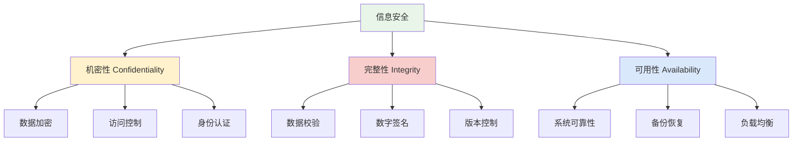
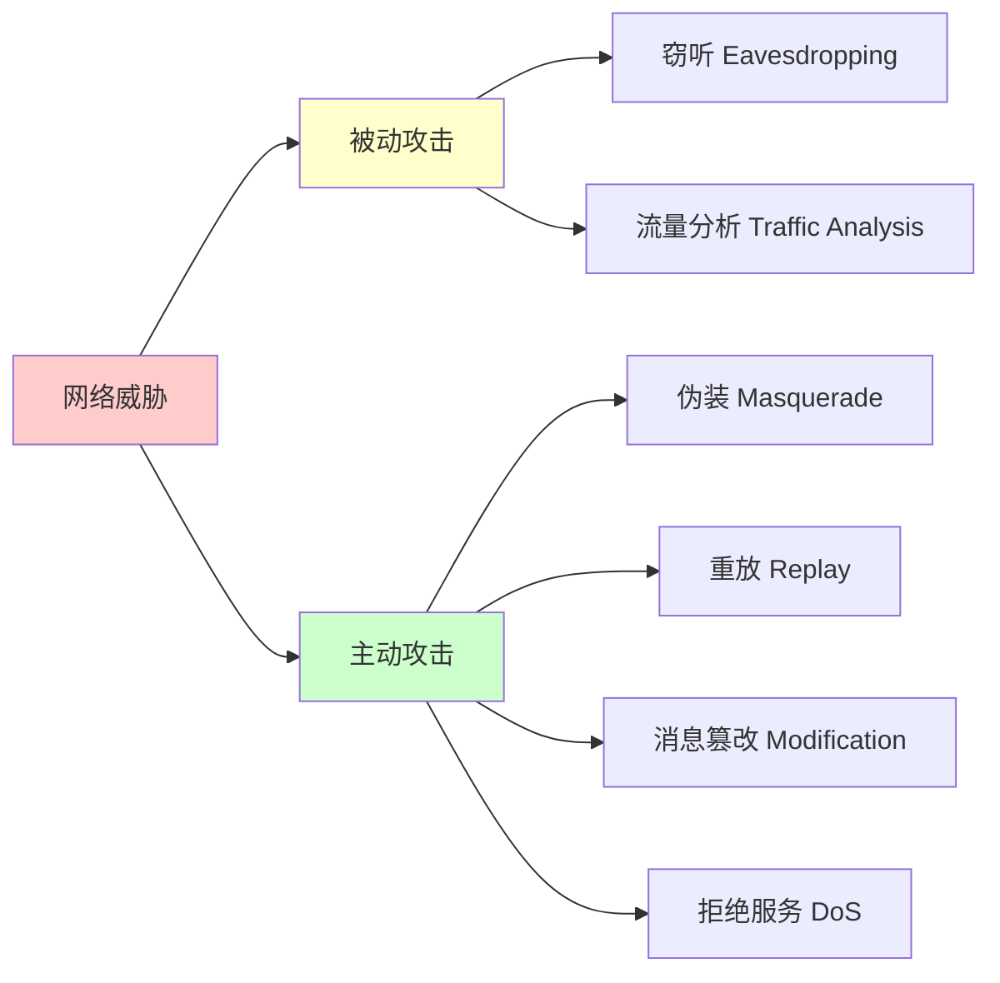
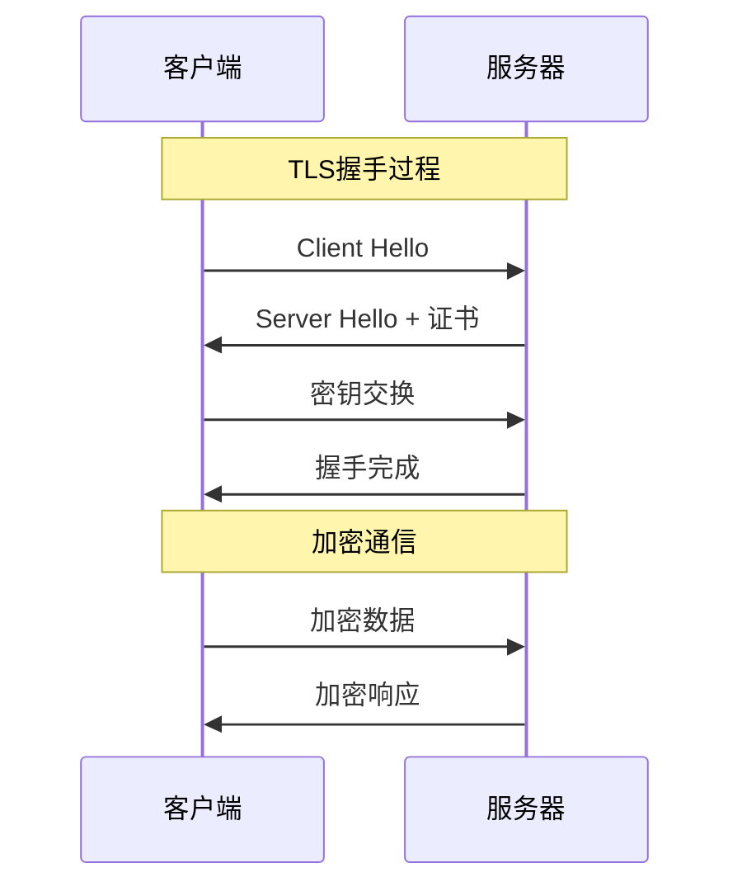
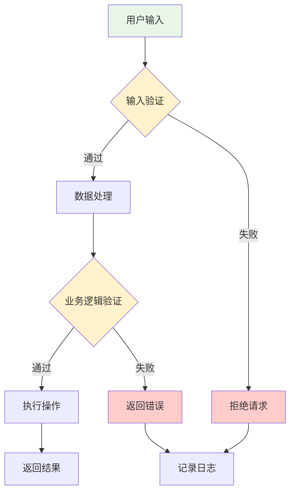
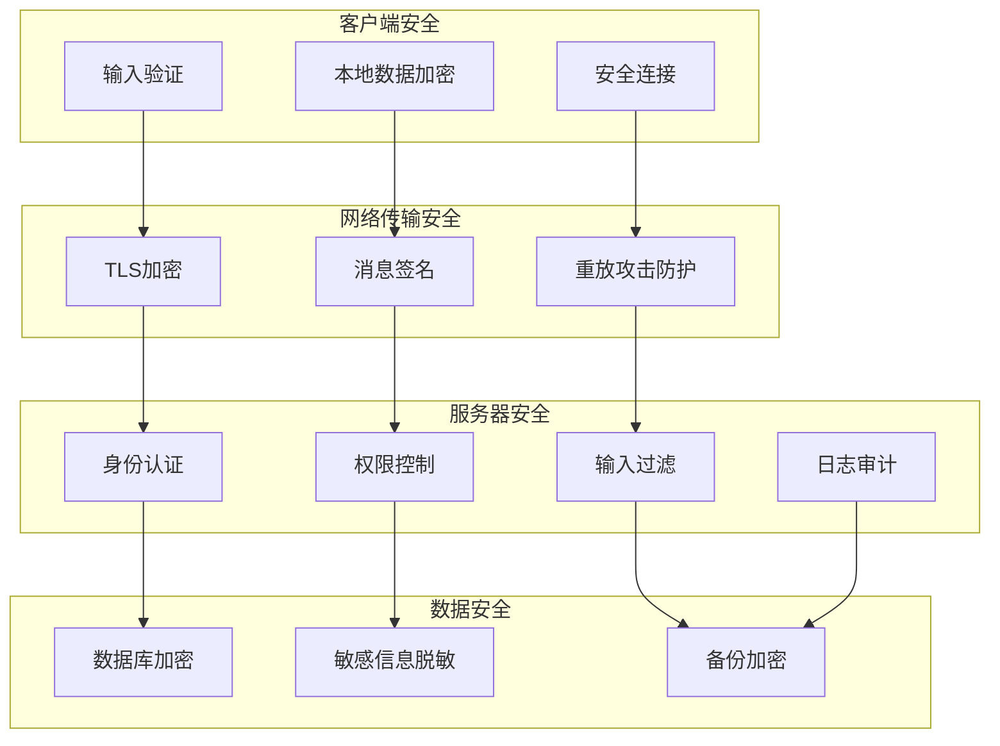
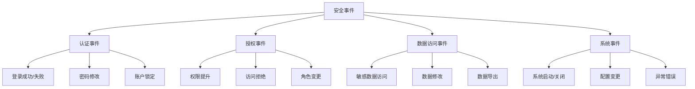

# 安全基础概念

## 🎯 学习目标

通过本节学习，您将能够：
- 理解信息安全的基本概念和重要性
- 掌握网络安全的基础知识
- 了解常见的安全威胁和防护措施
- 学会在Chat-Room项目中应用安全最佳实践
- 建立安全意识和防护思维

## 📖 内容概览

信息安全是现代软件开发中不可忽视的重要环节。本节将从基础概念开始，介绍网络安全、数据安全、应用安全等方面的知识，并结合Chat-Room项目的实际需求，讲解如何在开发过程中融入安全考虑。

## 🔐 信息安全基础

### 安全三要素（CIA三元组）



#### 1. 机密性（Confidentiality）
确保信息只能被授权的人员访问，防止敏感数据泄露。

**Chat-Room应用场景：**
- 用户密码加密存储
- 私聊消息端到端加密
- 管理员权限控制

#### 2. 完整性（Integrity）
确保信息在传输和存储过程中不被篡改，保持数据的准确性和完整性。

**Chat-Room应用场景：**
- 消息传输完整性校验
- 用户数据一致性检查
- 文件传输校验和验证

#### 3. 可用性（Availability）
确保授权用户能够及时、可靠地访问信息和服务。

**Chat-Room应用场景：**
- 服务器高可用性设计
- 数据库备份和恢复
- 网络连接稳定性保障

## 🌐 网络安全基础

### 常见网络威胁



#### 1. 被动攻击
攻击者监听网络通信，但不修改数据。

**防护措施：**
- 数据加密传输
- 使用HTTPS/TLS协议
- 网络流量混淆

#### 2. 主动攻击
攻击者主动干预网络通信，修改、插入或删除数据。

**防护措施：**
- 身份认证机制
- 数字签名验证
- 访问控制列表

### 网络安全协议



## 🔒 应用安全实践

### 1. 身份认证与授权

#### 认证方式对比

| 认证方式 | 安全级别 | 实现复杂度 | Chat-Room适用性 |
|----------|----------|------------|-----------------|
| 用户名密码 | 中等 | 简单 | ✅ 基础认证 |
| 令牌认证 | 高 | 中等 | ✅ 会话管理 |
| 双因子认证 | 很高 | 复杂 | ⚠️ 高级功能 |
| 生物识别 | 很高 | 很复杂 | ❌ 不适用 |

#### 实现示例：安全的密码处理

```python
import hashlib
import secrets
import hmac

class PasswordSecurity:
    """密码安全处理类"""
    
    @staticmethod
    def generate_salt():
        """生成随机盐值"""
        return secrets.token_hex(32)
    
    @staticmethod
    def hash_password(password: str, salt: str) -> str:
        """使用盐值哈希密码"""
        # 使用PBKDF2算法增强安全性
        return hashlib.pbkdf2_hmac(
            'sha256',
            password.encode('utf-8'),
            salt.encode('utf-8'),
            100000  # 迭代次数
        ).hex()
    
    @staticmethod
    def verify_password(password: str, salt: str, hashed: str) -> bool:
        """验证密码"""
        return hmac.compare_digest(
            hashed,
            PasswordSecurity.hash_password(password, salt)
        )

# 使用示例
def register_user(username: str, password: str):
    """用户注册时的密码处理"""
    salt = PasswordSecurity.generate_salt()
    hashed_password = PasswordSecurity.hash_password(password, salt)
    
    # 存储到数据库：用户名、盐值、哈希密码
    save_to_database(username, salt, hashed_password)

def login_user(username: str, password: str) -> bool:
    """用户登录时的密码验证"""
    user_data = get_from_database(username)
    if not user_data:
        return False
    
    salt, stored_hash = user_data['salt'], user_data['password_hash']
    return PasswordSecurity.verify_password(password, salt, stored_hash)
```

### 2. 输入验证与过滤

#### 输入验证策略



#### 实现示例：消息内容过滤

```python
import re
import html
from typing import List, Optional

class MessageValidator:
    """消息验证和过滤类"""
    
    # 危险字符模式
    DANGEROUS_PATTERNS = [
        r'<script.*?>.*?</script>',  # JavaScript代码
        r'javascript:',              # JavaScript协议
        r'on\w+\s*=',               # 事件处理器
        r'<iframe.*?>',             # 内嵌框架
    ]
    
    # 敏感词列表（示例）
    SENSITIVE_WORDS = ['敏感词1', '敏感词2']
    
    @classmethod
    def validate_message(cls, message: str) -> dict:
        """验证消息内容"""
        result = {
            'is_valid': True,
            'filtered_message': message,
            'warnings': []
        }
        
        # 1. 长度检查
        if len(message) > 1000:
            result['is_valid'] = False
            result['warnings'].append('消息长度超过限制')
            return result
        
        # 2. 危险内容检查
        for pattern in cls.DANGEROUS_PATTERNS:
            if re.search(pattern, message, re.IGNORECASE):
                result['is_valid'] = False
                result['warnings'].append('包含危险内容')
                return result
        
        # 3. HTML转义
        filtered_message = html.escape(message)
        
        # 4. 敏感词过滤
        for word in cls.SENSITIVE_WORDS:
            if word in filtered_message:
                filtered_message = filtered_message.replace(word, '*' * len(word))
                result['warnings'].append('包含敏感词，已过滤')
        
        result['filtered_message'] = filtered_message
        return result

# 使用示例
def process_user_message(user_id: int, message: str):
    """处理用户消息"""
    validation_result = MessageValidator.validate_message(message)
    
    if not validation_result['is_valid']:
        # 记录安全日志
        log_security_event(user_id, 'invalid_message', validation_result['warnings'])
        return {'error': '消息内容不符合规范'}
    
    # 使用过滤后的消息
    filtered_message = validation_result['filtered_message']
    
    # 继续处理消息...
    return {'success': True, 'message': filtered_message}
```

## 🛡️ Chat-Room项目安全实践

### 安全架构设计



### 安全配置管理

```python
# config/security_config.py
class SecurityConfig:
    """安全配置类"""
    
    # 密码策略
    PASSWORD_MIN_LENGTH = 8
    PASSWORD_REQUIRE_UPPERCASE = True
    PASSWORD_REQUIRE_LOWERCASE = True
    PASSWORD_REQUIRE_DIGITS = True
    PASSWORD_REQUIRE_SPECIAL = True
    
    # 会话管理
    SESSION_TIMEOUT = 3600  # 1小时
    MAX_LOGIN_ATTEMPTS = 5
    LOCKOUT_DURATION = 900  # 15分钟
    
    # 消息安全
    MAX_MESSAGE_LENGTH = 1000
    ENABLE_MESSAGE_ENCRYPTION = True
    ENABLE_CONTENT_FILTER = True
    
    # 文件传输安全
    MAX_FILE_SIZE = 10 * 1024 * 1024  # 10MB
    ALLOWED_FILE_TYPES = ['.txt', '.jpg', '.png', '.pdf']
    ENABLE_VIRUS_SCAN = False  # 生产环境建议启用
    
    # 日志安全
    LOG_SENSITIVE_DATA = False
    ENABLE_SECURITY_AUDIT = True
    
    @classmethod
    def validate_password(cls, password: str) -> List[str]:
        """验证密码强度"""
        errors = []
        
        if len(password) < cls.PASSWORD_MIN_LENGTH:
            errors.append(f'密码长度至少{cls.PASSWORD_MIN_LENGTH}位')
        
        if cls.PASSWORD_REQUIRE_UPPERCASE and not re.search(r'[A-Z]', password):
            errors.append('密码必须包含大写字母')
        
        if cls.PASSWORD_REQUIRE_LOWERCASE and not re.search(r'[a-z]', password):
            errors.append('密码必须包含小写字母')
        
        if cls.PASSWORD_REQUIRE_DIGITS and not re.search(r'\d', password):
            errors.append('密码必须包含数字')
        
        if cls.PASSWORD_REQUIRE_SPECIAL and not re.search(r'[!@#$%^&*(),.?":{}|<>]', password):
            errors.append('密码必须包含特殊字符')
        
        return errors
```

## 📊 安全监控与审计

### 安全事件分类



## 🔍 安全测试

### 安全测试类型

1. **静态安全测试（SAST）**
   - 代码安全扫描
   - 依赖漏洞检查
   - 配置安全审查

2. **动态安全测试（DAST）**
   - 渗透测试
   - 漏洞扫描
   - 模糊测试

3. **交互式安全测试（IAST）**
   - 运行时安全监控
   - 实时漏洞检测
   - 安全性能分析

## 📚 安全最佳实践

### 开发阶段
- [ ] 遵循安全编码规范
- [ ] 实施输入验证和输出编码
- [ ] 使用安全的加密算法
- [ ] 定期更新依赖库

### 部署阶段
- [ ] 配置安全的网络环境
- [ ] 启用访问控制和审计
- [ ] 定期备份和恢复测试
- [ ] 监控系统安全状态

### 运维阶段
- [ ] 定期安全评估
- [ ] 及时应用安全补丁
- [ ] 监控异常行为
- [ ] 制定应急响应计划

## 🎯 实践练习

1. **密码安全实现**：为Chat-Room实现安全的用户密码存储和验证机制
2. **消息过滤系统**：开发消息内容安全过滤功能
3. **访问控制**：实现基于角色的权限控制系统
4. **安全日志**：设计和实现安全事件日志记录

## 📖 扩展阅读

- OWASP Top 10 安全风险
- 《Web应用安全权威指南》
- Python安全编程最佳实践
- 网络安全基础教程

---

**安全是软件开发的重要基石，从设计阶段就要考虑安全因素！** 🔐


## 📖 导航

⬅️ **上一节：** [Socket Programming](socket-programming.md)

📚 **返回：** [第3章：计算机基础](README.md)

🏠 **主页：** [学习路径总览](../README.md)
*本节最后更新：2025-01-17*
