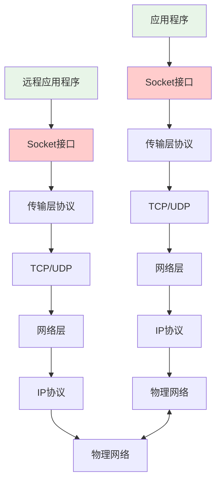

# Socket编程原理与实践

## 🎯 学习目标

通过本节学习，您将能够：
- 深入理解Socket编程的基本概念
- 掌握Python Socket API的使用方法
- 学会实现基本的客户端-服务器通信
- 理解Chat-Room项目中Socket编程的应用
- 掌握Socket编程的最佳实践和错误处理

## 🔌 Socket基础概念

### 什么是Socket？




## 📖 导航

⬅️ **上一节：** [Encoding And Charset](encoding-and-charset.md)

➡️ **下一节：** [Security Basics](security-basics.md)

📚 **返回：** [第3章：计算机基础](README.md)

🏠 **主页：** [学习路径总览](../README.md)
**Socket的作用**：
- **网络编程接口**：应用程序与网络协议栈的接口
- **通信端点**：网络通信的两个端点
- **抽象层**：隐藏底层网络协议的复杂性
- **标准化接口**：跨平台的网络编程标准

### Socket类型

```python
"""
Socket类型详解
以Chat-Room项目为例说明不同Socket类型的应用
"""

import socket
from enum import Enum

class SocketTypeDemo:
    """Socket类型演示"""

    def __init__(self):
        self.socket_types = {
            "TCP Socket": {
                "类型": socket.SOCK_STREAM,
                "协议": socket.IPPROTO_TCP,
                "特点": ["可靠传输", "面向连接", "有序传输", "流控制"],
                "适用场景": ["聊天消息", "文件传输", "Web服务"],
                "Chat-Room应用": "主要通信方式"
            },
            "UDP Socket": {
                "类型": socket.SOCK_DGRAM,
                "协议": socket.IPPROTO_UDP,
                "特点": ["不可靠传输", "无连接", "快速传输", "无流控制"],
                "适用场景": ["实时游戏", "视频流", "DNS查询"],
                "Chat-Room应用": "可用于心跳检测"
            },
            "Raw Socket": {
                "类型": socket.SOCK_RAW,
                "协议": socket.IPPROTO_RAW,
                "特点": ["直接访问IP层", "需要管理员权限", "完全控制"],
                "适用场景": ["网络监控", "协议分析", "安全工具"],
                "Chat-Room应用": "网络诊断工具"
            }
        }

    def demonstrate_socket_types(self):
        """演示不同Socket类型"""
        print("Socket类型对比:")
        for sock_type, details in self.socket_types.items():
            print(f"\n{sock_type}:")
            for key, value in details.items():
                if isinstance(value, list):
                    print(f"  {key}: {', '.join(value)}")
                else:
                    print(f"  {key}: {value}")

    def create_tcp_socket_example(self):
        """创建TCP Socket示例"""

        # 创建TCP Socket
        tcp_socket = socket.socket(socket.AF_INET, socket.SOCK_STREAM)

        # Socket选项设置
        tcp_socket.setsockopt(socket.SOL_SOCKET, socket.SO_REUSEADDR, 1)

        print("\nTCP Socket创建成功:")
        print(f"  地址族: {tcp_socket.family}")
        print(f"  Socket类型: {tcp_socket.type}")
        print(f"  协议: {tcp_socket.proto}")

        tcp_socket.close()
        return tcp_socket

    def create_udp_socket_example(self):
        """创建UDP Socket示例"""

        # 创建UDP Socket
        udp_socket = socket.socket(socket.AF_INET, socket.SOCK_DGRAM)

        print("\nUDP Socket创建成功:")
        print(f"  地址族: {udp_socket.family}")
        print(f"  Socket类型: {udp_socket.type}")
        print(f"  协议: {udp_socket.proto}")

        udp_socket.close()
        return udp_socket

if __name__ == "__main__":
    demo = SocketTypeDemo()
    demo.demonstrate_socket_types()
    demo.create_tcp_socket_example()
    demo.create_udp_socket_example()
```

## 🖥️ 服务器端Socket编程

### 基本服务器实现

```python
"""
Chat-Room服务器Socket编程实现
展示完整的服务器端Socket编程流程
"""

import socket
import threading
import json
import time
from typing import Dict, List, Optional
from shared.logger import get_logger

logger = get_logger("socket.server")

class ChatRoomSocketServer:
    """Chat-Room Socket服务器"""

    def __init__(self, host: str = "localhost", port: int = 8888):
        self.host = host
        self.port = port
        self.server_socket: Optional[socket.socket] = None
        self.running = False

        # 客户端管理
        self.clients: Dict[str, socket.socket] = {}
        self.client_threads: Dict[str, threading.Thread] = {}
        self.clients_lock = threading.Lock()

        # 消息处理
        self.message_handlers = {
            "login": self.handle_login,
            "chat": self.handle_chat_message,
            "logout": self.handle_logout
        }

    def start_server(self):
        """启动服务器 - Socket编程核心流程"""

        try:
            # 1. 创建Socket
            self.server_socket = socket.socket(socket.AF_INET, socket.SOCK_STREAM)
            logger.info("服务器Socket创建成功")

            # 2. 设置Socket选项
            self.server_socket.setsockopt(socket.SOL_SOCKET, socket.SO_REUSEADDR, 1)
            logger.info("Socket选项设置完成")

            # 3. 绑定地址和端口
            self.server_socket.bind((self.host, self.port))
            logger.info(f"Socket绑定成功: {self.host}:{self.port}")

            # 4. 开始监听
            self.server_socket.listen(5)  # 最多5个等待连接
            logger.info("服务器开始监听连接...")

            self.running = True

            # 5. 接受连接循环
            while self.running:
                try:
                    # 接受客户端连接
                    client_socket, client_address = self.server_socket.accept()

                    # 生成客户端ID
                    client_id = f"{client_address[0]}:{client_address[1]}:{int(time.time())}"

                    logger.info(f"新客户端连接: {client_id}")

                    # 创建客户端处理线程
                    client_thread = threading.Thread(
                        target=self.handle_client,
                        args=(client_socket, client_id),
                        name=f"ClientHandler-{client_id}"
                    )
                    client_thread.daemon = True

                    # 保存客户端信息
                    with self.clients_lock:
                        self.clients[client_id] = client_socket
                        self.client_threads[client_id] = client_thread

                    # 启动客户端处理线程
                    client_thread.start()

                except socket.error as e:
                    if self.running:
                        logger.error(f"接受连接时出错: {e}")

        except Exception as e:
            logger.error(f"服务器启动失败: {e}")
            raise
        finally:
            self.stop_server()

    def handle_client(self, client_socket: socket.socket, client_id: str):
        """处理客户端连接 - 消息接收和处理"""

        try:
            while self.running:
                # 接收数据
                data = client_socket.recv(4096)

                if not data:
                    # 客户端断开连接
                    logger.info(f"客户端 {client_id} 断开连接")
                    break

                try:
                    # 解析JSON消息
                    message = json.loads(data.decode('utf-8'))
                    logger.debug(f"收到消息: {message} 来自 {client_id}")

                    # 处理消息
                    self.process_message(client_socket, client_id, message)

                except json.JSONDecodeError as e:
                    logger.error(f"消息解析失败: {e}")
                    self.send_error(client_socket, "消息格式错误")

        except socket.error as e:
            logger.error(f"处理客户端 {client_id} 时出错: {e}")
        finally:
            self.remove_client(client_id)

    def process_message(self, client_socket: socket.socket, client_id: str, message: dict):
        """处理客户端消息"""

        message_type = message.get("type")

        if message_type in self.message_handlers:
            handler = self.message_handlers[message_type]
            handler(client_socket, client_id, message)
        else:
            logger.warning(f"未知消息类型: {message_type}")
            self.send_error(client_socket, f"未知消息类型: {message_type}")

    def handle_login(self, client_socket: socket.socket, client_id: str, message: dict):
        """处理登录消息"""

        username = message.get("username")
        password = message.get("password")

        # 简单的登录验证（实际项目中应该查询数据库）
        if username and password:
            response = {
                "type": "login_response",
                "success": True,
                "message": f"欢迎 {username}！",
                "user_id": client_id
            }
            logger.info(f"用户 {username} 登录成功")
        else:
            response = {
                "type": "login_response",
                "success": False,
                "message": "用户名或密码不能为空"
            }

        self.send_message(client_socket, response)

    def handle_chat_message(self, client_socket: socket.socket, client_id: str, message: dict):
        """处理聊天消息"""

        content = message.get("content")
        username = message.get("username", "匿名用户")

        if content:
            # 广播消息给所有客户端
            broadcast_message = {
                "type": "chat_message",
                "username": username,
                "content": content,
                "timestamp": time.time()
            }

            self.broadcast_message(broadcast_message, exclude_client=client_id)
            logger.info(f"广播消息: {username}: {content}")
        else:
            self.send_error(client_socket, "消息内容不能为空")

    def handle_logout(self, client_socket: socket.socket, client_id: str, message: dict):
        """处理登出消息"""

        username = message.get("username", "用户")

        response = {
            "type": "logout_response",
            "success": True,
            "message": f"再见 {username}！"
        }

        self.send_message(client_socket, response)
        logger.info(f"用户 {username} 登出")

        # 关闭连接
        self.remove_client(client_id)

    def send_message(self, client_socket: socket.socket, message: dict):
        """发送消息给客户端"""

        try:
            message_data = json.dumps(message, ensure_ascii=False).encode('utf-8')
            client_socket.send(message_data)
            logger.debug(f"消息发送成功: {message}")
        except socket.error as e:
            logger.error(f"发送消息失败: {e}")

    def send_error(self, client_socket: socket.socket, error_message: str):
        """发送错误消息"""

        error_response = {
            "type": "error",
            "message": error_message
        }
        self.send_message(client_socket, error_response)

    def broadcast_message(self, message: dict, exclude_client: str = None):
        """广播消息给所有客户端"""

        with self.clients_lock:
            clients_to_remove = []

            for client_id, client_socket in self.clients.items():
                if client_id == exclude_client:
                    continue

                try:
                    self.send_message(client_socket, message)
                except socket.error:
                    # 客户端连接已断开
                    clients_to_remove.append(client_id)

            # 清理断开的客户端
            for client_id in clients_to_remove:
                self.remove_client(client_id)

    def remove_client(self, client_id: str):
        """移除客户端连接"""

        with self.clients_lock:
            if client_id in self.clients:
                try:
                    self.clients[client_id].close()
                except:
                    pass
                del self.clients[client_id]

            if client_id in self.client_threads:
                del self.client_threads[client_id]

        logger.info(f"客户端 {client_id} 已移除")

    def stop_server(self):
        """停止服务器"""

        logger.info("正在停止服务器...")
        self.running = False

        # 关闭所有客户端连接
        with self.clients_lock:
            for client_id in list(self.clients.keys()):
                self.remove_client(client_id)

        # 关闭服务器Socket
        if self.server_socket:
            try:
                self.server_socket.close()
                logger.info("服务器Socket已关闭")
            except:
                pass

        logger.info("服务器已停止")

## 💻 客户端Socket编程

### 基本客户端实现

```python
"""
Chat-Room客户端Socket编程实现
展示完整的客户端Socket编程流程
"""

import socket
import threading
import json
import time
from typing import Optional, Callable
from shared.logger import get_logger

logger = get_logger("socket.client")

class ChatRoomSocketClient:
    """Chat-Room Socket客户端"""

    def __init__(self, host: str = "localhost", port: int = 8888):
        self.host = host
        self.port = port
        self.client_socket: Optional[socket.socket] = None
        self.connected = False
        self.running = False

        # 消息处理
        self.message_handlers = {
            "login_response": self.handle_login_response,
            "chat_message": self.handle_chat_message,
            "logout_response": self.handle_logout_response,
            "error": self.handle_error
        }

        # 回调函数
        self.on_message_received: Optional[Callable] = None
        self.on_connection_lost: Optional[Callable] = None

    def connect_to_server(self) -> bool:
        """连接到服务器 - 客户端Socket编程核心流程"""

        try:
            # 1. 创建Socket
            self.client_socket = socket.socket(socket.AF_INET, socket.SOCK_STREAM)
            logger.info("客户端Socket创建成功")

            # 2. 设置连接超时
            self.client_socket.settimeout(10.0)  # 10秒超时

            # 3. 连接到服务器
            logger.info(f"正在连接服务器 {self.host}:{self.port}...")
            self.client_socket.connect((self.host, self.port))

            # 4. 连接成功
            self.connected = True
            self.running = True
            logger.info("服务器连接成功")

            # 5. 启动消息接收线程
            receive_thread = threading.Thread(
                target=self.receive_messages,
                name="MessageReceiver"
            )
            receive_thread.daemon = True
            receive_thread.start()

            return True

        except socket.timeout:
            logger.error("连接服务器超时")
            return False
        except socket.error as e:
            logger.error(f"连接服务器失败: {e}")
            return False
        except Exception as e:
            logger.error(f"连接过程中出现异常: {e}")
            return False

    def receive_messages(self):
        """接收服务器消息 - 后台线程"""

        try:
            while self.running and self.connected:
                try:
                    # 接收数据
                    data = self.client_socket.recv(4096)

                    if not data:
                        # 服务器关闭连接
                        logger.info("服务器关闭了连接")
                        break

                    try:
                        # 解析JSON消息
                        message = json.loads(data.decode('utf-8'))
                        logger.debug(f"收到服务器消息: {message}")

                        # 处理消息
                        self.process_message(message)

                    except json.JSONDecodeError as e:
                        logger.error(f"消息解析失败: {e}")

                except socket.timeout:
                    # 接收超时，继续循环
                    continue
                except socket.error as e:
                    logger.error(f"接收消息时出错: {e}")
                    break

        except Exception as e:
            logger.error(f"消息接收线程异常: {e}")
        finally:
            self.disconnect_from_server()

    def process_message(self, message: dict):
        """处理服务器消息"""

        message_type = message.get("type")

        if message_type in self.message_handlers:
            handler = self.message_handlers[message_type]
            handler(message)
        else:
            logger.warning(f"未知消息类型: {message_type}")

        # 调用回调函数
        if self.on_message_received:
            self.on_message_received(message)

    def handle_login_response(self, message: dict):
        """处理登录响应"""

        success = message.get("success", False)
        response_message = message.get("message", "")

        if success:
            logger.info(f"登录成功: {response_message}")
        else:
            logger.error(f"登录失败: {response_message}")

    def handle_chat_message(self, message: dict):
        """处理聊天消息"""

        username = message.get("username", "未知用户")
        content = message.get("content", "")
        timestamp = message.get("timestamp", time.time())

        # 格式化时间
        time_str = time.strftime("%H:%M:%S", time.localtime(timestamp))

        logger.info(f"[{time_str}] {username}: {content}")

    def handle_logout_response(self, message: dict):
        """处理登出响应"""

        response_message = message.get("message", "")
        logger.info(f"登出响应: {response_message}")

    def handle_error(self, message: dict):
        """处理错误消息"""

        error_message = message.get("message", "未知错误")
        logger.error(f"服务器错误: {error_message}")

    def send_message(self, message: dict) -> bool:
        """发送消息到服务器"""

        if not self.connected:
            logger.error("未连接到服务器")
            return False

        try:
            message_data = json.dumps(message, ensure_ascii=False).encode('utf-8')
            self.client_socket.send(message_data)
            logger.debug(f"消息发送成功: {message}")
            return True
        except socket.error as e:
            logger.error(f"发送消息失败: {e}")
            self.disconnect_from_server()
            return False

    def login(self, username: str, password: str) -> bool:
        """登录到服务器"""

        login_message = {
            "type": "login",
            "username": username,
            "password": password
        }

        return self.send_message(login_message)

    def send_chat_message(self, content: str, username: str = "匿名用户") -> bool:
        """发送聊天消息"""

        chat_message = {
            "type": "chat",
            "username": username,
            "content": content
        }

        return self.send_message(chat_message)

    def logout(self, username: str = "用户") -> bool:
        """从服务器登出"""

        logout_message = {
            "type": "logout",
            "username": username
        }

        return self.send_message(logout_message)

    def disconnect_from_server(self):
        """断开服务器连接"""

        logger.info("正在断开服务器连接...")
        self.running = False
        self.connected = False

        if self.client_socket:
            try:
                self.client_socket.close()
                logger.info("客户端Socket已关闭")
            except:
                pass
            self.client_socket = None

        # 调用连接丢失回调
        if self.on_connection_lost:
            self.on_connection_lost()

        logger.info("已断开服务器连接")

# 使用示例
if __name__ == "__main__":
    client = ChatRoomSocketClient("localhost", 8888)

    # 设置回调函数
    def on_message(message):
        print(f"收到消息: {message}")

    def on_disconnect():
        print("连接已断开")

    client.on_message_received = on_message
    client.on_connection_lost = on_disconnect

    # 连接服务器
    if client.connect_to_server():
        # 登录
        client.login("test_user", "password123")

        # 发送消息
        time.sleep(1)
        client.send_chat_message("Hello, Chat-Room!", "test_user")

        # 保持连接
        try:
            time.sleep(10)
        except KeyboardInterrupt:
            print("\n收到中断信号，正在断开连接...")
        finally:
            client.disconnect_from_server()
    else:
        print("连接服务器失败")
```

## 🔄 Socket编程最佳实践

### 错误处理和异常管理

```python
"""
Socket编程错误处理最佳实践
"""

import socket
import errno
import time
from typing import Optional

class RobustSocketClient:
    """健壮的Socket客户端实现"""

    def __init__(self, host: str, port: int):
        self.host = host
        self.port = port
        self.socket: Optional[socket.socket] = None
        self.max_retries = 3
        self.retry_delay = 2.0

    def connect_with_retry(self) -> bool:
        """带重试机制的连接"""

        for attempt in range(self.max_retries):
            try:
                logger.info(f"连接尝试 {attempt + 1}/{self.max_retries}")

                # 创建新的Socket
                self.socket = socket.socket(socket.AF_INET, socket.SOCK_STREAM)

                # 设置超时
                self.socket.settimeout(5.0)

                # 尝试连接
                self.socket.connect((self.host, self.port))

                logger.info("连接成功")
                return True

            except socket.timeout:
                logger.warning(f"连接超时 (尝试 {attempt + 1})")
            except socket.gaierror as e:
                logger.error(f"DNS解析失败: {e}")
                break  # DNS错误不需要重试
            except ConnectionRefusedError:
                logger.warning(f"连接被拒绝 (尝试 {attempt + 1})")
            except socket.error as e:
                logger.warning(f"连接失败: {e} (尝试 {attempt + 1})")

            # 清理Socket
            if self.socket:
                self.socket.close()
                self.socket = None

            # 等待后重试
            if attempt < self.max_retries - 1:
                time.sleep(self.retry_delay)

        logger.error("所有连接尝试都失败了")
        return False

    def send_with_retry(self, data: bytes) -> bool:
        """带重试机制的发送"""

        if not self.socket:
            logger.error("Socket未连接")
            return False

        total_sent = 0
        data_length = len(data)

        while total_sent < data_length:
            try:
                sent = self.socket.send(data[total_sent:])
                if sent == 0:
                    logger.error("Socket连接已断开")
                    return False
                total_sent += sent

            except socket.error as e:
                if e.errno == errno.EAGAIN or e.errno == errno.EWOULDBLOCK:
                    # 非阻塞Socket暂时不可写
                    time.sleep(0.1)
                    continue
                else:
                    logger.error(f"发送数据失败: {e}")
                    return False

        logger.debug(f"数据发送完成: {total_sent} 字节")
        return True

    def receive_with_timeout(self, buffer_size: int = 4096, timeout: float = 5.0) -> Optional[bytes]:
        """带超时的接收"""

        if not self.socket:
            logger.error("Socket未连接")
            return None

        try:
            # 设置接收超时
            self.socket.settimeout(timeout)

            data = self.socket.recv(buffer_size)

            if not data:
                logger.info("对方关闭了连接")
                return None

            return data

        except socket.timeout:
            logger.warning("接收数据超时")
            return None
        except socket.error as e:
            logger.error(f"接收数据失败: {e}")
            return None

    def close_gracefully(self):
        """优雅关闭连接"""

        if self.socket:
            try:
                # 关闭发送方向
                self.socket.shutdown(socket.SHUT_WR)

                # 接收剩余数据
                while True:
                    data = self.socket.recv(1024)
                    if not data:
                        break

            except socket.error:
                pass  # 忽略关闭时的错误
            finally:
                self.socket.close()
                self.socket = None
                logger.info("Socket已优雅关闭")

# 使用示例
if __name__ == "__main__":
    server = ChatRoomSocketServer("localhost", 8888)

    try:
        server.start_server()
    except KeyboardInterrupt:
        print("\n收到中断信号，正在停止服务器...")
        server.stop_server()
```
