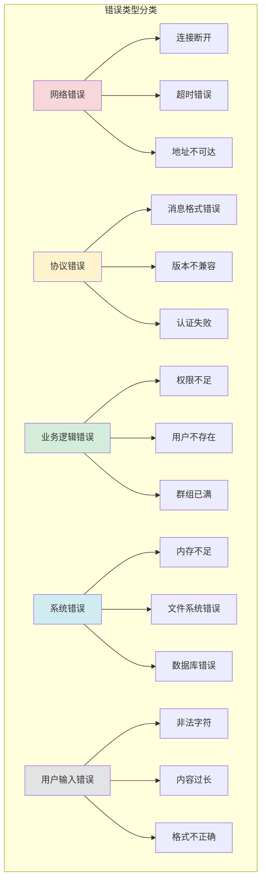

# 错误处理策略

## 🎯 学习目标

通过本章学习，您将能够：
- 理解网络应用中的各种错误类型和处理策略
- 掌握Python异常处理的最佳实践
- 学会设计健壮的错误恢复机制
- 在Chat-Room项目中应用完善的错误处理

## 🚨 错误类型分析

### Chat-Room中的错误分类



### 错误处理策略

```python
# shared/errors/error_strategy.py - 错误处理策略
from enum import Enum
from typing import Dict, Any, Optional, Callable
import logging
import traceback

class ErrorSeverity(Enum):
    """错误严重程度"""
    LOW = "low"          # 轻微错误，可以忽略
    MEDIUM = "medium"    # 中等错误，需要记录
    HIGH = "high"        # 严重错误，需要处理
    CRITICAL = "critical" # 致命错误，可能导致系统崩溃

class ErrorAction(Enum):
    """错误处理动作"""
    IGNORE = "ignore"           # 忽略错误
    LOG = "log"                # 记录错误
    RETRY = "retry"            # 重试操作
    FALLBACK = "fallback"      # 使用备用方案
    DISCONNECT = "disconnect"   # 断开连接
    SHUTDOWN = "shutdown"      # 关闭系统

class ChatRoomError(Exception):
    """Chat-Room基础异常类"""
    
    def __init__(self, message: str, error_code: str = None, 
                 severity: ErrorSeverity = ErrorSeverity.MEDIUM,
                 action: ErrorAction = ErrorAction.LOG,
                 details: Dict[str, Any] = None):
        super().__init__(message)
        self.message = message
        self.error_code = error_code
        self.severity = severity
        self.action = action
        self.details = details or {}
        self.timestamp = time.time()

class NetworkError(ChatRoomError):
    """网络相关错误"""
    
    def __init__(self, message: str, **kwargs):
        super().__init__(message, severity=ErrorSeverity.HIGH, 
                        action=ErrorAction.RETRY, **kwargs)

class ProtocolError(ChatRoomError):
    """协议相关错误"""
    
    def __init__(self, message: str, **kwargs):
        super().__init__(message, severity=ErrorSeverity.MEDIUM,
                        action=ErrorAction.DISCONNECT, **kwargs)

class BusinessLogicError(ChatRoomError):
    """业务逻辑错误"""
    
    def __init__(self, message: str, **kwargs):
        super().__init__(message, severity=ErrorSeverity.LOW,
                        action=ErrorAction.LOG, **kwargs)

class SystemError(ChatRoomError):
    """系统级错误"""
    
    def __init__(self, message: str, **kwargs):
        super().__init__(message, severity=ErrorSeverity.CRITICAL,
                        action=ErrorAction.SHUTDOWN, **kwargs)

class ErrorHandler:
    """
    统一错误处理器
    
    负责处理所有类型的错误，实现统一的错误处理策略
    """
    
    def __init__(self):
        self.logger = logging.getLogger('ChatRoom.ErrorHandler')
        self.error_stats = {
            'total_errors': 0,
            'errors_by_type': {},
            'errors_by_severity': {}
        }
        
        # 错误处理器映射
        self.action_handlers: Dict[ErrorAction, Callable] = {
            ErrorAction.IGNORE: self._handle_ignore,
            ErrorAction.LOG: self._handle_log,
            ErrorAction.RETRY: self._handle_retry,
            ErrorAction.FALLBACK: self._handle_fallback,
            ErrorAction.DISCONNECT: self._handle_disconnect,
            ErrorAction.SHUTDOWN: self._handle_shutdown
        }
    
    def handle_error(self, error: Exception, context: Dict[str, Any] = None) -> bool:
        """
        处理错误
        
        Args:
            error: 异常对象
            context: 错误上下文信息
            
        Returns:
            是否成功处理错误
        """
        try:
            # 更新错误统计
            self._update_error_stats(error)
            
            # 如果是ChatRoomError，使用预定义的处理策略
            if isinstance(error, ChatRoomError):
                return self._handle_chatroom_error(error, context)
            else:
                # 处理其他类型的异常
                return self._handle_generic_error(error, context)
                
        except Exception as e:
            # 错误处理器本身出错
            self.logger.critical(f"错误处理器异常: {e}")
            return False
    
    def _handle_chatroom_error(self, error: ChatRoomError, context: Dict[str, Any]) -> bool:
        """处理ChatRoom自定义错误"""
        # 记录错误详情
        self.logger.error(f"ChatRoom错误: {error.message}", extra={
            'error_code': error.error_code,
            'severity': error.severity.value,
            'action': error.action.value,
            'details': error.details,
            'context': context
        })
        
        # 执行相应的处理动作
        handler = self.action_handlers.get(error.action)
        if handler:
            return handler(error, context)
        else:
            self.logger.warning(f"未知的错误处理动作: {error.action}")
            return False
    
    def _handle_generic_error(self, error: Exception, context: Dict[str, Any]) -> bool:
        """处理通用异常"""
        error_type = type(error).__name__
        
        # 根据异常类型确定处理策略
        if isinstance(error, (ConnectionError, socket.error)):
            # 网络相关异常
            network_error = NetworkError(f"网络异常: {str(error)}")
            return self._handle_chatroom_error(network_error, context)
        
        elif isinstance(error, (ValueError, TypeError)):
            # 数据格式异常
            protocol_error = ProtocolError(f"数据格式异常: {str(error)}")
            return self._handle_chatroom_error(protocol_error, context)
        
        elif isinstance(error, PermissionError):
            # 权限异常
            business_error = BusinessLogicError(f"权限异常: {str(error)}")
            return self._handle_chatroom_error(business_error, context)
        
        else:
            # 其他未知异常
            self.logger.error(f"未处理的异常: {error_type}: {str(error)}")
            self.logger.debug(traceback.format_exc())
            return False
    
    def _handle_ignore(self, error: ChatRoomError, context: Dict[str, Any]) -> bool:
        """忽略错误"""
        return True
    
    def _handle_log(self, error: ChatRoomError, context: Dict[str, Any]) -> bool:
        """记录错误"""
        # 错误已在上层记录，这里可以添加额外的日志逻辑
        return True
    
    def _handle_retry(self, error: ChatRoomError, context: Dict[str, Any]) -> bool:
        """重试操作"""
        retry_count = context.get('retry_count', 0)
        max_retries = context.get('max_retries', 3)
        
        if retry_count < max_retries:
            self.logger.info(f"重试操作，第 {retry_count + 1} 次")
            # 这里应该触发重试逻辑
            return True
        else:
            self.logger.error(f"重试次数已达上限 ({max_retries})")
            return False
    
    def _handle_fallback(self, error: ChatRoomError, context: Dict[str, Any]) -> bool:
        """使用备用方案"""
        fallback_handler = context.get('fallback_handler')
        if fallback_handler:
            try:
                fallback_handler()
                self.logger.info("已切换到备用方案")
                return True
            except Exception as e:
                self.logger.error(f"备用方案执行失败: {e}")
                return False
        else:
            self.logger.warning("未提供备用方案")
            return False
    
    def _handle_disconnect(self, error: ChatRoomError, context: Dict[str, Any]) -> bool:
        """断开连接"""
        client_socket = context.get('client_socket')
        if client_socket:
            try:
                client_socket.close()
                self.logger.info("已断开客户端连接")
                return True
            except Exception as e:
                self.logger.error(f"断开连接失败: {e}")
                return False
        return True
    
    def _handle_shutdown(self, error: ChatRoomError, context: Dict[str, Any]) -> bool:
        """关闭系统"""
        self.logger.critical("系统即将关闭")
        # 这里应该触发系统关闭逻辑
        return True
    
    def _update_error_stats(self, error: Exception):
        """更新错误统计"""
        self.error_stats['total_errors'] += 1
        
        error_type = type(error).__name__
        if error_type not in self.error_stats['errors_by_type']:
            self.error_stats['errors_by_type'][error_type] = 0
        self.error_stats['errors_by_type'][error_type] += 1
        
        if isinstance(error, ChatRoomError):
            severity = error.severity.value
            if severity not in self.error_stats['errors_by_severity']:
                self.error_stats['errors_by_severity'][severity] = 0
            self.error_stats['errors_by_severity'][severity] += 1
    
    def get_error_stats(self) -> Dict[str, Any]:
        """获取错误统计信息"""
        return self.error_stats.copy()
```

## 🔧 网络错误处理

### 连接管理和错误恢复

```python
# server/network/connection_manager.py - 连接管理器
import socket
import time
import threading
from typing import Dict, Optional, Callable

class ConnectionManager:
    """
    连接管理器
    
    负责管理客户端连接，处理网络错误和连接恢复
    """
    
    def __init__(self, error_handler: ErrorHandler):
        self.error_handler = error_handler
        self.connections: Dict[int, socket.socket] = {}
        self.connection_info: Dict[int, Dict] = {}
        self.connections_lock = threading.RLock()
        
        # 连接监控
        self.monitor_thread = None
        self.monitoring = False
    
    def add_connection(self, user_id: int, client_socket: socket.socket, 
                      client_address: tuple) -> bool:
        """
        添加新连接
        
        包含完整的错误处理和验证
        """
        try:
            # 配置Socket选项
            self._configure_socket(client_socket)
            
            # 验证连接
            if not self._validate_connection(client_socket, client_address):
                raise NetworkError("连接验证失败")
            
            # 添加到连接池
            with self.connections_lock:
                self.connections[user_id] = client_socket
                self.connection_info[user_id] = {
                    'address': client_address,
                    'connect_time': time.time(),
                    'last_activity': time.time(),
                    'error_count': 0,
                    'status': 'active'
                }
            
            print(f"用户 {user_id} 连接已添加")
            return True
            
        except Exception as e:
            context = {
                'user_id': user_id,
                'client_address': client_address,
                'operation': 'add_connection'
            }
            self.error_handler.handle_error(e, context)
            return False
    
    def remove_connection(self, user_id: int, reason: str = "normal"):
        """移除连接"""
        with self.connections_lock:
            if user_id in self.connections:
                try:
                    # 优雅关闭连接
                    self._graceful_close(self.connections[user_id])
                except Exception as e:
                    # 强制关闭
                    try:
                        self.connections[user_id].close()
                    except:
                        pass
                
                del self.connections[user_id]
                del self.connection_info[user_id]
                
                print(f"用户 {user_id} 连接已移除，原因: {reason}")
    
    def send_data(self, user_id: int, data: bytes, retry_count: int = 0) -> bool:
        """
        发送数据（带错误处理和重试）
        """
        max_retries = 3
        
        with self.connections_lock:
            if user_id not in self.connections:
                return False
            
            client_socket = self.connections[user_id]
        
        try:
            # 发送数据
            total_sent = 0
            data_length = len(data)
            
            while total_sent < data_length:
                sent = client_socket.send(data[total_sent:])
                if sent == 0:
                    raise NetworkError("Socket连接已断开")
                total_sent += sent
            
            # 更新活动时间
            self._update_activity(user_id)
            return True
            
        except socket.timeout:
            # 发送超时
            if retry_count < max_retries:
                print(f"发送超时，重试 {retry_count + 1}/{max_retries}")
                time.sleep(0.1 * (retry_count + 1))  # 指数退避
                return self.send_data(user_id, data, retry_count + 1)
            else:
                self._handle_connection_error(user_id, "发送超时")
                return False
        
        except ConnectionResetError:
            # 连接被重置
            self._handle_connection_error(user_id, "连接被重置")
            return False
        
        except Exception as e:
            # 其他发送错误
            context = {
                'user_id': user_id,
                'data_length': len(data),
                'retry_count': retry_count,
                'operation': 'send_data'
            }
            self.error_handler.handle_error(e, context)
            return False
    
    def receive_data(self, user_id: int, buffer_size: int = 4096) -> Optional[bytes]:
        """
        接收数据（带错误处理）
        """
        with self.connections_lock:
            if user_id not in self.connections:
                return None
            
            client_socket = self.connections[user_id]
        
        try:
            data = client_socket.recv(buffer_size)
            
            if not data:
                # 客户端正常关闭连接
                self.remove_connection(user_id, "客户端断开")
                return None
            
            # 更新活动时间
            self._update_activity(user_id)
            return data
            
        except socket.timeout:
            # 接收超时（正常情况）
            return None
        
        except ConnectionResetError:
            # 连接被重置
            self._handle_connection_error(user_id, "连接被重置")
            return None
        
        except Exception as e:
            # 其他接收错误
            context = {
                'user_id': user_id,
                'buffer_size': buffer_size,
                'operation': 'receive_data'
            }
            self.error_handler.handle_error(e, context)
            return None
    
    def _configure_socket(self, client_socket: socket.socket):
        """配置Socket选项"""
        try:
            # 设置超时
            client_socket.settimeout(30.0)
            
            # 启用Keep-Alive
            client_socket.setsockopt(socket.SOL_SOCKET, socket.SO_KEEPALIVE, 1)
            
            # 禁用Nagle算法
            client_socket.setsockopt(socket.IPPROTO_TCP, socket.TCP_NODELAY, 1)
            
        except Exception as e:
            raise NetworkError(f"Socket配置失败: {e}")
    
    def _validate_connection(self, client_socket: socket.socket, 
                           client_address: tuple) -> bool:
        """验证连接"""
        try:
            # 检查地址格式
            if not client_address or len(client_address) != 2:
                return False
            
            # 检查Socket状态
            client_socket.getpeername()
            
            return True
            
        except Exception:
            return False
    
    def _graceful_close(self, client_socket: socket.socket):
        """优雅关闭连接"""
        try:
            # 关闭发送方向
            client_socket.shutdown(socket.SHUT_WR)
            
            # 等待对方关闭
            client_socket.settimeout(2.0)
            while True:
                data = client_socket.recv(1024)
                if not data:
                    break
        except:
            pass
        finally:
            client_socket.close()
    
    def _update_activity(self, user_id: int):
        """更新用户活动时间"""
        with self.connections_lock:
            if user_id in self.connection_info:
                self.connection_info[user_id]['last_activity'] = time.time()
    
    def _handle_connection_error(self, user_id: int, reason: str):
        """处理连接错误"""
        with self.connections_lock:
            if user_id in self.connection_info:
                self.connection_info[user_id]['error_count'] += 1
                self.connection_info[user_id]['status'] = 'error'
        
        # 移除有问题的连接
        self.remove_connection(user_id, reason)
    
    def start_monitoring(self):
        """启动连接监控"""
        if not self.monitoring:
            self.monitoring = True
            self.monitor_thread = threading.Thread(
                target=self._monitor_connections,
                daemon=True
            )
            self.monitor_thread.start()
    
    def _monitor_connections(self):
        """监控连接状态"""
        while self.monitoring:
            try:
                current_time = time.time()
                timeout_threshold = 300  # 5分钟无活动则超时
                
                with self.connections_lock:
                    timeout_users = []
                    
                    for user_id, info in self.connection_info.items():
                        last_activity = info['last_activity']
                        if current_time - last_activity > timeout_threshold:
                            timeout_users.append(user_id)
                
                # 清理超时连接
                for user_id in timeout_users:
                    self._handle_connection_error(user_id, "活动超时")
                
                time.sleep(60)  # 每分钟检查一次
                
            except Exception as e:
                context = {'operation': 'monitor_connections'}
                self.error_handler.handle_error(e, context)
                time.sleep(60)
```

## 🎯 实践练习

### 练习1：自定义异常类
```python
class CustomChatRoomExceptions:
    """
    自定义异常类练习
    
    要求：
    1. 创建用户管理相关异常
    2. 创建消息处理相关异常
    3. 创建文件传输相关异常
    4. 实现异常链和上下文
    """
    
    class UserManagementError(ChatRoomError):
        """用户管理异常"""
        pass
    
    class MessageProcessingError(ChatRoomError):
        """消息处理异常"""
        pass
    
    # TODO: 添加更多自定义异常类
```

### 练习2：错误恢复机制
```python
class ErrorRecoveryManager:
    """
    错误恢复管理器练习
    
    要求：
    1. 实现自动重连机制
    2. 实现数据备份和恢复
    3. 实现服务降级策略
    4. 实现错误报告系统
    """
    
    def __init__(self):
        # TODO: 初始化恢复管理器
        pass
    
    def auto_reconnect(self, connection_info: Dict):
        """自动重连"""
        # TODO: 实现自动重连逻辑
        pass
    
    def backup_and_recover(self, data: Any):
        """备份和恢复数据"""
        # TODO: 实现数据备份恢复
        pass
```

## ✅ 学习检查

完成本章学习后，请确认您能够：

- [ ] 理解各种错误类型和处理策略
- [ ] 设计完善的异常处理体系
- [ ] 实现网络错误的检测和恢复
- [ ] 应用错误处理最佳实践
- [ ] 建立错误监控和统计系统
- [ ] 完成实践练习

## 📚 下一步

错误处理策略掌握后，请继续学习：
- [第4章：数据库与用户系统](../04-database-user-system/sqlite-basics.md)

---

**现在您已经掌握了完善的错误处理策略！** 🎉
