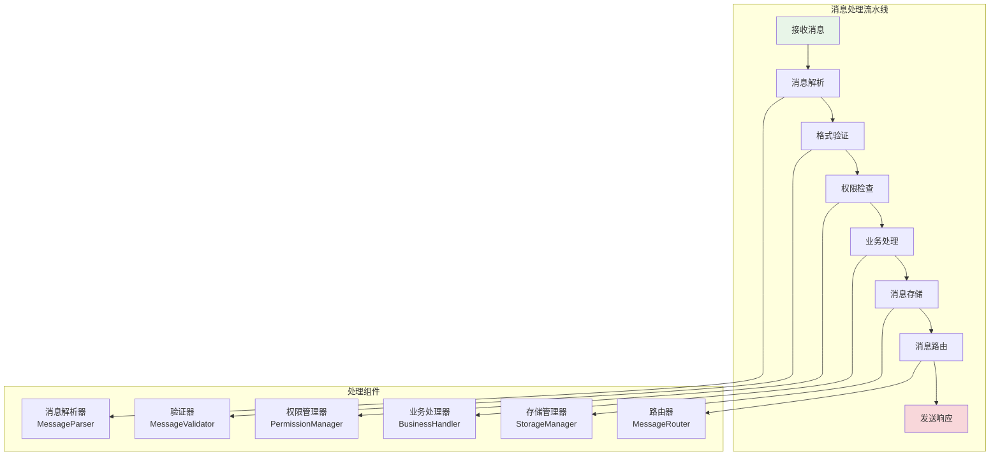

# 消息处理机制

## 🎯 学习目标

通过本章学习，您将能够：
- 理解消息处理的完整流程和架构
- 掌握消息路由、验证、存储的实现方法
- 学会设计高效的消息处理系统
- 在Chat-Room项目中应用消息处理技术

## 🔄 消息处理流程

### 消息处理架构



### Chat-Room消息处理核心

```python
# server/core/message_processor.py - 消息处理器
import json
import time
from typing import Dict, Any, Optional, List, Callable
from dataclasses import dataclass
from enum import Enum

class ProcessingResult(Enum):
    """处理结果枚举"""
    SUCCESS = "success"
    FAILED = "failed"
    REJECTED = "rejected"
    RETRY = "retry"

@dataclass
class MessageContext:
    """消息处理上下文"""
    client_socket: Any  # Socket连接
    client_address: tuple  # 客户端地址
    user_id: Optional[int] = None  # 用户ID
    session_token: Optional[str] = None  # 会话令牌
    processing_start_time: float = None  # 处理开始时间
    
    def __post_init__(self):
        if self.processing_start_time is None:
            self.processing_start_time = time.time()

class MessageProcessor:
    """
    消息处理器
    
    负责处理所有类型的消息，实现完整的处理流水线
    """
    
    def __init__(self, user_manager, chat_manager, storage_manager):
        self.user_manager = user_manager
        self.chat_manager = chat_manager
        self.storage_manager = storage_manager
        
        # 消息处理器映射
        self.message_handlers: Dict[str, Callable] = {
            "login_request": self._handle_login_request,
            "logout_request": self._handle_logout_request,
            "chat_message": self._handle_chat_message,
            "private_message": self._handle_private_message,
            "group_join": self._handle_group_join,
            "group_leave": self._handle_group_leave,
            "user_list": self._handle_user_list_request,
            "heartbeat": self._handle_heartbeat,
            "file_upload": self._handle_file_upload,
        }
        
        # 处理统计
        self.processing_stats = {
            "total_messages": 0,
            "successful_messages": 0,
            "failed_messages": 0,
            "average_processing_time": 0.0
        }
    
    def process_message(self, raw_message: bytes, context: MessageContext) -> ProcessingResult:
        """
        处理消息的主入口
        
        Args:
            raw_message: 原始消息字节
            context: 消息处理上下文
            
        Returns:
            处理结果
        """
        try:
            # 1. 消息解析
            message = self._parse_message(raw_message)
            if not message:
                return ProcessingResult.FAILED
            
            # 2. 格式验证
            if not self._validate_message_format(message):
                self._send_error_response(context, "INVALID_FORMAT", "消息格式错误")
                return ProcessingResult.REJECTED
            
            # 3. 权限检查
            if not self._check_permissions(message, context):
                self._send_error_response(context, "PERMISSION_DENIED", "权限不足")
                return ProcessingResult.REJECTED
            
            # 4. 业务处理
            result = self._handle_business_logic(message, context)
            
            # 5. 更新统计信息
            self._update_processing_stats(context, result)
            
            return result
            
        except Exception as e:
            print(f"消息处理异常: {e}")
            self._send_error_response(context, "INTERNAL_ERROR", "服务器内部错误")
            return ProcessingResult.FAILED
    
    def _parse_message(self, raw_message: bytes) -> Optional[Dict[str, Any]]:
        """
        解析原始消息
        
        将字节流解析为JSON消息对象
        """
        try:
            # 假设消息格式：[4字节长度][JSON数据]
            if len(raw_message) < 4:
                return None
            
            # 解析长度
            import struct
            length = struct.unpack('!I', raw_message[:4])[0]
            
            if len(raw_message) < 4 + length:
                return None
            
            # 解析JSON
            json_data = raw_message[4:4+length].decode('utf-8')
            message = json.loads(json_data)
            
            return message
            
        except Exception as e:
            print(f"消息解析失败: {e}")
            return None
    
    def _validate_message_format(self, message: Dict[str, Any]) -> bool:
        """
        验证消息格式
        
        检查消息是否包含必需字段和正确的数据类型
        """
        # 检查必需字段
        required_fields = ["type", "version"]
        
        for field in required_fields:
            if field not in message:
                print(f"缺少必需字段: {field}")
                return False
        
        # 检查消息类型
        message_type = message.get("type")
        if not isinstance(message_type, str) or not message_type.strip():
            print("消息类型无效")
            return False
        
        # 检查版本
        version = message.get("version")
        if not isinstance(version, str):
            print("版本格式无效")
            return False
        
        # 根据消息类型进行特定验证
        return self._validate_message_by_type(message)
    
    def _validate_message_by_type(self, message: Dict[str, Any]) -> bool:
        """根据消息类型进行特定验证"""
        message_type = message.get("type")
        
        if message_type == "chat_message":
            # 聊天消息验证
            required = ["content", "sender_id"]
            for field in required:
                if field not in message:
                    return False
            
            # 内容长度检查
            content = message.get("content", "")
            if len(content) > 1000:  # 限制1000字符
                return False
        
        elif message_type == "login_request":
            # 登录请求验证
            required = ["username", "password"]
            for field in required:
                if field not in message or not message[field]:
                    return False
        
        elif message_type == "private_message":
            # 私聊消息验证
            required = ["content", "sender_id", "target_user_id"]
            for field in required:
                if field not in message:
                    return False
        
        return True
    
    def _check_permissions(self, message: Dict[str, Any], context: MessageContext) -> bool:
        """
        检查用户权限
        
        验证用户是否有权限执行特定操作
        """
        message_type = message.get("type")
        
        # 不需要认证的消息类型
        public_messages = ["login_request", "register_request", "heartbeat"]
        
        if message_type in public_messages:
            return True
        
        # 需要认证的消息类型
        if not context.user_id:
            print("用户未认证")
            return False
        
        # 检查用户是否被禁用
        if self.user_manager.is_user_banned(context.user_id):
            print(f"用户 {context.user_id} 已被禁用")
            return False
        
        # 根据消息类型检查特定权限
        return self._check_specific_permissions(message, context)
    
    def _check_specific_permissions(self, message: Dict[str, Any], context: MessageContext) -> bool:
        """检查特定权限"""
        message_type = message.get("type")
        user_id = context.user_id
        
        if message_type == "group_join":
            # 检查是否可以加入群组
            group_id = message.get("group_id")
            return self.chat_manager.can_join_group(user_id, group_id)
        
        elif message_type == "private_message":
            # 检查是否可以发送私聊
            target_user_id = message.get("target_user_id")
            return self.user_manager.can_send_private_message(user_id, target_user_id)
        
        elif message_type == "admin_command":
            # 检查管理员权限
            return self.user_manager.is_admin(user_id)
        
        return True
    
    def _handle_business_logic(self, message: Dict[str, Any], context: MessageContext) -> ProcessingResult:
        """
        处理业务逻辑
        
        根据消息类型调用相应的处理器
        """
        message_type = message.get("type")
        
        if message_type in self.message_handlers:
            try:
                handler = self.message_handlers[message_type]
                return handler(message, context)
            except Exception as e:
                print(f"业务处理异常: {e}")
                return ProcessingResult.FAILED
        else:
            print(f"未知消息类型: {message_type}")
            self._send_error_response(context, "UNKNOWN_MESSAGE_TYPE", f"未知消息类型: {message_type}")
            return ProcessingResult.REJECTED
    
    def _handle_login_request(self, message: Dict[str, Any], context: MessageContext) -> ProcessingResult:
        """处理登录请求"""
        username = message.get("username")
        password = message.get("password")
        
        # 验证用户凭据
        auth_result = self.user_manager.authenticate_user(username, password)
        
        if auth_result.success:
            # 登录成功
            context.user_id = auth_result.user_id
            context.session_token = auth_result.token
            
            # 发送成功响应
            response = {
                "type": "login_response",
                "success": True,
                "user_id": auth_result.user_id,
                "token": auth_result.token,
                "message": "登录成功"
            }
            
            self._send_response(context, response)
            
            # 广播用户上线消息
            self.chat_manager.broadcast_user_status(auth_result.user_id, "online")
            
            return ProcessingResult.SUCCESS
        else:
            # 登录失败
            response = {
                "type": "login_response",
                "success": False,
                "message": auth_result.message
            }
            
            self._send_response(context, response)
            return ProcessingResult.REJECTED
    
    def _handle_chat_message(self, message: Dict[str, Any], context: MessageContext) -> ProcessingResult:
        """处理聊天消息"""
        sender_id = context.user_id
        content = message.get("content")
        group_id = message.get("group_id", 1)  # 默认公频
        
        # 创建聊天消息对象
        chat_message = {
            "type": "chat_message",
            "message_id": self._generate_message_id(),
            "sender_id": sender_id,
            "sender_name": self.user_manager.get_username(sender_id),
            "content": content,
            "group_id": group_id,
            "timestamp": time.time()
        }
        
        # 存储消息
        self.storage_manager.save_message(chat_message)
        
        # 广播消息给群组成员
        self.chat_manager.broadcast_to_group(group_id, chat_message, exclude_user=sender_id)
        
        # 发送确认响应
        ack_response = {
            "type": "message_ack",
            "message_id": chat_message["message_id"],
            "status": "delivered"
        }
        
        self._send_response(context, ack_response)
        
        return ProcessingResult.SUCCESS
    
    def _handle_private_message(self, message: Dict[str, Any], context: MessageContext) -> ProcessingResult:
        """处理私聊消息"""
        sender_id = context.user_id
        target_user_id = message.get("target_user_id")
        content = message.get("content")
        
        # 检查目标用户是否存在且在线
        if not self.user_manager.is_user_online(target_user_id):
            self._send_error_response(context, "USER_OFFLINE", "目标用户不在线")
            return ProcessingResult.REJECTED
        
        # 创建私聊消息
        private_message = {
            "type": "private_message",
            "message_id": self._generate_message_id(),
            "sender_id": sender_id,
            "sender_name": self.user_manager.get_username(sender_id),
            "target_user_id": target_user_id,
            "content": content,
            "timestamp": time.time()
        }
        
        # 存储消息
        self.storage_manager.save_private_message(private_message)
        
        # 发送给目标用户
        self.chat_manager.send_to_user(target_user_id, private_message)
        
        # 发送确认响应
        ack_response = {
            "type": "message_ack",
            "message_id": private_message["message_id"],
            "status": "delivered"
        }
        
        self._send_response(context, ack_response)
        
        return ProcessingResult.SUCCESS
    
    def _handle_heartbeat(self, message: Dict[str, Any], context: MessageContext) -> ProcessingResult:
        """处理心跳消息"""
        # 更新用户活动时间
        if context.user_id:
            self.user_manager.update_user_activity(context.user_id)
        
        # 发送心跳响应
        pong_response = {
            "type": "heartbeat_response",
            "timestamp": time.time(),
            "server_time": time.time()
        }
        
        self._send_response(context, pong_response)
        
        return ProcessingResult.SUCCESS
    
    def _send_response(self, context: MessageContext, response: Dict[str, Any]):
        """发送响应消息"""
        try:
            # 编码响应
            response_json = json.dumps(response, ensure_ascii=False)
            response_bytes = response_json.encode('utf-8')
            
            # 添加长度头
            import struct
            length_header = struct.pack('!I', len(response_bytes))
            
            # 发送响应
            context.client_socket.send(length_header + response_bytes)
            
        except Exception as e:
            print(f"发送响应失败: {e}")
    
    def _send_error_response(self, context: MessageContext, error_code: str, error_message: str):
        """发送错误响应"""
        error_response = {
            "type": "error_response",
            "error_code": error_code,
            "error_message": error_message,
            "timestamp": time.time()
        }
        
        self._send_response(context, error_response)
    
    def _generate_message_id(self) -> str:
        """生成消息ID"""
        import uuid
        return str(uuid.uuid4())
    
    def _update_processing_stats(self, context: MessageContext, result: ProcessingResult):
        """更新处理统计信息"""
        self.processing_stats["total_messages"] += 1
        
        if result == ProcessingResult.SUCCESS:
            self.processing_stats["successful_messages"] += 1
        else:
            self.processing_stats["failed_messages"] += 1
        
        # 计算处理时间
        processing_time = time.time() - context.processing_start_time
        
        # 更新平均处理时间
        total = self.processing_stats["total_messages"]
        current_avg = self.processing_stats["average_processing_time"]
        new_avg = (current_avg * (total - 1) + processing_time) / total
        self.processing_stats["average_processing_time"] = new_avg
    
    def get_processing_stats(self) -> Dict[str, Any]:
        """获取处理统计信息"""
        return self.processing_stats.copy()
```

## 📨 消息路由系统

### 消息路由器实现

```python
# server/core/message_router.py - 消息路由器
from typing import Dict, List, Set, Optional
import threading

class MessageRouter:
    """
    消息路由器
    
    负责将消息路由到正确的目标用户或群组
    """
    
    def __init__(self):
        # 用户连接映射：{user_id: socket}
        self.user_connections: Dict[int, Any] = {}
        
        # 群组成员映射：{group_id: {user_ids}}
        self.group_members: Dict[int, Set[int]] = {}
        
        # 在线用户集合
        self.online_users: Set[int] = set()
        
        # 线程锁
        self.connections_lock = threading.RLock()
        self.groups_lock = threading.RLock()
    
    def register_user_connection(self, user_id: int, socket_connection):
        """注册用户连接"""
        with self.connections_lock:
            self.user_connections[user_id] = socket_connection
            self.online_users.add(user_id)
            print(f"用户 {user_id} 连接已注册")
    
    def unregister_user_connection(self, user_id: int):
        """注销用户连接"""
        with self.connections_lock:
            if user_id in self.user_connections:
                del self.user_connections[user_id]
            self.online_users.discard(user_id)
            print(f"用户 {user_id} 连接已注销")
    
    def add_user_to_group(self, user_id: int, group_id: int):
        """添加用户到群组"""
        with self.groups_lock:
            if group_id not in self.group_members:
                self.group_members[group_id] = set()
            self.group_members[group_id].add(user_id)
            print(f"用户 {user_id} 已加入群组 {group_id}")
    
    def remove_user_from_group(self, user_id: int, group_id: int):
        """从群组移除用户"""
        with self.groups_lock:
            if group_id in self.group_members:
                self.group_members[group_id].discard(user_id)
                if not self.group_members[group_id]:
                    del self.group_members[group_id]
                print(f"用户 {user_id} 已离开群组 {group_id}")
    
    def route_to_user(self, target_user_id: int, message: Dict[str, Any]) -> bool:
        """路由消息到指定用户"""
        with self.connections_lock:
            if target_user_id not in self.user_connections:
                print(f"用户 {target_user_id} 不在线")
                return False
            
            try:
                socket_conn = self.user_connections[target_user_id]
                self._send_message_to_socket(socket_conn, message)
                return True
            except Exception as e:
                print(f"发送消息给用户 {target_user_id} 失败: {e}")
                # 移除失效连接
                self.unregister_user_connection(target_user_id)
                return False
    
    def route_to_group(self, group_id: int, message: Dict[str, Any], 
                      exclude_user: int = None) -> int:
        """
        路由消息到群组
        
        Returns:
            成功发送的用户数量
        """
        with self.groups_lock:
            if group_id not in self.group_members:
                print(f"群组 {group_id} 不存在")
                return 0
            
            members = self.group_members[group_id].copy()
        
        # 排除指定用户
        if exclude_user:
            members.discard(exclude_user)
        
        success_count = 0
        failed_users = []
        
        for user_id in members:
            if self.route_to_user(user_id, message):
                success_count += 1
            else:
                failed_users.append(user_id)
        
        # 清理失效用户
        if failed_users:
            with self.groups_lock:
                for user_id in failed_users:
                    self.group_members[group_id].discard(user_id)
        
        return success_count
    
    def broadcast_to_all(self, message: Dict[str, Any], exclude_user: int = None) -> int:
        """广播消息给所有在线用户"""
        with self.connections_lock:
            online_users = self.online_users.copy()
        
        if exclude_user:
            online_users.discard(exclude_user)
        
        success_count = 0
        
        for user_id in online_users:
            if self.route_to_user(user_id, message):
                success_count += 1
        
        return success_count
    
    def _send_message_to_socket(self, socket_conn, message: Dict[str, Any]):
        """发送消息到Socket连接"""
        import json
        import struct
        
        # 编码消息
        message_json = json.dumps(message, ensure_ascii=False)
        message_bytes = message_json.encode('utf-8')
        
        # 发送长度头和消息体
        length_header = struct.pack('!I', len(message_bytes))
        socket_conn.send(length_header + message_bytes)
    
    def get_online_users(self) -> List[int]:
        """获取在线用户列表"""
        with self.connections_lock:
            return list(self.online_users)
    
    def get_group_members(self, group_id: int) -> List[int]:
        """获取群组成员列表"""
        with self.groups_lock:
            if group_id in self.group_members:
                return list(self.group_members[group_id])
            return []
    
    def get_routing_stats(self) -> Dict[str, Any]:
        """获取路由统计信息"""
        with self.connections_lock, self.groups_lock:
            return {
                "online_users_count": len(self.online_users),
                "total_groups": len(self.group_members),
                "total_group_members": sum(len(members) for members in self.group_members.values()),
                "active_connections": len(self.user_connections)
            }
```

## 🎯 实践练习

### 练习1：消息过滤器
```python
class MessageFilter:
    """
    消息过滤器练习
    
    要求：
    1. 实现垃圾消息过滤
    2. 敏感词检测和替换
    3. 消息频率限制
    4. 内容长度限制
    """
    
    def __init__(self):
        # TODO: 初始化过滤器
        pass
    
    def filter_spam(self, message: str) -> bool:
        """过滤垃圾消息"""
        # TODO: 实现垃圾消息检测
        pass
    
    def filter_profanity(self, message: str) -> str:
        """过滤敏感词"""
        # TODO: 实现敏感词过滤
        pass
    
    def check_rate_limit(self, user_id: int) -> bool:
        """检查发送频率限制"""
        # TODO: 实现频率限制检查
        pass
```

### 练习2：消息队列系统
```python
class MessageQueue:
    """
    消息队列系统练习
    
    要求：
    1. 实现消息队列管理
    2. 支持消息优先级
    3. 离线消息存储
    4. 消息重试机制
    """
    
    def __init__(self):
        # TODO: 初始化消息队列
        pass
    
    def enqueue_message(self, message: Dict[str, Any], priority: int = 0):
        """入队消息"""
        # TODO: 实现消息入队
        pass
    
    def dequeue_message(self) -> Optional[Dict[str, Any]]:
        """出队消息"""
        # TODO: 实现消息出队
        pass
    
    def store_offline_message(self, user_id: int, message: Dict[str, Any]):
        """存储离线消息"""
        # TODO: 实现离线消息存储
        pass
```

## ✅ 学习检查

完成本章学习后，请确认您能够：

- [ ] 理解消息处理的完整流程
- [ ] 实现消息解析、验证、路由功能
- [ ] 设计高效的消息路由系统
- [ ] 处理各种类型的消息
- [ ] 实现消息过滤和安全检查
- [ ] 完成实践练习

## 📚 下一步

消息处理机制掌握后，请继续学习：
- [多线程编程基础](threading-basics.md)
- [错误处理策略](error-handling.md)

---

**现在您已经掌握了消息处理的核心技术！** 🎉
