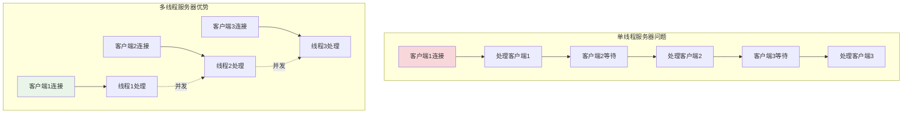

# 多线程编程基础

## 🎯 学习目标

通过本章学习，您将能够：
- 理解多线程编程的基本概念和原理
- 掌握Python线程编程的核心技术
- 学会处理线程同步和数据共享问题
- 在Chat-Room项目中应用多线程技术

## 🧵 多线程基础概念

### 为什么Chat-Room需要多线程？



**Chat-Room多线程应用场景**：
- **并发连接处理**：每个客户端连接独立线程
- **消息广播**：后台线程处理消息分发
- **文件传输**：独立线程处理文件上传下载
- **心跳检测**：定时线程检查连接状态
- **数据库操作**：异步线程处理数据存储

### Python线程基础

```python
# server/threading/thread_basics.py - 线程基础示例
import threading
import time
import queue
from typing import List, Dict, Any

class ThreadingBasics:
    """
    Python线程编程基础

    演示线程创建、管理和同步的基本概念
    """

    def __init__(self):
        self.thread_results = {}
        self.shared_counter = 0
        self.counter_lock = threading.Lock()

    def demo_basic_threading(self):
        """基础线程创建和管理"""
        print("=== 基础线程演示 ===")

        # 方法1：使用Thread类
        def worker_function(worker_id: int, duration: int):
            """工作线程函数"""
            print(f"工作线程 {worker_id} 开始工作")
            time.sleep(duration)
            print(f"工作线程 {worker_id} 完成工作")
            return f"Worker {worker_id} result"

        # 创建线程
        threads = []
        for i in range(3):
            thread = threading.Thread(
                target=worker_function,
                args=(i, 2),  # 工作2秒
                name=f"Worker-{i}"
            )
            threads.append(thread)

        # 启动线程
        start_time = time.time()
        for thread in threads:
            thread.start()

        # 等待所有线程完成
        for thread in threads:
            thread.join()

        end_time = time.time()
        print(f"所有线程完成，总耗时: {end_time - start_time:.2f}秒")

    def demo_thread_class(self):
        """使用Thread子类"""
        print("\n=== Thread子类演示 ===")

        class ChatClientHandler(threading.Thread):
            """聊天客户端处理线程"""

            def __init__(self, client_id: int, message_queue: queue.Queue):
                super().__init__(name=f"ClientHandler-{client_id}")
                self.client_id = client_id
                self.message_queue = message_queue
                self.running = True

            def run(self):
                """线程主函数"""
                print(f"客户端 {self.client_id} 处理线程启动")

                while self.running:
                    try:
                        # 模拟处理消息
                        message = f"Message from client {self.client_id}"
                        self.message_queue.put(message)

                        time.sleep(1)  # 模拟处理时间

                        # 模拟处理5条消息后退出
                        if self.message_queue.qsize() >= 5:
                            self.running = False

                    except Exception as e:
                        print(f"客户端 {self.client_id} 处理异常: {e}")
                        break

                print(f"客户端 {self.client_id} 处理线程结束")

            def stop(self):
                """停止线程"""
                self.running = False

        # 创建消息队列
        message_queue = queue.Queue()

        # 创建客户端处理线程
        handlers = []
        for i in range(2):
            handler = ChatClientHandler(i, message_queue)
            handlers.append(handler)
            handler.start()

        # 等待线程完成
        for handler in handlers:
            handler.join()

        # 显示队列中的消息
        print("队列中的消息:")
        while not message_queue.empty():
            print(f"  - {message_queue.get()}")

    def demo_thread_synchronization(self):
        """线程同步演示"""
        print("\n=== 线程同步演示 ===")

        def unsafe_counter_increment():
            """不安全的计数器递增（可能出现竞态条件）"""
            for _ in range(100000):
                self.shared_counter += 1

        def safe_counter_increment():
            """安全的计数器递增（使用锁）"""
            for _ in range(100000):
                with self.counter_lock:
                    self.shared_counter += 1

        # 测试不安全的递增
        self.shared_counter = 0
        threads = []

        for i in range(2):
            thread = threading.Thread(target=unsafe_counter_increment)
            threads.append(thread)

        start_time = time.time()
        for thread in threads:
            thread.start()

        for thread in threads:
            thread.join()

        print(f"不安全递增结果: {self.shared_counter} (期望: 200000)")

        # 测试安全的递增
        self.shared_counter = 0
        threads = []

        for i in range(2):
            thread = threading.Thread(target=safe_counter_increment)
            threads.append(thread)

        for thread in threads:
            thread.start()

        for thread in threads:
            thread.join()

        print(f"安全递增结果: {self.shared_counter} (期望: 200000)")

## 🏠 Chat-Room中的多线程应用

### 多线程服务器架构

```python
# server/core/threaded_server.py - 多线程服务器实现
import threading
import socket
import queue
import time
from typing import Dict, Set, Optional

class ThreadedChatServer:
    """
    多线程聊天服务器

    架构设计：
    1. 主线程：接受新连接
    2. 客户端线程：处理每个客户端
    3. 广播线程：处理消息广播
    4. 心跳线程：检查连接状态
    """

    def __init__(self, host: str = "localhost", port: int = 8888):
        self.host = host
        self.port = port
        self.running = False

        # 网络相关
        self.server_socket: Optional[socket.socket] = None
        self.client_sockets: Dict[int, socket.socket] = {}  # {user_id: socket}
        self.client_threads: Dict[int, threading.Thread] = {}  # {user_id: thread}

        # 消息队列
        self.broadcast_queue = queue.Queue()
        self.private_message_queue = queue.Queue()

        # 线程同步
        self.clients_lock = threading.RLock()
        self.user_counter = 0
        self.user_counter_lock = threading.Lock()

        # 工作线程
        self.broadcast_thread: Optional[threading.Thread] = None
        self.heartbeat_thread: Optional[threading.Thread] = None

    def start_server(self):
        """启动服务器"""
        try:
            # 创建服务器Socket
            self.server_socket = socket.socket(socket.AF_INET, socket.SOCK_STREAM)
            self.server_socket.setsockopt(socket.SOL_SOCKET, socket.SO_REUSEADDR, 1)
            self.server_socket.bind((self.host, self.port))
            self.server_socket.listen(10)

            self.running = True
            print(f"多线程服务器启动: {self.host}:{self.port}")

            # 启动工作线程
            self._start_worker_threads()

            # 主循环：接受客户端连接
            self._accept_connections()

        except Exception as e:
            print(f"服务器启动失败: {e}")
        finally:
            self.stop_server()

    def _start_worker_threads(self):
        """启动工作线程"""
        # 启动广播线程
        self.broadcast_thread = threading.Thread(
            target=self._broadcast_worker,
            name="BroadcastWorker",
            daemon=True
        )
        self.broadcast_thread.start()

        # 启动心跳检测线程
        self.heartbeat_thread = threading.Thread(
            target=self._heartbeat_worker,
            name="HeartbeatWorker",
            daemon=True
        )
        self.heartbeat_thread.start()

        print("工作线程已启动")

    def _accept_connections(self):
        """接受客户端连接的主循环"""
        while self.running:
            try:
                client_socket, client_address = self.server_socket.accept()
                print(f"新客户端连接: {client_address}")

                # 为客户端分配ID
                with self.user_counter_lock:
                    self.user_counter += 1
                    user_id = self.user_counter

                # 创建客户端处理线程
                client_thread = threading.Thread(
                    target=self._handle_client,
                    args=(user_id, client_socket, client_address),
                    name=f"Client-{user_id}",
                    daemon=True
                )

                # 注册客户端
                with self.clients_lock:
                    self.client_sockets[user_id] = client_socket
                    self.client_threads[user_id] = client_thread

                # 启动客户端线程
                client_thread.start()

                print(f"客户端 {user_id} 处理线程已启动")

            except OSError:
                if self.running:
                    print("接受连接时发生错误")
                break
            except Exception as e:
                print(f"处理新连接异常: {e}")

    def _handle_client(self, user_id: int, client_socket: socket.socket, client_address):
        """处理单个客户端连接"""
        try:
            print(f"开始处理客户端 {user_id} ({client_address})")

            while self.running:
                try:
                    # 接收消息
                    data = client_socket.recv(4096)
                    if not data:
                        print(f"客户端 {user_id} 断开连接")
                        break

                    # 处理消息
                    self._process_client_message(user_id, data)

                except socket.timeout:
                    continue
                except ConnectionResetError:
                    print(f"客户端 {user_id} 连接被重置")
                    break
                except Exception as e:
                    print(f"处理客户端 {user_id} 消息异常: {e}")
                    break

        finally:
            # 清理客户端连接
            self._cleanup_client(user_id)

    def _process_client_message(self, user_id: int, data: bytes):
        """处理客户端消息"""
        try:
            import json

            # 简单的消息解析（实际项目中会更复杂）
            message_text = data.decode('utf-8').strip()

            if message_text.startswith('/'):
                # 处理命令
                self._handle_command(user_id, message_text)
            else:
                # 普通聊天消息，加入广播队列
                broadcast_message = {
                    'type': 'chat',
                    'user_id': user_id,
                    'content': message_text,
                    'timestamp': time.time()
                }

                self.broadcast_queue.put(broadcast_message)

        except Exception as e:
            print(f"处理消息异常: {e}")

    def _handle_command(self, user_id: int, command: str):
        """处理客户端命令"""
        if command == '/users':
            # 获取在线用户列表
            with self.clients_lock:
                user_count = len(self.client_sockets)

            response = f"在线用户数: {user_count}\n"
            self._send_to_client(user_id, response.encode())

        elif command == '/quit':
            # 客户端请求断开连接
            self._send_to_client(user_id, b"Goodbye!\n")
            self._cleanup_client(user_id)

    def _broadcast_worker(self):
        """广播工作线程"""
        print("广播工作线程启动")

        while self.running:
            try:
                # 从队列获取广播消息
                message = self.broadcast_queue.get(timeout=1.0)

                if message is None:  # 停止信号
                    break

                # 广播给所有客户端
                self._broadcast_message(message)

                # 标记任务完成
                self.broadcast_queue.task_done()

            except queue.Empty:
                continue
            except Exception as e:
                print(f"广播工作线程异常: {e}")

        print("广播工作线程结束")

    def _broadcast_message(self, message: Dict):
        """广播消息给所有客户端"""
        sender_id = message.get('user_id')
        content = message.get('content')

        broadcast_text = f"用户{sender_id}: {content}\n"
        broadcast_data = broadcast_text.encode()

        # 获取所有客户端连接的副本
        with self.clients_lock:
            client_sockets = self.client_sockets.copy()

        # 发送给所有客户端（除了发送者）
        failed_clients = []

        for user_id, client_socket in client_sockets.items():
            if user_id == sender_id:
                continue  # 不发送给发送者自己

            try:
                client_socket.send(broadcast_data)
            except Exception as e:
                print(f"发送广播消息给客户端 {user_id} 失败: {e}")
                failed_clients.append(user_id)

        # 清理失败的客户端
        for user_id in failed_clients:
            self._cleanup_client(user_id)

    def _heartbeat_worker(self):
        """心跳检测工作线程"""
        print("心跳检测线程启动")

        while self.running:
            try:
                time.sleep(30)  # 每30秒检查一次

                # 获取所有客户端连接
                with self.clients_lock:
                    client_sockets = self.client_sockets.copy()

                # 发送心跳包
                heartbeat_data = b"PING\n"
                failed_clients = []

                for user_id, client_socket in client_sockets.items():
                    try:
                        client_socket.send(heartbeat_data)
                    except Exception as e:
                        print(f"心跳检测失败，客户端 {user_id}: {e}")
                        failed_clients.append(user_id)

                # 清理失败的客户端
                for user_id in failed_clients:
                    self._cleanup_client(user_id)

                print(f"心跳检测完成，在线用户: {len(client_sockets) - len(failed_clients)}")

            except Exception as e:
                print(f"心跳检测异常: {e}")

        print("心跳检测线程结束")

    def _send_to_client(self, user_id: int, data: bytes):
        """发送数据给指定客户端"""
        with self.clients_lock:
            if user_id in self.client_sockets:
                try:
                    self.client_sockets[user_id].send(data)
                except Exception as e:
                    print(f"发送数据给客户端 {user_id} 失败: {e}")
                    self._cleanup_client(user_id)

    def _cleanup_client(self, user_id: int):
        """清理客户端连接"""
        with self.clients_lock:
            # 关闭Socket
            if user_id in self.client_sockets:
                try:
                    self.client_sockets[user_id].close()
                except:
                    pass
                del self.client_sockets[user_id]

            # 清理线程引用
            if user_id in self.client_threads:
                del self.client_threads[user_id]

        print(f"客户端 {user_id} 已清理")

    def stop_server(self):
        """停止服务器"""
        print("正在停止服务器...")
        self.running = False

        # 发送停止信号给广播线程
        self.broadcast_queue.put(None)

        # 关闭所有客户端连接
        with self.clients_lock:
            for client_socket in self.client_sockets.values():
                try:
                    client_socket.close()
                except:
                    pass
            self.client_sockets.clear()
            self.client_threads.clear()

        # 关闭服务器Socket
        if self.server_socket:
            try:
                self.server_socket.close()
            except:
                pass

        print("服务器已停止")

# 使用示例
def demo_threading_basics():
    """线程基础演示"""
    basics = ThreadingBasics()

    basics.demo_basic_threading()
    basics.demo_thread_class()
    basics.demo_thread_synchronization()

def demo_threaded_server():
    """多线程服务器演示"""
    server = ThreadedChatServer()

    try:
        server.start_server()
    except KeyboardInterrupt:
        print("\n收到中断信号")
    finally:
        server.stop_server()
```