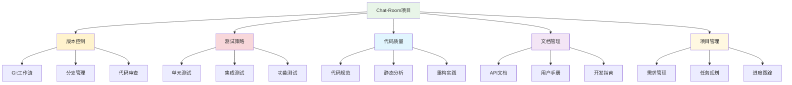
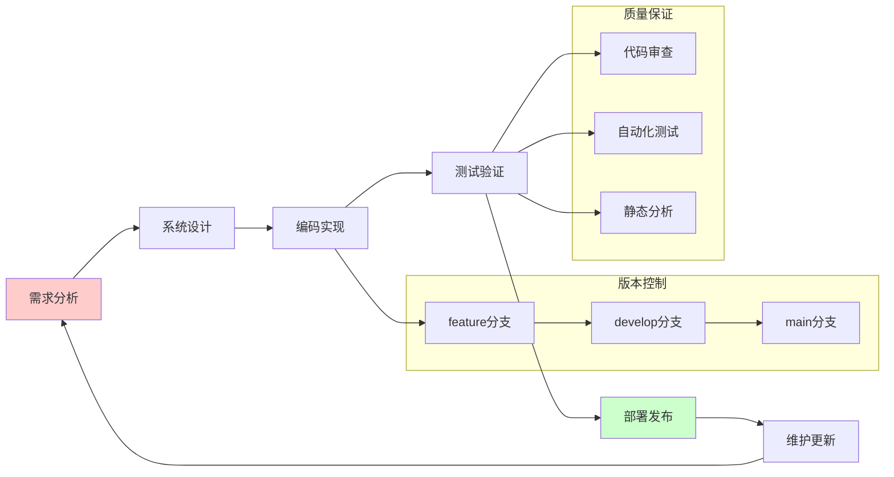
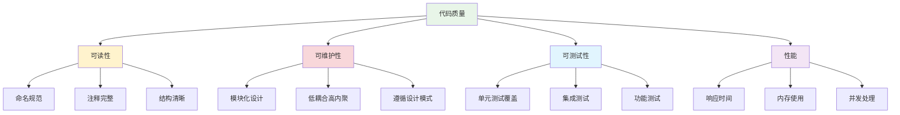

# 第3章：软件工程基础

## 🎯 学习目标

通过本章学习，您将能够：
- 理解软件开发生命周期的各个阶段
- 掌握Python代码规范和最佳实践（PEP 8、类型提示）
- 了解常用设计模式及其在Chat-Room中的应用
- 学会项目结构设计和模块化开发
- 掌握文档编写和代码注释技巧
- 理解敏捷开发和团队协作方法
- 掌握版本控制系统Git的使用
- 理解软件测试的基本概念和方法

## 📚 章节内容

### 3.1 软件开发生命周期
- [开发流程与方法论](development-lifecycle.md) - 从瀑布模型到敏捷开发
- [需求分析与系统设计](requirements-design.md) - Chat-Room需求分析实例
- [开发实施与质量控制](development-implementation.md) - 编码规范与代码审查
- [测试部署与运维监控](testing-deployment.md) - 完整的软件交付流程

### 3.2 Python代码规范与最佳实践
- [PEP 8代码规范详解](pep8-standards.md) - Python官方编码规范
- [类型提示系统应用](type-hints.md) - 提高代码可读性和可维护性
- [代码质量工具链](code-quality-tools.md) - black、flake8、mypy等工具
- [重构技巧与实践](refactoring-techniques.md) - 改善既有代码的设计

### 3.3 设计模式基础
- [创建型模式](creational-patterns.md) - 单例、工厂、建造者模式
- [结构型模式](structural-patterns.md) - 适配器、装饰器、外观模式
- [行为型模式](behavioral-patterns.md) - 观察者、策略、命令模式
- [Chat-Room中的设计模式](patterns-in-chatroom.md) - 实际应用案例分析

### 3.4 项目结构与模块化设计
- [项目组织原则](project-organization.md) - 目录结构设计原则
- [模块化设计思想](modular-design.md) - 高内聚低耦合的实现
- [包管理与依赖控制](package-management.md) - requirements.txt与虚拟环境
- [配置管理最佳实践](configuration-management.md) - 配置文件设计与管理

### 3.5 版本控制与协作
- [Git版本控制详解](git-version-control.md) - Git工作流和分支管理
- [团队协作与代码审查](team-collaboration.md) - 协作开发最佳实践

### 3.6 软件质量保证
- [测试驱动开发实践](testing-practices.md) - TDD方法论和实践
- [代码质量与规范](code-quality.md) - 质量度量和改进方法

### 3.7 项目管理
- [文档编写与维护](documentation.md) - 技术文档编写规范
- [项目管理方法](project-management.md) - 敏捷开发和项目跟踪

## 🏗️ 软件工程在Chat-Room中的应用



## 🔄 软件开发生命周期

### Chat-Room项目开发流程



### 开发阶段详解

```python
"""
Chat-Room项目软件工程实践
展示软件工程概念在实际项目中的应用
"""

from enum import Enum
from typing import List, Dict, Optional
from dataclasses import dataclass
from datetime import datetime
import subprocess
import os

class ProjectPhase(Enum):
    """项目阶段枚举"""
    REQUIREMENTS = "需求分析"
    DESIGN = "系统设计"
    IMPLEMENTATION = "编码实现"
    TESTING = "测试验证"
    DEPLOYMENT = "部署发布"
    MAINTENANCE = "维护更新"

@dataclass
class Requirement:
    """需求类"""
    id: str
    title: str
    description: str
    priority: str  # High, Medium, Low
    status: str    # New, In Progress, Done
    assignee: Optional[str] = None
    created_at: datetime = datetime.now()

@dataclass
class TestCase:
    """测试用例类"""
    id: str
    name: str
    description: str
    steps: List[str]
    expected_result: str
    actual_result: Optional[str] = None
    status: str = "Not Run"  # Not Run, Pass, Fail

class ChatRoomProjectManager:
    """Chat-Room项目管理器"""
    
    def __init__(self):
        self.requirements: List[Requirement] = []
        self.test_cases: List[TestCase] = []
        self.current_phase = ProjectPhase.REQUIREMENTS
        
        # 初始化项目需求
        self.initialize_requirements()
        self.initialize_test_cases()
    
    def initialize_requirements(self):
        """初始化项目需求"""
        
        requirements_data = [
            {
                "id": "REQ-001",
                "title": "用户注册登录",
                "description": "用户可以注册账号并登录系统",
                "priority": "High"
            },
            {
                "id": "REQ-002", 
                "title": "实时聊天功能",
                "description": "用户可以发送和接收实时消息",
                "priority": "High"
            },
            {
                "id": "REQ-003",
                "title": "聊天组管理",
                "description": "用户可以创建、加入、退出聊天组",
                "priority": "Medium"
            },
            {
                "id": "REQ-004",
                "title": "文件传输功能",
                "description": "用户可以发送和接收文件",
                "priority": "Medium"
            },
            {
                "id": "REQ-005",
                "title": "AI智能回复",
                "description": "集成AI助手提供智能回复",
                "priority": "Low"
            }
        ]
        
        for req_data in requirements_data:
            requirement = Requirement(
                id=req_data["id"],
                title=req_data["title"],
                description=req_data["description"],
                priority=req_data["priority"],
                status="New"
            )
            self.requirements.append(requirement)
    
    def initialize_test_cases(self):
        """初始化测试用例"""
        
        test_cases_data = [
            {
                "id": "TC-001",
                "name": "用户登录测试",
                "description": "测试用户登录功能",
                "steps": [
                    "启动客户端",
                    "输入用户名和密码",
                    "点击登录按钮"
                ],
                "expected_result": "用户成功登录，显示聊天界面"
            },
            {
                "id": "TC-002",
                "name": "消息发送测试",
                "description": "测试消息发送功能",
                "steps": [
                    "用户登录成功",
                    "在输入框输入消息",
                    "按回车发送消息"
                ],
                "expected_result": "消息成功发送并显示在聊天窗口"
            },
            {
                "id": "TC-003",
                "name": "文件上传测试",
                "description": "测试文件上传功能",
                "steps": [
                    "用户登录成功",
                    "点击文件上传按钮",
                    "选择文件并确认上传"
                ],
                "expected_result": "文件成功上传并显示上传进度"
            }
        ]
        
        for tc_data in test_cases_data:
            test_case = TestCase(
                id=tc_data["id"],
                name=tc_data["name"],
                description=tc_data["description"],
                steps=tc_data["steps"],
                expected_result=tc_data["expected_result"]
            )
            self.test_cases.append(test_case)
    
    def get_requirements_by_priority(self, priority: str) -> List[Requirement]:
        """根据优先级获取需求"""
        return [req for req in self.requirements if req.priority == priority]
    
    def get_requirements_by_status(self, status: str) -> List[Requirement]:
        """根据状态获取需求"""
        return [req for req in self.requirements if req.status == status]
    
    def update_requirement_status(self, req_id: str, status: str):
        """更新需求状态"""
        for req in self.requirements:
            if req.id == req_id:
                req.status = status
                break
    
    def run_test_case(self, test_id: str, actual_result: str, status: str):
        """执行测试用例"""
        for tc in self.test_cases:
            if tc.id == test_id:
                tc.actual_result = actual_result
                tc.status = status
                break
    
    def generate_project_report(self) -> Dict:
        """生成项目报告"""
        
        # 需求统计
        req_stats = {
            "total": len(self.requirements),
            "new": len(self.get_requirements_by_status("New")),
            "in_progress": len(self.get_requirements_by_status("In Progress")),
            "done": len(self.get_requirements_by_status("Done"))
        }
        
        # 测试统计
        test_stats = {
            "total": len(self.test_cases),
            "not_run": len([tc for tc in self.test_cases if tc.status == "Not Run"]),
            "pass": len([tc for tc in self.test_cases if tc.status == "Pass"]),
            "fail": len([tc for tc in self.test_cases if tc.status == "Fail"])
        }
        
        return {
            "project_phase": self.current_phase.value,
            "requirements": req_stats,
            "tests": test_stats,
            "completion_rate": req_stats["done"] / req_stats["total"] * 100 if req_stats["total"] > 0 else 0
        }
    
    def demonstrate_project_workflow(self):
        """演示项目工作流程"""
        
        print("=== Chat-Room项目工作流程演示 ===")
        
        # 1. 需求分析阶段
        print("\n1. 需求分析阶段")
        high_priority_reqs = self.get_requirements_by_priority("High")
        print(f"高优先级需求 ({len(high_priority_reqs)} 个):")
        for req in high_priority_reqs:
            print(f"  - {req.id}: {req.title}")
        
        # 2. 开发阶段 - 更新需求状态
        print("\n2. 开发阶段 - 开始实现需求")
        self.update_requirement_status("REQ-001", "In Progress")
        self.update_requirement_status("REQ-002", "In Progress")
        
        # 3. 测试阶段
        print("\n3. 测试阶段 - 执行测试用例")
        self.run_test_case("TC-001", "用户成功登录", "Pass")
        self.run_test_case("TC-002", "消息发送成功", "Pass")
        self.run_test_case("TC-003", "文件上传失败", "Fail")
        
        # 4. 完成需求
        print("\n4. 完成需求")
        self.update_requirement_status("REQ-001", "Done")
        self.update_requirement_status("REQ-002", "Done")
        
        # 5. 生成项目报告
        print("\n5. 项目报告")
        report = self.generate_project_report()
        print(f"项目阶段: {report['project_phase']}")
        print(f"需求完成率: {report['completion_rate']:.1f}%")
        print(f"需求状态: 总计{report['requirements']['total']}, "
              f"新建{report['requirements']['new']}, "
              f"进行中{report['requirements']['in_progress']}, "
              f"已完成{report['requirements']['done']}")
        print(f"测试状态: 总计{report['tests']['total']}, "
              f"未运行{report['tests']['not_run']}, "
              f"通过{report['tests']['pass']}, "
              f"失败{report['tests']['fail']}")

# Git工作流演示
class GitWorkflowDemo:
    """Git工作流演示"""
    
    def __init__(self):
        self.current_branch = "main"
        self.branches = ["main", "develop"]
        self.commits = []
    
    def demonstrate_git_workflow(self):
        """演示Git工作流"""
        
        print("\n=== Git工作流演示 ===")
        
        # 检查Git状态
        if self.check_git_repository():
            print("✅ Git仓库已初始化")
            
            # 演示分支操作
            self.demonstrate_branching()
            
            # 演示提交操作
            self.demonstrate_commits()
            
            # 演示合并操作
            self.demonstrate_merging()
        else:
            print("❌ 当前目录不是Git仓库")
    
    def check_git_repository(self) -> bool:
        """检查是否为Git仓库"""
        return os.path.exists(".git")
    
    def demonstrate_branching(self):
        """演示分支操作"""
        
        print("\n分支管理:")
        
        # 模拟Git命令
        git_commands = [
            "git branch feature/user-login",
            "git checkout feature/user-login",
            "git branch feature/chat-message", 
            "git checkout develop"
        ]
        
        for cmd in git_commands:
            print(f"  $ {cmd}")
    
    def demonstrate_commits(self):
        """演示提交操作"""
        
        print("\n提交管理:")
        
        commit_messages = [
            "feat: 添加用户登录功能",
            "fix: 修复消息发送bug",
            "docs: 更新API文档",
            "test: 添加单元测试",
            "refactor: 重构数据库连接模块"
        ]
        
        for msg in commit_messages:
            print(f"  $ git commit -m \"{msg}\"")
    
    def demonstrate_merging(self):
        """演示合并操作"""
        
        print("\n合并管理:")
        
        merge_commands = [
            "git checkout develop",
            "git merge feature/user-login",
            "git checkout main", 
            "git merge develop",
            "git tag v1.0.0"
        ]
        
        for cmd in merge_commands:
            print(f"  $ {cmd}")

# 使用示例
if __name__ == "__main__":
    # 项目管理演示
    project_manager = ChatRoomProjectManager()
    project_manager.demonstrate_project_workflow()
    
    # Git工作流演示
    git_demo = GitWorkflowDemo()
    git_demo.demonstrate_git_workflow()
```

## 📊 软件质量度量

### 代码质量指标



### Chat-Room项目质量标准

```python
"""
Chat-Room项目质量标准
定义项目的质量度量标准和检查方法
"""

from typing import Dict, List, Tuple
import ast
import os
import subprocess

class CodeQualityChecker:
    """代码质量检查器"""
    
    def __init__(self, project_path: str = "."):
        self.project_path = project_path
        self.quality_metrics = {
            "lines_of_code": 0,
            "comment_ratio": 0.0,
            "function_count": 0,
            "class_count": 0,
            "complexity_score": 0
        }
    
    def analyze_python_file(self, file_path: str) -> Dict:
        """分析Python文件的质量指标"""
        
        try:
            with open(file_path, 'r', encoding='utf-8') as f:
                content = f.read()
            
            # 解析AST
            tree = ast.parse(content)
            
            # 统计指标
            lines = content.split('\n')
            total_lines = len(lines)
            comment_lines = sum(1 for line in lines if line.strip().startswith('#'))
            
            # 统计函数和类
            functions = [node for node in ast.walk(tree) if isinstance(node, ast.FunctionDef)]
            classes = [node for node in ast.walk(tree) if isinstance(node, ast.ClassDef)]
            
            return {
                "file": file_path,
                "total_lines": total_lines,
                "comment_lines": comment_lines,
                "comment_ratio": comment_lines / total_lines if total_lines > 0 else 0,
                "function_count": len(functions),
                "class_count": len(classes)
            }
            
        except Exception as e:
            print(f"分析文件 {file_path} 时出错: {e}")
            return {}
    
    def check_naming_conventions(self, file_path: str) -> List[str]:
        """检查命名规范"""
        
        issues = []
        
        try:
            with open(file_path, 'r', encoding='utf-8') as f:
                content = f.read()
            
            tree = ast.parse(content)
            
            for node in ast.walk(tree):
                if isinstance(node, ast.FunctionDef):
                    # 检查函数命名（应该使用snake_case）
                    if not node.name.islower() or '-' in node.name:
                        issues.append(f"函数 {node.name} 命名不符合snake_case规范")
                
                elif isinstance(node, ast.ClassDef):
                    # 检查类命名（应该使用PascalCase）
                    if not node.name[0].isupper():
                        issues.append(f"类 {node.name} 命名不符合PascalCase规范")
        
        except Exception as e:
            issues.append(f"检查文件 {file_path} 时出错: {e}")
        
        return issues
    
    def run_static_analysis(self) -> Dict:
        """运行静态代码分析"""
        
        results = {
            "flake8": [],
            "pylint": [],
            "mypy": []
        }
        
        # 运行flake8
        try:
            result = subprocess.run(
                ["flake8", "--max-line-length=100", self.project_path],
                capture_output=True, text=True
            )
            if result.stdout:
                results["flake8"] = result.stdout.strip().split('\n')
        except FileNotFoundError:
            results["flake8"] = ["flake8未安装"]
        
        # 运行pylint（如果安装了）
        try:
            result = subprocess.run(
                ["pylint", "--rcfile=.pylintrc", self.project_path],
                capture_output=True, text=True
            )
            if result.stdout:
                results["pylint"] = result.stdout.strip().split('\n')
        except FileNotFoundError:
            results["pylint"] = ["pylint未安装"]
        
        return results
    
    def generate_quality_report(self) -> Dict:
        """生成质量报告"""
        
        print("=== 代码质量报告 ===")
        
        # 分析Python文件
        python_files = []
        for root, dirs, files in os.walk(self.project_path):
            # 跳过虚拟环境和缓存目录
            dirs[:] = [d for d in dirs if d not in ['.git', '__pycache__', '.pytest_cache', 'venv', 'env']]
            
            for file in files:
                if file.endswith('.py'):
                    file_path = os.path.join(root, file)
                    python_files.append(file_path)
        
        # 分析每个文件
        file_analyses = []
        total_lines = 0
        total_comments = 0
        total_functions = 0
        total_classes = 0
        
        for file_path in python_files[:5]:  # 限制分析文件数量
            analysis = self.analyze_python_file(file_path)
            if analysis:
                file_analyses.append(analysis)
                total_lines += analysis["total_lines"]
                total_comments += analysis["comment_lines"]
                total_functions += analysis["function_count"]
                total_classes += analysis["class_count"]
        
        # 计算总体指标
        overall_comment_ratio = total_comments / total_lines if total_lines > 0 else 0
        
        report = {
            "summary": {
                "total_files": len(file_analyses),
                "total_lines": total_lines,
                "total_comments": total_comments,
                "comment_ratio": overall_comment_ratio,
                "total_functions": total_functions,
                "total_classes": total_classes
            },
            "files": file_analyses
        }
        
        # 打印报告
        print(f"分析文件数: {report['summary']['total_files']}")
        print(f"总代码行数: {report['summary']['total_lines']}")
        print(f"注释覆盖率: {report['summary']['comment_ratio']:.2%}")
        print(f"函数总数: {report['summary']['total_functions']}")
        print(f"类总数: {report['summary']['total_classes']}")
        
        return report

# 使用示例
if __name__ == "__main__":
    quality_checker = CodeQualityChecker()
    quality_report = quality_checker.generate_quality_report()
```

## 📋 学习检查清单

完成本章学习后，请确认您能够：

- [ ] 理解软件工程的基本概念和重要性
- [ ] 掌握软件开发生命周期的各个阶段
- [ ] 了解需求分析和项目管理方法
- [ ] 理解代码质量的重要性和度量方法
- [ ] 掌握基本的项目管理技能
- [ ] 了解Chat-Room项目的软件工程实践

## 🔗 相关资源

- [软件工程：实践者的研究方法](https://www.amazon.com/Software-Engineering-Practitioners-Roger-Pressman/dp/0078022126)
- [敏捷软件开发](https://agilemanifesto.org/)
- [代码整洁之道](https://www.amazon.com/Clean-Code-Handbook-Software-Craftsmanship/dp/0132350882)
- [软件项目管理](https://www.pmi.org/)

## 📚 下一步

软件工程基础学习完成后，请继续学习：
- [Git版本控制详解](git-version-control.md)

---

**掌握软件工程方法，构建高质量的Chat-Room项目！** 🏗️
