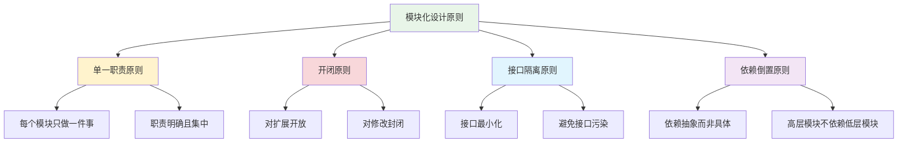
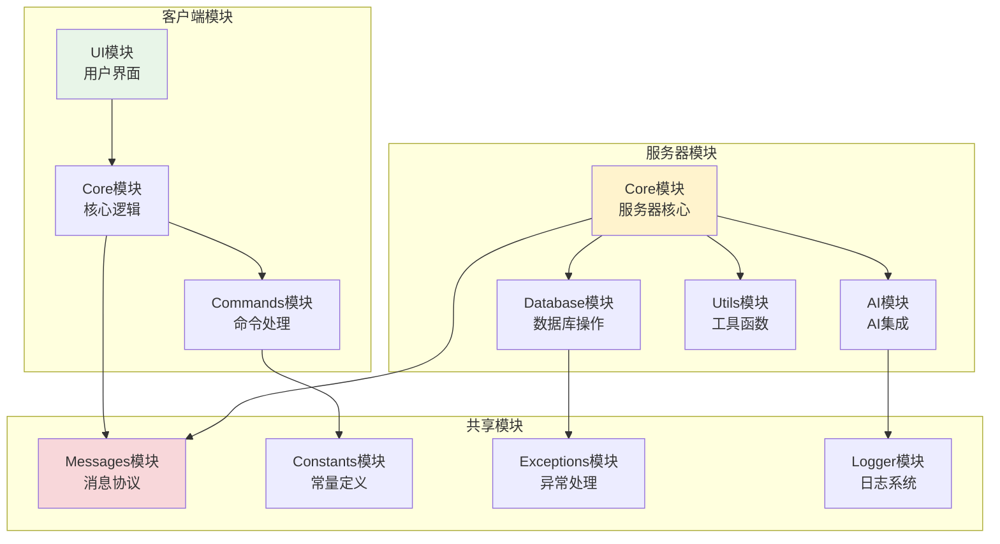

# 模块化设计思想

## 🎯 学习目标

通过本节学习，您将能够：
- 理解模块化设计的核心思想和优势
- 掌握模块划分的原则和方法
- 学会设计清晰的模块接口
- 了解模块间通信的最佳实践
- 在Chat-Room项目中应用模块化设计

## 📖 模块化设计概述

模块化设计是将复杂系统分解为相对独立、功能明确的模块的设计方法。每个模块负责特定的功能，模块间通过定义良好的接口进行交互。

### 模块化设计的核心原则



## 🏗️ Chat-Room项目的模块化架构

### 整体模块架构



## 🔧 模块设计实践

### 1. 消息协议模块设计

```python
"""
消息协议模块 - shared/messages.py
定义系统中所有消息类型和协议
"""

from abc import ABC, abstractmethod
from enum import Enum
from typing import Dict, Any, Optional
from dataclasses import dataclass
import json
import time


class MessageType(Enum):
    """消息类型枚举"""
    # 认证相关
    LOGIN = "login"
    LOGOUT = "logout"
    REGISTER = "register"
    
    # 聊天相关
    CHAT = "chat"
    PRIVATE_CHAT = "private_chat"
    GROUP_CHAT = "group_chat"
    
    # 文件相关
    FILE_UPLOAD = "file_upload"
    FILE_DOWNLOAD = "file_download"
    
    # 系统相关
    SYSTEM = "system"
    ERROR = "error"
    HEARTBEAT = "heartbeat"


@dataclass
class BaseMessage(ABC):
    """消息基类 - 定义所有消息的通用接口"""
    
    message_id: str
    message_type: MessageType
    sender: Optional[str] = None
    timestamp: float = None
    
    def __post_init__(self):
        if self.timestamp is None:
            self.timestamp = time.time()
    
    @abstractmethod
    def to_dict(self) -> Dict[str, Any]:
        """转换为字典格式"""
        pass
    
    @abstractmethod
    def validate(self) -> bool:
        """验证消息格式"""
        pass
    
    def to_json(self) -> str:
        """转换为JSON字符串"""
        return json.dumps(self.to_dict(), ensure_ascii=False)
    
    @classmethod
    @abstractmethod
    def from_dict(cls, data: Dict[str, Any]) -> 'BaseMessage':
        """从字典创建消息对象"""
        pass


@dataclass
class ChatMessage(BaseMessage):
    """聊天消息"""
    
    content: str = ""
    target: Optional[str] = None  # 私聊目标或群组ID
    
    def __post_init__(self):
        super().__post_init__()
        self.message_type = MessageType.CHAT
    
    def to_dict(self) -> Dict[str, Any]:
        return {
            "message_id": self.message_id,
            "type": self.message_type.value,
            "sender": self.sender,
            "content": self.content,
            "target": self.target,
            "timestamp": self.timestamp
        }
    
    def validate(self) -> bool:
        return bool(
            self.message_id and 
            self.sender and 
            self.content.strip()
        )
    
    @classmethod
    def from_dict(cls, data: Dict[str, Any]) -> 'ChatMessage':
        return cls(
            message_id=data["message_id"],
            sender=data.get("sender"),
            content=data.get("content", ""),
            target=data.get("target"),
            timestamp=data.get("timestamp")
        )


class MessageFactory:
    """消息工厂 - 负责创建和解析消息"""
    
    _message_classes = {
        MessageType.CHAT: ChatMessage,
        # 其他消息类型...
    }
    
    @classmethod
    def create_message(cls, message_type: MessageType, **kwargs) -> Optional[BaseMessage]:
        """创建消息对象"""
        message_class = cls._message_classes.get(message_type)
        if not message_class:
            return None
        
        try:
            message = message_class(**kwargs)
            return message if message.validate() else None
        except Exception:
            return None
    
    @classmethod
    def parse_message(cls, json_data: str) -> Optional[BaseMessage]:
        """解析JSON消息"""
        try:
            data = json.loads(json_data)
            message_type = MessageType(data.get("type"))
            message_class = cls._message_classes.get(message_type)
            
            if message_class:
                return message_class.from_dict(data)
            return None
        except Exception:
            return None
```

### 2. 数据库模块设计

```python
"""
数据库模块 - server/database/operations.py
封装所有数据库操作，提供统一接口
"""

from abc import ABC, abstractmethod
from typing import List, Dict, Any, Optional
import sqlite3
import threading


class DatabaseInterface(ABC):
    """数据库接口 - 定义数据库操作的抽象接口"""
    
    @abstractmethod
    def connect(self) -> bool:
        """连接数据库"""
        pass
    
    @abstractmethod
    def disconnect(self) -> None:
        """断开数据库连接"""
        pass
    
    @abstractmethod
    def execute_query(self, query: str, params: tuple = ()) -> List[Dict[str, Any]]:
        """执行查询"""
        pass
    
    @abstractmethod
    def execute_update(self, query: str, params: tuple = ()) -> int:
        """执行更新"""
        pass


class SQLiteDatabase(DatabaseInterface):
    """SQLite数据库实现"""
    
    def __init__(self, db_path: str):
        self.db_path = db_path
        self.connection: Optional[sqlite3.Connection] = None
        self._lock = threading.Lock()
    
    def connect(self) -> bool:
        """连接数据库"""
        try:
            self.connection = sqlite3.connect(
                self.db_path, 
                check_same_thread=False
            )
            self.connection.row_factory = sqlite3.Row
            return True
        except Exception:
            return False
    
    def disconnect(self) -> None:
        """断开数据库连接"""
        if self.connection:
            self.connection.close()
            self.connection = None
    
    def execute_query(self, query: str, params: tuple = ()) -> List[Dict[str, Any]]:
        """执行查询"""
        with self._lock:
            cursor = self.connection.cursor()
            cursor.execute(query, params)
            rows = cursor.fetchall()
            return [dict(row) for row in rows]
    
    def execute_update(self, query: str, params: tuple = ()) -> int:
        """执行更新"""
        with self._lock:
            cursor = self.connection.cursor()
            cursor.execute(query, params)
            self.connection.commit()
            return cursor.rowcount


class UserRepository:
    """用户数据仓库 - 封装用户相关的数据库操作"""
    
    def __init__(self, database: DatabaseInterface):
        self.db = database
    
    def create_user(self, username: str, password_hash: str, email: str = None) -> bool:
        """创建用户"""
        query = """
        INSERT INTO users (username, password_hash, email, created_at)
        VALUES (?, ?, ?, datetime('now'))
        """
        try:
            rows_affected = self.db.execute_update(query, (username, password_hash, email))
            return rows_affected > 0
        except Exception:
            return False
    
    def get_user_by_username(self, username: str) -> Optional[Dict[str, Any]]:
        """根据用户名获取用户"""
        query = "SELECT * FROM users WHERE username = ?"
        results = self.db.execute_query(query, (username,))
        return results[0] if results else None
    
    def update_user_status(self, user_id: int, status: str) -> bool:
        """更新用户状态"""
        query = "UPDATE users SET status = ?, last_active = datetime('now') WHERE id = ?"
        try:
            rows_affected = self.db.execute_update(query, (status, user_id))
            return rows_affected > 0
        except Exception:
            return False
    
    def get_online_users(self) -> List[Dict[str, Any]]:
        """获取在线用户列表"""
        query = "SELECT id, username FROM users WHERE status = 'online'"
        return self.db.execute_query(query)


class ChatRepository:
    """聊天数据仓库 - 封装聊天相关的数据库操作"""
    
    def __init__(self, database: DatabaseInterface):
        self.db = database
    
    def save_message(self, sender_id: int, content: str, 
                    chat_type: str = "public", target_id: int = None) -> bool:
        """保存消息"""
        query = """
        INSERT INTO messages (sender_id, content, chat_type, target_id, created_at)
        VALUES (?, ?, ?, ?, datetime('now'))
        """
        try:
            rows_affected = self.db.execute_update(
                query, (sender_id, content, chat_type, target_id)
            )
            return rows_affected > 0
        except Exception:
            return False
    
    def get_recent_messages(self, limit: int = 50) -> List[Dict[str, Any]]:
        """获取最近的消息"""
        query = """
        SELECT m.*, u.username as sender_name
        FROM messages m
        JOIN users u ON m.sender_id = u.id
        WHERE m.chat_type = 'public'
        ORDER BY m.created_at DESC
        LIMIT ?
        """
        return self.db.execute_query(query, (limit,))
    
    def get_private_messages(self, user1_id: int, user2_id: int, 
                           limit: int = 50) -> List[Dict[str, Any]]:
        """获取私聊消息"""
        query = """
        SELECT m.*, u.username as sender_name
        FROM messages m
        JOIN users u ON m.sender_id = u.id
        WHERE m.chat_type = 'private'
        AND ((m.sender_id = ? AND m.target_id = ?) 
             OR (m.sender_id = ? AND m.target_id = ?))
        ORDER BY m.created_at DESC
        LIMIT ?
        """
        return self.db.execute_query(query, (user1_id, user2_id, user2_id, user1_id, limit))
```

### 3. 用户管理模块设计

```python
"""
用户管理模块 - server/core/user_manager.py
负责用户相关的业务逻辑
"""

import hashlib
import secrets
from typing import Dict, List, Optional
from dataclasses import dataclass
from enum import Enum


class UserStatus(Enum):
    """用户状态枚举"""
    OFFLINE = "offline"
    ONLINE = "online"
    AWAY = "away"
    BUSY = "busy"


@dataclass
class User:
    """用户数据模型"""
    id: int
    username: str
    email: Optional[str] = None
    status: UserStatus = UserStatus.OFFLINE
    last_active: Optional[str] = None
    created_at: Optional[str] = None


class UserManager:
    """用户管理器 - 封装用户相关的业务逻辑"""
    
    def __init__(self, user_repository, logger):
        self.user_repo = user_repository
        self.logger = logger
        self.active_sessions: Dict[str, User] = {}  # session_id -> User
    
    def register_user(self, username: str, password: str, email: str = None) -> bool:
        """注册新用户"""
        # 验证输入
        if not self._validate_username(username):
            self.logger.warning(f"无效的用户名: {username}")
            return False
        
        if not self._validate_password(password):
            self.logger.warning(f"密码不符合要求")
            return False
        
        # 检查用户名是否已存在
        if self.user_repo.get_user_by_username(username):
            self.logger.warning(f"用户名已存在: {username}")
            return False
        
        # 创建用户
        password_hash = self._hash_password(password)
        success = self.user_repo.create_user(username, password_hash, email)
        
        if success:
            self.logger.info(f"用户注册成功: {username}")
        else:
            self.logger.error(f"用户注册失败: {username}")
        
        return success
    
    def authenticate_user(self, username: str, password: str) -> Optional[str]:
        """用户认证，返回session_id"""
        user_data = self.user_repo.get_user_by_username(username)
        if not user_data:
            self.logger.warning(f"用户不存在: {username}")
            return None
        
        # 验证密码
        if not self._verify_password(password, user_data["password_hash"]):
            self.logger.warning(f"密码错误: {username}")
            return None
        
        # 创建会话
        session_id = self._generate_session_id()
        user = User(
            id=user_data["id"],
            username=user_data["username"],
            email=user_data.get("email"),
            status=UserStatus.ONLINE
        )
        
        self.active_sessions[session_id] = user
        
        # 更新用户状态
        self.user_repo.update_user_status(user.id, UserStatus.ONLINE.value)
        
        self.logger.info(f"用户登录成功: {username}")
        return session_id
    
    def logout_user(self, session_id: str) -> bool:
        """用户登出"""
        if session_id not in self.active_sessions:
            return False
        
        user = self.active_sessions[session_id]
        
        # 更新用户状态
        self.user_repo.update_user_status(user.id, UserStatus.OFFLINE.value)
        
        # 移除会话
        del self.active_sessions[session_id]
        
        self.logger.info(f"用户登出: {user.username}")
        return True
    
    def get_user_by_session(self, session_id: str) -> Optional[User]:
        """根据会话ID获取用户"""
        return self.active_sessions.get(session_id)
    
    def get_online_users(self) -> List[User]:
        """获取在线用户列表"""
        return list(self.active_sessions.values())
    
    def _validate_username(self, username: str) -> bool:
        """验证用户名"""
        return (
            len(username) >= 3 and 
            len(username) <= 20 and 
            username.isalnum()
        )
    
    def _validate_password(self, password: str) -> bool:
        """验证密码"""
        return len(password) >= 6
    
    def _hash_password(self, password: str) -> str:
        """密码哈希"""
        salt = secrets.token_hex(16)
        password_hash = hashlib.pbkdf2_hmac('sha256', password.encode(), salt.encode(), 100000)
        return f"{salt}:{password_hash.hex()}"
    
    def _verify_password(self, password: str, stored_hash: str) -> bool:
        """验证密码"""
        try:
            salt, hash_hex = stored_hash.split(':')
            password_hash = hashlib.pbkdf2_hmac('sha256', password.encode(), salt.encode(), 100000)
            return password_hash.hex() == hash_hex
        except Exception:
            return False
    
    def _generate_session_id(self) -> str:
        """生成会话ID"""
        return secrets.token_urlsafe(32)
```

## 🔗 模块间通信

### 1. 事件驱动通信

```python
"""
事件驱动的模块间通信
"""

from typing import Callable, Dict, List
from enum import Enum


class EventType(Enum):
    USER_LOGIN = "user_login"
    USER_LOGOUT = "user_logout"
    MESSAGE_SENT = "message_sent"
    FILE_UPLOADED = "file_uploaded"


class EventBus:
    """事件总线 - 模块间通信的中介"""
    
    def __init__(self):
        self._subscribers: Dict[EventType, List[Callable]] = {}
    
    def subscribe(self, event_type: EventType, callback: Callable) -> None:
        """订阅事件"""
        if event_type not in self._subscribers:
            self._subscribers[event_type] = []
        self._subscribers[event_type].append(callback)
    
    def publish(self, event_type: EventType, data: dict) -> None:
        """发布事件"""
        if event_type in self._subscribers:
            for callback in self._subscribers[event_type]:
                try:
                    callback(data)
                except Exception as e:
                    print(f"事件处理错误: {e}")


# 使用示例
event_bus = EventBus()

# 用户管理器订阅登录事件
def on_user_login(data):
    print(f"用户 {data['username']} 登录了")

event_bus.subscribe(EventType.USER_LOGIN, on_user_login)

# 发布登录事件
event_bus.publish(EventType.USER_LOGIN, {"username": "test_user"})
```

## 📊 模块化设计的优势

### 1. 可维护性
- **职责分离**：每个模块职责明确，易于理解和修改
- **影响范围小**：修改一个模块不会影响其他模块
- **测试简单**：可以独立测试每个模块

### 2. 可扩展性
- **功能扩展**：可以轻松添加新模块
- **接口稳定**：模块接口稳定，内部实现可以改变
- **插件架构**：支持插件式的功能扩展

### 3. 可重用性
- **模块复用**：模块可以在不同项目中重用
- **组合灵活**：可以灵活组合不同模块
- **标准化**：统一的接口标准

## 📋 学习检查清单

完成本节学习后，请确认您能够：

- [ ] 理解模块化设计的核心思想
- [ ] 掌握模块划分的原则和方法
- [ ] 设计清晰的模块接口
- [ ] 实现模块间的有效通信
- [ ] 在实际项目中应用模块化设计

## 🚀 下一步

完成模块化设计学习后，请继续学习：
- [包管理与依赖控制](package-management.md)
- [配置管理最佳实践](configuration-management.md)

---


## 📖 导航

⬅️ **上一节：** [Project Organization](project-organization.md)

➡️ **下一节：** [Pep8 Standards](pep8-standards.md)

📚 **返回：** [第4章：软件工程](README.md)

🏠 **主页：** [学习路径总览](../README.md)
**模块化设计让代码更清晰、更易维护！** 🧩
