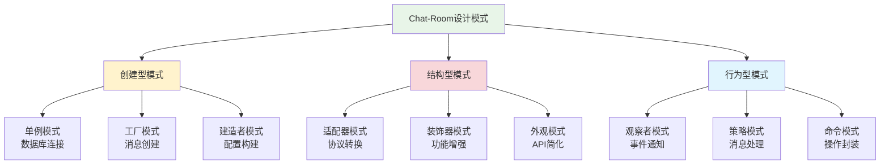

# Chat-Room中的设计模式

## 🎯 学习目标

通过本节学习，您将能够：
- 理解设计模式在实际项目中的应用
- 识别Chat-Room项目中使用的设计模式
- 掌握常用设计模式的实现方法
- 学会在自己的项目中应用设计模式
- 理解设计模式如何提高代码质量

## 📖 设计模式概述

设计模式是软件设计中常见问题的典型解决方案。它们就像预先制作的蓝图，可以定制来解决代码中的重复设计问题。

### Chat-Room项目中的设计模式分布



## 🏗️ 创建型模式

### 1. 单例模式 - 数据库连接管理

**应用场景**：确保数据库连接管理器在整个应用中只有一个实例。

```python
"""
单例模式实现 - 数据库连接管理器
确保整个应用只有一个数据库连接实例
"""

import sqlite3
import threading
from typing import Optional


class DatabaseManager:
    """
    数据库管理器单例类
    
    使用单例模式确保整个应用只有一个数据库连接实例，
    避免多个连接导致的资源浪费和数据不一致问题。
    """
    
    _instance: Optional['DatabaseManager'] = None
    _lock = threading.Lock()
    
    def __new__(cls, db_path: str = "chatroom.db"):
        """
        创建单例实例
        
        使用双重检查锁定模式确保线程安全的单例创建
        """
        if cls._instance is None:
            with cls._lock:
                # 双重检查，防止多线程环境下创建多个实例
                if cls._instance is None:
                    cls._instance = super().__new__(cls)
                    cls._instance._initialized = False
        return cls._instance
    
    def __init__(self, db_path: str = "chatroom.db"):
        """初始化数据库连接"""
        if self._initialized:
            return
        
        self.db_path = db_path
        self.connection: Optional[sqlite3.Connection] = None
        self._lock = threading.Lock()
        self._connect()
        self._initialized = True
    
    def _connect(self) -> None:
        """建立数据库连接"""
        try:
            self.connection = sqlite3.connect(
                self.db_path, 
                check_same_thread=False
            )
            self.connection.row_factory = sqlite3.Row
            print(f"数据库连接已建立: {self.db_path}")
        except Exception as e:
            print(f"数据库连接失败: {e}")
            raise
    
    def get_connection(self) -> sqlite3.Connection:
        """获取数据库连接"""
        if self.connection is None:
            with self._lock:
                if self.connection is None:
                    self._connect()
        return self.connection
    
    def execute_query(self, query: str, params: tuple = ()) -> list:
        """执行查询语句"""
        with self._lock:
            cursor = self.get_connection().cursor()
            cursor.execute(query, params)
            return cursor.fetchall()
    
    def execute_update(self, query: str, params: tuple = ()) -> int:
        """执行更新语句"""
        with self._lock:
            cursor = self.get_connection().cursor()
            cursor.execute(query, params)
            self.connection.commit()
            return cursor.rowcount
    
    def close(self) -> None:
        """关闭数据库连接"""
        if self.connection:
            self.connection.close()
            self.connection = None
            print("数据库连接已关闭")


# 使用示例
def demonstrate_singleton_pattern():
    """演示单例模式的使用"""
    print("=== 单例模式演示 ===")
    
    # 创建多个实例，实际上都是同一个对象
    db1 = DatabaseManager("chatroom.db")
    db2 = DatabaseManager("another.db")  # 参数会被忽略
    db3 = DatabaseManager()
    
    # 验证是否为同一个实例
    print(f"db1 is db2: {db1 is db2}")  # True
    print(f"db2 is db3: {db2 is db3}")  # True
    print(f"实例ID: db1={id(db1)}, db2={id(db2)}, db3={id(db3)}")
```

### 2. 工厂模式 - 消息对象创建

**应用场景**：根据不同的消息类型创建相应的消息对象。

```python
"""
工厂模式实现 - 消息对象创建
根据消息类型创建不同的消息对象
"""

from abc import ABC, abstractmethod
from enum import Enum
from typing import Dict, Any, Optional
from dataclasses import dataclass
import time


class MessageType(Enum):
    """消息类型枚举"""
    CHAT = "chat"
    LOGIN = "login"
    LOGOUT = "logout"
    FILE_TRANSFER = "file_transfer"
    SYSTEM = "system"
    ERROR = "error"


@dataclass
class BaseMessage(ABC):
    """消息基类"""
    message_type: MessageType
    sender: Optional[str] = None
    timestamp: float = None
    
    def __post_init__(self):
        if self.timestamp is None:
            self.timestamp = time.time()
    
    @abstractmethod
    def to_dict(self) -> Dict[str, Any]:
        """转换为字典格式"""
        pass
    
    @abstractmethod
    def validate(self) -> bool:
        """验证消息格式"""
        pass


@dataclass
class ChatMessage(BaseMessage):
    """聊天消息"""
    content: str = ""
    target_user: Optional[str] = None
    chat_group: Optional[str] = None
    
    def __post_init__(self):
        super().__post_init__()
        self.message_type = MessageType.CHAT
    
    def to_dict(self) -> Dict[str, Any]:
        return {
            "type": self.message_type.value,
            "sender": self.sender,
            "content": self.content,
            "target_user": self.target_user,
            "chat_group": self.chat_group,
            "timestamp": self.timestamp
        }
    
    def validate(self) -> bool:
        return bool(self.content.strip() and self.sender)


@dataclass
class LoginMessage(BaseMessage):
    """登录消息"""
    username: str = ""
    password: str = ""
    
    def __post_init__(self):
        super().__post_init__()
        self.message_type = MessageType.LOGIN
    
    def to_dict(self) -> Dict[str, Any]:
        return {
            "type": self.message_type.value,
            "username": self.username,
            "password": self.password,
            "timestamp": self.timestamp
        }
    
    def validate(self) -> bool:
        return bool(self.username.strip() and self.password.strip())


@dataclass
class FileTransferMessage(BaseMessage):
    """文件传输消息"""
    filename: str = ""
    file_size: int = 0
    file_hash: str = ""
    chunk_data: Optional[bytes] = None
    
    def __post_init__(self):
        super().__post_init__()
        self.message_type = MessageType.FILE_TRANSFER
    
    def to_dict(self) -> Dict[str, Any]:
        return {
            "type": self.message_type.value,
            "sender": self.sender,
            "filename": self.filename,
            "file_size": self.file_size,
            "file_hash": self.file_hash,
            "timestamp": self.timestamp
        }
    
    def validate(self) -> bool:
        return bool(self.filename.strip() and self.file_size > 0)


class MessageFactory:
    """
    消息工厂类
    
    使用工厂模式根据消息类型创建相应的消息对象，
    简化消息对象的创建过程并确保类型安全。
    """
    
    # 消息类型到类的映射
    _message_classes = {
        MessageType.CHAT: ChatMessage,
        MessageType.LOGIN: LoginMessage,
        MessageType.FILE_TRANSFER: FileTransferMessage,
    }
    
    @classmethod
    def create_message(cls, message_type: MessageType, 
                      **kwargs) -> Optional[BaseMessage]:
        """
        创建消息对象
        
        Args:
            message_type: 消息类型
            **kwargs: 消息参数
            
        Returns:
            BaseMessage: 创建的消息对象，如果类型不支持则返回None
        """
        message_class = cls._message_classes.get(message_type)
        if message_class is None:
            print(f"不支持的消息类型: {message_type}")
            return None
        
        try:
            message = message_class(**kwargs)
            if message.validate():
                return message
            else:
                print(f"消息验证失败: {kwargs}")
                return None
        except Exception as e:
            print(f"创建消息对象失败: {e}")
            return None
    
    @classmethod
    def create_from_dict(cls, data: Dict[str, Any]) -> Optional[BaseMessage]:
        """
        从字典创建消息对象
        
        Args:
            data: 消息数据字典
            
        Returns:
            BaseMessage: 创建的消息对象
        """
        try:
            message_type_str = data.get("type")
            if not message_type_str:
                return None
            
            message_type = MessageType(message_type_str)
            
            # 移除type字段，避免重复传递
            message_data = {k: v for k, v in data.items() if k != "type"}
            
            return cls.create_message(message_type, **message_data)
            
        except ValueError as e:
            print(f"无效的消息类型: {message_type_str}")
            return None
        except Exception as e:
            print(f"从字典创建消息失败: {e}")
            return None
    
    @classmethod
    def register_message_type(cls, message_type: MessageType, 
                            message_class: type) -> None:
        """
        注册新的消息类型
        
        Args:
            message_type: 消息类型
            message_class: 消息类
        """
        cls._message_classes[message_type] = message_class
        print(f"注册消息类型: {message_type.value} -> {message_class.__name__}")


# 使用示例
def demonstrate_factory_pattern():
    """演示工厂模式的使用"""
    print("\n=== 工厂模式演示 ===")
    
    # 创建不同类型的消息
    chat_msg = MessageFactory.create_message(
        MessageType.CHAT,
        sender="张三",
        content="Hello, World!",
        target_user="李四"
    )
    
    login_msg = MessageFactory.create_message(
        MessageType.LOGIN,
        username="test_user",
        password="password123"
    )
    
    file_msg = MessageFactory.create_message(
        MessageType.FILE_TRANSFER,
        sender="张三",
        filename="document.pdf",
        file_size=1024000,
        file_hash="abc123def456"
    )
    
    # 打印消息信息
    messages = [chat_msg, login_msg, file_msg]
    for msg in messages:
        if msg:
            print(f"消息类型: {msg.message_type.value}")
            print(f"消息内容: {msg.to_dict()}")
            print(f"验证结果: {msg.validate()}")
            print("-" * 40)
    
    # 从字典创建消息
    dict_data = {
        "type": "chat",
        "sender": "王五",
        "content": "这是从字典创建的消息",
        "timestamp": time.time()
    }
    
    dict_msg = MessageFactory.create_from_dict(dict_data)
    if dict_msg:
        print(f"从字典创建的消息: {dict_msg.to_dict()}")
```

## 🔗 结构型模式

### 1. 适配器模式 - 协议转换

**应用场景**：将不同的网络协议或数据格式转换为统一的内部格式。

```python
"""
适配器模式实现 - 协议转换
将不同的网络协议转换为统一的内部消息格式
"""

from abc import ABC, abstractmethod
from typing import Dict, Any
import json
import xml.etree.ElementTree as ET


class MessageProtocol(ABC):
    """消息协议接口"""
    
    @abstractmethod
    def serialize(self, data: Dict[str, Any]) -> str:
        """序列化数据"""
        pass
    
    @abstractmethod
    def deserialize(self, data: str) -> Dict[str, Any]:
        """反序列化数据"""
        pass


class JSONProtocol(MessageProtocol):
    """JSON协议实现"""
    
    def serialize(self, data: Dict[str, Any]) -> str:
        return json.dumps(data, ensure_ascii=False)
    
    def deserialize(self, data: str) -> Dict[str, Any]:
        return json.loads(data)


class XMLProtocol(MessageProtocol):
    """XML协议实现（第三方协议，接口不兼容）"""
    
    def to_xml(self, data: Dict[str, Any]) -> str:
        """转换为XML格式"""
        root = ET.Element("message")
        for key, value in data.items():
            elem = ET.SubElement(root, key)
            elem.text = str(value)
        return ET.tostring(root, encoding='unicode')
    
    def from_xml(self, xml_data: str) -> Dict[str, Any]:
        """从XML格式解析"""
        root = ET.fromstring(xml_data)
        return {child.tag: child.text for child in root}


class XMLProtocolAdapter(MessageProtocol):
    """
    XML协议适配器
    
    将XMLProtocol的接口适配为MessageProtocol接口，
    使其能够与系统的其他部分兼容。
    """
    
    def __init__(self, xml_protocol: XMLProtocol):
        self.xml_protocol = xml_protocol
    
    def serialize(self, data: Dict[str, Any]) -> str:
        """适配serialize方法"""
        return self.xml_protocol.to_xml(data)
    
    def deserialize(self, data: str) -> Dict[str, Any]:
        """适配deserialize方法"""
        return self.xml_protocol.from_xml(data)


class ProtocolManager:
    """协议管理器"""
    
    def __init__(self):
        self.protocols: Dict[str, MessageProtocol] = {}
        self._setup_protocols()
    
    def _setup_protocols(self):
        """设置支持的协议"""
        # 直接支持的协议
        self.protocols["json"] = JSONProtocol()
        
        # 通过适配器支持的协议
        xml_protocol = XMLProtocol()
        self.protocols["xml"] = XMLProtocolAdapter(xml_protocol)
    
    def send_message(self, protocol_name: str, data: Dict[str, Any]) -> str:
        """使用指定协议发送消息"""
        protocol = self.protocols.get(protocol_name)
        if not protocol:
            raise ValueError(f"不支持的协议: {protocol_name}")
        
        return protocol.serialize(data)
    
    def receive_message(self, protocol_name: str, data: str) -> Dict[str, Any]:
        """使用指定协议接收消息"""
        protocol = self.protocols.get(protocol_name)
        if not protocol:
            raise ValueError(f"不支持的协议: {protocol_name}")
        
        return protocol.deserialize(data)


# 使用示例
def demonstrate_adapter_pattern():
    """演示适配器模式的使用"""
    print("\n=== 适配器模式演示 ===")
    
    manager = ProtocolManager()
    
    # 测试数据
    test_data = {
        "type": "chat",
        "sender": "张三",
        "content": "Hello, World!",
        "timestamp": "1234567890"
    }
    
    # 使用JSON协议
    json_data = manager.send_message("json", test_data)
    print(f"JSON格式: {json_data}")
    
    received_json = manager.receive_message("json", json_data)
    print(f"JSON解析: {received_json}")
    
    # 使用XML协议（通过适配器）
    xml_data = manager.send_message("xml", test_data)
    print(f"XML格式: {xml_data}")
    
    received_xml = manager.receive_message("xml", xml_data)
    print(f"XML解析: {received_xml}")
```

## 🎭 行为型模式

### 1. 观察者模式 - 事件通知系统

**应用场景**：当用户状态发生变化时，通知所有相关的组件。

```python
"""
观察者模式实现 - 事件通知系统
当用户状态或消息事件发生时，通知所有订阅的观察者
"""

from abc import ABC, abstractmethod
from typing import List, Dict, Any
from enum import Enum


class EventType(Enum):
    """事件类型"""
    USER_LOGIN = "user_login"
    USER_LOGOUT = "user_logout"
    MESSAGE_RECEIVED = "message_received"
    FILE_UPLOADED = "file_uploaded"
    ERROR_OCCURRED = "error_occurred"


class Observer(ABC):
    """观察者接口"""
    
    @abstractmethod
    def update(self, event_type: EventType, data: Dict[str, Any]) -> None:
        """处理事件通知"""
        pass


class Subject(ABC):
    """主题接口"""
    
    @abstractmethod
    def attach(self, observer: Observer) -> None:
        """添加观察者"""
        pass
    
    @abstractmethod
    def detach(self, observer: Observer) -> None:
        """移除观察者"""
        pass
    
    @abstractmethod
    def notify(self, event_type: EventType, data: Dict[str, Any]) -> None:
        """通知所有观察者"""
        pass


class EventManager(Subject):
    """
    事件管理器
    
    实现观察者模式的主题角色，管理所有观察者并负责事件通知。
    支持按事件类型订阅，提高通知效率。
    """
    
    def __init__(self):
        # 按事件类型分组的观察者列表
        self._observers: Dict[EventType, List[Observer]] = {}
        # 全局观察者列表（订阅所有事件）
        self._global_observers: List[Observer] = []
    
    def attach(self, observer: Observer, event_types: List[EventType] = None) -> None:
        """
        添加观察者
        
        Args:
            observer: 观察者对象
            event_types: 订阅的事件类型列表，如果为None则订阅所有事件
        """
        if event_types is None:
            # 订阅所有事件
            if observer not in self._global_observers:
                self._global_observers.append(observer)
                print(f"观察者 {observer.__class__.__name__} 订阅了所有事件")
        else:
            # 订阅特定事件
            for event_type in event_types:
                if event_type not in self._observers:
                    self._observers[event_type] = []
                
                if observer not in self._observers[event_type]:
                    self._observers[event_type].append(observer)
                    print(f"观察者 {observer.__class__.__name__} 订阅了事件 {event_type.value}")
    
    def detach(self, observer: Observer, event_types: List[EventType] = None) -> None:
        """
        移除观察者
        
        Args:
            observer: 观察者对象
            event_types: 取消订阅的事件类型列表，如果为None则取消所有订阅
        """
        if event_types is None:
            # 取消所有订阅
            if observer in self._global_observers:
                self._global_observers.remove(observer)
            
            for event_type in self._observers:
                if observer in self._observers[event_type]:
                    self._observers[event_type].remove(observer)
            
            print(f"观察者 {observer.__class__.__name__} 取消了所有订阅")
        else:
            # 取消特定事件订阅
            for event_type in event_types:
                if event_type in self._observers and observer in self._observers[event_type]:
                    self._observers[event_type].remove(observer)
                    print(f"观察者 {observer.__class__.__name__} 取消了事件 {event_type.value} 的订阅")
    
    def notify(self, event_type: EventType, data: Dict[str, Any]) -> None:
        """
        通知观察者
        
        Args:
            event_type: 事件类型
            data: 事件数据
        """
        print(f"触发事件: {event_type.value}")
        
        # 通知全局观察者
        for observer in self._global_observers:
            try:
                observer.update(event_type, data)
            except Exception as e:
                print(f"通知观察者 {observer.__class__.__name__} 时出错: {e}")
        
        # 通知特定事件的观察者
        if event_type in self._observers:
            for observer in self._observers[event_type]:
                try:
                    observer.update(event_type, data)
                except Exception as e:
                    print(f"通知观察者 {observer.__class__.__name__} 时出错: {e}")


# 具体观察者实现
class UINotificationObserver(Observer):
    """UI通知观察者"""
    
    def update(self, event_type: EventType, data: Dict[str, Any]) -> None:
        """更新UI显示"""
        if event_type == EventType.USER_LOGIN:
            username = data.get("username", "未知用户")
            print(f"[UI] 用户 {username} 已登录")
        
        elif event_type == EventType.MESSAGE_RECEIVED:
            sender = data.get("sender", "未知发送者")
            content = data.get("content", "")
            print(f"[UI] 收到来自 {sender} 的消息: {content}")
        
        elif event_type == EventType.ERROR_OCCURRED:
            error_msg = data.get("error", "未知错误")
            print(f"[UI] 错误提示: {error_msg}")


class LoggingObserver(Observer):
    """日志记录观察者"""
    
    def update(self, event_type: EventType, data: Dict[str, Any]) -> None:
        """记录日志"""
        print(f"[LOG] 事件: {event_type.value}, 数据: {data}")


class StatisticsObserver(Observer):
    """统计观察者"""
    
    def __init__(self):
        self.stats = {
            "login_count": 0,
            "message_count": 0,
            "error_count": 0
        }
    
    def update(self, event_type: EventType, data: Dict[str, Any]) -> None:
        """更新统计数据"""
        if event_type == EventType.USER_LOGIN:
            self.stats["login_count"] += 1
        elif event_type == EventType.MESSAGE_RECEIVED:
            self.stats["message_count"] += 1
        elif event_type == EventType.ERROR_OCCURRED:
            self.stats["error_count"] += 1
        
        print(f"[STATS] 当前统计: {self.stats}")


# 使用示例
def demonstrate_observer_pattern():
    """演示观察者模式的使用"""
    print("\n=== 观察者模式演示 ===")
    
    # 创建事件管理器
    event_manager = EventManager()
    
    # 创建观察者
    ui_observer = UINotificationObserver()
    log_observer = LoggingObserver()
    stats_observer = StatisticsObserver()
    
    # 订阅事件
    event_manager.attach(ui_observer, [EventType.USER_LOGIN, EventType.MESSAGE_RECEIVED])
    event_manager.attach(log_observer)  # 订阅所有事件
    event_manager.attach(stats_observer, [EventType.USER_LOGIN, EventType.MESSAGE_RECEIVED, EventType.ERROR_OCCURRED])
    
    print("\n--- 触发事件 ---")
    
    # 触发用户登录事件
    event_manager.notify(EventType.USER_LOGIN, {
        "username": "张三",
        "user_id": "user_001",
        "login_time": "2024-01-01 10:00:00"
    })
    
    # 触发消息接收事件
    event_manager.notify(EventType.MESSAGE_RECEIVED, {
        "sender": "李四",
        "content": "Hello, 张三!",
        "timestamp": "2024-01-01 10:01:00"
    })
    
    # 触发错误事件
    event_manager.notify(EventType.ERROR_OCCURRED, {
        "error": "网络连接超时",
        "error_code": "NETWORK_TIMEOUT"
    })


# 运行所有演示
if __name__ == "__main__":
    demonstrate_singleton_pattern()
    demonstrate_factory_pattern()
    demonstrate_adapter_pattern()
    demonstrate_observer_pattern()
```

## 📊 设计模式的优势

### 1. 代码复用性
- 提供经过验证的解决方案
- 减少重复代码的编写
- 提高开发效率

### 2. 可维护性
- 代码结构清晰，易于理解
- 修改和扩展更加容易
- 降低维护成本

### 3. 可扩展性
- 支持功能的灵活扩展
- 新需求的快速实现
- 系统架构的平滑演进

## 📋 学习检查清单

完成本节学习后，请确认您能够：

- [ ] 理解设计模式的基本概念
- [ ] 识别Chat-Room项目中的设计模式
- [ ] 实现单例、工厂、适配器、观察者模式
- [ ] 理解每种模式的适用场景
- [ ] 在自己的项目中应用设计模式

## 🚀 下一步

完成设计模式学习后，请继续学习：
- [项目组织原则](project-organization.md)
- [模块化设计思想](modular-design.md)

---

**掌握设计模式，构建优雅的软件架构！** 🏗️
