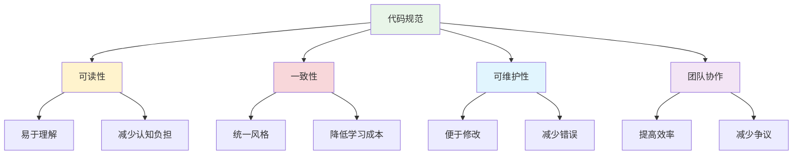

# PEP 8代码规范详解

## 🎯 学习目标

通过本节学习，您将能够：
- 理解PEP 8规范的重要性和基本原则
- 掌握Python代码的格式化规范
- 学会命名约定和代码组织方法
- 了解代码质量工具的使用
- 在Chat-Room项目中应用代码规范

## 📖 PEP 8简介

PEP 8是Python官方的代码风格指南，定义了Python代码的编写规范。遵循PEP 8可以让代码更加可读、一致和专业。

### 为什么需要代码规范？



## 🔧 代码布局规范

### 1. 缩进

**使用4个空格进行缩进，不要使用制表符。**

```python
# ✅ 正确的缩进
def send_message(self, message: str) -> bool:
    """发送消息到服务器"""
    if not message.strip():
        return False
    
    try:
        # 格式化消息
        formatted_message = {
            "type": "chat",
            "content": message,
            "timestamp": time.time()
        }
        
        # 发送消息
        self.socket.send(json.dumps(formatted_message).encode())
        return True
    except Exception as e:
        self.logger.error(f"发送消息失败: {e}")
        return False

# ❌ 错误的缩进（使用制表符或不一致的空格）
def send_message(self, message: str) -> bool:
	"""发送消息到服务器"""  # 使用了制表符
  if not message.strip():  # 只有2个空格
        return False  # 8个空格，不一致
```

### 2. 行长度

**每行代码不超过79个字符，文档字符串和注释不超过72个字符。**

```python
# ✅ 正确的行长度处理
def create_chat_message(self, user_id: int, content: str, 
                       chat_group_id: int = None) -> ChatMessage:
    """
    创建聊天消息对象
    
    Args:
        user_id: 用户ID
        content: 消息内容
        chat_group_id: 聊天组ID，可选
    
    Returns:
        ChatMessage: 创建的消息对象
    """
    return ChatMessage(
        user_id=user_id,
        content=content,
        chat_group_id=chat_group_id,
        timestamp=datetime.now()
    )

# ❌ 行太长
def create_chat_message(self, user_id: int, content: str, chat_group_id: int = None) -> ChatMessage:
    """创建聊天消息对象，包含用户ID、消息内容、聊天组ID和时间戳等信息"""
    return ChatMessage(user_id=user_id, content=content, chat_group_id=chat_group_id, timestamp=datetime.now())
```

### 3. 空行

**使用空行来分隔逻辑相关的代码块。**

```python
# ✅ 正确的空行使用
import socket
import json
import threading
from typing import Dict, List, Optional

from shared.messages import Message
from shared.logger import get_logger


class ChatServer:
    """聊天服务器类"""
    
    def __init__(self, host: str = "localhost", port: int = 8888):
        """初始化服务器"""
        self.host = host
        self.port = port
        self.clients: Dict[str, socket.socket] = {}
        self.logger = get_logger(__name__)
    
    def start_server(self) -> None:
        """启动服务器"""
        self.server_socket = socket.socket(socket.AF_INET, socket.SOCK_STREAM)
        self.server_socket.setsockopt(socket.SOL_SOCKET, socket.SO_REUSEADDR, 1)
        
        try:
            self.server_socket.bind((self.host, self.port))
            self.server_socket.listen(5)
            self.logger.info(f"服务器启动在 {self.host}:{self.port}")
            
            self._accept_connections()
        except Exception as e:
            self.logger.error(f"服务器启动失败: {e}")
            raise
    
    def _accept_connections(self) -> None:
        """接受客户端连接"""
        while True:
            try:
                client_socket, address = self.server_socket.accept()
                self.logger.info(f"新客户端连接: {address}")
                
                # 为每个客户端创建处理线程
                client_thread = threading.Thread(
                    target=self._handle_client,
                    args=(client_socket, address)
                )
                client_thread.daemon = True
                client_thread.start()
                
            except Exception as e:
                self.logger.error(f"接受连接失败: {e}")
```

## 📝 命名约定

### 1. 变量和函数命名

**使用小写字母和下划线（snake_case）。**

```python
# ✅ 正确的命名
user_name = "张三"
message_count = 0
chat_group_id = 123

def send_message(content: str) -> bool:
    """发送消息"""
    pass

def get_user_by_id(user_id: int) -> Optional[User]:
    """根据ID获取用户"""
    pass

def calculate_message_hash(message: str) -> str:
    """计算消息哈希值"""
    pass

# ❌ 错误的命名
userName = "张三"  # 驼峰命名法，不符合Python规范
MessageCount = 0  # 首字母大写
chatgroupid = 123  # 没有下划线分隔

def SendMessage(content: str) -> bool:  # 函数名使用大写
    pass

def getUserById(user_id: int) -> Optional[User]:  # 驼峰命名法
    pass
```

### 2. 类命名

**使用首字母大写的驼峰命名法（PascalCase）。**

```python
# ✅ 正确的类命名
class ChatServer:
    """聊天服务器"""
    pass

class UserManager:
    """用户管理器"""
    pass

class MessageHandler:
    """消息处理器"""
    pass

class DatabaseConnection:
    """数据库连接"""
    pass

# ❌ 错误的类命名
class chatServer:  # 首字母应该大写
    pass

class user_manager:  # 应该使用驼峰命名法
    pass

class messagehandler:  # 缺少大写字母分隔
    pass
```

### 3. 常量命名

**使用全大写字母和下划线。**

```python
# ✅ 正确的常量命名
DEFAULT_PORT = 8888
MAX_MESSAGE_LENGTH = 1024
CONNECTION_TIMEOUT = 30
SERVER_HOST = "localhost"

# Chat-Room项目中的常量示例
MESSAGE_TYPES = {
    "CHAT": "chat",
    "LOGIN": "login",
    "LOGOUT": "logout",
    "FILE_TRANSFER": "file_transfer"
}

# ❌ 错误的常量命名
default_port = 8888  # 应该全大写
MaxMessageLength = 1024  # 不应该使用驼峰命名法
connectionTimeout = 30  # 应该全大写并使用下划线
```

## 🏗️ Chat-Room项目中的PEP 8应用

### 实际代码示例

```python
"""
Chat-Room客户端核心模块
遵循PEP 8规范的代码示例
"""

import socket
import json
import threading
import time
from typing import Dict, List, Optional, Callable
from dataclasses import dataclass
from enum import Enum

from shared.messages import Message, MessageType
from shared.exceptions import ConnectionError, AuthenticationError
from shared.logger import get_logger


class ConnectionStatus(Enum):
    """连接状态枚举"""
    DISCONNECTED = "disconnected"
    CONNECTING = "connecting"
    CONNECTED = "connected"
    RECONNECTING = "reconnecting"


@dataclass
class ClientConfig:
    """客户端配置"""
    host: str = "localhost"
    port: int = 8888
    timeout: int = 30
    max_retries: int = 3
    retry_delay: float = 1.0


class ChatClient:
    """
    聊天客户端类
    
    负责与服务器建立连接、发送和接收消息、处理用户认证等功能。
    遵循PEP 8代码规范，提供清晰的接口和良好的错误处理。
    """
    
    def __init__(self, config: ClientConfig = None):
        """
        初始化聊天客户端
        
        Args:
            config: 客户端配置，如果为None则使用默认配置
        """
        self.config = config or ClientConfig()
        self.socket: Optional[socket.socket] = None
        self.status = ConnectionStatus.DISCONNECTED
        self.user_id: Optional[str] = None
        self.message_handlers: Dict[MessageType, Callable] = {}
        self.logger = get_logger(__name__)
        
        # 初始化消息处理器
        self._setup_message_handlers()
    
    def _setup_message_handlers(self) -> None:
        """设置消息处理器"""
        self.message_handlers = {
            MessageType.CHAT: self._handle_chat_message,
            MessageType.LOGIN_RESPONSE: self._handle_login_response,
            MessageType.USER_LIST: self._handle_user_list,
            MessageType.FILE_TRANSFER: self._handle_file_transfer,
            MessageType.ERROR: self._handle_error_message
        }
    
    def connect(self) -> bool:
        """
        连接到服务器
        
        Returns:
            bool: 连接是否成功
            
        Raises:
            ConnectionError: 连接失败时抛出
        """
        if self.status == ConnectionStatus.CONNECTED:
            self.logger.warning("客户端已经连接")
            return True
        
        self.status = ConnectionStatus.CONNECTING
        
        try:
            # 创建socket连接
            self.socket = socket.socket(socket.AF_INET, socket.SOCK_STREAM)
            self.socket.settimeout(self.config.timeout)
            
            # 连接到服务器
            self.socket.connect((self.config.host, self.config.port))
            
            # 启动消息接收线程
            self._start_message_receiver()
            
            self.status = ConnectionStatus.CONNECTED
            self.logger.info(f"成功连接到服务器 {self.config.host}:{self.config.port}")
            return True
            
        except socket.error as e:
            self.status = ConnectionStatus.DISCONNECTED
            error_msg = f"连接服务器失败: {e}"
            self.logger.error(error_msg)
            raise ConnectionError(error_msg) from e
    
    def disconnect(self) -> None:
        """断开与服务器的连接"""
        if self.socket:
            try:
                self.socket.close()
            except Exception as e:
                self.logger.error(f"关闭socket连接时出错: {e}")
            finally:
                self.socket = None
                self.status = ConnectionStatus.DISCONNECTED
                self.user_id = None
                self.logger.info("已断开与服务器的连接")
    
    def login(self, username: str, password: str) -> bool:
        """
        用户登录
        
        Args:
            username: 用户名
            password: 密码
            
        Returns:
            bool: 登录是否成功
            
        Raises:
            ConnectionError: 未连接到服务器时抛出
            AuthenticationError: 认证失败时抛出
        """
        if self.status != ConnectionStatus.CONNECTED:
            raise ConnectionError("未连接到服务器")
        
        # 构造登录消息
        login_message = Message(
            type=MessageType.LOGIN,
            data={
                "username": username,
                "password": password,
                "timestamp": time.time()
            }
        )
        
        # 发送登录请求
        return self._send_message(login_message)
    
    def send_chat_message(self, content: str, 
                         target_user: str = None,
                         chat_group: str = None) -> bool:
        """
        发送聊天消息
        
        Args:
            content: 消息内容
            target_user: 目标用户（私聊）
            chat_group: 聊天组（群聊）
            
        Returns:
            bool: 发送是否成功
        """
        if not content.strip():
            self.logger.warning("消息内容不能为空")
            return False
        
        # 构造聊天消息
        chat_message = Message(
            type=MessageType.CHAT,
            sender=self.user_id,
            data={
                "content": content,
                "target_user": target_user,
                "chat_group": chat_group,
                "timestamp": time.time()
            }
        )
        
        return self._send_message(chat_message)
    
    def _send_message(self, message: Message) -> bool:
        """
        发送消息到服务器
        
        Args:
            message: 要发送的消息对象
            
        Returns:
            bool: 发送是否成功
        """
        if not self.socket:
            self.logger.error("Socket连接不存在")
            return False
        
        try:
            # 序列化消息
            message_data = json.dumps(message.to_dict()).encode('utf-8')
            message_length = len(message_data)
            
            # 发送消息长度（4字节）
            self.socket.send(message_length.to_bytes(4, byteorder='big'))
            
            # 发送消息内容
            self.socket.send(message_data)
            
            self.logger.debug(f"发送消息: {message.type.value}")
            return True
            
        except Exception as e:
            self.logger.error(f"发送消息失败: {e}")
            return False
    
    def _start_message_receiver(self) -> None:
        """启动消息接收线程"""
        receiver_thread = threading.Thread(
            target=self._message_receiver_loop,
            name="MessageReceiver"
        )
        receiver_thread.daemon = True
        receiver_thread.start()
    
    def _message_receiver_loop(self) -> None:
        """消息接收循环"""
        while self.status == ConnectionStatus.CONNECTED and self.socket:
            try:
                # 接收消息
                message = self._receive_message()
                if message:
                    self._process_message(message)
                    
            except Exception as e:
                self.logger.error(f"接收消息时出错: {e}")
                break
        
        # 连接断开时的清理工作
        self.disconnect()
    
    def _receive_message(self) -> Optional[Message]:
        """
        从服务器接收消息
        
        Returns:
            Optional[Message]: 接收到的消息，如果失败则返回None
        """
        try:
            # 接收消息长度（4字节）
            length_data = self.socket.recv(4)
            if not length_data:
                return None
            
            message_length = int.from_bytes(length_data, byteorder='big')
            
            # 接收消息内容
            message_data = b''
            while len(message_data) < message_length:
                chunk = self.socket.recv(message_length - len(message_data))
                if not chunk:
                    return None
                message_data += chunk
            
            # 反序列化消息
            message_dict = json.loads(message_data.decode('utf-8'))
            return Message.from_dict(message_dict)
            
        except Exception as e:
            self.logger.error(f"接收消息失败: {e}")
            return None
    
    def _process_message(self, message: Message) -> None:
        """
        处理接收到的消息
        
        Args:
            message: 接收到的消息对象
        """
        handler = self.message_handlers.get(message.type)
        if handler:
            try:
                handler(message)
            except Exception as e:
                self.logger.error(f"处理消息时出错: {e}")
        else:
            self.logger.warning(f"未知的消息类型: {message.type}")
    
    def _handle_chat_message(self, message: Message) -> None:
        """处理聊天消息"""
        sender = message.sender
        content = message.data.get("content", "")
        timestamp = message.data.get("timestamp", time.time())
        
        self.logger.info(f"收到来自 {sender} 的消息: {content}")
        
        # 这里可以触发UI更新或其他处理逻辑
        # 例如：self.ui.display_message(sender, content, timestamp)
    
    def _handle_login_response(self, message: Message) -> None:
        """处理登录响应"""
        success = message.data.get("success", False)
        if success:
            self.user_id = message.data.get("user_id")
            self.logger.info(f"登录成功，用户ID: {self.user_id}")
        else:
            error_msg = message.data.get("error", "登录失败")
            self.logger.error(f"登录失败: {error_msg}")
            raise AuthenticationError(error_msg)
    
    def _handle_user_list(self, message: Message) -> None:
        """处理用户列表"""
        users = message.data.get("users", [])
        self.logger.info(f"在线用户: {users}")
    
    def _handle_file_transfer(self, message: Message) -> None:
        """处理文件传输"""
        # 文件传输逻辑
        pass
    
    def _handle_error_message(self, message: Message) -> None:
        """处理错误消息"""
        error_msg = message.data.get("error", "未知错误")
        self.logger.error(f"服务器错误: {error_msg}")


# 使用示例
if __name__ == "__main__":
    # 创建客户端配置
    config = ClientConfig(
        host="localhost",
        port=8888,
        timeout=30
    )
    
    # 创建客户端实例
    client = ChatClient(config)
    
    try:
        # 连接到服务器
        if client.connect():
            # 登录
            client.login("test_user", "password123")
            
            # 发送消息
            client.send_chat_message("Hello, World!")
            
            # 保持连接
            time.sleep(10)
            
    except Exception as e:
        print(f"客户端运行出错: {e}")
    finally:
        client.disconnect()
```

## 🛠️ 代码质量工具

### 1. Black - 代码格式化工具

```bash
# 安装black
pip install black

# 格式化单个文件
black client/core/client.py

# 格式化整个项目
black client/ server/ shared/

# 检查格式但不修改
black --check client/ server/ shared/
```

### 2. Flake8 - 代码风格检查

```bash
# 安装flake8
pip install flake8

# 检查代码风格
flake8 client/ server/ shared/

# 使用配置文件
flake8 --config=.flake8 client/ server/ shared/
```

### 3. isort - 导入语句排序

```bash
# 安装isort
pip install isort

# 排序导入语句
isort client/ server/ shared/

# 检查导入顺序
isort --check-only client/ server/ shared/
```

## 📋 学习检查清单

完成本节学习后，请确认您能够：

- [ ] 理解PEP 8规范的重要性
- [ ] 掌握Python代码的格式化规范
- [ ] 正确使用命名约定
- [ ] 合理组织代码结构
- [ ] 使用代码质量工具
- [ ] 在Chat-Room项目中应用规范

## 🚀 下一步

完成PEP 8学习后，请继续学习：
- [类型提示系统应用](type-hints.md)
- [代码质量工具链](code-quality-tools.md)

---


## 📖 导航

⬅️ **上一节：** [Modular Design](modular-design.md)

➡️ **下一节：** [Patterns In Chatroom](patterns-in-chatroom.md)

📚 **返回：** [第4章：软件工程](README.md)

🏠 **主页：** [学习路径总览](../README.md)
**遵循PEP 8规范，编写专业的Python代码！** ✨
