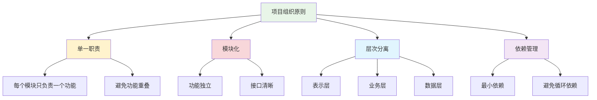

# 项目组织原则

## 🎯 学习目标

通过本节学习，您将能够：
- 理解项目组织的基本原则和重要性
- 掌握目录结构设计的最佳实践
- 学会合理划分模块和包
- 了解Chat-Room项目的组织结构
- 能够设计清晰的项目架构

## 📖 项目组织的重要性

良好的项目组织是软件开发成功的基础。它不仅影响代码的可读性和可维护性，还直接关系到团队协作的效率和项目的长期发展。

### 项目组织的核心原则



## 🏗️ Chat-Room项目结构分析

### 整体目录结构

```
Chat-Room/
├── README.md                    # 项目说明文档
├── requirements.txt             # 依赖包列表
├── setup.py                     # 项目安装配置
├── .gitignore                   # Git忽略文件
├── .env.example                 # 环境变量模板
├── config/                      # 配置文件目录
│   ├── client_config.yaml       # 客户端配置
│   ├── server_config.yaml       # 服务器配置
│   └── database_config.yaml     # 数据库配置
├── client/                      # 客户端模块
│   ├── __init__.py
│   ├── main.py                  # 客户端入口
│   ├── core/                    # 核心功能
│   │   ├── __init__.py
│   │   ├── client.py            # 客户端核心类
│   │   └── connection.py        # 连接管理
│   ├── ui/                      # 用户界面
│   │   ├── __init__.py
│   │   ├── app.py              # TUI应用主类
│   │   ├── components/         # UI组件
│   │   └── themes/             # 主题配置
│   └── commands/               # 命令处理
│       ├── __init__.py
│       └── handlers.py
├── server/                      # 服务器模块
│   ├── __init__.py
│   ├── main.py                  # 服务器入口
│   ├── core/                    # 核心业务逻辑
│   │   ├── __init__.py
│   │   ├── server.py            # 服务器核心类
│   │   ├── user_manager.py      # 用户管理
│   │   ├── chat_manager.py      # 聊天管理
│   │   └── file_manager.py      # 文件管理
│   ├── database/               # 数据库操作
│   │   ├── __init__.py
│   │   ├── models.py           # 数据模型
│   │   ├── operations.py       # 数据库操作
│   │   └── migrations/         # 数据库迁移
│   ├── ai/                     # AI集成
│   │   ├── __init__.py
│   │   ├── glm_client.py       # GLM客户端
│   │   └── context_manager.py  # 上下文管理
│   └── utils/                  # 工具函数
│       ├── __init__.py
│       ├── validators.py       # 验证器
│       └── helpers.py          # 辅助函数
├── shared/                     # 共享模块
│   ├── __init__.py
│   ├── messages.py             # 消息协议
│   ├── constants.py            # 常量定义
│   ├── exceptions.py           # 异常类
│   ├── logger.py              # 日志配置
│   └── utils.py               # 通用工具
├── test/                       # 测试目录
│   ├── __init__.py
│   ├── test_client/           # 客户端测试
│   ├── test_server/           # 服务器测试
│   ├── test_shared/           # 共享模块测试
│   └── fixtures/              # 测试数据
├── docs/                       # 文档目录
│   ├── api/                   # API文档
│   ├── user-guide/            # 用户指南
│   └── learning-v02/          # 学习文档
├── demo/                       # 演示脚本
│   ├── simple_client.py       # 简单客户端演示
│   └── test_server.py         # 服务器测试脚本
└── archive/                    # 归档目录
    ├── old_versions/          # 旧版本代码
    └── temp_files/            # 临时文件
```

### 目录组织原则详解

#### 1. 按功能模块划分

```python
"""
按功能模块划分的示例
每个模块负责特定的功能领域
"""

# client/ - 客户端相关的所有代码
# ├── core/     - 核心通信逻辑
# ├── ui/       - 用户界面相关
# └── commands/ - 命令处理逻辑

# server/ - 服务器相关的所有代码  
# ├── core/     - 核心业务逻辑
# ├── database/ - 数据库操作
# ├── ai/       - AI功能集成
# └── utils/    - 服务器工具函数

# shared/ - 客户端和服务器共享的代码
# ├── messages.py   - 消息协议定义
# ├── constants.py  - 共享常量
# └── exceptions.py - 共享异常类
```

#### 2. 按层次结构划分

```python
"""
按层次结构划分的示例
将不同抽象层次的代码分开
"""

# 表示层 (Presentation Layer)
client/ui/
├── app.py              # 主应用界面
├── components/         # UI组件
│   ├── chat_window.py  # 聊天窗口
│   ├── login_form.py   # 登录表单
│   └── file_dialog.py  # 文件对话框
└── themes/             # 主题配置

# 业务层 (Business Layer)
server/core/
├── user_manager.py     # 用户业务逻辑
├── chat_manager.py     # 聊天业务逻辑
└── file_manager.py     # 文件业务逻辑

# 数据层 (Data Layer)
server/database/
├── models.py           # 数据模型定义
├── operations.py       # 数据库操作
└── migrations/         # 数据库迁移脚本
```

#### 3. 配置文件集中管理

```python
"""
配置文件组织示例
将所有配置文件集中在config目录
"""

config/
├── client_config.yaml      # 客户端配置
├── server_config.yaml      # 服务器配置
├── database_config.yaml    # 数据库配置
├── logging_config.yaml     # 日志配置
└── ai_config.yaml          # AI配置

# 配置文件示例 - server_config.yaml
"""
server:
  host: "localhost"
  port: 8888
  max_connections: 100
  timeout: 30

database:
  path: "data/chatroom.db"
  backup_interval: 3600

logging:
  level: "INFO"
  file: "logs/server.log"
  max_size: "10MB"
"""
```

## 📦 模块设计原则

### 1. 高内聚低耦合

```python
"""
高内聚低耦合的模块设计示例
"""

# ✅ 好的设计 - 高内聚
class UserManager:
    """用户管理器 - 所有用户相关功能集中在一个类中"""
    
    def __init__(self):
        self.users = {}
        self.online_users = set()
    
    def register_user(self, username: str, password: str) -> bool:
        """注册用户"""
        pass
    
    def authenticate_user(self, username: str, password: str) -> bool:
        """验证用户"""
        pass
    
    def get_user_info(self, user_id: str) -> dict:
        """获取用户信息"""
        pass
    
    def update_user_status(self, user_id: str, status: str) -> None:
        """更新用户状态"""
        pass


# ❌ 不好的设计 - 低内聚
class MixedManager:
    """混合管理器 - 功能分散，职责不清"""
    
    def register_user(self, username: str, password: str) -> bool:
        """注册用户"""
        pass
    
    def send_message(self, message: str) -> None:
        """发送消息 - 与用户管理无关"""
        pass
    
    def save_file(self, filename: str, data: bytes) -> None:
        """保存文件 - 与用户管理无关"""
        pass
```

### 2. 依赖注入和接口抽象

```python
"""
依赖注入和接口抽象示例
"""

from abc import ABC, abstractmethod
from typing import Protocol


class DatabaseInterface(Protocol):
    """数据库接口"""
    
    def save_user(self, user_data: dict) -> bool:
        """保存用户数据"""
        pass
    
    def get_user(self, user_id: str) -> dict:
        """获取用户数据"""
        pass


class SQLiteDatabase:
    """SQLite数据库实现"""
    
    def save_user(self, user_data: dict) -> bool:
        # SQLite具体实现
        pass
    
    def get_user(self, user_id: str) -> dict:
        # SQLite具体实现
        pass


class UserService:
    """用户服务 - 依赖注入数据库接口"""
    
    def __init__(self, database: DatabaseInterface):
        self.database = database  # 依赖注入
    
    def create_user(self, username: str, password: str) -> bool:
        """创建用户"""
        user_data = {
            "username": username,
            "password": password,
            "created_at": time.time()
        }
        return self.database.save_user(user_data)


# 使用示例
database = SQLiteDatabase()
user_service = UserService(database)  # 注入依赖
user_service.create_user("test_user", "password123")
```

## 🔧 实际应用示例

### Chat-Room项目的模块组织

```python
"""
Chat-Room项目的实际模块组织示例
"""

# 1. 客户端核心模块
# client/core/client.py
class ChatClient:
    """聊天客户端核心类"""
    
    def __init__(self, config_manager, message_handler):
        self.config = config_manager
        self.message_handler = message_handler
        self.connection = None
    
    def connect(self) -> bool:
        """连接到服务器"""
        pass
    
    def send_message(self, message: str) -> bool:
        """发送消息"""
        pass


# 2. 服务器核心模块
# server/core/server.py
class ChatServer:
    """聊天服务器核心类"""
    
    def __init__(self, user_manager, chat_manager, file_manager):
        self.user_manager = user_manager
        self.chat_manager = chat_manager
        self.file_manager = file_manager
    
    def start(self) -> None:
        """启动服务器"""
        pass
    
    def handle_client(self, client_socket) -> None:
        """处理客户端连接"""
        pass


# 3. 共享消息协议
# shared/messages.py
from dataclasses import dataclass
from enum import Enum

class MessageType(Enum):
    CHAT = "chat"
    LOGIN = "login"
    FILE_TRANSFER = "file_transfer"

@dataclass
class Message:
    type: MessageType
    sender: str
    content: str
    timestamp: float


# 4. 配置管理
# shared/config.py
import yaml
from typing import Dict, Any

class ConfigManager:
    """配置管理器"""
    
    def __init__(self, config_path: str):
        self.config_path = config_path
        self.config = self._load_config()
    
    def _load_config(self) -> Dict[str, Any]:
        """加载配置文件"""
        with open(self.config_path, 'r', encoding='utf-8') as f:
            return yaml.safe_load(f)
    
    def get(self, key: str, default=None):
        """获取配置值"""
        keys = key.split('.')
        value = self.config
        for k in keys:
            value = value.get(k, default)
            if value is None:
                return default
        return value
```

## 📋 项目组织检查清单

### 目录结构检查

- [ ] **功能模块分离**：客户端、服务器、共享代码分别组织
- [ ] **层次结构清晰**：UI层、业务层、数据层分离
- [ ] **配置集中管理**：所有配置文件在config目录
- [ ] **测试代码分离**：测试代码在独立的test目录
- [ ] **文档完整**：docs目录包含完整文档

### 模块设计检查

- [ ] **单一职责**：每个模块只负责一个功能领域
- [ ] **高内聚**：模块内部功能紧密相关
- [ ] **低耦合**：模块间依赖关系最小
- [ ] **接口清晰**：模块间通过明确的接口交互
- [ ] **依赖管理**：避免循环依赖

### 命名规范检查

- [ ] **目录命名**：使用小写字母和下划线
- [ ] **文件命名**：描述性强，易于理解
- [ ] **模块命名**：符合Python命名规范
- [ ] **包结构**：合理的__init__.py文件
- [ ] **导入路径**：清晰的导入关系

## 🚀 最佳实践建议

### 1. 渐进式重构

```python
"""
渐进式重构示例
逐步改善项目结构，而不是一次性大改
"""

# 第一步：提取常量
# 将硬编码的值提取到constants.py

# 第二步：分离配置
# 将配置信息移到配置文件

# 第三步：模块化功能
# 将相关功能组织到独立模块

# 第四步：抽象接口
# 定义清晰的模块接口

# 第五步：优化依赖
# 减少模块间的耦合度
```

### 2. 文档驱动开发

```python
"""
为每个模块编写清晰的文档
"""

# module_name/__init__.py
"""
模块名称：用户管理模块

功能描述：
- 用户注册和认证
- 用户信息管理
- 用户状态跟踪

主要类：
- UserManager: 用户管理器
- User: 用户数据模型

使用示例：
    from user_module import UserManager
    
    manager = UserManager()
    manager.register_user("username", "password")
"""
```

### 3. 持续改进

- **定期审查**：定期检查项目结构是否合理
- **重构优化**：及时重构不合理的代码组织
- **团队协作**：与团队成员讨论最佳实践
- **学习借鉴**：参考优秀开源项目的组织方式

## 📋 学习检查清单

完成本节学习后，请确认您能够：

- [ ] 理解项目组织的基本原则
- [ ] 设计合理的目录结构
- [ ] 实现模块化的代码组织
- [ ] 管理模块间的依赖关系
- [ ] 应用配置管理最佳实践

## 🚀 下一步

完成项目组织学习后，请继续学习：
- [模块化设计思想](modular-design.md)
- [配置管理最佳实践](configuration-management.md)

---


## 📖 导航

➡️ **下一节：** [Modular Design](modular-design.md)

📚 **返回：** [第4章：软件工程](README.md)

🏠 **主页：** [学习路径总览](../README.md)
**良好的项目组织是成功的基础！** 🏗️
