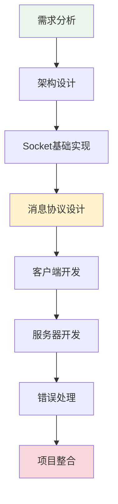
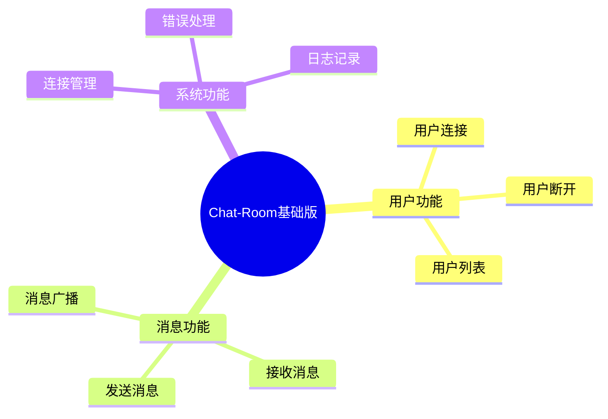
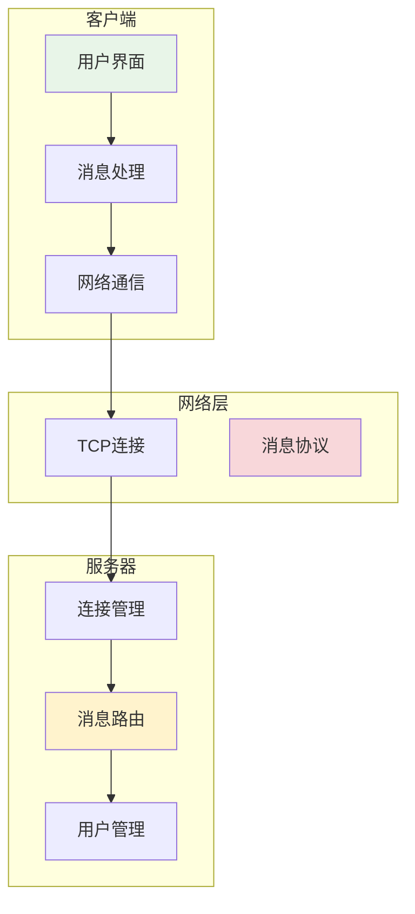
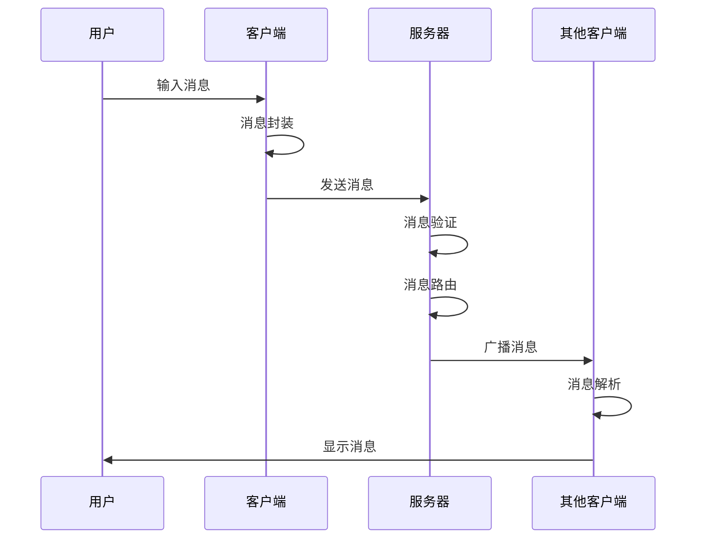

# 第4章：Chat-Room项目入门

## 🎯 学习目标

通过本章学习，您将能够：
- 理解Chat-Room项目的需求分析和设计思路
- 掌握最简单的Socket通信实现
- 构建基础的客户端-服务器架构
- 实现简单的消息收发功能
- 学会基础的错误处理方法
- 组织清晰的项目结构

## 📖 本章概览

本章将带您从零开始构建Chat-Room项目的基础版本。我们将采用渐进式开发的方法，从最简单的功能开始，逐步构建一个完整的聊天室系统。

### 学习路径



## 📚 章节内容

### 4.1 项目需求分析和设计
- [需求分析与功能规划](requirements-analysis.md) - 明确项目目标和功能需求
- [系统架构设计](system-architecture.md) - 设计整体系统架构
- [技术选型与决策](technology-selection.md) - 选择合适的技术栈
- [开发计划制定](development-plan.md) - 制定详细的开发计划

### 4.2 最简单的Socket通信实现
- [Socket编程基础](socket-basics.md) - Socket编程的基本概念
- [TCP连接建立](tcp-connection.md) - 建立可靠的TCP连接
- [数据传输机制](data-transmission.md) - 实现基本的数据传输
- [连接管理](connection-management.md) - 管理客户端连接

### 4.3 基础的客户端-服务器架构
- [服务器核心实现](server-core.md) - 多线程服务器的实现
- [客户端核心实现](client-core.md) - 客户端连接和通信
- [消息处理机制](message-processing.md) - 消息的发送和接收
- [状态管理](state-management.md) - 客户端和服务器状态管理

### 4.4 简单的消息收发功能
- [消息协议定义](message-protocol.md) - 设计简单的消息协议
- [消息序列化](message-serialization.md) - JSON格式的消息序列化
- [消息路由](message-routing.md) - 消息的路由和分发
- [实时通信](real-time-communication.md) - 实现实时消息传递

## 🎯 项目需求概述

### 核心功能需求



### 技术需求

1. **编程语言**：Python 3.8+
2. **网络通信**：Socket TCP协议
3. **数据格式**：JSON消息协议
4. **并发处理**：多线程处理客户端连接
5. **错误处理**：基础的异常处理和日志记录

### 非功能性需求

- **性能**：支持至少10个并发用户
- **可靠性**：基本的错误恢复机制
- **可维护性**：清晰的代码结构和注释
- **可扩展性**：为后续功能扩展预留接口

## 🏗️ 系统架构概览

### 整体架构图



### 数据流图



## 🔧 开发环境准备

### 项目结构

```
chat-room-basic/
├── README.md                   # 项目说明
├── requirements.txt            # 依赖包
├── config.py                   # 配置文件
├── server.py                   # 服务器主程序
├── client.py                   # 客户端主程序
├── shared/                     # 共享模块
│   ├── __init__.py
│   ├── message.py              # 消息协议
│   ├── constants.py            # 常量定义
│   └── utils.py                # 工具函数
├── server/                     # 服务器模块
│   ├── __init__.py
│   ├── core.py                 # 服务器核心
│   ├── handler.py              # 消息处理
│   └── manager.py              # 连接管理
├── client/                     # 客户端模块
│   ├── __init__.py
│   ├── core.py                 # 客户端核心
│   ├── ui.py                   # 用户界面
│   └── handler.py              # 消息处理
└── tests/                      # 测试文件
    ├── test_server.py
    ├── test_client.py
    └── test_message.py
```

### 依赖包

```txt
# requirements.txt
# 基础版本只需要Python标准库
# 后续章节会添加更多依赖

# 开发工具
pytest>=7.0.0
black>=22.0.0
flake8>=4.0.0

# 日志工具
loguru>=0.6.0
```

## 🚀 快速开始

### 1. 创建项目目录

```bash
# 创建项目目录
mkdir chat-room-basic
cd chat-room-basic

# 创建基本结构
mkdir shared server client tests
touch README.md requirements.txt config.py
touch server.py client.py
```

### 2. 实现最简单的服务器

```python
# server.py - 最简单的服务器实现
import socket
import threading
import json
from datetime import datetime

class SimpleChatServer:
    """简单聊天服务器"""
    
    def __init__(self, host='localhost', port=8888):
        self.host = host
        self.port = port
        self.clients = []  # 存储客户端连接
        self.running = False
    
    def start(self):
        """启动服务器"""
        self.server_socket = socket.socket(socket.AF_INET, socket.SOCK_STREAM)
        self.server_socket.setsockopt(socket.SOL_SOCKET, socket.SO_REUSEADDR, 1)
        
        try:
            self.server_socket.bind((self.host, self.port))
            self.server_socket.listen(5)
            self.running = True
            
            print(f"服务器启动在 {self.host}:{self.port}")
            
            while self.running:
                client_socket, address = self.server_socket.accept()
                print(f"新客户端连接: {address}")
                
                # 为每个客户端创建处理线程
                client_thread = threading.Thread(
                    target=self.handle_client,
                    args=(client_socket, address)
                )
                client_thread.daemon = True
                client_thread.start()
                
        except Exception as e:
            print(f"服务器启动失败: {e}")
        finally:
            self.stop()
    
    def handle_client(self, client_socket, address):
        """处理客户端连接"""
        self.clients.append(client_socket)
        
        try:
            while self.running:
                # 接收消息
                data = client_socket.recv(1024).decode('utf-8')
                if not data:
                    break
                
                print(f"收到消息: {data}")
                
                # 广播消息给所有客户端
                self.broadcast_message(data, client_socket)
                
        except Exception as e:
            print(f"处理客户端 {address} 时出错: {e}")
        finally:
            # 清理连接
            if client_socket in self.clients:
                self.clients.remove(client_socket)
            client_socket.close()
            print(f"客户端 {address} 断开连接")
    
    def broadcast_message(self, message, sender_socket):
        """广播消息给所有客户端"""
        for client in self.clients[:]:  # 使用切片避免修改列表时的问题
            if client != sender_socket:  # 不发送给发送者
                try:
                    client.send(message.encode('utf-8'))
                except:
                    # 如果发送失败，移除该客户端
                    self.clients.remove(client)
                    client.close()
    
    def stop(self):
        """停止服务器"""
        self.running = False
        if hasattr(self, 'server_socket'):
            self.server_socket.close()
        print("服务器已停止")

if __name__ == "__main__":
    server = SimpleChatServer()
    try:
        server.start()
    except KeyboardInterrupt:
        print("\n正在关闭服务器...")
        server.stop()
```

### 3. 实现最简单的客户端

```python
# client.py - 最简单的客户端实现
import socket
import threading

class SimpleChatClient:
    """简单聊天客户端"""
    
    def __init__(self, host='localhost', port=8888):
        self.host = host
        self.port = port
        self.socket = None
        self.connected = False
    
    def connect(self):
        """连接到服务器"""
        try:
            self.socket = socket.socket(socket.AF_INET, socket.SOCK_STREAM)
            self.socket.connect((self.host, self.port))
            self.connected = True
            
            print(f"已连接到服务器 {self.host}:{self.port}")
            
            # 启动接收消息的线程
            receive_thread = threading.Thread(target=self.receive_messages)
            receive_thread.daemon = True
            receive_thread.start()
            
            return True
            
        except Exception as e:
            print(f"连接失败: {e}")
            return False
    
    def receive_messages(self):
        """接收服务器消息"""
        while self.connected:
            try:
                message = self.socket.recv(1024).decode('utf-8')
                if message:
                    print(f"收到消息: {message}")
                else:
                    break
            except:
                break
        
        self.disconnect()
    
    def send_message(self, message):
        """发送消息"""
        if self.connected:
            try:
                self.socket.send(message.encode('utf-8'))
                return True
            except:
                print("发送消息失败")
                return False
        return False
    
    def disconnect(self):
        """断开连接"""
        self.connected = False
        if self.socket:
            self.socket.close()
        print("已断开连接")
    
    def start_chat(self):
        """开始聊天"""
        if not self.connect():
            return
        
        print("开始聊天！输入 'quit' 退出")
        
        try:
            while self.connected:
                message = input()
                if message.lower() == 'quit':
                    break
                
                if message.strip():
                    self.send_message(message)
        except KeyboardInterrupt:
            pass
        finally:
            self.disconnect()

if __name__ == "__main__":
    client = SimpleChatClient()
    client.start_chat()
```

## 🧪 测试运行

### 启动服务器

```bash
python server.py
```

### 启动客户端

```bash
# 在另一个终端窗口
python client.py
```

### 测试多客户端

```bash
# 可以启动多个客户端进行测试
python client.py  # 客户端1
python client.py  # 客户端2
python client.py  # 客户端3
```

## 📋 学习检查清单

完成本章学习后，请确认您能够：

- [ ] **需求分析**：理解Chat-Room项目的基本需求
- [ ] **架构设计**：掌握客户端-服务器架构的基本概念
- [ ] **Socket编程**：实现基本的TCP Socket通信
- [ ] **多线程**：理解多线程在网络编程中的应用
- [ ] **消息处理**：实现简单的消息收发功能
- [ ] **错误处理**：添加基本的异常处理
- [ ] **项目结构**：组织清晰的项目目录结构

## 🎯 本章成果

完成本章学习后，您将拥有：

1. **可运行的聊天室**：支持多用户实时聊天
2. **清晰的代码结构**：易于理解和扩展
3. **基础的网络编程技能**：Socket编程基础
4. **项目开发经验**：从需求到实现的完整流程

## 🚀 下一步

完成本章学习后，您可以继续学习：

- [第5章：多人聊天与消息管理](../05-multi-user-chat/README.md) - 扩展聊天功能
- [第6章：数据库集成](../06-database-integration/README.md) - 添加数据持久化
- [第7章：文件传输功能](../07-file-transfer/README.md) - 实现文件传输

## 💡 扩展思考

1. **性能优化**：如何提高服务器的并发处理能力？
2. **安全性**：如何防止恶意客户端攻击？
3. **可靠性**：如何处理网络断开和重连？
4. **用户体验**：如何改善客户端的用户界面？

---

**恭喜您完成了Chat-Room项目的基础实现！这是您网络编程之旅的重要里程碑。** 🎉
