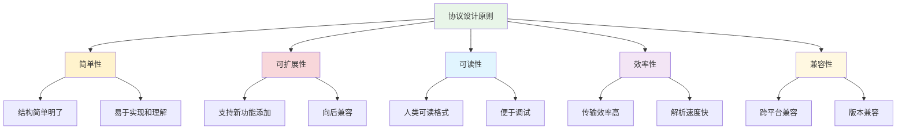

# 消息协议定义

## 🎯 学习目标

通过本节学习，您将能够：
- 理解消息协议的重要性和设计原则
- 掌握JSON格式的消息协议设计
- 学会实现消息的序列化和反序列化
- 了解消息协议的版本管理
- 为Chat-Room项目设计完整的消息协议

## 📖 消息协议概述

消息协议是客户端和服务器之间通信的"语言"，它定义了消息的格式、类型和处理规则。良好的消息协议设计能够：

- 确保通信的可靠性和一致性
- 提供清晰的消息结构
- 支持功能的扩展和演进
- 便于调试和维护

### 协议设计原则



## 🔧 Chat-Room消息协议设计

### 1. 协议格式选择

我们选择JSON格式作为Chat-Room的消息协议，原因如下：

- **人类可读**：便于开发和调试
- **跨平台**：所有编程语言都支持
- **灵活性**：易于扩展和修改
- **Python原生支持**：无需额外依赖

### 2. 基础消息结构

```python
"""
Chat-Room消息协议定义
"""

from enum import Enum
from dataclasses import dataclass, asdict
from typing import Dict, Any, Optional, Union
import json
import time
import uuid


class MessageType(Enum):
    """消息类型枚举"""
    
    # 连接管理
    CONNECT = "connect"           # 连接请求
    CONNECT_ACK = "connect_ack"   # 连接确认
    DISCONNECT = "disconnect"     # 断开连接
    HEARTBEAT = "heartbeat"       # 心跳检测
    
    # 聊天消息
    CHAT = "chat"                 # 普通聊天消息
    BROADCAST = "broadcast"       # 广播消息
    PRIVATE = "private"           # 私聊消息
    
    # 用户管理
    USER_JOIN = "user_join"       # 用户加入
    USER_LEAVE = "user_leave"     # 用户离开
    USER_LIST = "user_list"       # 用户列表
    
    # 系统消息
    SYSTEM = "system"             # 系统消息
    ERROR = "error"               # 错误消息
    SUCCESS = "success"           # 成功消息


@dataclass
class BaseMessage:
    """基础消息类"""
    
    # 必需字段
    type: MessageType             # 消息类型
    message_id: str               # 消息唯一ID
    timestamp: float              # 时间戳
    
    # 可选字段
    sender: Optional[str] = None  # 发送者
    content: str = ""             # 消息内容
    metadata: Optional[Dict[str, Any]] = None  # 元数据
    
    def __post_init__(self):
        """初始化后处理"""
        if not self.message_id:
            self.message_id = str(uuid.uuid4())
        if not self.timestamp:
            self.timestamp = time.time()
        if self.metadata is None:
            self.metadata = {}
    
    def to_dict(self) -> Dict[str, Any]:
        """转换为字典"""
        data = asdict(self)
        data['type'] = self.type.value  # 枚举转换为字符串
        return data
    
    def to_json(self) -> str:
        """转换为JSON字符串"""
        return json.dumps(self.to_dict(), ensure_ascii=False)
    
    @classmethod
    def from_dict(cls, data: Dict[str, Any]) -> 'BaseMessage':
        """从字典创建消息"""
        # 处理枚举类型
        if 'type' in data:
            data['type'] = MessageType(data['type'])
        
        return cls(**data)
    
    @classmethod
    def from_json(cls, json_str: str) -> 'BaseMessage':
        """从JSON字符串创建消息"""
        data = json.loads(json_str)
        return cls.from_dict(data)


# 具体消息类型定义
@dataclass
class ConnectMessage(BaseMessage):
    """连接消息"""
    username: str = ""
    
    def __post_init__(self):
        super().__post_init__()
        self.type = MessageType.CONNECT


@dataclass
class ChatMessage(BaseMessage):
    """聊天消息"""
    target: Optional[str] = None  # 目标用户（私聊时使用）
    
    def __post_init__(self):
        super().__post_init__()
        self.type = MessageType.CHAT


@dataclass
class SystemMessage(BaseMessage):
    """系统消息"""
    level: str = "info"  # info, warning, error
    
    def __post_init__(self):
        super().__post_init__()
        self.type = MessageType.SYSTEM
        self.sender = "系统"


@dataclass
class ErrorMessage(BaseMessage):
    """错误消息"""
    error_code: str = ""
    error_details: str = ""
    
    def __post_init__(self):
        super().__post_init__()
        self.type = MessageType.ERROR
        self.sender = "系统"
```

### 3. 消息协议处理器

```python
"""
消息协议处理器
"""

class MessageProtocol:
    """消息协议处理器"""
    
    # 协议版本
    VERSION = "1.0"
    
    # 消息类型映射
    MESSAGE_CLASSES = {
        MessageType.CONNECT: ConnectMessage,
        MessageType.CHAT: ChatMessage,
        MessageType.SYSTEM: SystemMessage,
        MessageType.ERROR: ErrorMessage,
    }
    
    @classmethod
    def create_message(cls, message_type: MessageType, **kwargs) -> BaseMessage:
        """创建消息对象"""
        message_class = cls.MESSAGE_CLASSES.get(message_type, BaseMessage)
        return message_class(type=message_type, **kwargs)
    
    @classmethod
    def parse_message(cls, json_str: str) -> BaseMessage:
        """解析JSON消息"""
        try:
            data = json.loads(json_str)
            message_type = MessageType(data.get('type'))
            message_class = cls.MESSAGE_CLASSES.get(message_type, BaseMessage)
            return message_class.from_dict(data)
        except (json.JSONDecodeError, ValueError, KeyError) as e:
            # 返回错误消息
            return ErrorMessage(
                content=f"消息解析失败: {str(e)}",
                error_code="PARSE_ERROR"
            )
    
    @classmethod
    def pack_message(cls, message: BaseMessage) -> bytes:
        """打包消息（添加长度前缀）"""
        json_str = message.to_json()
        data = json_str.encode('utf-8')
        length = len(data)
        
        # 4字节长度前缀 + JSON数据
        return length.to_bytes(4, byteorder='big') + data
    
    @classmethod
    def unpack_message(cls, sock) -> Optional[BaseMessage]:
        """解包消息（从Socket读取）"""
        try:
            # 读取4字节长度前缀
            length_data = cls._recv_exact(sock, 4)
            if not length_data:
                return None
            
            length = int.from_bytes(length_data, byteorder='big')
            
            # 读取消息内容
            message_data = cls._recv_exact(sock, length)
            if not message_data:
                return None
            
            json_str = message_data.decode('utf-8')
            return cls.parse_message(json_str)
            
        except Exception as e:
            return ErrorMessage(
                content=f"消息解包失败: {str(e)}",
                error_code="UNPACK_ERROR"
            )
    
    @staticmethod
    def _recv_exact(sock, length: int) -> Optional[bytes]:
        """精确接收指定长度的数据"""
        data = b''
        while len(data) < length:
            chunk = sock.recv(length - len(data))
            if not chunk:
                return None
            data += chunk
        return data


# 消息工厂类
class MessageFactory:
    """消息工厂"""
    
    @staticmethod
    def create_connect_message(username: str) -> ConnectMessage:
        """创建连接消息"""
        return ConnectMessage(username=username)
    
    @staticmethod
    def create_connect_ack_message(success: bool, message: str = "") -> BaseMessage:
        """创建连接确认消息"""
        if success:
            return BaseMessage(
                type=MessageType.CONNECT_ACK,
                content=message or "连接成功",
                sender="系统"
            )
        else:
            return ErrorMessage(
                content=message or "连接失败",
                error_code="CONNECT_FAILED"
            )
    
    @staticmethod
    def create_chat_message(sender: str, content: str, target: str = None) -> ChatMessage:
        """创建聊天消息"""
        return ChatMessage(
            sender=sender,
            content=content,
            target=target
        )
    
    @staticmethod
    def create_user_join_message(username: str) -> BaseMessage:
        """创建用户加入消息"""
        return BaseMessage(
            type=MessageType.USER_JOIN,
            content=f"用户 {username} 加入了聊天室",
            sender="系统",
            metadata={"username": username}
        )
    
    @staticmethod
    def create_user_leave_message(username: str) -> BaseMessage:
        """创建用户离开消息"""
        return BaseMessage(
            type=MessageType.USER_LEAVE,
            content=f"用户 {username} 离开了聊天室",
            sender="系统",
            metadata={"username": username}
        )
    
    @staticmethod
    def create_user_list_message(users: list) -> BaseMessage:
        """创建用户列表消息"""
        return BaseMessage(
            type=MessageType.USER_LIST,
            content=f"当前在线用户: {', '.join(users)}",
            sender="系统",
            metadata={"users": users}
        )
    
    @staticmethod
    def create_system_message(content: str, level: str = "info") -> SystemMessage:
        """创建系统消息"""
        return SystemMessage(content=content, level=level)
    
    @staticmethod
    def create_error_message(content: str, error_code: str = "") -> ErrorMessage:
        """创建错误消息"""
        return ErrorMessage(
            content=content,
            error_code=error_code
        )
    
    @staticmethod
    def create_heartbeat_message() -> BaseMessage:
        """创建心跳消息"""
        return BaseMessage(
            type=MessageType.HEARTBEAT,
            content="ping",
            sender="系统"
        )
```

### 4. 消息验证器

```python
"""
消息验证器
"""

class MessageValidator:
    """消息验证器"""
    
    # 验证规则
    MAX_CONTENT_LENGTH = 1000
    MAX_USERNAME_LENGTH = 20
    MIN_USERNAME_LENGTH = 2
    
    @classmethod
    def validate_message(cls, message: BaseMessage) -> tuple[bool, str]:
        """验证消息"""
        
        # 基础字段验证
        if not message.type:
            return False, "消息类型不能为空"
        
        if not message.message_id:
            return False, "消息ID不能为空"
        
        if not message.timestamp:
            return False, "时间戳不能为空"
        
        # 内容长度验证
        if len(message.content) > cls.MAX_CONTENT_LENGTH:
            return False, f"消息内容超过最大长度 {cls.MAX_CONTENT_LENGTH}"
        
        # 特定类型验证
        if isinstance(message, ConnectMessage):
            return cls._validate_connect_message(message)
        elif isinstance(message, ChatMessage):
            return cls._validate_chat_message(message)
        
        return True, "验证通过"
    
    @classmethod
    def _validate_connect_message(cls, message: ConnectMessage) -> tuple[bool, str]:
        """验证连接消息"""
        if not message.username:
            return False, "用户名不能为空"
        
        if len(message.username) < cls.MIN_USERNAME_LENGTH:
            return False, f"用户名长度不能少于 {cls.MIN_USERNAME_LENGTH} 个字符"
        
        if len(message.username) > cls.MAX_USERNAME_LENGTH:
            return False, f"用户名长度不能超过 {cls.MAX_USERNAME_LENGTH} 个字符"
        
        # 用户名字符验证
        if not message.username.replace('_', '').replace('-', '').isalnum():
            return False, "用户名只能包含字母、数字、下划线和连字符"
        
        return True, "验证通过"
    
    @classmethod
    def _validate_chat_message(cls, message: ChatMessage) -> tuple[bool, str]:
        """验证聊天消息"""
        if not message.sender:
            return False, "发送者不能为空"
        
        if not message.content.strip():
            return False, "消息内容不能为空"
        
        return True, "验证通过"


# 消息处理器基类
class MessageHandler:
    """消息处理器基类"""
    
    def __init__(self):
        self.handlers = {
            MessageType.CONNECT: self.handle_connect,
            MessageType.CHAT: self.handle_chat,
            MessageType.DISCONNECT: self.handle_disconnect,
            MessageType.HEARTBEAT: self.handle_heartbeat,
        }
    
    def process_message(self, message: BaseMessage, client_info: dict = None) -> Optional[BaseMessage]:
        """处理消息"""
        # 验证消息
        is_valid, error_msg = MessageValidator.validate_message(message)
        if not is_valid:
            return MessageFactory.create_error_message(error_msg, "VALIDATION_ERROR")
        
        # 路由到具体处理器
        handler = self.handlers.get(message.type)
        if handler:
            return handler(message, client_info)
        else:
            return MessageFactory.create_error_message(
                f"不支持的消息类型: {message.type.value}",
                "UNSUPPORTED_MESSAGE_TYPE"
            )
    
    def handle_connect(self, message: BaseMessage, client_info: dict = None) -> BaseMessage:
        """处理连接消息"""
        # 子类实现
        raise NotImplementedError
    
    def handle_chat(self, message: BaseMessage, client_info: dict = None) -> BaseMessage:
        """处理聊天消息"""
        # 子类实现
        raise NotImplementedError
    
    def handle_disconnect(self, message: BaseMessage, client_info: dict = None) -> BaseMessage:
        """处理断开连接消息"""
        # 子类实现
        raise NotImplementedError
    
    def handle_heartbeat(self, message: BaseMessage, client_info: dict = None) -> BaseMessage:
        """处理心跳消息"""
        return BaseMessage(
            type=MessageType.HEARTBEAT,
            content="pong",
            sender="系统"
        )
```

## 📊 协议使用示例

### 1. 客户端发送消息

```python
"""
客户端消息发送示例
"""

class ClientMessageExample:
    """客户端消息示例"""
    
    def __init__(self, socket):
        self.socket = socket
    
    def send_connect_request(self, username: str):
        """发送连接请求"""
        message = MessageFactory.create_connect_message(username)
        packed_data = MessageProtocol.pack_message(message)
        self.socket.sendall(packed_data)
        print(f"发送连接请求: {message.to_json()}")
    
    def send_chat_message(self, content: str, sender: str):
        """发送聊天消息"""
        message = MessageFactory.create_chat_message(sender, content)
        packed_data = MessageProtocol.pack_message(message)
        self.socket.sendall(packed_data)
        print(f"发送聊天消息: {message.to_json()}")
    
    def receive_message(self) -> Optional[BaseMessage]:
        """接收消息"""
        message = MessageProtocol.unpack_message(self.socket)
        if message:
            print(f"收到消息: {message.to_json()}")
        return message
```

### 2. 服务器处理消息

```python
"""
服务器消息处理示例
"""

class ServerMessageHandler(MessageHandler):
    """服务器消息处理器"""
    
    def __init__(self):
        super().__init__()
        self.connected_users = {}  # 用户连接映射
    
    def handle_connect(self, message: BaseMessage, client_info: dict = None) -> BaseMessage:
        """处理连接请求"""
        if isinstance(message, ConnectMessage):
            username = message.username
            
            # 检查用户名是否已存在
            if username in self.connected_users:
                return MessageFactory.create_error_message(
                    f"用户名 {username} 已存在",
                    "USERNAME_EXISTS"
                )
            
            # 添加用户
            self.connected_users[username] = client_info
            
            # 返回成功消息
            return MessageFactory.create_connect_ack_message(
                True, f"欢迎 {username} 加入聊天室！"
            )
        
        return MessageFactory.create_error_message("无效的连接消息", "INVALID_CONNECT")
    
    def handle_chat(self, message: BaseMessage, client_info: dict = None) -> BaseMessage:
        """处理聊天消息"""
        if isinstance(message, ChatMessage):
            # 广播消息给所有用户（除发送者外）
            self.broadcast_message(message, exclude_sender=message.sender)
            
            # 返回成功确认
            return MessageFactory.create_system_message("消息发送成功")
        
        return MessageFactory.create_error_message("无效的聊天消息", "INVALID_CHAT")
    
    def handle_disconnect(self, message: BaseMessage, client_info: dict = None) -> BaseMessage:
        """处理断开连接"""
        if message.sender in self.connected_users:
            del self.connected_users[message.sender]
            
            # 通知其他用户
            leave_message = MessageFactory.create_user_leave_message(message.sender)
            self.broadcast_message(leave_message)
        
        return MessageFactory.create_system_message("断开连接成功")
    
    def broadcast_message(self, message: BaseMessage, exclude_sender: str = None):
        """广播消息"""
        packed_data = MessageProtocol.pack_message(message)
        
        for username, client_info in self.connected_users.items():
            if username != exclude_sender:
                try:
                    client_socket = client_info.get('socket')
                    if client_socket:
                        client_socket.sendall(packed_data)
                except Exception as e:
                    print(f"向用户 {username} 发送消息失败: {e}")
```

## 📋 协议测试

```python
"""
消息协议测试
"""

def test_message_protocol():
    """测试消息协议"""
    
    # 测试消息创建
    print("=== 测试消息创建 ===")
    
    # 创建连接消息
    connect_msg = MessageFactory.create_connect_message("test_user")
    print(f"连接消息: {connect_msg.to_json()}")
    
    # 创建聊天消息
    chat_msg = MessageFactory.create_chat_message("test_user", "Hello, World!")
    print(f"聊天消息: {chat_msg.to_json()}")
    
    # 测试消息解析
    print("\n=== 测试消息解析 ===")
    
    json_str = chat_msg.to_json()
    parsed_msg = MessageProtocol.parse_message(json_str)
    print(f"解析结果: {parsed_msg.to_json()}")
    
    # 测试消息验证
    print("\n=== 测试消息验证 ===")
    
    is_valid, error_msg = MessageValidator.validate_message(chat_msg)
    print(f"验证结果: {is_valid}, 错误信息: {error_msg}")
    
    # 测试无效消息
    invalid_msg = ChatMessage(sender="", content="")
    is_valid, error_msg = MessageValidator.validate_message(invalid_msg)
    print(f"无效消息验证: {is_valid}, 错误信息: {error_msg}")

if __name__ == "__main__":
    test_message_protocol()
```

## 📋 学习检查清单

完成本节学习后，请确认您能够：

- [ ] 理解消息协议的设计原则
- [ ] 设计JSON格式的消息结构
- [ ] 实现消息的序列化和反序列化
- [ ] 创建消息工厂和处理器
- [ ] 实现消息验证机制
- [ ] 处理消息的打包和解包
- [ ] 测试消息协议的正确性

## 🚀 下一步

完成消息协议设计后，请继续学习：
- [服务器核心实现](server-core.md) - 实现服务器端消息处理
- [客户端核心实现](client-core.md) - 实现客户端消息处理

---


## 📖 导航

⬅️ **上一节：** [System Architecture](system-architecture.md)

📚 **返回：** [第5章：项目入门](README.md)

🏠 **主页：** [学习路径总览](../README.md)
**良好的消息协议是可靠通信的基础！** 📡
