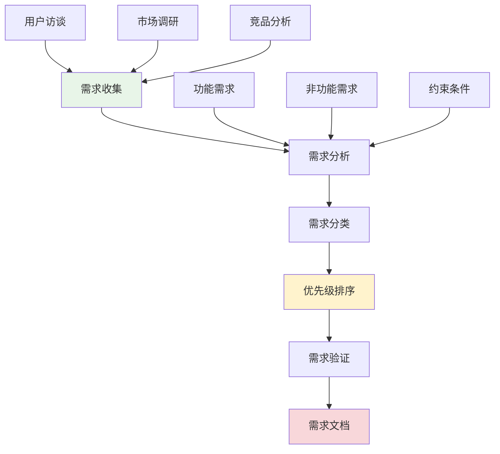
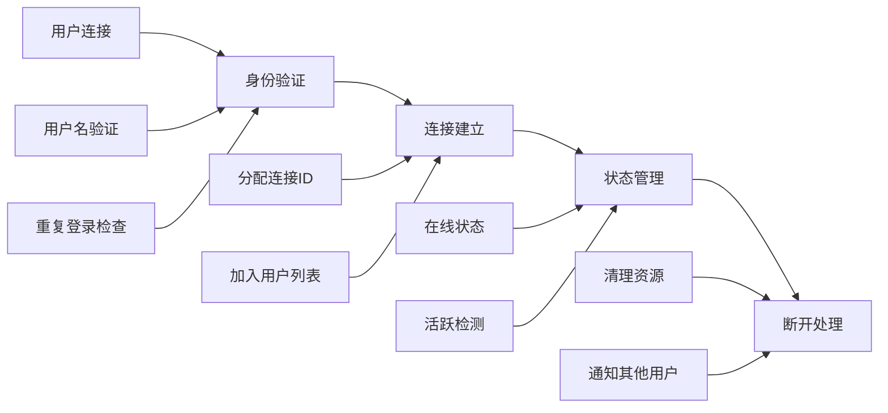
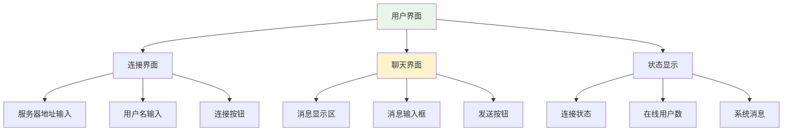
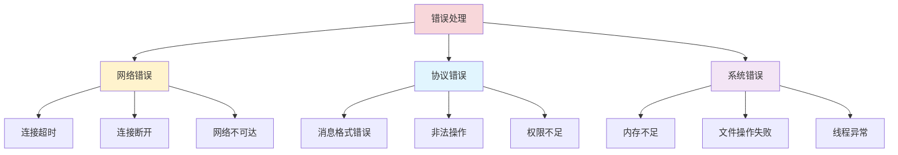
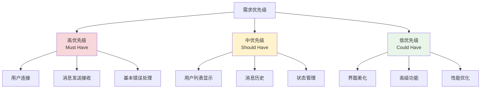

# 需求分析与功能规划

## 🎯 学习目标

通过本节学习，您将能够：
- 掌握软件需求分析的基本方法
- 理解Chat-Room项目的功能需求
- 学会将需求转化为具体的技术实现
- 制定合理的功能优先级
- 为项目开发制定清晰的目标

## 📖 需求分析概述

需求分析是软件开发的第一步，它决定了项目的方向和成功与否。良好的需求分析能够帮助我们：

- 明确项目目标和范围
- 识别关键功能和约束条件
- 制定合理的开发计划
- 避免后期的需求变更

### 需求分析流程



## 🎯 Chat-Room项目需求概述

### 项目背景

Chat-Room是一个基于Socket编程的实时聊天室系统，主要用于：

1. **学习目的**：帮助初学者理解网络编程和Socket通信
2. **实践项目**：提供完整的项目开发经验
3. **技能培养**：培养系统设计和编程能力
4. **课程设计**：作为计算机网络课程的实践项目

### 目标用户

- **主要用户**：计算机专业学生和编程初学者
- **次要用户**：网络编程爱好者和技术学习者
- **使用场景**：学习、实验、小型团队沟通

## 📋 功能需求分析

### 1. 核心功能需求

#### 1.1 用户连接管理



**详细需求**：
- **FR-001**：用户可以通过用户名连接到聊天室
- **FR-002**：系统应验证用户名的唯一性
- **FR-003**：系统应维护在线用户列表
- **FR-004**：用户可以主动断开连接
- **FR-005**：系统应处理异常断开情况

#### 1.2 消息通信功能

```python
"""
消息通信需求定义
"""

class MessageRequirements:
    """消息功能需求"""
    
    # FR-006: 基本消息发送
    def send_text_message(self, content: str) -> bool:
        """
        用户可以发送文本消息
        
        需求：
        - 消息长度限制：1-1000字符
        - 支持中文和英文
        - 过滤恶意内容
        """
        pass
    
    # FR-007: 消息接收
    def receive_message(self) -> dict:
        """
        用户可以实时接收消息
        
        需求：
        - 实时显示新消息
        - 显示发送者信息
        - 显示时间戳
        """
        pass
    
    # FR-008: 消息广播
    def broadcast_message(self, message: dict) -> None:
        """
        系统将消息广播给所有在线用户
        
        需求：
        - 除发送者外的所有用户都能收到
        - 保证消息顺序
        - 处理发送失败情况
        """
        pass
    
    # FR-009: 消息历史
    def get_message_history(self, limit: int = 50) -> list:
        """
        用户可以查看最近的消息历史
        
        需求：
        - 显示最近50条消息
        - 包含发送者和时间信息
        - 按时间顺序排列
        """
        pass
```

#### 1.3 用户界面需求



**详细需求**：
- **FR-010**：提供简洁的命令行界面
- **FR-011**：实时显示聊天消息
- **FR-012**：显示系统状态信息
- **FR-013**：支持基本的输入验证
- **FR-014**：提供友好的错误提示

### 2. 系统功能需求

#### 2.1 服务器管理

```python
"""
服务器管理需求
"""

class ServerRequirements:
    """服务器功能需求"""
    
    # FR-015: 服务器启动
    def start_server(self, host: str, port: int) -> bool:
        """
        启动聊天服务器
        
        需求：
        - 绑定指定的IP和端口
        - 开始监听客户端连接
        - 初始化必要的数据结构
        """
        pass
    
    # FR-016: 并发连接处理
    def handle_multiple_clients(self) -> None:
        """
        处理多个客户端并发连接
        
        需求：
        - 支持至少10个并发连接
        - 为每个客户端创建独立线程
        - 线程安全的数据访问
        """
        pass
    
    # FR-017: 服务器关闭
    def shutdown_server(self) -> None:
        """
        优雅关闭服务器
        
        需求：
        - 通知所有客户端服务器关闭
        - 清理所有连接和资源
        - 保存必要的状态信息
        """
        pass
```

#### 2.2 错误处理



**详细需求**：
- **FR-018**：处理网络连接异常
- **FR-019**：处理消息格式错误
- **FR-020**：记录错误日志
- **FR-021**：提供错误恢复机制
- **FR-022**：向用户显示友好的错误信息

## 🔧 非功能性需求

### 1. 性能需求

```python
"""
性能需求定义
"""

class PerformanceRequirements:
    """性能需求"""
    
    # NFR-001: 并发性能
    CONCURRENT_USERS = 10  # 支持10个并发用户
    
    # NFR-002: 响应时间
    MESSAGE_RESPONSE_TIME = 100  # 消息响应时间 < 100ms
    
    # NFR-003: 吞吐量
    MESSAGES_PER_SECOND = 50  # 支持50条消息/秒
    
    # NFR-004: 资源使用
    MAX_MEMORY_USAGE = 100  # 最大内存使用 < 100MB
    MAX_CPU_USAGE = 50      # 最大CPU使用率 < 50%
    
    # NFR-005: 网络带宽
    MAX_BANDWIDTH = 1       # 最大带宽使用 < 1MB/s
```

### 2. 可靠性需求

- **NFR-006**：系统可用性达到95%
- **NFR-007**：能够处理客户端异常断开
- **NFR-008**：服务器重启后能够恢复正常服务
- **NFR-009**：消息传递成功率达到99%

### 3. 可用性需求

- **NFR-010**：界面简洁易用，新用户5分钟内上手
- **NFR-011**：提供清晰的操作指导
- **NFR-012**：错误信息易于理解
- **NFR-013**：支持常见的操作系统（Windows、macOS、Linux）

### 4. 可维护性需求

- **NFR-014**：代码结构清晰，模块化设计
- **NFR-015**：提供完整的代码注释
- **NFR-016**：遵循Python编码规范
- **NFR-017**：提供单元测试覆盖

## 📊 需求优先级

### 优先级分类



### 开发阶段规划

#### 第一阶段：核心功能（高优先级）
1. **基础连接**：实现客户端-服务器连接
2. **消息通信**：实现基本的消息收发
3. **多用户支持**：支持多个用户同时在线
4. **基础错误处理**：处理常见的异常情况

#### 第二阶段：完善功能（中优先级）
1. **用户管理**：用户名验证、在线列表
2. **消息增强**：时间戳、消息历史
3. **状态管理**：连接状态、用户状态
4. **日志系统**：错误日志、操作日志

#### 第三阶段：优化功能（低优先级）
1. **界面改进**：更好的用户体验
2. **性能优化**：提高并发处理能力
3. **扩展功能**：私聊、文件传输等
4. **安全增强**：身份验证、消息加密

## 🧪 需求验证

### 验收标准

```python
"""
需求验收标准
"""

class AcceptanceCriteria:
    """验收标准"""
    
    def test_user_connection(self):
        """测试用户连接功能"""
        # Given: 服务器已启动
        # When: 用户尝试连接
        # Then: 连接成功并显示欢迎消息
        pass
    
    def test_message_sending(self):
        """测试消息发送功能"""
        # Given: 两个用户已连接
        # When: 用户A发送消息
        # Then: 用户B能够收到消息
        pass
    
    def test_multiple_users(self):
        """测试多用户功能"""
        # Given: 服务器支持多用户
        # When: 10个用户同时连接
        # Then: 所有用户都能正常通信
        pass
    
    def test_error_handling(self):
        """测试错误处理"""
        # Given: 客户端异常断开
        # When: 服务器检测到断开
        # Then: 清理资源并通知其他用户
        pass
```

### 测试场景

1. **正常流程测试**
   - 用户连接 → 发送消息 → 接收消息 → 断开连接

2. **异常流程测试**
   - 网络断开、服务器关闭、非法输入

3. **性能测试**
   - 并发用户测试、消息压力测试

4. **兼容性测试**
   - 不同操作系统、不同Python版本

## 📋 需求文档模板

### 功能需求文档

```markdown
## 功能需求 FR-XXX

**需求标题**：[功能名称]

**需求描述**：[详细描述功能的目的和行为]

**前置条件**：[执行此功能前需要满足的条件]

**输入**：[功能的输入参数或数据]

**处理过程**：[功能的处理逻辑]

**输出**：[功能的输出结果]

**异常处理**：[可能的异常情况和处理方式]

**验收标准**：[如何验证功能是否正确实现]

**优先级**：[高/中/低]

**依赖关系**：[与其他需求的依赖关系]
```

## 📋 学习检查清单

完成本节学习后，请确认您能够：

- [ ] 理解需求分析的基本流程和方法
- [ ] 识别和分类不同类型的需求
- [ ] 制定合理的需求优先级
- [ ] 编写清晰的需求文档
- [ ] 设计有效的验收标准
- [ ] 将需求转化为技术实现方案

## 🚀 下一步

完成需求分析后，请继续学习：
- [系统架构设计](system-architecture.md) - 设计系统整体架构
- [技术选型与决策](technology-selection.md) - 选择合适的技术方案

---

**良好的需求分析是项目成功的基础！** 📋
