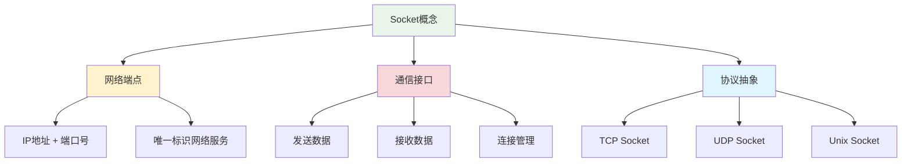
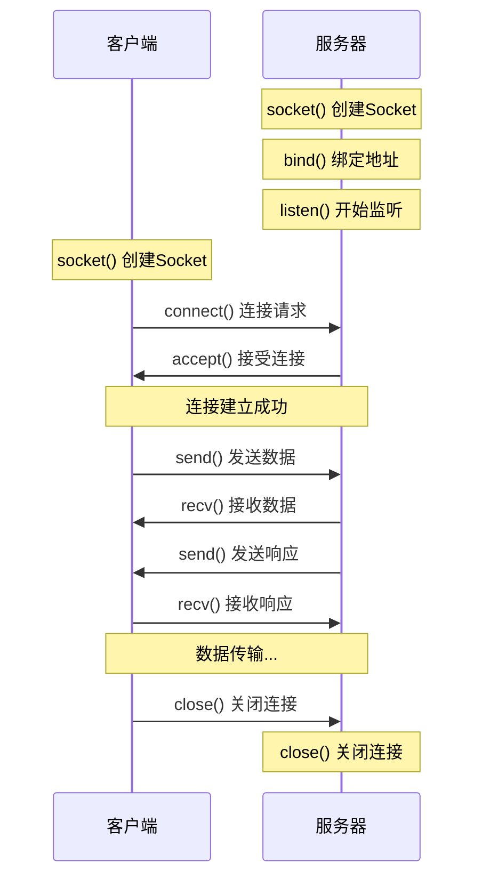

# Socket编程基础

## 🎯 学习目标

通过本节学习，您将能够：
- 理解Socket编程的基本概念
- 掌握TCP Socket的使用方法
- 学会创建简单的客户端-服务器程序
- 了解Socket编程的常见问题和解决方案
- 为Chat-Room项目打下网络编程基础

## 📖 Socket概述

Socket（套接字）是网络编程的基础，它提供了进程间通信的接口。可以把Socket想象成电话系统中的电话机，通过它可以与远程的另一个"电话机"进行通信。

### Socket的基本概念



### Socket类型

1. **TCP Socket**：面向连接，可靠传输
2. **UDP Socket**：无连接，快速传输
3. **Unix Socket**：本地进程间通信

## 🔧 Python Socket编程基础

### 1. 导入Socket模块

```python
import socket
import threading
import time
```

### 2. 创建Socket对象

```python
"""
Socket创建和基本操作
"""

# 创建TCP Socket
tcp_socket = socket.socket(socket.AF_INET, socket.SOCK_STREAM)

# 创建UDP Socket
udp_socket = socket.socket(socket.AF_INET, socket.SOCK_DGRAM)

# 参数说明：
# AF_INET: IPv4地址族
# AF_INET6: IPv6地址族
# SOCK_STREAM: TCP协议
# SOCK_DGRAM: UDP协议
```

### 3. 服务器端Socket编程

```python
"""
TCP服务器基础实现
"""

class BasicTCPServer:
    """基础TCP服务器"""
    
    def __init__(self, host='localhost', port=8888):
        self.host = host
        self.port = port
        self.server_socket = None
        self.running = False
    
    def start_server(self):
        """启动服务器"""
        try:
            # 1. 创建Socket对象
            self.server_socket = socket.socket(socket.AF_INET, socket.SOCK_STREAM)
            
            # 2. 设置Socket选项（可选）
            # SO_REUSEADDR: 允许重用地址
            self.server_socket.setsockopt(socket.SOL_SOCKET, socket.SO_REUSEADDR, 1)
            
            # 3. 绑定地址和端口
            self.server_socket.bind((self.host, self.port))
            
            # 4. 开始监听连接
            # 参数5表示最大等待连接数
            self.server_socket.listen(5)
            
            self.running = True
            print(f"服务器启动在 {self.host}:{self.port}")
            
            # 5. 接受客户端连接
            while self.running:
                try:
                    # accept()会阻塞，直到有客户端连接
                    client_socket, client_address = self.server_socket.accept()
                    print(f"新客户端连接: {client_address}")
                    
                    # 为每个客户端创建处理线程
                    client_thread = threading.Thread(
                        target=self.handle_client,
                        args=(client_socket, client_address)
                    )
                    client_thread.daemon = True  # 守护线程
                    client_thread.start()
                    
                except socket.error as e:
                    if self.running:  # 只有在运行时才报告错误
                        print(f"接受连接时出错: {e}")
                    break
                    
        except Exception as e:
            print(f"服务器启动失败: {e}")
        finally:
            self.stop_server()
    
    def handle_client(self, client_socket, client_address):
        """处理客户端连接"""
        try:
            while self.running:
                # 接收数据
                # recv()会阻塞，直到接收到数据或连接关闭
                data = client_socket.recv(1024)  # 最多接收1024字节
                
                if not data:
                    # 客户端关闭连接
                    print(f"客户端 {client_address} 断开连接")
                    break
                
                # 解码接收到的数据
                message = data.decode('utf-8')
                print(f"收到来自 {client_address} 的消息: {message}")
                
                # 回显消息（发送回客户端）
                response = f"服务器收到: {message}"
                client_socket.send(response.encode('utf-8'))
                
        except socket.error as e:
            print(f"处理客户端 {client_address} 时出错: {e}")
        except UnicodeDecodeError as e:
            print(f"消息解码失败: {e}")
        finally:
            # 关闭客户端连接
            client_socket.close()
            print(f"客户端 {client_address} 连接已关闭")
    
    def stop_server(self):
        """停止服务器"""
        self.running = False
        if self.server_socket:
            self.server_socket.close()
        print("服务器已停止")


# 使用示例
if __name__ == "__main__":
    server = BasicTCPServer()
    try:
        server.start_server()
    except KeyboardInterrupt:
        print("\n正在关闭服务器...")
        server.stop_server()
```

### 4. 客户端Socket编程

```python
"""
TCP客户端基础实现
"""

class BasicTCPClient:
    """基础TCP客户端"""
    
    def __init__(self, host='localhost', port=8888):
        self.host = host
        self.port = port
        self.client_socket = None
        self.connected = False
    
    def connect_to_server(self):
        """连接到服务器"""
        try:
            # 1. 创建Socket对象
            self.client_socket = socket.socket(socket.AF_INET, socket.SOCK_STREAM)
            
            # 2. 连接到服务器
            self.client_socket.connect((self.host, self.port))
            
            self.connected = True
            print(f"已连接到服务器 {self.host}:{self.port}")
            
            # 启动接收消息的线程
            receive_thread = threading.Thread(target=self.receive_messages)
            receive_thread.daemon = True
            receive_thread.start()
            
            return True
            
        except socket.error as e:
            print(f"连接服务器失败: {e}")
            return False
    
    def receive_messages(self):
        """接收服务器消息"""
        try:
            while self.connected:
                # 接收数据
                data = self.client_socket.recv(1024)
                
                if not data:
                    # 服务器关闭连接
                    print("服务器关闭了连接")
                    break
                
                # 解码并显示消息
                message = data.decode('utf-8')
                print(f"服务器回复: {message}")
                
        except socket.error as e:
            if self.connected:  # 只有在连接状态下才报告错误
                print(f"接收消息时出错: {e}")
        except UnicodeDecodeError as e:
            print(f"消息解码失败: {e}")
        finally:
            self.disconnect()
    
    def send_message(self, message):
        """发送消息到服务器"""
        if not self.connected:
            print("未连接到服务器")
            return False
        
        try:
            # 编码并发送消息
            self.client_socket.send(message.encode('utf-8'))
            return True
        except socket.error as e:
            print(f"发送消息失败: {e}")
            return False
    
    def disconnect(self):
        """断开连接"""
        self.connected = False
        if self.client_socket:
            self.client_socket.close()
        print("已断开与服务器的连接")
    
    def start_chat(self):
        """开始聊天"""
        if not self.connect_to_server():
            return
        
        print("开始聊天！输入消息并按回车发送，输入 'quit' 退出")
        
        try:
            while self.connected:
                # 获取用户输入
                user_input = input()
                
                if user_input.lower() == 'quit':
                    break
                
                if user_input.strip():  # 只发送非空消息
                    self.send_message(user_input)
                    
        except KeyboardInterrupt:
            print("\n用户中断")
        finally:
            self.disconnect()


# 使用示例
if __name__ == "__main__":
    client = BasicTCPClient()
    client.start_chat()
```

## 🔄 Socket通信流程

### 1. TCP连接建立过程



### 2. 数据传输过程

```python
"""
数据传输的详细过程
"""

class DataTransferExample:
    """数据传输示例"""
    
    def demonstrate_send_recv(self):
        """演示发送和接收数据"""
        
        # 发送端代码
        def sender_example(sock):
            """发送数据示例"""
            message = "Hello, World!"
            
            # 方法1: 简单发送
            sock.send(message.encode('utf-8'))
            
            # 方法2: 发送所有数据（推荐）
            sock.sendall(message.encode('utf-8'))
            
            # 方法3: 发送到指定地址（UDP）
            # sock.sendto(message.encode('utf-8'), ('localhost', 8888))
        
        # 接收端代码
        def receiver_example(sock):
            """接收数据示例"""
            
            # 方法1: 接收指定字节数
            data = sock.recv(1024)  # 最多接收1024字节
            
            # 方法2: 接收所有数据直到连接关闭
            def recv_all(sock):
                data = b''
                while True:
                    chunk = sock.recv(1024)
                    if not chunk:
                        break
                    data += chunk
                return data
            
            # 方法3: 接收指定长度的数据
            def recv_exact(sock, length):
                data = b''
                while len(data) < length:
                    chunk = sock.recv(length - len(data))
                    if not chunk:
                        raise ConnectionError("连接意外关闭")
                    data += chunk
                return data
    
    def handle_partial_data(self):
        """处理部分数据传输"""
        
        def send_with_length_prefix(sock, message):
            """发送带长度前缀的消息"""
            data = message.encode('utf-8')
            length = len(data)
            
            # 先发送数据长度（4字节）
            sock.sendall(length.to_bytes(4, byteorder='big'))
            # 再发送实际数据
            sock.sendall(data)
        
        def recv_with_length_prefix(sock):
            """接收带长度前缀的消息"""
            # 先接收长度信息（4字节）
            length_data = sock.recv(4)
            if len(length_data) != 4:
                raise ConnectionError("无法接收长度信息")
            
            length = int.from_bytes(length_data, byteorder='big')
            
            # 接收指定长度的数据
            data = b''
            while len(data) < length:
                chunk = sock.recv(length - len(data))
                if not chunk:
                    raise ConnectionError("连接意外关闭")
                data += chunk
            
            return data.decode('utf-8')
```

## ⚠️ Socket编程常见问题

### 1. 地址已被使用错误

```python
"""
解决地址已被使用的问题
"""

# 问题：OSError: [Errno 98] Address already in use

# 解决方案1：设置SO_REUSEADDR选项
server_socket = socket.socket(socket.AF_INET, socket.SOCK_STREAM)
server_socket.setsockopt(socket.SOL_SOCKET, socket.SO_REUSEADDR, 1)
server_socket.bind(('localhost', 8888))

# 解决方案2：等待一段时间后重试
import time
for i in range(5):
    try:
        server_socket.bind(('localhost', 8888))
        break
    except OSError:
        print(f"端口被占用，等待 {i+1} 秒后重试...")
        time.sleep(i + 1)
```

### 2. 连接重置错误

```python
"""
处理连接重置错误
"""

# 问题：ConnectionResetError: [Errno 104] Connection reset by peer

def robust_recv(sock, buffer_size=1024):
    """健壮的数据接收"""
    try:
        data = sock.recv(buffer_size)
        if not data:
            # 正常关闭
            return None
        return data
    except ConnectionResetError:
        # 连接被重置
        print("连接被对方重置")
        return None
    except socket.timeout:
        # 接收超时
        print("接收数据超时")
        return None
    except Exception as e:
        print(f"接收数据时出现未知错误: {e}")
        return None
```

### 3. 数据粘包和拆包

```python
"""
处理TCP数据粘包和拆包问题
"""

class MessageProtocol:
    """消息协议处理器"""
    
    @staticmethod
    def pack_message(message: str) -> bytes:
        """打包消息（添加长度头）"""
        data = message.encode('utf-8')
        length = len(data)
        # 4字节长度 + 实际数据
        return length.to_bytes(4, byteorder='big') + data
    
    @staticmethod
    def unpack_message(sock) -> str:
        """解包消息"""
        # 先读取4字节的长度信息
        length_data = MessageProtocol._recv_exact(sock, 4)
        if not length_data:
            return None
        
        length = int.from_bytes(length_data, byteorder='big')
        
        # 读取指定长度的消息内容
        message_data = MessageProtocol._recv_exact(sock, length)
        if not message_data:
            return None
        
        return message_data.decode('utf-8')
    
    @staticmethod
    def _recv_exact(sock, length: int) -> bytes:
        """精确接收指定长度的数据"""
        data = b''
        while len(data) < length:
            chunk = sock.recv(length - len(data))
            if not chunk:
                return None  # 连接关闭
            data += chunk
        return data

# 使用示例
def send_message_with_protocol(sock, message):
    """使用协议发送消息"""
    packed_data = MessageProtocol.pack_message(message)
    sock.sendall(packed_data)

def recv_message_with_protocol(sock):
    """使用协议接收消息"""
    return MessageProtocol.unpack_message(sock)
```

## 🧪 实践练习

### 练习1：回显服务器

```python
"""
练习1：实现一个简单的回显服务器
要求：
1. 服务器接收客户端消息
2. 将消息原样返回给客户端
3. 支持多个客户端同时连接
"""

class EchoServer:
    """回显服务器"""
    
    def __init__(self, host='localhost', port=8888):
        self.host = host
        self.port = port
        self.running = False
    
    def start(self):
        """启动服务器"""
        # TODO: 实现服务器启动逻辑
        pass
    
    def handle_client(self, client_socket, address):
        """处理客户端连接"""
        # TODO: 实现客户端处理逻辑
        pass
```

### 练习2：聊天客户端

```python
"""
练习2：实现一个简单的聊天客户端
要求：
1. 连接到服务器
2. 发送用户输入的消息
3. 显示服务器返回的消息
4. 支持优雅退出
"""

class ChatClient:
    """聊天客户端"""
    
    def __init__(self, host='localhost', port=8888):
        self.host = host
        self.port = port
        self.connected = False
    
    def connect(self):
        """连接到服务器"""
        # TODO: 实现连接逻辑
        pass
    
    def send_message(self, message):
        """发送消息"""
        # TODO: 实现发送逻辑
        pass
    
    def receive_messages(self):
        """接收消息"""
        # TODO: 实现接收逻辑
        pass
```

## 📋 学习检查清单

完成本节学习后，请确认您能够：

- [ ] 理解Socket的基本概念和作用
- [ ] 创建TCP服务器和客户端
- [ ] 处理多个并发连接
- [ ] 正确发送和接收数据
- [ ] 处理常见的Socket编程问题
- [ ] 实现简单的消息协议
- [ ] 进行错误处理和异常管理

## 🚀 下一步

完成Socket基础学习后，请继续学习：
- [TCP连接建立](tcp-connection.md) - 深入理解TCP连接机制
- [消息协议定义](message-protocol.md) - 设计Chat-Room的消息协议

---


## 📖 导航

⬅️ **上一节：** [Requirements Analysis](requirements-analysis.md)

➡️ **下一节：** [System Architecture](system-architecture.md)

📚 **返回：** [第5章：项目入门](README.md)

🏠 **主页：** [学习路径总览](../README.md)
**Socket编程是网络应用开发的基础！** 🔌
