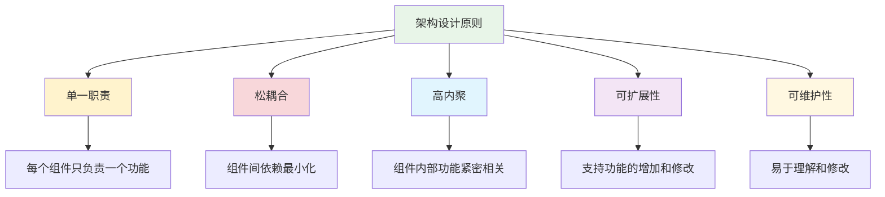
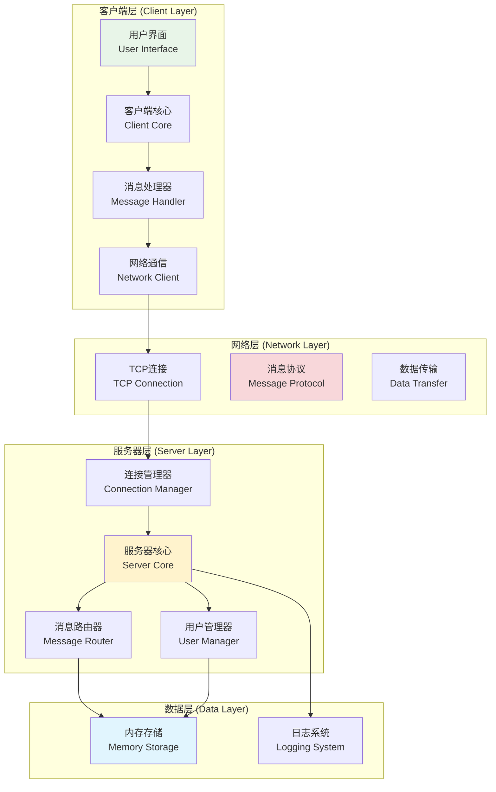
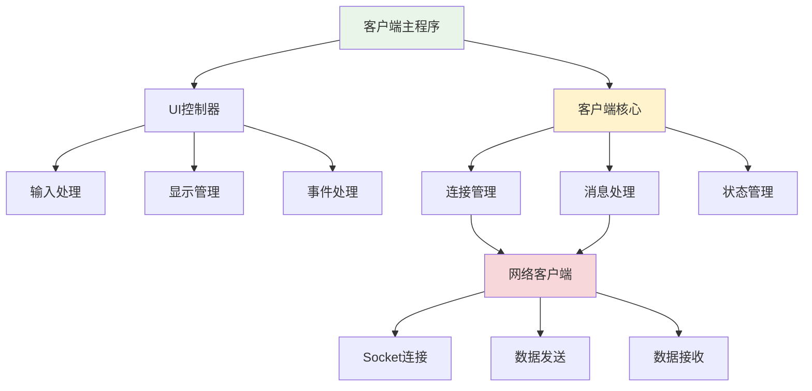
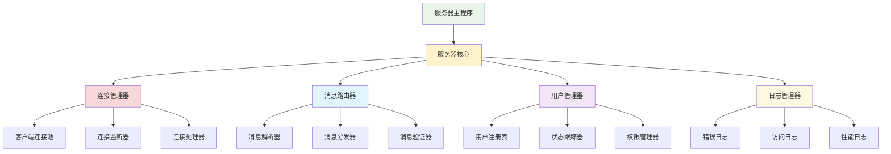
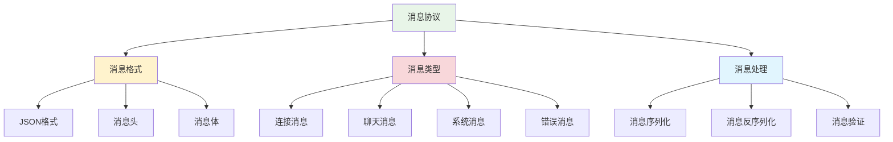
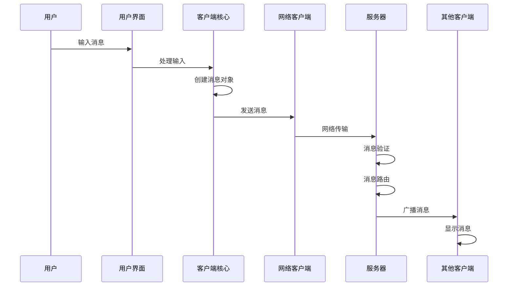
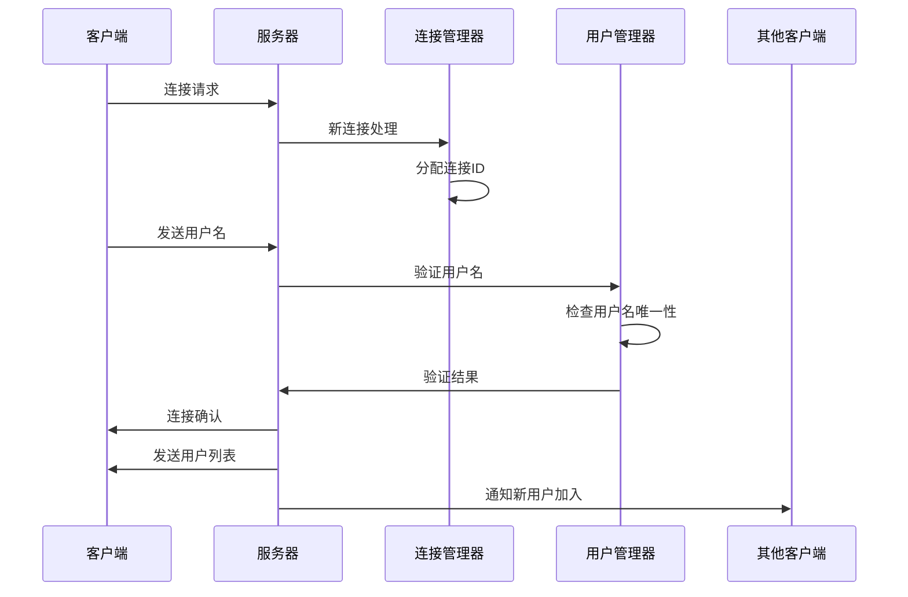

# 系统架构设计

## 🎯 学习目标

通过本节学习，您将能够：
- 理解系统架构设计的基本原则
- 掌握客户端-服务器架构的设计方法
- 学会设计模块化的系统结构
- 了解网络通信的架构模式
- 为Chat-Room项目设计合理的架构

## 📖 系统架构概述

系统架构是软件系统的高层设计，它定义了系统的组件、组件间的关系以及组件的行为。良好的架构设计能够：

- 提高系统的可维护性和可扩展性
- 降低系统的复杂度
- 提高开发效率
- 确保系统的质量属性

### 架构设计原则



## 🏗️ Chat-Room整体架构

### 1. 架构概览



### 2. 架构分层说明

#### 客户端层 (Client Layer)
- **用户界面**：处理用户输入和显示
- **客户端核心**：管理客户端状态和逻辑
- **消息处理器**：处理消息的发送和接收
- **网络通信**：管理与服务器的网络连接

#### 网络层 (Network Layer)
- **TCP连接**：建立和维护可靠的网络连接
- **消息协议**：定义客户端和服务器间的通信格式
- **数据传输**：处理数据的序列化和传输

#### 服务器层 (Server Layer)
- **连接管理器**：管理所有客户端连接
- **消息路由器**：将消息路由到正确的目标
- **用户管理器**：管理用户信息和状态
- **服务器核心**：协调各个组件的工作

#### 数据层 (Data Layer)
- **内存存储**：存储运行时数据
- **日志系统**：记录系统运行日志

## 🔧 详细架构设计

### 1. 客户端架构



#### 客户端组件详解

```python
"""
客户端架构组件定义
"""

class ClientArchitecture:
    """客户端架构设计"""
    
    class UIController:
        """用户界面控制器"""
        def __init__(self):
            self.input_handler = InputHandler()
            self.display_manager = DisplayManager()
            self.event_processor = EventProcessor()
        
        def start_ui(self):
            """启动用户界面"""
            pass
        
        def handle_user_input(self, input_data):
            """处理用户输入"""
            pass
        
        def update_display(self, message):
            """更新显示内容"""
            pass
    
    class ClientCore:
        """客户端核心"""
        def __init__(self):
            self.connection_manager = ConnectionManager()
            self.message_processor = MessageProcessor()
            self.state_manager = StateManager()
        
        def connect_to_server(self, host, port):
            """连接到服务器"""
            pass
        
        def send_message(self, message):
            """发送消息"""
            pass
        
        def process_received_message(self, message):
            """处理接收到的消息"""
            pass
    
    class NetworkClient:
        """网络客户端"""
        def __init__(self):
            self.socket = None
            self.connected = False
        
        def establish_connection(self, host, port):
            """建立连接"""
            pass
        
        def send_data(self, data):
            """发送数据"""
            pass
        
        def receive_data(self):
            """接收数据"""
            pass
        
        def close_connection(self):
            """关闭连接"""
            pass
```

### 2. 服务器架构



#### 服务器组件详解

```python
"""
服务器架构组件定义
"""

class ServerArchitecture:
    """服务器架构设计"""
    
    class ServerCore:
        """服务器核心"""
        def __init__(self):
            self.connection_manager = ConnectionManager()
            self.message_router = MessageRouter()
            self.user_manager = UserManager()
            self.logger = LogManager()
        
        def start_server(self, host, port):
            """启动服务器"""
            pass
        
        def handle_new_connection(self, client_socket):
            """处理新连接"""
            pass
        
        def process_message(self, message, sender):
            """处理消息"""
            pass
        
        def shutdown_server(self):
            """关闭服务器"""
            pass
    
    class ConnectionManager:
        """连接管理器"""
        def __init__(self):
            self.client_pool = {}  # 客户端连接池
            self.connection_count = 0
        
        def add_client(self, client_id, client_socket):
            """添加客户端连接"""
            pass
        
        def remove_client(self, client_id):
            """移除客户端连接"""
            pass
        
        def get_all_clients(self):
            """获取所有客户端"""
            pass
        
        def broadcast_to_all(self, message, exclude_client=None):
            """广播消息给所有客户端"""
            pass
    
    class MessageRouter:
        """消息路由器"""
        def __init__(self):
            self.message_handlers = {}
        
        def register_handler(self, message_type, handler):
            """注册消息处理器"""
            pass
        
        def route_message(self, message):
            """路由消息"""
            pass
        
        def validate_message(self, message):
            """验证消息格式"""
            pass
    
    class UserManager:
        """用户管理器"""
        def __init__(self):
            self.users = {}  # 用户注册表
            self.online_users = set()  # 在线用户
        
        def register_user(self, username, client_id):
            """注册用户"""
            pass
        
        def unregister_user(self, username):
            """注销用户"""
            pass
        
        def get_online_users(self):
            """获取在线用户列表"""
            pass
        
        def is_username_available(self, username):
            """检查用户名是否可用"""
            pass
```

### 3. 消息协议架构



#### 消息协议设计

```python
"""
消息协议设计
"""

from enum import Enum
from dataclasses import dataclass
from typing import Dict, Any, Optional
import json
import time

class MessageType(Enum):
    """消息类型枚举"""
    # 连接相关
    CONNECT = "connect"
    DISCONNECT = "disconnect"
    HEARTBEAT = "heartbeat"
    
    # 聊天相关
    CHAT = "chat"
    BROADCAST = "broadcast"
    
    # 系统相关
    SYSTEM = "system"
    ERROR = "error"
    USER_LIST = "user_list"

@dataclass
class Message:
    """消息基类"""
    type: MessageType
    sender: Optional[str] = None
    content: str = ""
    timestamp: float = None
    metadata: Dict[str, Any] = None
    
    def __post_init__(self):
        if self.timestamp is None:
            self.timestamp = time.time()
        if self.metadata is None:
            self.metadata = {}
    
    def to_json(self) -> str:
        """转换为JSON字符串"""
        return json.dumps({
            "type": self.type.value,
            "sender": self.sender,
            "content": self.content,
            "timestamp": self.timestamp,
            "metadata": self.metadata
        }, ensure_ascii=False)
    
    @classmethod
    def from_json(cls, json_str: str) -> 'Message':
        """从JSON字符串创建消息"""
        data = json.loads(json_str)
        return cls(
            type=MessageType(data["type"]),
            sender=data.get("sender"),
            content=data.get("content", ""),
            timestamp=data.get("timestamp"),
            metadata=data.get("metadata", {})
        )

class MessageProtocol:
    """消息协议处理器"""
    
    @staticmethod
    def create_connect_message(username: str) -> Message:
        """创建连接消息"""
        return Message(
            type=MessageType.CONNECT,
            sender=username,
            content=f"用户 {username} 加入聊天室"
        )
    
    @staticmethod
    def create_chat_message(sender: str, content: str) -> Message:
        """创建聊天消息"""
        return Message(
            type=MessageType.CHAT,
            sender=sender,
            content=content
        )
    
    @staticmethod
    def create_system_message(content: str) -> Message:
        """创建系统消息"""
        return Message(
            type=MessageType.SYSTEM,
            sender="系统",
            content=content
        )
    
    @staticmethod
    def create_error_message(error_msg: str) -> Message:
        """创建错误消息"""
        return Message(
            type=MessageType.ERROR,
            sender="系统",
            content=error_msg
        )
```

## 🔄 数据流设计

### 1. 消息发送流程



### 2. 连接建立流程



## 📊 架构质量属性

### 1. 性能设计

```python
"""
性能架构设计
"""

class PerformanceArchitecture:
    """性能架构设计"""
    
    # 并发处理设计
    def concurrent_design(self):
        """并发处理设计"""
        return {
            "thread_pool": "为每个客户端分配独立线程",
            "message_queue": "使用队列缓冲消息",
            "connection_pool": "复用网络连接",
            "load_balancing": "负载均衡处理"
        }
    
    # 内存管理设计
    def memory_design(self):
        """内存管理设计"""
        return {
            "message_buffer": "限制消息缓冲区大小",
            "connection_limit": "限制最大连接数",
            "garbage_collection": "定期清理无效连接",
            "memory_monitoring": "监控内存使用情况"
        }
    
    # 网络优化设计
    def network_design(self):
        """网络优化设计"""
        return {
            "message_compression": "压缩大消息",
            "batch_processing": "批量处理消息",
            "heartbeat": "心跳检测机制",
            "timeout_handling": "超时处理机制"
        }
```

### 2. 可靠性设计

- **错误恢复**：自动重连机制
- **数据一致性**：消息顺序保证
- **故障隔离**：单个客户端故障不影响其他用户
- **资源保护**：防止资源泄漏

### 3. 可扩展性设计

- **模块化**：组件可独立替换和升级
- **插件架构**：支持功能插件扩展
- **配置驱动**：通过配置文件控制行为
- **接口标准化**：统一的组件接口

## 📋 架构决策记录

### 决策1：选择TCP协议

**背景**：需要选择网络通信协议

**决策**：使用TCP协议而不是UDP

**理由**：
- TCP提供可靠的数据传输
- 聊天消息需要保证顺序和完整性
- 实现相对简单

**后果**：
- 性能略低于UDP
- 连接开销较大
- 但可靠性更高

### 决策2：使用JSON消息格式

**背景**：需要选择消息序列化格式

**决策**：使用JSON格式

**理由**：
- 人类可读，便于调试
- Python原生支持
- 跨平台兼容性好

**后果**：
- 比二进制格式占用更多带宽
- 解析性能略低
- 但开发效率更高

### 决策3：多线程架构

**背景**：需要处理多个并发连接

**决策**：为每个客户端创建独立线程

**理由**：
- 实现简单直观
- 隔离性好
- 适合小规模应用

**后果**：
- 线程开销较大
- 扩展性有限
- 但满足当前需求

## 📋 学习检查清单

完成本节学习后，请确认您能够：

- [ ] 理解系统架构设计的基本原则
- [ ] 掌握客户端-服务器架构的设计方法
- [ ] 设计模块化的系统结构
- [ ] 理解消息协议的设计
- [ ] 分析架构的质量属性
- [ ] 记录和评估架构决策

## 🚀 下一步

完成系统架构设计后，请继续学习：
- [技术选型与决策](technology-selection.md) - 选择具体的技术实现
- [Socket编程基础](socket-basics.md) - 开始具体的编程实现

---


## 📖 导航

⬅️ **上一节：** [Socket Basics](socket-basics.md)

➡️ **下一节：** [Message Protocol](message-protocol.md)

📚 **返回：** [第5章：项目入门](README.md)

🏠 **主页：** [学习路径总览](../README.md)
**良好的架构设计是系统成功的关键！** 🏗️
