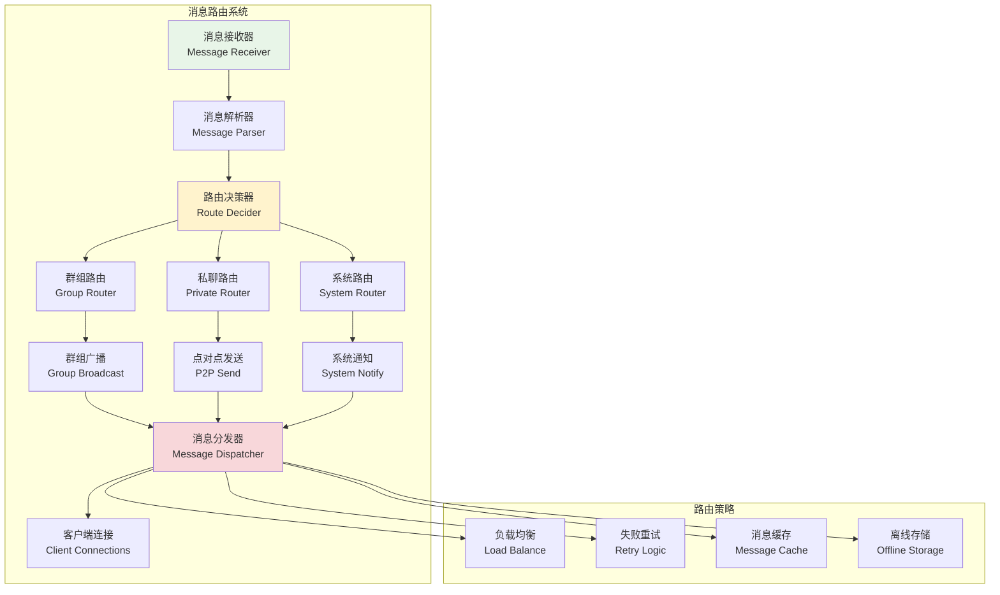
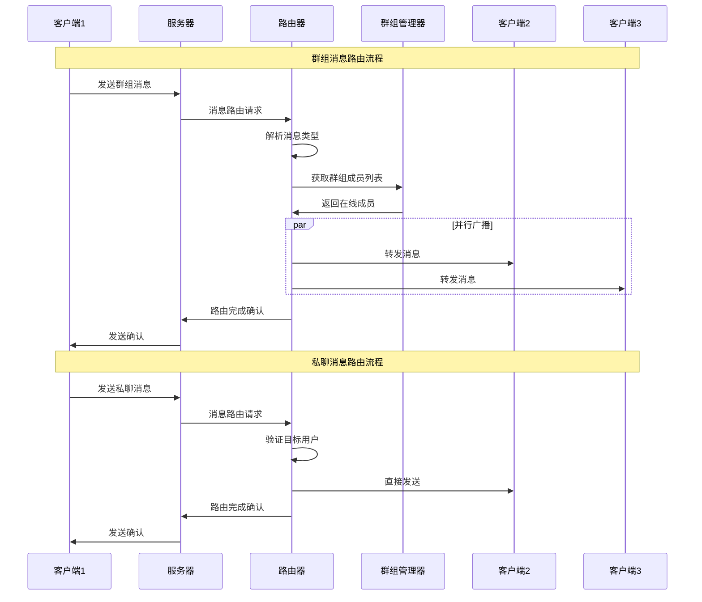

# 消息路由系统

## 🎯 学习目标

通过本章学习，您将能够：
- 理解多人聊天中的消息路由机制
- 掌握群组消息广播和私聊消息的实现
- 学会设计高效的消息分发系统
- 在Chat-Room项目中实现完整的消息路由功能

## 🚀 消息路由架构

### 路由系统概览



### 消息流转过程



## 📨 消息路由核心实现

### 消息路由器

```python
# server/chat/message_router.py - 消息路由器
import threading
import time
import queue
from typing import Dict, List, Set, Optional, Callable, Any
from dataclasses import dataclass
from enum import Enum
import json

class MessageType(Enum):
    """消息类型枚举"""
    GROUP_MESSAGE = "group_message"      # 群组消息
    PRIVATE_MESSAGE = "private_message"  # 私聊消息
    SYSTEM_MESSAGE = "system_message"    # 系统消息
    BROADCAST = "broadcast"              # 全局广播
    NOTIFICATION = "notification"        # 通知消息

class RouteResult(Enum):
    """路由结果枚举"""
    SUCCESS = "success"           # 路由成功
    PARTIAL_SUCCESS = "partial"   # 部分成功
    FAILED = "failed"            # 路由失败
    NO_RECIPIENTS = "no_recipients"  # 无接收者

@dataclass
class RouteTarget:
    """路由目标"""
    user_id: int
    connection: Any  # Socket连接对象
    is_online: bool = True
    last_activity: float = 0

@dataclass
class RouteContext:
    """路由上下文"""
    message_id: str
    sender_id: int
    message_type: MessageType
    target_group: Optional[int] = None
    target_user: Optional[int] = None
    priority: int = 0  # 消息优先级
    retry_count: int = 0
    max_retries: int = 3

class MessageRouter:
    """
    消息路由器
    
    负责将消息路由到正确的目标：
    1. 群组消息广播给所有群组成员
    2. 私聊消息发送给指定用户
    3. 系统消息按需分发
    4. 处理离线用户的消息存储
    """
    
    def __init__(self, group_manager, connection_manager, offline_storage=None):
        self.group_manager = group_manager
        self.connection_manager = connection_manager
        self.offline_storage = offline_storage
        
        # 路由统计
        self.route_stats = {
            'total_messages': 0,
            'successful_routes': 0,
            'failed_routes': 0,
            'offline_stored': 0
        }
        
        # 消息队列
        self.message_queue = queue.PriorityQueue()
        self.retry_queue = queue.Queue()
        
        # 路由处理器映射
        self.route_handlers = {
            MessageType.GROUP_MESSAGE: self._route_group_message,
            MessageType.PRIVATE_MESSAGE: self._route_private_message,
            MessageType.SYSTEM_MESSAGE: self._route_system_message,
            MessageType.BROADCAST: self._route_broadcast_message,
            MessageType.NOTIFICATION: self._route_notification
        }
        
        # 线程控制
        self.routing_thread = None
        self.retry_thread = None
        self.running = False
        
        # 线程锁
        self.stats_lock = threading.Lock()
    
    def start_routing(self):
        """启动路由服务"""
        if self.running:
            return
        
        self.running = True
        
        # 启动主路由线程
        self.routing_thread = threading.Thread(
            target=self._routing_worker,
            name="MessageRouter",
            daemon=True
        )
        self.routing_thread.start()
        
        # 启动重试线程
        self.retry_thread = threading.Thread(
            target=self._retry_worker,
            name="RetryWorker",
            daemon=True
        )
        self.retry_thread.start()
        
        print("消息路由服务已启动")
    
    def stop_routing(self):
        """停止路由服务"""
        self.running = False
        
        # 发送停止信号
        self.message_queue.put((0, None))
        self.retry_queue.put(None)
        
        # 等待线程结束
        if self.routing_thread:
            self.routing_thread.join(timeout=5)
        if self.retry_thread:
            self.retry_thread.join(timeout=5)
        
        print("消息路由服务已停止")
    
    def route_message(self, message: Dict[str, Any], context: RouteContext) -> RouteResult:
        """
        路由消息
        
        Args:
            message: 消息内容
            context: 路由上下文
            
        Returns:
            路由结果
        """
        # 添加到路由队列
        priority = -context.priority  # 负数表示高优先级
        self.message_queue.put((priority, (message, context)))
        
        with self.stats_lock:
            self.route_stats['total_messages'] += 1
        
        return RouteResult.SUCCESS
    
    def _routing_worker(self):
        """路由工作线程"""
        print("路由工作线程启动")
        
        while self.running:
            try:
                # 获取消息
                priority, item = self.message_queue.get(timeout=1.0)
                
                if item is None:  # 停止信号
                    break
                
                message, context = item
                
                # 执行路由
                result = self._execute_route(message, context)
                
                # 处理路由结果
                if result == RouteResult.FAILED and context.retry_count < context.max_retries:
                    # 添加到重试队列
                    context.retry_count += 1
                    self.retry_queue.put((message, context))
                
                # 标记任务完成
                self.message_queue.task_done()
                
            except queue.Empty:
                continue
            except Exception as e:
                print(f"路由工作线程异常: {e}")
        
        print("路由工作线程结束")
    
    def _retry_worker(self):
        """重试工作线程"""
        print("重试工作线程启动")
        
        while self.running:
            try:
                item = self.retry_queue.get(timeout=1.0)
                
                if item is None:  # 停止信号
                    break
                
                message, context = item
                
                # 等待一段时间后重试
                time.sleep(min(2 ** context.retry_count, 30))  # 指数退避
                
                # 重新执行路由
                result = self._execute_route(message, context)
                
                if result == RouteResult.FAILED and context.retry_count < context.max_retries:
                    # 继续重试
                    context.retry_count += 1
                    self.retry_queue.put((message, context))
                
                self.retry_queue.task_done()
                
            except queue.Empty:
                continue
            except Exception as e:
                print(f"重试工作线程异常: {e}")
        
        print("重试工作线程结束")
    
    def _execute_route(self, message: Dict[str, Any], context: RouteContext) -> RouteResult:
        """执行消息路由"""
        try:
            # 获取路由处理器
            handler = self.route_handlers.get(context.message_type)
            if not handler:
                print(f"未知消息类型: {context.message_type}")
                return RouteResult.FAILED
            
            # 执行路由
            result = handler(message, context)
            
            # 更新统计
            with self.stats_lock:
                if result == RouteResult.SUCCESS:
                    self.route_stats['successful_routes'] += 1
                else:
                    self.route_stats['failed_routes'] += 1
            
            return result
            
        except Exception as e:
            print(f"路由执行异常: {e}")
            return RouteResult.FAILED
    
    def _route_group_message(self, message: Dict[str, Any], context: RouteContext) -> RouteResult:
        """路由群组消息"""
        if not context.target_group:
            print("群组消息缺少目标群组")
            return RouteResult.FAILED
        
        # 获取群组成员
        members = self.group_manager.get_group_members(context.target_group)
        if not members:
            print(f"群组 {context.target_group} 没有成员")
            return RouteResult.NO_RECIPIENTS
        
        # 过滤在线成员（排除发送者）
        online_members = [
            member for member in members 
            if member.user_id != context.sender_id and member.is_online
        ]
        
        if not online_members:
            print(f"群组 {context.target_group} 没有在线成员")
            return RouteResult.NO_RECIPIENTS
        
        # 广播消息
        success_count = 0
        total_count = len(online_members)
        
        for member in online_members:
            if self._send_to_user(member.user_id, message):
                success_count += 1
            else:
                # 存储离线消息
                self._store_offline_message(member.user_id, message)
        
        # 判断路由结果
        if success_count == total_count:
            return RouteResult.SUCCESS
        elif success_count > 0:
            return RouteResult.PARTIAL_SUCCESS
        else:
            return RouteResult.FAILED
    
    def _route_private_message(self, message: Dict[str, Any], context: RouteContext) -> RouteResult:
        """路由私聊消息"""
        if not context.target_user:
            print("私聊消息缺少目标用户")
            return RouteResult.FAILED
        
        # 检查目标用户是否在线
        if self.connection_manager.is_user_online(context.target_user):
            if self._send_to_user(context.target_user, message):
                return RouteResult.SUCCESS
            else:
                # 发送失败，存储离线消息
                self._store_offline_message(context.target_user, message)
                return RouteResult.FAILED
        else:
            # 用户离线，存储消息
            self._store_offline_message(context.target_user, message)
            return RouteResult.SUCCESS  # 离线存储成功也算成功
    
    def _route_system_message(self, message: Dict[str, Any], context: RouteContext) -> RouteResult:
        """路由系统消息"""
        # 系统消息可以发送给特定用户或群组
        if context.target_user:
            return self._route_private_message(message, context)
        elif context.target_group:
            return self._route_group_message(message, context)
        else:
            # 发送给所有在线用户
            return self._route_broadcast_message(message, context)
    
    def _route_broadcast_message(self, message: Dict[str, Any], context: RouteContext) -> RouteResult:
        """路由广播消息"""
        online_users = self.connection_manager.get_online_users()
        
        if not online_users:
            return RouteResult.NO_RECIPIENTS
        
        success_count = 0
        total_count = len(online_users)
        
        for user_id in online_users:
            if user_id != context.sender_id:  # 不发送给发送者
                if self._send_to_user(user_id, message):
                    success_count += 1
        
        # 判断路由结果
        if success_count == total_count - (1 if context.sender_id in online_users else 0):
            return RouteResult.SUCCESS
        elif success_count > 0:
            return RouteResult.PARTIAL_SUCCESS
        else:
            return RouteResult.FAILED
    
    def _route_notification(self, message: Dict[str, Any], context: RouteContext) -> RouteResult:
        """路由通知消息"""
        # 通知消息通常发送给特定用户
        if context.target_user:
            return self._route_private_message(message, context)
        else:
            print("通知消息缺少目标用户")
            return RouteResult.FAILED
    
    def _send_to_user(self, user_id: int, message: Dict[str, Any]) -> bool:
        """发送消息给指定用户"""
        try:
            # 获取用户连接
            connection = self.connection_manager.get_user_connection(user_id)
            if not connection:
                return False
            
            # 序列化消息
            message_data = json.dumps(message, ensure_ascii=False)
            message_bytes = message_data.encode('utf-8')
            
            # 添加长度头
            import struct
            length_header = struct.pack('!I', len(message_bytes))
            
            # 发送消息
            connection.send(length_header + message_bytes)
            
            return True
            
        except Exception as e:
            print(f"发送消息给用户 {user_id} 失败: {e}")
            return False
    
    def _store_offline_message(self, user_id: int, message: Dict[str, Any]):
        """存储离线消息"""
        if self.offline_storage:
            try:
                self.offline_storage.store_message(user_id, message)
                
                with self.stats_lock:
                    self.route_stats['offline_stored'] += 1
                
                print(f"离线消息已存储给用户 {user_id}")
                
            except Exception as e:
                print(f"存储离线消息失败: {e}")
    
    def get_route_stats(self) -> Dict[str, Any]:
        """获取路由统计信息"""
        with self.stats_lock:
            return self.route_stats.copy()
    
    def clear_stats(self):
        """清除统计信息"""
        with self.stats_lock:
            self.route_stats = {
                'total_messages': 0,
                'successful_routes': 0,
                'failed_routes': 0,
                'offline_stored': 0
            }

class OfflineMessageStorage:
    """
    离线消息存储
    
    负责存储和管理离线用户的消息
    """
    
    def __init__(self, db_connection):
        self.db = db_connection
        self._create_offline_table()
    
    def _create_offline_table(self):
        """创建离线消息表"""
        try:
            cursor = self.db.cursor()
            cursor.execute("""
                CREATE TABLE IF NOT EXISTS offline_messages (
                    id INTEGER PRIMARY KEY AUTOINCREMENT,
                    user_id INTEGER NOT NULL,
                    message_data TEXT NOT NULL,
                    created_at TIMESTAMP DEFAULT CURRENT_TIMESTAMP,
                    is_delivered BOOLEAN DEFAULT 0
                )
            """)
            
            cursor.execute("""
                CREATE INDEX IF NOT EXISTS idx_offline_user 
                ON offline_messages(user_id, is_delivered)
            """)
            
            self.db.commit()
            
        except Exception as e:
            print(f"创建离线消息表失败: {e}")
    
    def store_message(self, user_id: int, message: Dict[str, Any]):
        """存储离线消息"""
        try:
            cursor = self.db.cursor()
            
            message_data = json.dumps(message, ensure_ascii=False)
            
            cursor.execute("""
                INSERT INTO offline_messages (user_id, message_data)
                VALUES (?, ?)
            """, (user_id, message_data))
            
            self.db.commit()
            
        except Exception as e:
            print(f"存储离线消息失败: {e}")
    
    def get_offline_messages(self, user_id: int, limit: int = 100) -> List[Dict[str, Any]]:
        """获取用户的离线消息"""
        try:
            cursor = self.db.cursor()
            
            cursor.execute("""
                SELECT id, message_data, created_at
                FROM offline_messages
                WHERE user_id = ? AND is_delivered = 0
                ORDER BY created_at ASC
                LIMIT ?
            """, (user_id, limit))
            
            messages = []
            message_ids = []
            
            for row in cursor.fetchall():
                try:
                    message = json.loads(row['message_data'])
                    message['offline_id'] = row['id']
                    message['offline_time'] = row['created_at']
                    messages.append(message)
                    message_ids.append(row['id'])
                except json.JSONDecodeError:
                    print(f"解析离线消息失败: {row['id']}")
            
            # 标记消息为已投递
            if message_ids:
                placeholders = ','.join('?' * len(message_ids))
                cursor.execute(f"""
                    UPDATE offline_messages 
                    SET is_delivered = 1 
                    WHERE id IN ({placeholders})
                """, message_ids)
                
                self.db.commit()
            
            return messages
            
        except Exception as e:
            print(f"获取离线消息失败: {e}")
            return []
    
    def cleanup_delivered_messages(self, days_old: int = 7):
        """清理已投递的旧消息"""
        try:
            cursor = self.db.cursor()
            
            cursor.execute("""
                DELETE FROM offline_messages
                WHERE is_delivered = 1 
                AND created_at < datetime('now', '-{} days')
            """.format(days_old))
            
            deleted_count = cursor.rowcount
            self.db.commit()
            
            print(f"清理了 {deleted_count} 条已投递的离线消息")
            
        except Exception as e:
            print(f"清理离线消息失败: {e}")

# 消息路由工厂
class MessageRouterFactory:
    """消息路由工厂"""
    
    @staticmethod
    def create_group_message_context(sender_id: int, group_id: int, 
                                   message_id: str = None) -> RouteContext:
        """创建群组消息路由上下文"""
        if not message_id:
            import uuid
            message_id = str(uuid.uuid4())
        
        return RouteContext(
            message_id=message_id,
            sender_id=sender_id,
            message_type=MessageType.GROUP_MESSAGE,
            target_group=group_id,
            priority=1
        )
    
    @staticmethod
    def create_private_message_context(sender_id: int, target_user_id: int,
                                     message_id: str = None) -> RouteContext:
        """创建私聊消息路由上下文"""
        if not message_id:
            import uuid
            message_id = str(uuid.uuid4())
        
        return RouteContext(
            message_id=message_id,
            sender_id=sender_id,
            message_type=MessageType.PRIVATE_MESSAGE,
            target_user=target_user_id,
            priority=2
        )
    
    @staticmethod
    def create_system_message_context(message_id: str = None, 
                                    target_user: int = None,
                                    target_group: int = None) -> RouteContext:
        """创建系统消息路由上下文"""
        if not message_id:
            import uuid
            message_id = str(uuid.uuid4())
        
        return RouteContext(
            message_id=message_id,
            sender_id=0,  # 系统消息
            message_type=MessageType.SYSTEM_MESSAGE,
            target_user=target_user,
            target_group=target_group,
            priority=0  # 最高优先级
        )

# 使用示例
def demo_message_routing():
    """消息路由演示"""
    print("=== 消息路由演示 ===")
    
    # 模拟组件
    class MockGroupManager:
        def get_group_members(self, group_id):
            # 模拟群组成员
            from dataclasses import dataclass
            
            @dataclass
            class MockMember:
                user_id: int
                is_online: bool
            
            return [
                MockMember(2, True),
                MockMember(3, True),
                MockMember(4, False)
            ]
    
    class MockConnectionManager:
        def __init__(self):
            self.online_users = {2, 3}
        
        def is_user_online(self, user_id):
            return user_id in self.online_users
        
        def get_user_connection(self, user_id):
            if user_id in self.online_users:
                return MockConnection()
            return None
        
        def get_online_users(self):
            return list(self.online_users)
    
    class MockConnection:
        def send(self, data):
            print(f"发送数据: {len(data)} 字节")
    
    # 创建路由器
    group_manager = MockGroupManager()
    connection_manager = MockConnectionManager()
    router = MessageRouter(group_manager, connection_manager)
    
    # 启动路由服务
    router.start_routing()
    
    # 创建群组消息
    message = {
        "type": "group_message",
        "content": "Hello everyone!",
        "sender_name": "Alice",
        "timestamp": time.time()
    }
    
    context = MessageRouterFactory.create_group_message_context(1, 1)
    
    # 路由消息
    result = router.route_message(message, context)
    print(f"群组消息路由结果: {result}")
    
    # 等待路由完成
    time.sleep(1)
    
    # 查看统计
    stats = router.get_route_stats()
    print(f"路由统计: {stats}")
    
    # 停止路由服务
    router.stop_routing()

if __name__ == "__main__":
    demo_message_routing()
```

现在创建并发处理文档：

<function_calls>
<invoke name="save-file">
<parameter name="instructions_reminder">LIMIT THE FILE CONTENT TO AT MOST 300 LINES. IF MORE CONTENT NEEDS TO BE ADDED USE THE str-replace-editor TOOL TO EDIT THE FILE AFTER IT HAS BEEN CREATED.</parameter>
<parameter name="path">docs/learning-v02/05-multi-user-chat/concurrent-handling.md</parameter>
