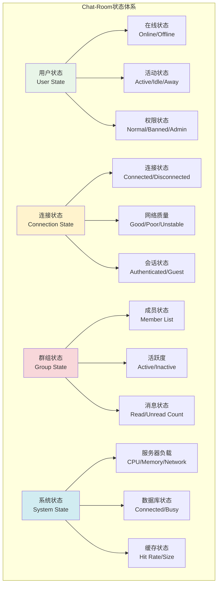
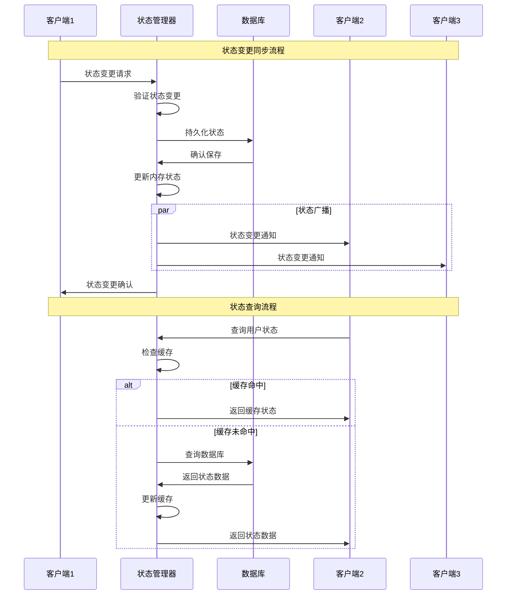

# 状态管理系统

## 🎯 学习目标

通过本章学习，您将能够：
- 理解多人聊天中的状态管理需求和挑战
- 掌握用户状态、连接状态、群组状态的管理技术
- 学会设计分布式状态同步机制
- 在Chat-Room项目中实现完整的状态管理系统

## 📊 状态管理架构

### 状态类型分析



### 状态同步机制



## 🔄 状态管理核心实现

### 状态管理器

```python
# server/state/state_manager.py - 状态管理器
import threading
import time
import json
from typing import Dict, List, Set, Optional, Any, Callable
from dataclasses import dataclass, asdict
from enum import Enum
from datetime import datetime, timedelta
import weakref

class UserStatus(Enum):
    """用户状态枚举"""
    ONLINE = "online"
    OFFLINE = "offline"
    AWAY = "away"
    BUSY = "busy"
    INVISIBLE = "invisible"

class ConnectionStatus(Enum):
    """连接状态枚举"""
    CONNECTED = "connected"
    CONNECTING = "connecting"
    DISCONNECTED = "disconnected"
    RECONNECTING = "reconnecting"

@dataclass
class UserState:
    """用户状态"""
    user_id: int
    username: str
    status: UserStatus = UserStatus.OFFLINE
    last_activity: datetime = None
    current_groups: Set[int] = None
    connection_count: int = 0
    client_info: Dict[str, Any] = None
    
    def __post_init__(self):
        if self.last_activity is None:
            self.last_activity = datetime.now()
        if self.current_groups is None:
            self.current_groups = set()
        if self.client_info is None:
            self.client_info = {}

@dataclass
class ConnectionState:
    """连接状态"""
    connection_id: str
    user_id: int
    status: ConnectionStatus = ConnectionStatus.DISCONNECTED
    ip_address: str = ""
    user_agent: str = ""
    connected_at: datetime = None
    last_ping: datetime = None
    ping_latency: float = 0.0
    
    def __post_init__(self):
        if self.connected_at is None:
            self.connected_at = datetime.now()
        if self.last_ping is None:
            self.last_ping = datetime.now()

@dataclass
class GroupState:
    """群组状态"""
    group_id: int
    group_name: str
    online_members: Set[int] = None
    total_members: int = 0
    last_message_time: datetime = None
    unread_counts: Dict[int, int] = None  # {user_id: unread_count}
    
    def __post_init__(self):
        if self.online_members is None:
            self.online_members = set()
        if self.unread_counts is None:
            self.unread_counts = {}

class StateManager:
    """
    状态管理器
    
    负责管理Chat-Room中的所有状态：
    1. 用户在线状态和活动状态
    2. 连接状态和网络质量
    3. 群组成员状态和活跃度
    4. 状态变更的实时同步
    """
    
    def __init__(self, db_connection, event_bus=None):
        self.db = db_connection
        self.event_bus = event_bus
        
        # 状态存储
        self.user_states: Dict[int, UserState] = {}
        self.connection_states: Dict[str, ConnectionState] = {}
        self.group_states: Dict[int, GroupState] = {}
        
        # 索引映射
        self.user_connections: Dict[int, Set[str]] = {}  # {user_id: {connection_ids}}
        self.connection_users: Dict[str, int] = {}  # {connection_id: user_id}
        
        # 状态变更监听器
        self.state_listeners: Dict[str, List[Callable]] = {
            'user_status_changed': [],
            'user_activity_updated': [],
            'connection_established': [],
            'connection_lost': [],
            'group_member_joined': [],
            'group_member_left': []
        }
        
        # 线程安全锁
        self.user_states_lock = threading.RWLock()
        self.connection_states_lock = threading.RWLock()
        self.group_states_lock = threading.RWLock()
        
        # 状态清理线程
        self.cleanup_thread = None
        self.running = False
        
        # 初始化
        self._load_states_from_database()
        self._start_cleanup_thread()
    
    def register_user_connection(self, connection_id: str, user_id: int, 
                               ip_address: str, user_agent: str = "") -> bool:
        """
        注册用户连接
        
        Args:
            connection_id: 连接ID
            user_id: 用户ID
            ip_address: IP地址
            user_agent: 用户代理
            
        Returns:
            是否注册成功
        """
        try:
            # 创建连接状态
            connection_state = ConnectionState(
                connection_id=connection_id,
                user_id=user_id,
                status=ConnectionStatus.CONNECTED,
                ip_address=ip_address,
                user_agent=user_agent
            )
            
            with self.connection_states_lock.write_lock():
                self.connection_states[connection_id] = connection_state
                self.connection_users[connection_id] = user_id
                
                # 更新用户连接映射
                if user_id not in self.user_connections:
                    self.user_connections[user_id] = set()
                self.user_connections[user_id].add(connection_id)
            
            # 更新用户状态
            self._update_user_online_status(user_id)
            
            # 触发事件
            self._trigger_event('connection_established', {
                'connection_id': connection_id,
                'user_id': user_id,
                'ip_address': ip_address
            })
            
            print(f"用户连接已注册: {user_id} -> {connection_id}")
            return True
            
        except Exception as e:
            print(f"注册用户连接失败: {e}")
            return False
    
    def unregister_user_connection(self, connection_id: str) -> bool:
        """
        注销用户连接
        
        Args:
            connection_id: 连接ID
            
        Returns:
            是否注销成功
        """
        try:
            user_id = None
            
            with self.connection_states_lock.write_lock():
                if connection_id in self.connection_states:
                    user_id = self.connection_states[connection_id].user_id
                    del self.connection_states[connection_id]
                
                if connection_id in self.connection_users:
                    del self.connection_users[connection_id]
                
                # 更新用户连接映射
                if user_id and user_id in self.user_connections:
                    self.user_connections[user_id].discard(connection_id)
                    if not self.user_connections[user_id]:
                        del self.user_connections[user_id]
            
            if user_id:
                # 更新用户状态
                self._update_user_online_status(user_id)
                
                # 触发事件
                self._trigger_event('connection_lost', {
                    'connection_id': connection_id,
                    'user_id': user_id
                })
            
            print(f"用户连接已注销: {connection_id}")
            return True
            
        except Exception as e:
            print(f"注销用户连接失败: {e}")
            return False
    
    def update_user_activity(self, user_id: int, activity_type: str = "general"):
        """
        更新用户活动时间
        
        Args:
            user_id: 用户ID
            activity_type: 活动类型
        """
        with self.user_states_lock.write_lock():
            if user_id in self.user_states:
                self.user_states[user_id].last_activity = datetime.now()
                
                # 如果用户状态是away，自动切换为online
                if self.user_states[user_id].status == UserStatus.AWAY:
                    self.user_states[user_id].status = UserStatus.ONLINE
        
        # 触发事件
        self._trigger_event('user_activity_updated', {
            'user_id': user_id,
            'activity_type': activity_type,
            'timestamp': datetime.now()
        })
    
    def set_user_status(self, user_id: int, status: UserStatus) -> bool:
        """
        设置用户状态
        
        Args:
            user_id: 用户ID
            status: 新状态
            
        Returns:
            是否设置成功
        """
        try:
            old_status = None
            
            with self.user_states_lock.write_lock():
                if user_id in self.user_states:
                    old_status = self.user_states[user_id].status
                    self.user_states[user_id].status = status
                    self.user_states[user_id].last_activity = datetime.now()
            
            if old_status != status:
                # 触发事件
                self._trigger_event('user_status_changed', {
                    'user_id': user_id,
                    'old_status': old_status.value if old_status else None,
                    'new_status': status.value,
                    'timestamp': datetime.now()
                })
                
                print(f"用户状态已更新: {user_id} -> {status.value}")
            
            return True
            
        except Exception as e:
            print(f"设置用户状态失败: {e}")
            return False
    
    def get_user_state(self, user_id: int) -> Optional[UserState]:
        """获取用户状态"""
        with self.user_states_lock.read_lock():
            return self.user_states.get(user_id)
    
    def get_online_users(self) -> List[int]:
        """获取所有在线用户ID列表"""
        with self.user_states_lock.read_lock():
            return [
                user_id for user_id, state in self.user_states.items()
                if state.status != UserStatus.OFFLINE
            ]
    
    def get_group_online_members(self, group_id: int) -> Set[int]:
        """获取群组在线成员"""
        with self.group_states_lock.read_lock():
            if group_id in self.group_states:
                return self.group_states[group_id].online_members.copy()
            return set()
    
    def join_group(self, user_id: int, group_id: int, group_name: str = ""):
        """用户加入群组"""
        with self.user_states_lock.write_lock(), self.group_states_lock.write_lock():
            # 更新用户状态
            if user_id in self.user_states:
                self.user_states[user_id].current_groups.add(group_id)
            
            # 更新群组状态
            if group_id not in self.group_states:
                self.group_states[group_id] = GroupState(
                    group_id=group_id,
                    group_name=group_name
                )
            
            # 如果用户在线，添加到在线成员
            user_state = self.user_states.get(user_id)
            if user_state and user_state.status != UserStatus.OFFLINE:
                self.group_states[group_id].online_members.add(user_id)
            
            self.group_states[group_id].total_members += 1
        
        # 触发事件
        self._trigger_event('group_member_joined', {
            'user_id': user_id,
            'group_id': group_id,
            'timestamp': datetime.now()
        })
    
    def leave_group(self, user_id: int, group_id: int):
        """用户离开群组"""
        with self.user_states_lock.write_lock(), self.group_states_lock.write_lock():
            # 更新用户状态
            if user_id in self.user_states:
                self.user_states[user_id].current_groups.discard(group_id)
            
            # 更新群组状态
            if group_id in self.group_states:
                self.group_states[group_id].online_members.discard(user_id)
                self.group_states[group_id].total_members = max(0, 
                    self.group_states[group_id].total_members - 1)
        
        # 触发事件
        self._trigger_event('group_member_left', {
            'user_id': user_id,
            'group_id': group_id,
            'timestamp': datetime.now()
        })
    
    def update_connection_ping(self, connection_id: str, latency: float):
        """更新连接延迟"""
        with self.connection_states_lock.write_lock():
            if connection_id in self.connection_states:
                self.connection_states[connection_id].last_ping = datetime.now()
                self.connection_states[connection_id].ping_latency = latency
    
    def get_connection_state(self, connection_id: str) -> Optional[ConnectionState]:
        """获取连接状态"""
        with self.connection_states_lock.read_lock():
            return self.connection_states.get(connection_id)
    
    def get_user_connections(self, user_id: int) -> List[str]:
        """获取用户的所有连接"""
        with self.connection_states_lock.read_lock():
            return list(self.user_connections.get(user_id, set()))
    
    def add_state_listener(self, event_type: str, callback: Callable):
        """添加状态变更监听器"""
        if event_type in self.state_listeners:
            self.state_listeners[event_type].append(callback)
    
    def remove_state_listener(self, event_type: str, callback: Callable):
        """移除状态变更监听器"""
        if event_type in self.state_listeners:
            try:
                self.state_listeners[event_type].remove(callback)
            except ValueError:
                pass
    
    def _update_user_online_status(self, user_id: int):
        """更新用户在线状态"""
        has_connections = user_id in self.user_connections and self.user_connections[user_id]
        
        with self.user_states_lock.write_lock():
            if user_id not in self.user_states:
                # 创建新的用户状态
                self.user_states[user_id] = UserState(
                    user_id=user_id,
                    username=f"用户{user_id}",  # 实际应该从数据库获取
                    status=UserStatus.ONLINE if has_connections else UserStatus.OFFLINE
                )
            else:
                # 更新现有状态
                if has_connections:
                    if self.user_states[user_id].status == UserStatus.OFFLINE:
                        self.user_states[user_id].status = UserStatus.ONLINE
                else:
                    self.user_states[user_id].status = UserStatus.OFFLINE
            
            self.user_states[user_id].connection_count = len(self.user_connections.get(user_id, set()))
        
        # 更新群组在线成员
        self._update_group_online_members(user_id, has_connections)
    
    def _update_group_online_members(self, user_id: int, is_online: bool):
        """更新群组在线成员列表"""
        user_state = self.get_user_state(user_id)
        if not user_state:
            return
        
        with self.group_states_lock.write_lock():
            for group_id in user_state.current_groups:
                if group_id in self.group_states:
                    if is_online:
                        self.group_states[group_id].online_members.add(user_id)
                    else:
                        self.group_states[group_id].online_members.discard(user_id)
    
    def _trigger_event(self, event_type: str, event_data: Dict[str, Any]):
        """触发状态变更事件"""
        if self.event_bus:
            self.event_bus.publish(event_type, event_data)
        
        # 调用注册的监听器
        for callback in self.state_listeners.get(event_type, []):
            try:
                callback(event_data)
            except Exception as e:
                print(f"状态事件回调失败: {e}")
    
    def _load_states_from_database(self):
        """从数据库加载状态信息"""
        # 这里应该从数据库加载用户和群组的基本信息
        # 实际实现中需要根据具体的数据库结构来编写
        pass
    
    def _start_cleanup_thread(self):
        """启动状态清理线程"""
        self.running = True
        self.cleanup_thread = threading.Thread(
            target=self._cleanup_loop,
            name="StateManager-Cleanup",
            daemon=True
        )
        self.cleanup_thread.start()
    
    def _cleanup_loop(self):
        """状态清理循环"""
        while self.running:
            try:
                time.sleep(60)  # 每分钟清理一次
                
                # 清理过期连接
                self._cleanup_expired_connections()
                
                # 更新用户away状态
                self._update_away_status()
                
            except Exception as e:
                print(f"状态清理异常: {e}")
    
    def _cleanup_expired_connections(self):
        """清理过期连接"""
        current_time = datetime.now()
        expired_connections = []
        
        with self.connection_states_lock.read_lock():
            for conn_id, conn_state in self.connection_states.items():
                # 如果超过5分钟没有ping，认为连接已断开
                if current_time - conn_state.last_ping > timedelta(minutes=5):
                    expired_connections.append(conn_id)
        
        # 清理过期连接
        for conn_id in expired_connections:
            self.unregister_user_connection(conn_id)
    
    def _update_away_status(self):
        """更新用户away状态"""
        current_time = datetime.now()
        
        with self.user_states_lock.write_lock():
            for user_id, user_state in self.user_states.items():
                # 如果用户在线但超过10分钟没有活动，设置为away
                if (user_state.status == UserStatus.ONLINE and
                    current_time - user_state.last_activity > timedelta(minutes=10)):
                    user_state.status = UserStatus.AWAY
    
    def stop(self):
        """停止状态管理器"""
        self.running = False
        if self.cleanup_thread:
            self.cleanup_thread.join(timeout=5)

# 使用示例
def demo_state_management():
    """状态管理演示"""
    import sqlite3
    
    # 创建内存数据库
    conn = sqlite3.connect(":memory:")
    
    # 创建状态管理器
    state_manager = StateManager(conn)
    
    print("=== 状态管理演示 ===")
    
    # 注册用户连接
    state_manager.register_user_connection("conn1", 1, "127.0.0.1", "TestClient/1.0")
    state_manager.register_user_connection("conn2", 2, "127.0.0.1", "TestClient/1.0")
    
    # 用户加入群组
    state_manager.join_group(1, 1, "技术讨论")
    state_manager.join_group(2, 1, "技术讨论")
    
    # 更新用户活动
    state_manager.update_user_activity(1, "send_message")
    
    # 设置用户状态
    state_manager.set_user_status(2, UserStatus.BUSY)
    
    # 查看状态
    user1_state = state_manager.get_user_state(1)
    print(f"用户1状态: {user1_state}")
    
    online_users = state_manager.get_online_users()
    print(f"在线用户: {online_users}")
    
    group_members = state_manager.get_group_online_members(1)
    print(f"群组1在线成员: {group_members}")
    
    # 停止状态管理器
    state_manager.stop()
    conn.close()

if __name__ == "__main__":
    demo_state_management()
```

## 🎯 实践练习

### 练习1：状态持久化
```python
class StatePersistence:
    """
    状态持久化练习
    
    要求：
    1. 实现状态的数据库持久化
    2. 支持状态的增量同步
    3. 处理状态冲突解决
    4. 实现状态快照和恢复
    """
    
    def save_state_snapshot(self, state_data: Dict[str, Any]):
        """保存状态快照"""
        # TODO: 实现状态快照保存
        pass
    
    def restore_state_snapshot(self, snapshot_id: str) -> Dict[str, Any]:
        """恢复状态快照"""
        # TODO: 实现状态快照恢复
        pass
```

### 练习2：分布式状态同步
```python
class DistributedStateSync:
    """
    分布式状态同步练习
    
    要求：
    1. 实现多服务器状态同步
    2. 处理网络分区问题
    3. 实现状态一致性算法
    4. 支持状态冲突解决
    """
    
    def sync_state_with_peers(self, peer_servers: List[str]):
        """与其他服务器同步状态"""
        # TODO: 实现分布式状态同步
        pass
    
    def resolve_state_conflict(self, local_state: Any, remote_state: Any) -> Any:
        """解决状态冲突"""
        # TODO: 实现状态冲突解决
        pass
```

## ✅ 学习检查

完成本章学习后，请确认您能够：

- [ ] 理解多人聊天中的状态管理需求
- [ ] 设计完整的状态管理架构
- [ ] 实现线程安全的状态操作
- [ ] 处理状态变更的实时同步
- [ ] 管理用户、连接、群组状态
- [ ] 完成实践练习

## 📚 下一步

状态管理系统掌握后，请继续学习：
- [第6章：文件传输功能](../06-file-transfer/file-protocol.md)

---

**恭喜！您已经完成了多人聊天功能的学习！** 🎉
