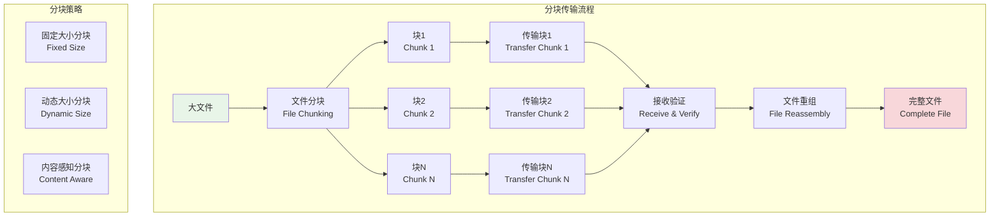
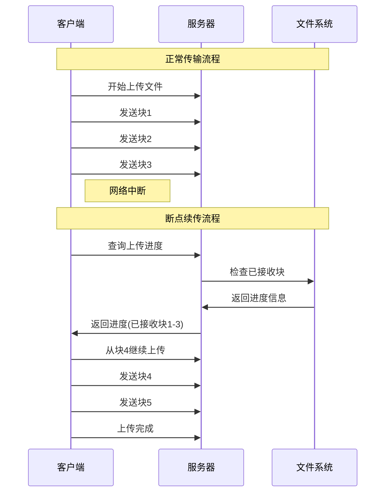

# 分块传输机制

## 🎯 学习目标

通过本章学习，您将能够：
- 理解分块传输的原理和优势
- 掌握大文件分块处理技术
- 学会实现断点续传功能
- 在Chat-Room项目中应用分块传输技术

## 🧩 分块传输架构

### 分块传输原理



### 断点续传机制



## 📦 分块传输实现

### 文件分块器

```python
# server/file/chunked_transfer.py - 分块传输实现
import os
import hashlib
import threading
import time
from typing import Dict, List, Optional, BinaryIO, Callable
from dataclasses import dataclass
from enum import Enum
import json

class ChunkStatus(Enum):
    """块状态枚举"""
    PENDING = "pending"
    UPLOADING = "uploading"
    COMPLETED = "completed"
    FAILED = "failed"
    VERIFIED = "verified"

@dataclass
class ChunkInfo:
    """块信息"""
    chunk_id: int
    start_offset: int
    end_offset: int
    size: int
    checksum: Optional[str] = None
    status: ChunkStatus = ChunkStatus.PENDING
    retry_count: int = 0
    upload_time: Optional[float] = None

@dataclass
class TransferSession:
    """传输会话"""
    session_id: str
    file_id: str
    filename: str
    total_size: int
    chunk_size: int
    total_chunks: int
    uploaded_chunks: int = 0
    chunks: Dict[int, ChunkInfo] = None
    created_at: float = None
    last_activity: float = None
    
    def __post_init__(self):
        if self.chunks is None:
            self.chunks = {}
        if self.created_at is None:
            self.created_at = time.time()
        if self.last_activity is None:
            self.last_activity = time.time()

class ChunkedFileUploader:
    """
    分块文件上传器
    
    功能：
    1. 大文件分块上传
    2. 断点续传支持
    3. 并发块传输
    4. 完整性验证
    """
    
    def __init__(self, upload_dir: str, chunk_size: int = 1024*1024):
        self.upload_dir = upload_dir
        self.default_chunk_size = chunk_size
        
        # 传输会话管理
        self.sessions: Dict[str, TransferSession] = {}
        self.sessions_lock = threading.RLock()
        
        # 临时文件管理
        self.temp_files: Dict[str, BinaryIO] = {}
        self.temp_files_lock = threading.RLock()
        
        # 确保上传目录存在
        os.makedirs(upload_dir, exist_ok=True)
        os.makedirs(os.path.join(upload_dir, 'temp'), exist_ok=True)
    
    def create_upload_session(self, file_id: str, filename: str, 
                            total_size: int, file_checksum: str,
                            chunk_size: int = None) -> TransferSession:
        """
        创建上传会话
        
        Args:
            file_id: 文件ID
            filename: 文件名
            total_size: 文件总大小
            file_checksum: 文件校验和
            chunk_size: 块大小
            
        Returns:
            传输会话对象
        """
        if chunk_size is None:
            chunk_size = self.default_chunk_size
        
        # 计算块数量
        total_chunks = (total_size + chunk_size - 1) // chunk_size
        
        # 生成会话ID
        session_id = self._generate_session_id(file_id, filename)
        
        # 创建会话
        session = TransferSession(
            session_id=session_id,
            file_id=file_id,
            filename=filename,
            total_size=total_size,
            chunk_size=chunk_size,
            total_chunks=total_chunks
        )
        
        # 初始化块信息
        for i in range(total_chunks):
            start_offset = i * chunk_size
            end_offset = min(start_offset + chunk_size, total_size)
            
            chunk_info = ChunkInfo(
                chunk_id=i,
                start_offset=start_offset,
                end_offset=end_offset,
                size=end_offset - start_offset
            )
            
            session.chunks[i] = chunk_info
        
        # 保存会话
        with self.sessions_lock:
            self.sessions[session_id] = session
        
        # 创建临时文件
        self._create_temp_file(session_id, total_size)
        
        print(f"创建上传会话: {session_id}, 文件: {filename}, 大小: {total_size}, 块数: {total_chunks}")
        return session
    
    def upload_chunk(self, session_id: str, chunk_id: int, 
                    chunk_data: bytes) -> tuple[bool, str]:
        """
        上传文件块
        
        Args:
            session_id: 会话ID
            chunk_id: 块ID
            chunk_data: 块数据
            
        Returns:
            (是否成功, 消息)
        """
        with self.sessions_lock:
            if session_id not in self.sessions:
                return False, "会话不存在"
            
            session = self.sessions[session_id]
        
        # 检查块ID有效性
        if chunk_id not in session.chunks:
            return False, f"无效的块ID: {chunk_id}"
        
        chunk_info = session.chunks[chunk_id]
        
        # 检查块状态
        if chunk_info.status == ChunkStatus.COMPLETED:
            return True, "块已上传"
        
        # 验证块大小
        if len(chunk_data) != chunk_info.size:
            return False, f"块大小不匹配: 期望{chunk_info.size}, 实际{len(chunk_data)}"
        
        try:
            # 计算块校验和
            chunk_checksum = hashlib.md5(chunk_data).hexdigest()
            
            # 写入临时文件
            success = self._write_chunk_to_temp_file(session_id, chunk_info, chunk_data)
            if not success:
                return False, "写入临时文件失败"
            
            # 更新块状态
            chunk_info.checksum = chunk_checksum
            chunk_info.status = ChunkStatus.COMPLETED
            chunk_info.upload_time = time.time()
            
            # 更新会话状态
            session.uploaded_chunks += 1
            session.last_activity = time.time()
            
            print(f"块上传成功: 会话{session_id}, 块{chunk_id}, 进度{session.uploaded_chunks}/{session.total_chunks}")
            
            return True, "块上传成功"
            
        except Exception as e:
            chunk_info.status = ChunkStatus.FAILED
            chunk_info.retry_count += 1
            return False, f"上传块失败: {e}"
    
    def complete_upload(self, session_id: str) -> tuple[bool, str, Optional[str]]:
        """
        完成文件上传
        
        Args:
            session_id: 会话ID
            
        Returns:
            (是否成功, 消息, 文件路径)
        """
        with self.sessions_lock:
            if session_id not in self.sessions:
                return False, "会话不存在", None
            
            session = self.sessions[session_id]
        
        # 检查所有块是否上传完成
        if session.uploaded_chunks != session.total_chunks:
            missing_chunks = [
                chunk_id for chunk_id, chunk_info in session.chunks.items()
                if chunk_info.status != ChunkStatus.COMPLETED
            ]
            return False, f"还有{len(missing_chunks)}个块未上传: {missing_chunks}", None
        
        try:
            # 合并临时文件为最终文件
            final_path = self._merge_temp_file(session)
            
            # 验证文件完整性
            if self._verify_file_integrity(final_path, session):
                # 清理临时文件
                self._cleanup_temp_file(session_id)
                
                # 移除会话
                with self.sessions_lock:
                    del self.sessions[session_id]
                
                print(f"文件上传完成: {session.filename} -> {final_path}")
                return True, "文件上传完成", final_path
            else:
                return False, "文件完整性验证失败", None
                
        except Exception as e:
            return False, f"完成上传失败: {e}", None
    
    def get_upload_progress(self, session_id: str) -> Optional[Dict]:
        """获取上传进度"""
        with self.sessions_lock:
            if session_id not in self.sessions:
                return None
            
            session = self.sessions[session_id]
            
            return {
                'session_id': session_id,
                'filename': session.filename,
                'total_size': session.total_size,
                'total_chunks': session.total_chunks,
                'uploaded_chunks': session.uploaded_chunks,
                'progress_percent': (session.uploaded_chunks / session.total_chunks) * 100,
                'missing_chunks': [
                    chunk_id for chunk_id, chunk_info in session.chunks.items()
                    if chunk_info.status != ChunkStatus.COMPLETED
                ],
                'created_at': session.created_at,
                'last_activity': session.last_activity
            }
    
    def resume_upload(self, session_id: str) -> Optional[List[int]]:
        """
        恢复上传，返回需要重新上传的块ID列表
        
        Args:
            session_id: 会话ID
            
        Returns:
            需要上传的块ID列表
        """
        with self.sessions_lock:
            if session_id not in self.sessions:
                return None
            
            session = self.sessions[session_id]
            
            # 返回未完成的块
            missing_chunks = [
                chunk_id for chunk_id, chunk_info in session.chunks.items()
                if chunk_info.status != ChunkStatus.COMPLETED
            ]
            
            print(f"恢复上传: 会话{session_id}, 需要上传{len(missing_chunks)}个块")
            return missing_chunks
    
    def cancel_upload(self, session_id: str) -> bool:
        """取消上传"""
        try:
            # 清理临时文件
            self._cleanup_temp_file(session_id)
            
            # 移除会话
            with self.sessions_lock:
                if session_id in self.sessions:
                    del self.sessions[session_id]
            
            print(f"上传已取消: {session_id}")
            return True
            
        except Exception as e:
            print(f"取消上传失败: {e}")
            return False
    
    def _generate_session_id(self, file_id: str, filename: str) -> str:
        """生成会话ID"""
        content = f"{file_id}_{filename}_{time.time()}"
        return hashlib.md5(content.encode()).hexdigest()
    
    def _create_temp_file(self, session_id: str, total_size: int):
        """创建临时文件"""
        temp_path = os.path.join(self.upload_dir, 'temp', f"{session_id}.tmp")
        
        with self.temp_files_lock:
            # 创建指定大小的临时文件
            with open(temp_path, 'wb') as f:
                f.seek(total_size - 1)
                f.write(b'\0')
            
            # 以读写模式打开
            self.temp_files[session_id] = open(temp_path, 'r+b')
    
    def _write_chunk_to_temp_file(self, session_id: str, chunk_info: ChunkInfo, 
                                 chunk_data: bytes) -> bool:
        """写入块到临时文件"""
        try:
            with self.temp_files_lock:
                if session_id not in self.temp_files:
                    return False
                
                temp_file = self.temp_files[session_id]
                temp_file.seek(chunk_info.start_offset)
                temp_file.write(chunk_data)
                temp_file.flush()
                
                return True
                
        except Exception as e:
            print(f"写入块到临时文件失败: {e}")
            return False
    
    def _merge_temp_file(self, session: TransferSession) -> str:
        """合并临时文件为最终文件"""
        temp_path = os.path.join(self.upload_dir, 'temp', f"{session.session_id}.tmp")
        final_path = os.path.join(self.upload_dir, f"{session.file_id}_{session.filename}")
        
        # 关闭临时文件
        with self.temp_files_lock:
            if session.session_id in self.temp_files:
                self.temp_files[session.session_id].close()
                del self.temp_files[session.session_id]
        
        # 移动文件
        os.rename(temp_path, final_path)
        
        return final_path
    
    def _verify_file_integrity(self, file_path: str, session: TransferSession) -> bool:
        """验证文件完整性"""
        try:
            # 计算文件校验和
            with open(file_path, 'rb') as f:
                file_hash = hashlib.md5()
                while chunk := f.read(8192):
                    file_hash.update(chunk)
            
            calculated_checksum = file_hash.hexdigest()
            
            # 这里应该与原始文件校验和比较
            # 由于示例中没有存储原始校验和，这里简单返回True
            print(f"文件校验和: {calculated_checksum}")
            return True
            
        except Exception as e:
            print(f"文件完整性验证失败: {e}")
            return False
    
    def _cleanup_temp_file(self, session_id: str):
        """清理临时文件"""
        try:
            # 关闭文件句柄
            with self.temp_files_lock:
                if session_id in self.temp_files:
                    self.temp_files[session_id].close()
                    del self.temp_files[session_id]
            
            # 删除临时文件
            temp_path = os.path.join(self.upload_dir, 'temp', f"{session_id}.tmp")
            if os.path.exists(temp_path):
                os.remove(temp_path)
                
        except Exception as e:
            print(f"清理临时文件失败: {e}")

# 使用示例
def demo_chunked_upload():
    """分块上传演示"""
    uploader = ChunkedFileUploader("uploads", chunk_size=1024)  # 1KB块用于演示
    
    print("=== 分块上传演示 ===")
    
    # 模拟文件数据
    file_data = b"Hello World! " * 1000  # 约13KB数据
    file_id = "test_file_123"
    filename = "test.txt"
    
    # 创建上传会话
    session = uploader.create_upload_session(
        file_id=file_id,
        filename=filename,
        total_size=len(file_data),
        file_checksum="dummy_checksum"
    )
    
    print(f"会话创建: {session.session_id}")
    
    # 分块上传
    chunk_size = session.chunk_size
    for i in range(session.total_chunks):
        start = i * chunk_size
        end = min(start + chunk_size, len(file_data))
        chunk_data = file_data[start:end]
        
        success, message = uploader.upload_chunk(session.session_id, i, chunk_data)
        print(f"上传块{i}: {success}, {message}")
        
        # 查看进度
        progress = uploader.get_upload_progress(session.session_id)
        print(f"进度: {progress['progress_percent']:.1f}%")
    
    # 完成上传
    success, message, file_path = uploader.complete_upload(session.session_id)
    print(f"上传完成: {success}, {message}, 文件路径: {file_path}")

if __name__ == "__main__":
    demo_chunked_upload()
```

## 🎯 实践练习

### 练习1：并发分块上传
```python
class ConcurrentChunkUploader:
    """
    并发分块上传练习
    
    要求：
    1. 支持多线程并发上传
    2. 实现上传速度控制
    3. 处理网络错误重试
    4. 优化上传性能
    """
    
    def upload_chunks_concurrently(self, session_id: str, max_workers: int = 4):
        """并发上传块"""
        # TODO: 实现并发上传逻辑
        pass
```

### 练习2：智能分块策略
```python
class AdaptiveChunking:
    """
    自适应分块策略练习
    
    要求：
    1. 根据网络状况调整块大小
    2. 实现内容感知分块
    3. 优化传输效率
    4. 支持动态块大小调整
    """
    
    def calculate_optimal_chunk_size(self, network_speed: float, file_type: str) -> int:
        """计算最优块大小"""
        # TODO: 实现自适应块大小计算
        pass
```

## ✅ 学习检查

完成本章学习后，请确认您能够：

- [ ] 理解分块传输的原理和优势
- [ ] 实现文件分块和重组功能
- [ ] 设计断点续传机制
- [ ] 处理并发块传输
- [ ] 验证文件完整性
- [ ] 完成实践练习

## 📚 下一步

分块传输机制掌握后，请继续学习：
- [进度跟踪](progress-tracking.md)
- [安全验证](security-validation.md)

---

**现在您已经掌握了分块传输的核心技术！** 🧩
