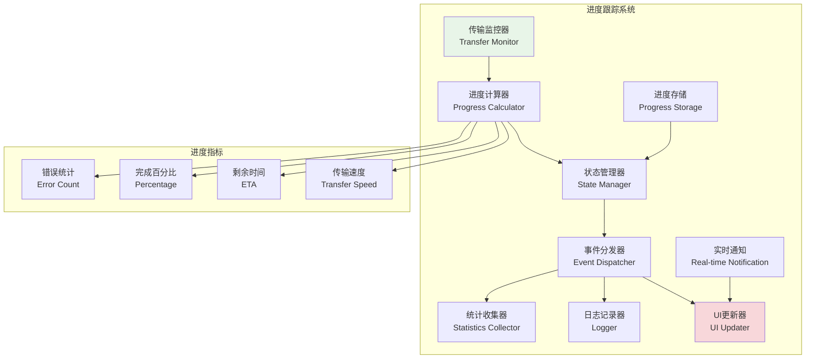
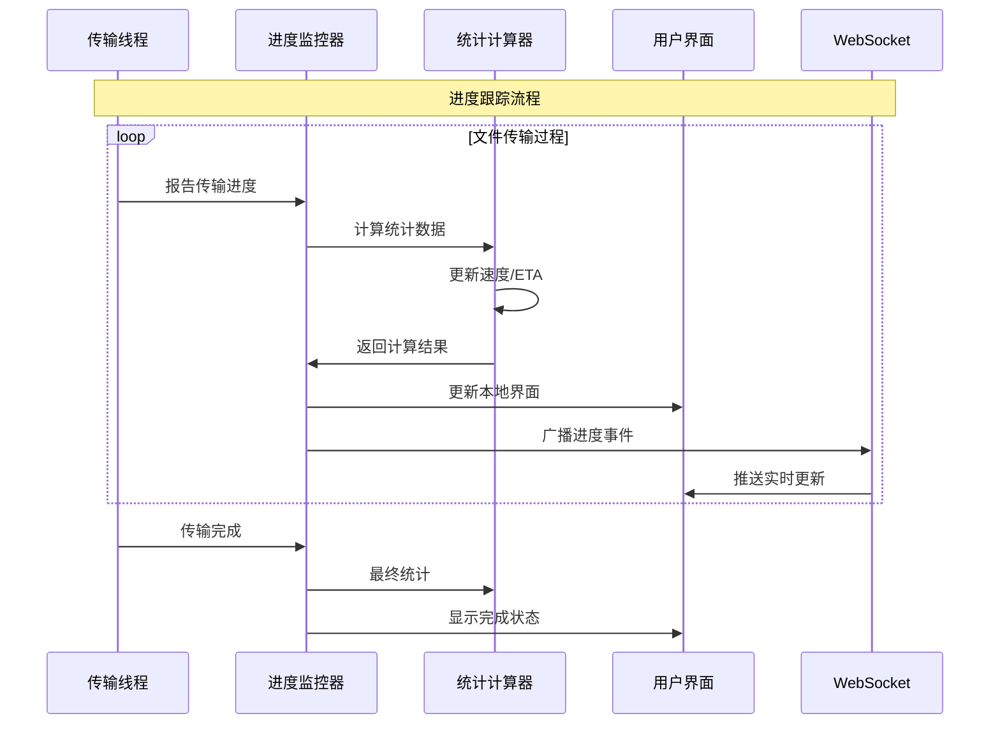

# 进度跟踪系统

## 🎯 学习目标

通过本章学习，您将能够：
- 理解文件传输进度跟踪的重要性和实现方法
- 掌握实时进度更新和用户界面展示技术
- 学会设计高效的进度监控系统
- 在Chat-Room项目中实现完整的进度跟踪功能

## 📊 进度跟踪架构

### 进度跟踪系统概览



### 进度更新流程



## 📈 进度跟踪实现

### 进度监控器

```python
# server/file/progress_tracker.py - 进度跟踪器
import threading
import time
import json
from typing import Dict, List, Optional, Callable, Any
from dataclasses import dataclass, asdict
from enum import Enum
import queue

class TransferStatus(Enum):
    """传输状态"""
    PENDING = "pending"
    STARTING = "starting"
    IN_PROGRESS = "in_progress"
    PAUSED = "paused"
    COMPLETED = "completed"
    FAILED = "failed"
    CANCELLED = "cancelled"

@dataclass
class ProgressSnapshot:
    """进度快照"""
    transfer_id: str
    filename: str
    total_size: int
    transferred_size: int
    transfer_speed: float  # bytes/second
    progress_percent: float
    eta_seconds: Optional[float]  # estimated time to arrival
    status: TransferStatus
    start_time: float
    last_update_time: float
    error_count: int = 0
    retry_count: int = 0
    
    def to_dict(self) -> Dict[str, Any]:
        """转换为字典"""
        return {
            'transfer_id': self.transfer_id,
            'filename': self.filename,
            'total_size': self.total_size,
            'transferred_size': self.transferred_size,
            'transfer_speed': self.transfer_speed,
            'progress_percent': self.progress_percent,
            'eta_seconds': self.eta_seconds,
            'status': self.status.value,
            'start_time': self.start_time,
            'last_update_time': self.last_update_time,
            'error_count': self.error_count,
            'retry_count': self.retry_count
        }

class SpeedCalculator:
    """传输速度计算器"""
    
    def __init__(self, window_size: int = 10):
        self.window_size = window_size
        self.samples: List[tuple] = []  # (timestamp, bytes_transferred)
        self.lock = threading.Lock()
    
    def add_sample(self, bytes_transferred: int):
        """添加传输样本"""
        with self.lock:
            current_time = time.time()
            self.samples.append((current_time, bytes_transferred))
            
            # 保持窗口大小
            if len(self.samples) > self.window_size:
                self.samples.pop(0)
    
    def calculate_speed(self) -> float:
        """计算当前传输速度 (bytes/second)"""
        with self.lock:
            if len(self.samples) < 2:
                return 0.0
            
            # 使用最近的样本计算速度
            time_diff = self.samples[-1][0] - self.samples[0][0]
            bytes_diff = self.samples[-1][1] - self.samples[0][1]
            
            if time_diff <= 0:
                return 0.0
            
            return bytes_diff / time_diff
    
    def calculate_eta(self, remaining_bytes: int) -> Optional[float]:
        """计算预计完成时间"""
        speed = self.calculate_speed()
        if speed <= 0:
            return None
        
        return remaining_bytes / speed

class ProgressTracker:
    """
    进度跟踪器
    
    功能：
    1. 实时跟踪文件传输进度
    2. 计算传输速度和预计完成时间
    3. 管理传输状态和错误统计
    4. 提供进度查询和订阅功能
    """
    
    def __init__(self):
        # 传输进度存储
        self.transfers: Dict[str, ProgressSnapshot] = {}
        self.speed_calculators: Dict[str, SpeedCalculator] = {}
        
        # 进度监听器
        self.progress_listeners: List[Callable] = []
        
        # 事件队列
        self.event_queue = queue.Queue()
        
        # 线程安全锁
        self.transfers_lock = threading.RWLock()
        self.listeners_lock = threading.RLock()
        
        # 事件处理线程
        self.event_thread = None
        self.running = False
        
        # 启动事件处理
        self._start_event_processing()
    
    def start_transfer(self, transfer_id: str, filename: str, total_size: int) -> bool:
        """
        开始传输跟踪
        
        Args:
            transfer_id: 传输ID
            filename: 文件名
            total_size: 文件总大小
            
        Returns:
            是否成功开始跟踪
        """
        try:
            current_time = time.time()
            
            # 创建进度快照
            progress = ProgressSnapshot(
                transfer_id=transfer_id,
                filename=filename,
                total_size=total_size,
                transferred_size=0,
                transfer_speed=0.0,
                progress_percent=0.0,
                eta_seconds=None,
                status=TransferStatus.STARTING,
                start_time=current_time,
                last_update_time=current_time
            )
            
            # 创建速度计算器
            speed_calc = SpeedCalculator()
            
            with self.transfers_lock.write_lock():
                self.transfers[transfer_id] = progress
                self.speed_calculators[transfer_id] = speed_calc
            
            # 触发事件
            self._emit_event('transfer_started', progress)
            
            print(f"开始跟踪传输: {transfer_id} - {filename}")
            return True
            
        except Exception as e:
            print(f"开始传输跟踪失败: {e}")
            return False
    
    def update_progress(self, transfer_id: str, bytes_transferred: int) -> bool:
        """
        更新传输进度
        
        Args:
            transfer_id: 传输ID
            bytes_transferred: 已传输字节数
            
        Returns:
            是否成功更新
        """
        with self.transfers_lock.write_lock():
            if transfer_id not in self.transfers:
                return False
            
            progress = self.transfers[transfer_id]
            speed_calc = self.speed_calculators[transfer_id]
            
            # 更新传输数据
            progress.transferred_size = bytes_transferred
            progress.last_update_time = time.time()
            
            # 计算进度百分比
            if progress.total_size > 0:
                progress.progress_percent = (bytes_transferred / progress.total_size) * 100
            
            # 更新速度计算器
            speed_calc.add_sample(bytes_transferred)
            
            # 计算传输速度
            progress.transfer_speed = speed_calc.calculate_speed()
            
            # 计算预计完成时间
            remaining_bytes = progress.total_size - bytes_transferred
            if remaining_bytes > 0:
                progress.eta_seconds = speed_calc.calculate_eta(remaining_bytes)
            else:
                progress.eta_seconds = 0
            
            # 更新状态
            if progress.status == TransferStatus.STARTING:
                progress.status = TransferStatus.IN_PROGRESS
        
        # 触发事件
        self._emit_event('progress_updated', progress)
        
        return True
    
    def complete_transfer(self, transfer_id: str, success: bool = True) -> bool:
        """
        完成传输
        
        Args:
            transfer_id: 传输ID
            success: 是否成功完成
            
        Returns:
            是否成功标记完成
        """
        with self.transfers_lock.write_lock():
            if transfer_id not in self.transfers:
                return False
            
            progress = self.transfers[transfer_id]
            progress.last_update_time = time.time()
            
            if success:
                progress.status = TransferStatus.COMPLETED
                progress.progress_percent = 100.0
                progress.transferred_size = progress.total_size
                progress.eta_seconds = 0
            else:
                progress.status = TransferStatus.FAILED
        
        # 触发事件
        event_type = 'transfer_completed' if success else 'transfer_failed'
        self._emit_event(event_type, progress)
        
        print(f"传输{'完成' if success else '失败'}: {transfer_id}")
        return True
    
    def pause_transfer(self, transfer_id: str) -> bool:
        """暂停传输"""
        with self.transfers_lock.write_lock():
            if transfer_id not in self.transfers:
                return False
            
            progress = self.transfers[transfer_id]
            if progress.status == TransferStatus.IN_PROGRESS:
                progress.status = TransferStatus.PAUSED
                progress.last_update_time = time.time()
        
        self._emit_event('transfer_paused', progress)
        return True
    
    def resume_transfer(self, transfer_id: str) -> bool:
        """恢复传输"""
        with self.transfers_lock.write_lock():
            if transfer_id not in self.transfers:
                return False
            
            progress = self.transfers[transfer_id]
            if progress.status == TransferStatus.PAUSED:
                progress.status = TransferStatus.IN_PROGRESS
                progress.last_update_time = time.time()
        
        self._emit_event('transfer_resumed', progress)
        return True
    
    def cancel_transfer(self, transfer_id: str) -> bool:
        """取消传输"""
        with self.transfers_lock.write_lock():
            if transfer_id not in self.transfers:
                return False
            
            progress = self.transfers[transfer_id]
            progress.status = TransferStatus.CANCELLED
            progress.last_update_time = time.time()
        
        self._emit_event('transfer_cancelled', progress)
        return True
    
    def increment_error_count(self, transfer_id: str) -> bool:
        """增加错误计数"""
        with self.transfers_lock.write_lock():
            if transfer_id not in self.transfers:
                return False
            
            progress = self.transfers[transfer_id]
            progress.error_count += 1
            progress.last_update_time = time.time()
        
        self._emit_event('transfer_error', progress)
        return True
    
    def increment_retry_count(self, transfer_id: str) -> bool:
        """增加重试计数"""
        with self.transfers_lock.write_lock():
            if transfer_id not in self.transfers:
                return False
            
            progress = self.transfers[transfer_id]
            progress.retry_count += 1
            progress.last_update_time = time.time()
        
        self._emit_event('transfer_retry', progress)
        return True
    
    def get_progress(self, transfer_id: str) -> Optional[ProgressSnapshot]:
        """获取传输进度"""
        with self.transfers_lock.read_lock():
            return self.transfers.get(transfer_id)
    
    def get_all_transfers(self) -> List[ProgressSnapshot]:
        """获取所有传输进度"""
        with self.transfers_lock.read_lock():
            return list(self.transfers.values())
    
    def get_active_transfers(self) -> List[ProgressSnapshot]:
        """获取活跃的传输"""
        with self.transfers_lock.read_lock():
            return [
                progress for progress in self.transfers.values()
                if progress.status in [TransferStatus.STARTING, TransferStatus.IN_PROGRESS]
            ]
    
    def remove_transfer(self, transfer_id: str) -> bool:
        """移除传输记录"""
        with self.transfers_lock.write_lock():
            if transfer_id in self.transfers:
                del self.transfers[transfer_id]
            if transfer_id in self.speed_calculators:
                del self.speed_calculators[transfer_id]
            return True
        return False
    
    def add_progress_listener(self, listener: Callable):
        """添加进度监听器"""
        with self.listeners_lock:
            self.progress_listeners.append(listener)
    
    def remove_progress_listener(self, listener: Callable):
        """移除进度监听器"""
        with self.listeners_lock:
            try:
                self.progress_listeners.remove(listener)
            except ValueError:
                pass
    
    def _emit_event(self, event_type: str, progress: ProgressSnapshot):
        """发送事件"""
        event = {
            'type': event_type,
            'progress': progress.to_dict(),
            'timestamp': time.time()
        }
        
        try:
            self.event_queue.put_nowait(event)
        except queue.Full:
            print("事件队列已满，丢弃事件")
    
    def _start_event_processing(self):
        """启动事件处理线程"""
        self.running = True
        self.event_thread = threading.Thread(
            target=self._event_processing_loop,
            name="ProgressTracker-Events",
            daemon=True
        )
        self.event_thread.start()
    
    def _event_processing_loop(self):
        """事件处理循环"""
        while self.running:
            try:
                event = self.event_queue.get(timeout=1.0)
                
                # 通知所有监听器
                with self.listeners_lock:
                    for listener in self.progress_listeners:
                        try:
                            listener(event)
                        except Exception as e:
                            print(f"进度监听器异常: {e}")
                
                self.event_queue.task_done()
                
            except queue.Empty:
                continue
            except Exception as e:
                print(f"事件处理异常: {e}")
    
    def stop(self):
        """停止进度跟踪器"""
        self.running = False
        if self.event_thread:
            self.event_thread.join(timeout=5)

# 进度格式化工具
class ProgressFormatter:
    """进度格式化工具"""
    
    @staticmethod
    def format_size(size_bytes: int) -> str:
        """格式化文件大小"""
        for unit in ['B', 'KB', 'MB', 'GB', 'TB']:
            if size_bytes < 1024.0:
                return f"{size_bytes:.1f} {unit}"
            size_bytes /= 1024.0
        return f"{size_bytes:.1f} PB"
    
    @staticmethod
    def format_speed(speed_bps: float) -> str:
        """格式化传输速度"""
        return f"{ProgressFormatter.format_size(int(speed_bps))}/s"
    
    @staticmethod
    def format_eta(eta_seconds: Optional[float]) -> str:
        """格式化预计完成时间"""
        if eta_seconds is None or eta_seconds <= 0:
            return "未知"
        
        if eta_seconds < 60:
            return f"{int(eta_seconds)}秒"
        elif eta_seconds < 3600:
            minutes = int(eta_seconds // 60)
            seconds = int(eta_seconds % 60)
            return f"{minutes}分{seconds}秒"
        else:
            hours = int(eta_seconds // 3600)
            minutes = int((eta_seconds % 3600) // 60)
            return f"{hours}小时{minutes}分"
    
    @staticmethod
    def format_progress_bar(progress_percent: float, width: int = 30) -> str:
        """格式化进度条"""
        filled = int(width * progress_percent / 100)
        bar = '█' * filled + '░' * (width - filled)
        return f"[{bar}] {progress_percent:.1f}%"

# 使用示例
def demo_progress_tracking():
    """进度跟踪演示"""
    tracker = ProgressTracker()
    
    # 添加进度监听器
    def progress_listener(event):
        progress = event['progress']
        print(f"事件: {event['type']}")
        print(f"文件: {progress['filename']}")
        print(f"进度: {ProgressFormatter.format_progress_bar(progress['progress_percent'])}")
        print(f"速度: {ProgressFormatter.format_speed(progress['transfer_speed'])}")
        print(f"ETA: {ProgressFormatter.format_eta(progress['eta_seconds'])}")
        print("-" * 50)
    
    tracker.add_progress_listener(progress_listener)
    
    print("=== 进度跟踪演示 ===")
    
    # 开始传输
    transfer_id = "test_transfer_123"
    tracker.start_transfer(transfer_id, "test_file.zip", 10 * 1024 * 1024)  # 10MB
    
    # 模拟传输进度
    total_size = 10 * 1024 * 1024
    chunk_size = 1024 * 1024  # 1MB chunks
    
    for i in range(10):
        transferred = (i + 1) * chunk_size
        tracker.update_progress(transfer_id, transferred)
        time.sleep(0.5)  # 模拟传输延迟
    
    # 完成传输
    tracker.complete_transfer(transfer_id, success=True)
    
    # 等待事件处理
    time.sleep(1)
    
    # 停止跟踪器
    tracker.stop()

if __name__ == "__main__":
    demo_progress_tracking()
```

## 🎯 实践练习

### 练习1：实时进度推送
```python
class RealTimeProgressPusher:
    """
    实时进度推送练习
    
    要求：
    1. 实现WebSocket进度推送
    2. 支持多客户端订阅
    3. 优化推送频率
    4. 处理连接断开
    """
    
    def push_progress_update(self, transfer_id: str, clients: List[Any]):
        """推送进度更新"""
        # TODO: 实现实时进度推送
        pass
```

### 练习2：进度持久化
```python
class ProgressPersistence:
    """
    进度持久化练习
    
    要求：
    1. 保存传输进度到数据库
    2. 支持断点续传恢复
    3. 清理过期进度记录
    4. 提供进度历史查询
    """
    
    def save_progress_snapshot(self, progress: ProgressSnapshot):
        """保存进度快照"""
        # TODO: 实现进度持久化
        pass
```

## ✅ 学习检查

完成本章学习后，请确认您能够：

- [ ] 理解进度跟踪的重要性和实现原理
- [ ] 设计完整的进度监控系统
- [ ] 计算传输速度和预计完成时间
- [ ] 实现实时进度更新和事件通知
- [ ] 格式化和展示进度信息
- [ ] 完成实践练习

## 📚 下一步

进度跟踪系统掌握后，请继续学习：
- [安全验证](security-validation.md)

---

**现在您已经掌握了进度跟踪的核心技术！** 📊
