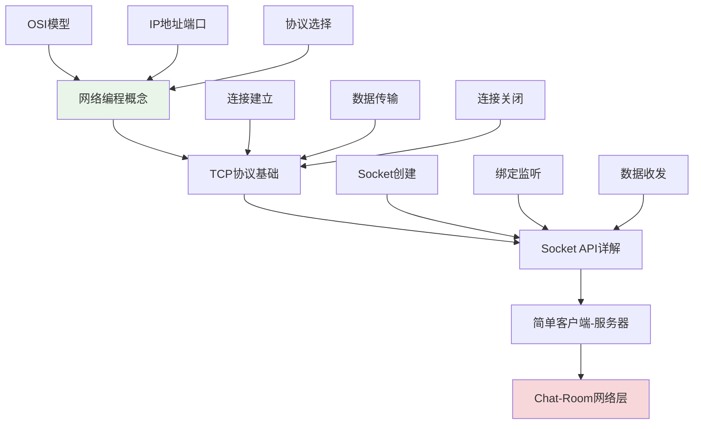

# 第6章：Socket网络编程

## 🎯 学习目标

通过本章学习，您将能够：
- 理解网络编程的基本概念和原理
- 掌握Python Socket编程的核心技术
- 实现基础的客户端-服务器通信
- 为Chat-Room项目的网络功能打下基础

## 📖 本章概览

本章是Chat-Room项目的核心技术章节。我们将从网络编程的基本概念开始，深入学习TCP协议和Socket API，最后实现完整的客户端-服务器通信。

### 学习路径

## 📚 章节内容

### 1. [网络编程概念](network-concepts.md)
**学习时间：** 3-4小时  
**难度等级：** ⭐⭐

学习内容：
- 网络编程基础概念
- OSI七层模型和TCP/IP模型
- IP地址、端口和协议
- 客户端-服务器架构

### 2. [TCP协议基础](tcp-basics.md)
**学习时间：** 4-5小时  
**难度等级：** ⭐⭐⭐

学习内容：
- TCP协议特点和优势
- 三次握手和四次挥手
- 数据传输和流控制
- TCP在Chat-Room中的应用

### 3. [Socket API详解](socket-api.md)
**学习时间：** 5-6小时  
**难度等级：** ⭐⭐⭐

学习内容：
- Python Socket库介绍
- Socket创建和配置
- 服务器端编程模式
- 客户端编程模式

### 4. [简单客户端-服务器](simple-client-server.md)
**学习时间：** 4-5小时  
**难度等级：** ⭐⭐⭐

学习内容：
- 实现基础的Echo服务器
- 客户端连接和通信
- 错误处理和异常管理
- 代码优化和重构

## 🔧 前置知识要求

- **Python基础：** 已完成第1章Python编程基础
- **计算机网络：** 了解基本的网络概念
- **编程经验：** 能够编写简单的Python程序

## ⏱️ 预计学习时间

| 内容 | 预计时间 | 累计时间 |
|------|----------|----------|
| 网络编程概念 | 3-4小时 | 3-4小时 |
| TCP协议基础 | 4-5小时 | 7-9小时 |
| Socket API详解 | 5-6小时 | 12-15小时 |
| 简单客户端-服务器 | 4-5小时 | 16-20小时 |
| **总计** | **16-20小时** | **3-4天** |

## 📋 学习顺序建议

### 第1天：理论基础
1. **网络编程概念** - 建立网络编程的整体认识
2. **TCP协议基础** - 理解底层通信原理

### 第2-3天：实践编程
3. **Socket API详解** - 掌握编程接口
4. **简单客户端-服务器** - 实现完整通信

### 第4天：项目应用
5. **Chat-Room网络层设计** - 应用到实际项目

## ✅ 学习检查清单

### 理论理解
- [ ] 理解网络编程的基本概念
- [ ] 掌握TCP协议的工作原理
- [ ] 了解客户端-服务器架构
- [ ] 理解Socket编程模型

### 实践能力
- [ ] 能够创建TCP Socket
- [ ] 实现基础的服务器程序
- [ ] 实现基础的客户端程序
- [ ] 处理网络编程中的异常

### 项目应用
- [ ] 设计Chat-Room的网络架构
- [ ] 实现消息的网络传输
- [ ] 处理多客户端连接
- [ ] 优化网络性能

## 📚 下一步学习

Socket网络编程掌握后，请继续学习：
- [第7章：简单聊天室](../07-simple-chat/README.md) - 实现完整的聊天功能

---

**网络编程是现代应用开发的核心技能！** 🌐

*本章最后更新：2025-01-17*
