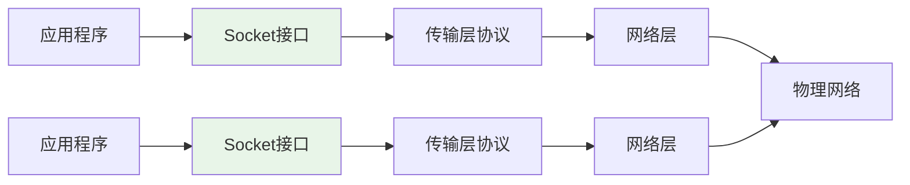

# Python Socket API详解

## 🎯 学习目标

通过本章学习，您将能够：
- 掌握Python Socket API的完整使用方法
- 理解Socket编程的核心概念和最佳实践
- 学会处理Socket编程中的常见问题
- 在Chat-Room项目中熟练应用Socket技术

## 🔌 Socket基础概念

### Socket是什么？



Socket是应用程序与网络协议栈之间的接口，就像文件操作一样简单：
- **创建Socket**：类似打开文件
- **连接Socket**：建立通信通道
- **读写数据**：发送和接收数据
- **关闭Socket**：释放资源

### Python Socket模块架构
```python
# Python Socket模块的核心组件
import socket

"""
Socket模块提供的主要功能：

1. Socket对象创建和管理
2. 地址族支持（IPv4, IPv6, Unix域套接字）
3. Socket类型支持（TCP, UDP, Raw）
4. 网络地址转换
5. 错误处理和异常
6. 高级功能（SSL, 多播等）
"""

# Chat-Room项目中使用的Socket类型
def socket_types_in_chatroom():
    """Chat-Room项目中的Socket使用"""
    
    # TCP Socket（主要使用）
    tcp_socket = socket.socket(socket.AF_INET, socket.SOCK_STREAM)
    print("TCP Socket: 可靠的、面向连接的通信")
    
    # 地址族说明
    address_families = {
        socket.AF_INET: "IPv4网络通信",
        socket.AF_INET6: "IPv6网络通信", 
        socket.AF_UNIX: "Unix域套接字（本地通信）"
    }
    
    # Socket类型说明
    socket_types = {
        socket.SOCK_STREAM: "TCP - 可靠的字节流",
        socket.SOCK_DGRAM: "UDP - 不可靠的数据报",
        socket.SOCK_RAW: "原始套接字（需要特权）"
    }
    
    return address_families, socket_types
```

## 🖥️ 服务器端Socket编程

### 完整的服务器实现
```python
# server/network/tcp_server.py - TCP服务器实现
import socket
import threading
import select
import time
from typing import List, Dict, Optional, Callable

class TCPServer:
    """
    TCP服务器基类
    
    提供完整的服务器Socket编程示例
    """
    
    def __init__(self, host: str = "localhost", port: int = 8888):
        self.host = host
        self.port = port
        self.server_socket: Optional[socket.socket] = None
        self.client_sockets: List[socket.socket] = []
        self.running = False
        
        # 回调函数
        self.on_client_connect: Optional[Callable] = None
        self.on_client_disconnect: Optional[Callable] = None
        self.on_data_received: Optional[Callable] = None
    
    def create_server_socket(self) -> bool:
        """
        创建并配置服务器Socket
        
        Socket创建和配置的完整流程
        """
        try:
            # 1. 创建Socket对象
            self.server_socket = socket.socket(socket.AF_INET, socket.SOCK_STREAM)
            print(f"创建TCP Socket成功")
            
            # 2. 设置Socket选项
            self._configure_server_socket()
            
            # 3. 绑定地址和端口
            self.server_socket.bind((self.host, self.port))
            print(f"绑定地址 {self.host}:{self.port} 成功")
            
            # 4. 开始监听
            self.server_socket.listen(128)  # 连接队列长度
            print(f"开始监听，队列长度: 128")
            
            return True
            
        except socket.error as e:
            print(f"创建服务器Socket失败: {e}")
            return False
    
    def _configure_server_socket(self):
        """
        配置服务器Socket选项
        
        重要的Socket选项说明
        """
        # SO_REUSEADDR: 允许重用本地地址
        # 解决TIME_WAIT状态下无法重新绑定的问题
        self.server_socket.setsockopt(socket.SOL_SOCKET, socket.SO_REUSEADDR, 1)
        
        # SO_REUSEPORT: 允许多个进程绑定同一端口（Linux）
        try:
            self.server_socket.setsockopt(socket.SOL_SOCKET, socket.SO_REUSEPORT, 1)
        except AttributeError:
            # Windows不支持SO_REUSEPORT
            pass
        
        # 设置接收缓冲区大小
        self.server_socket.setsockopt(socket.SOL_SOCKET, socket.SO_RCVBUF, 65536)
        
        # 设置发送缓冲区大小
        self.server_socket.setsockopt(socket.SOL_SOCKET, socket.SO_SNDBUF, 65536)
        
        print("服务器Socket配置完成")
    
    def start_server(self):
        """
        启动服务器
        
        使用select模型处理多个连接
        """
        if not self.create_server_socket():
            return
        
        self.running = True
        print(f"服务器启动成功，监听 {self.host}:{self.port}")
        
        # 使用select模型（I/O多路复用）
        self._run_select_loop()
    
    def _run_select_loop(self):
        """
        select模型主循环
        
        I/O多路复用，高效处理多个连接
        """
        # 监听的Socket列表
        read_sockets = [self.server_socket]
        write_sockets = []
        error_sockets = []
        
        while self.running:
            try:
                # select调用：监听可读、可写、异常Socket
                readable, writable, exceptional = select.select(
                    read_sockets, write_sockets, error_sockets, 1.0  # 1秒超时
                )
                
                # 处理可读Socket
                for sock in readable:
                    if sock is self.server_socket:
                        # 服务器Socket可读：有新连接
                        self._accept_new_connection(read_sockets)
                    else:
                        # 客户端Socket可读：有数据到达
                        self._handle_client_data(sock, read_sockets)
                
                # 处理异常Socket
                for sock in exceptional:
                    print(f"Socket异常: {sock.getpeername()}")
                    self._cleanup_client_socket(sock, read_sockets)
                    
            except KeyboardInterrupt:
                print("收到中断信号，关闭服务器")
                break
            except Exception as e:
                print(f"select循环异常: {e}")
        
        self._cleanup_server()
    
    def _accept_new_connection(self, read_sockets: List[socket.socket]):
        """
        接受新的客户端连接
        
        处理新连接的完整流程
        """
        try:
            client_socket, client_address = self.server_socket.accept()
            print(f"新客户端连接: {client_address}")
            
            # 配置客户端Socket
            self._configure_client_socket(client_socket)
            
            # 添加到监听列表
            read_sockets.append(client_socket)
            self.client_sockets.append(client_socket)
            
            # 调用连接回调
            if self.on_client_connect:
                self.on_client_connect(client_socket, client_address)
                
        except socket.error as e:
            print(f"接受连接失败: {e}")
    
    def _configure_client_socket(self, client_socket: socket.socket):
        """
        配置客户端Socket
        
        优化客户端连接性能
        """
        # 禁用Nagle算法，减少延迟
        client_socket.setsockopt(socket.IPPROTO_TCP, socket.TCP_NODELAY, 1)
        
        # 启用Keep-Alive
        client_socket.setsockopt(socket.SOL_SOCKET, socket.SO_KEEPALIVE, 1)
        
        # 设置接收超时
        client_socket.settimeout(300.0)  # 5分钟
    
    def _handle_client_data(self, client_socket: socket.socket, 
                           read_sockets: List[socket.socket]):
        """
        处理客户端数据
        
        接收和处理客户端发送的数据
        """
        try:
            data = client_socket.recv(4096)
            
            if data:
                # 有数据：调用数据处理回调
                if self.on_data_received:
                    self.on_data_received(client_socket, data)
            else:
                # 无数据：客户端关闭连接
                print(f"客户端 {client_socket.getpeername()} 断开连接")
                self._cleanup_client_socket(client_socket, read_sockets)
                
        except socket.timeout:
            print(f"客户端 {client_socket.getpeername()} 接收超时")
            self._cleanup_client_socket(client_socket, read_sockets)
        except ConnectionResetError:
            print(f"客户端 {client_socket.getpeername()} 连接重置")
            self._cleanup_client_socket(client_socket, read_sockets)
        except Exception as e:
            print(f"处理客户端数据异常: {e}")
            self._cleanup_client_socket(client_socket, read_sockets)
    
    def _cleanup_client_socket(self, client_socket: socket.socket,
                              read_sockets: List[socket.socket]):
        """清理客户端Socket"""
        try:
            # 获取客户端地址（用于日志）
            client_address = client_socket.getpeername()
        except:
            client_address = "未知地址"
        
        # 关闭Socket
        try:
            client_socket.close()
        except:
            pass
        
        # 从列表中移除
        if client_socket in read_sockets:
            read_sockets.remove(client_socket)
        if client_socket in self.client_sockets:
            self.client_sockets.remove(client_socket)
        
        # 调用断开连接回调
        if self.on_client_disconnect:
            self.on_client_disconnect(client_socket, client_address)
        
        print(f"客户端 {client_address} 连接已清理")
    
    def broadcast_message(self, message: bytes, exclude_socket: socket.socket = None):
        """
        广播消息给所有客户端
        
        Chat-Room的核心功能：消息广播
        """
        disconnected_sockets = []
        
        for client_socket in self.client_sockets:
            if client_socket == exclude_socket:
                continue
            
            try:
                client_socket.send(message)
            except Exception as e:
                print(f"发送消息失败: {e}")
                disconnected_sockets.append(client_socket)
        
        # 清理断开的连接
        for sock in disconnected_sockets:
            self._cleanup_client_socket(sock, [])
    
    def _cleanup_server(self):
        """清理服务器资源"""
        self.running = False
        
        # 关闭所有客户端连接
        for client_socket in self.client_sockets[:]:
            try:
                client_socket.close()
            except:
                pass
        
        # 关闭服务器Socket
        if self.server_socket:
            try:
                self.server_socket.close()
            except:
                pass
        
        print("服务器已关闭")
```

## 💻 客户端Socket编程

### 完整的客户端实现
```python
# client/network/tcp_client.py - TCP客户端实现
import socket
import threading
import time
from typing import Optional, Callable

class TCPClient:
    """
    TCP客户端基类
    
    提供完整的客户端Socket编程示例
    """
    
    def __init__(self, host: str = "localhost", port: int = 8888):
        self.host = host
        self.port = port
        self.socket: Optional[socket.socket] = None
        self.connected = False
        self.receive_thread: Optional[threading.Thread] = None
        
        # 回调函数
        self.on_connected: Optional[Callable] = None
        self.on_disconnected: Optional[Callable] = None
        self.on_data_received: Optional[Callable] = None
        self.on_error: Optional[Callable] = None
    
    def connect(self) -> bool:
        """
        连接到服务器
        
        客户端连接的完整流程
        """
        try:
            # 1. 创建Socket
            self.socket = socket.socket(socket.AF_INET, socket.SOCK_STREAM)
            print("创建客户端Socket成功")
            
            # 2. 配置Socket
            self._configure_client_socket()
            
            # 3. 连接服务器
            print(f"正在连接服务器 {self.host}:{self.port}...")
            self.socket.connect((self.host, self.port))
            
            self.connected = True
            print("连接服务器成功")
            
            # 4. 启动接收线程
            self._start_receive_thread()
            
            # 5. 调用连接回调
            if self.on_connected:
                self.on_connected()
            
            return True
            
        except socket.error as e:
            print(f"连接服务器失败: {e}")
            if self.on_error:
                self.on_error(f"连接失败: {e}")
            return False
    
    def _configure_client_socket(self):
        """
        配置客户端Socket
        
        优化客户端性能
        """
        # 设置连接超时
        self.socket.settimeout(10.0)
        
        # 禁用Nagle算法
        self.socket.setsockopt(socket.IPPROTO_TCP, socket.TCP_NODELAY, 1)
        
        # 设置缓冲区大小
        self.socket.setsockopt(socket.SOL_SOCKET, socket.SO_RCVBUF, 32768)
        self.socket.setsockopt(socket.SOL_SOCKET, socket.SO_SNDBUF, 32768)
    
    def _start_receive_thread(self):
        """
        启动数据接收线程
        
        客户端需要独立线程接收服务器数据
        """
        self.receive_thread = threading.Thread(
            target=self._receive_loop,
            daemon=True
        )
        self.receive_thread.start()
        print("数据接收线程已启动")
    
    def _receive_loop(self):
        """
        数据接收循环
        
        持续接收服务器发送的数据
        """
        while self.connected and self.socket:
            try:
                data = self.socket.recv(4096)
                
                if data:
                    # 收到数据：调用数据处理回调
                    if self.on_data_received:
                        self.on_data_received(data)
                else:
                    # 服务器关闭连接
                    print("服务器关闭了连接")
                    self._handle_disconnect()
                    break
                    
            except socket.timeout:
                # 接收超时，继续循环
                continue
            except ConnectionResetError:
                print("连接被服务器重置")
                self._handle_disconnect()
                break
            except Exception as e:
                print(f"接收数据异常: {e}")
                if self.on_error:
                    self.on_error(f"接收异常: {e}")
                self._handle_disconnect()
                break
    
    def send_data(self, data: bytes) -> bool:
        """
        发送数据到服务器
        
        安全的数据发送方法
        """
        if not self.connected or not self.socket:
            print("未连接到服务器")
            return False
        
        try:
            # 确保所有数据都发送完毕
            total_sent = 0
            data_length = len(data)
            
            while total_sent < data_length:
                sent = self.socket.send(data[total_sent:])
                if sent == 0:
                    print("Socket连接已断开")
                    self._handle_disconnect()
                    return False
                total_sent += sent
            
            return True
            
        except Exception as e:
            print(f"发送数据失败: {e}")
            if self.on_error:
                self.on_error(f"发送失败: {e}")
            return False
    
    def _handle_disconnect(self):
        """
        处理连接断开
        
        清理资源和状态
        """
        if self.connected:
            self.connected = False
            
            # 调用断开连接回调
            if self.on_disconnected:
                self.on_disconnected()
    
    def disconnect(self):
        """
        主动断开连接
        
        优雅关闭连接
        """
        if not self.connected:
            return
        
        print("正在断开连接...")
        self.connected = False
        
        # 关闭Socket
        if self.socket:
            try:
                # 优雅关闭：先关闭发送方向
                self.socket.shutdown(socket.SHUT_WR)
                
                # 等待接收线程结束
                if self.receive_thread and self.receive_thread.is_alive():
                    self.receive_thread.join(timeout=2.0)
                
                # 关闭Socket
                self.socket.close()
                
            except Exception as e:
                print(f"关闭连接时发生异常: {e}")
            finally:
                self.socket = None
        
        print("连接已断开")
    
    def get_connection_info(self) -> dict:
        """
        获取连接信息
        
        用于调试和监控
        """
        if not self.connected or not self.socket:
            return {'status': 'disconnected'}
        
        try:
            local_addr = self.socket.getsockname()
            remote_addr = self.socket.getpeername()
            
            return {
                'status': 'connected',
                'local_address': local_addr,
                'remote_address': remote_addr,
                'socket_family': self.socket.family.name,
                'socket_type': self.socket.type.name
            }
        except Exception as e:
            return {'status': 'error', 'error': str(e)}
```

## 🔧 Socket选项和配置

### 重要的Socket选项
```python
# shared/network/socket_options.py - Socket选项配置
import socket
import struct

class SocketConfigurator:
    """
    Socket配置器
    
    管理各种Socket选项的设置
    """
    
    @staticmethod
    def configure_server_socket(sock: socket.socket):
        """配置服务器Socket"""
        
        # 1. 地址重用（解决TIME_WAIT问题）
        sock.setsockopt(socket.SOL_SOCKET, socket.SO_REUSEADDR, 1)
        
        # 2. 端口重用（Linux）
        try:
            sock.setsockopt(socket.SOL_SOCKET, socket.SO_REUSEPORT, 1)
        except AttributeError:
            pass  # Windows不支持
        
        # 3. 缓冲区大小
        sock.setsockopt(socket.SOL_SOCKET, socket.SO_RCVBUF, 65536)  # 64KB
        sock.setsockopt(socket.SOL_SOCKET, socket.SO_SNDBUF, 65536)  # 64KB
        
        # 4. Keep-Alive（检测死连接）
        sock.setsockopt(socket.SOL_SOCKET, socket.SO_KEEPALIVE, 1)
        
        print("服务器Socket配置完成")
    
    @staticmethod
    def configure_client_socket(sock: socket.socket):
        """配置客户端Socket"""
        
        # 1. 禁用Nagle算法（减少延迟）
        sock.setsockopt(socket.IPPROTO_TCP, socket.TCP_NODELAY, 1)
        
        # 2. 设置超时
        sock.settimeout(30.0)  # 30秒超时
        
        # 3. 缓冲区大小
        sock.setsockopt(socket.SOL_SOCKET, socket.SO_RCVBUF, 32768)  # 32KB
        sock.setsockopt(socket.SOL_SOCKET, socket.SO_SNDBUF, 32768)  # 32KB
        
        # 4. Keep-Alive参数（Linux）
        try:
            sock.setsockopt(socket.IPPROTO_TCP, socket.TCP_KEEPIDLE, 60)   # 60秒空闲
            sock.setsockopt(socket.IPPROTO_TCP, socket.TCP_KEEPINTVL, 10)  # 10秒间隔
            sock.setsockopt(socket.IPPROTO_TCP, socket.TCP_KEEPCNT, 3)     # 3次探测
        except AttributeError:
            pass  # Windows不支持这些选项
        
        print("客户端Socket配置完成")
    
    @staticmethod
    def get_socket_info(sock: socket.socket) -> dict:
        """获取Socket详细信息"""
        try:
            info = {
                'family': sock.family.name,
                'type': sock.type.name,
                'local_address': sock.getsockname(),
            }
            
            # 尝试获取远程地址
            try:
                info['remote_address'] = sock.getpeername()
            except:
                info['remote_address'] = None
            
            # 获取Socket选项
            try:
                info['recv_buffer'] = sock.getsockopt(socket.SOL_SOCKET, socket.SO_RCVBUF)
                info['send_buffer'] = sock.getsockopt(socket.SOL_SOCKET, socket.SO_SNDBUF)
                info['keepalive'] = sock.getsockopt(socket.SOL_SOCKET, socket.SO_KEEPALIVE)
                info['nodelay'] = sock.getsockopt(socket.IPPROTO_TCP, socket.TCP_NODELAY)
            except:
                pass
            
            return info
            
        except Exception as e:
            return {'error': str(e)}
```

## 🎯 实践练习

### 练习1：Echo服务器
```python
class EchoServer(TCPServer):
    """
    Echo服务器练习
    
    要求：
    1. 接收客户端消息
    2. 原样返回给客户端
    3. 支持多个客户端
    4. 添加时间戳
    """
    
    def __init__(self, host="localhost", port=8888):
        super().__init__(host, port)
        # TODO: 设置回调函数
        pass
    
    def handle_echo_message(self, client_socket, data):
        """处理Echo消息"""
        # TODO: 实现Echo逻辑
        pass
```

### 练习2：文件传输服务器
```python
class FileTransferServer(TCPServer):
    """
    文件传输服务器练习
    
    要求：
    1. 接收文件上传请求
    2. 处理文件数据传输
    3. 支持断点续传
    4. 文件完整性验证
    """
    
    def handle_file_upload(self, client_socket, file_info):
        """处理文件上传"""
        # TODO: 实现文件上传逻辑
        pass
    
    def handle_file_download(self, client_socket, filename):
        """处理文件下载"""
        # TODO: 实现文件下载逻辑
        pass
```

## ✅ 学习检查

完成本章学习后，请确认您能够：

- [ ] 熟练使用Python Socket API
- [ ] 实现完整的TCP服务器和客户端
- [ ] 配置Socket选项优化性能
- [ ] 处理Socket编程中的各种异常
- [ ] 使用I/O多路复用技术
- [ ] 完成实践练习

## 📚 下一步

Socket API掌握后，请继续学习：
- [简单客户端-服务器实现](simple-client-server.md)
- [第3章：简单聊天室](../03-simple-chat/protocol-design.md)

---

**现在您已经掌握了Python Socket编程的核心技能！** 🎉
